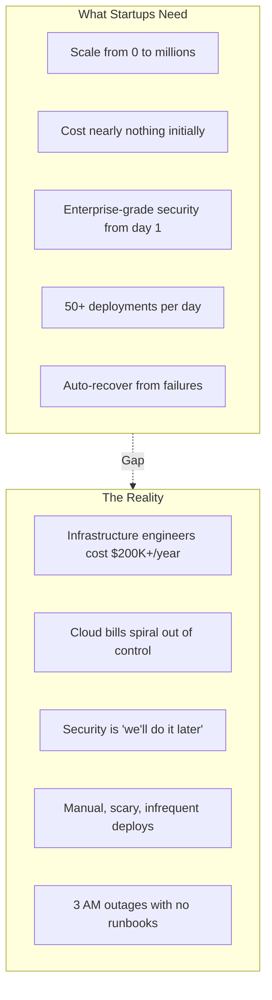
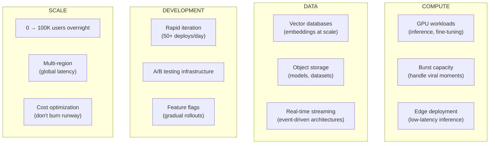
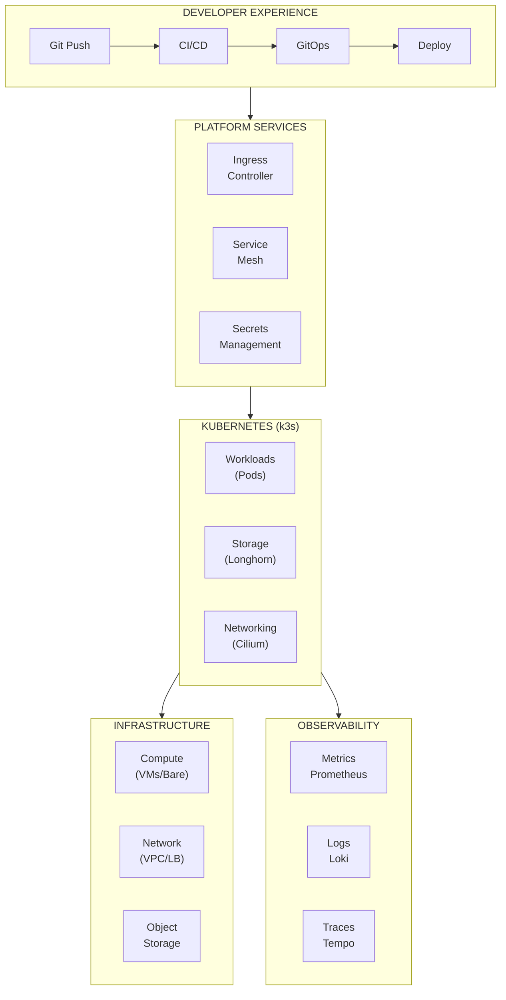

# Product Vision: Startup Infrastructure Platform

## The Problem

Every startup needs infrastructure. But building production-grade infrastructure is **expensive, complex, and time-consuming**.

### The Startup Infrastructure Paradox

| Startups Need | But Reality Is |
|---------------|----------------|
| ✅ Scales from 0 to millions of users | ❌ Infrastructure engineers cost $200K+/year |
| ✅ Costs nearly nothing at the beginning | ❌ Cloud bills spiral out of control |
| ✅ Enterprise-grade security from day 1 | ❌ Security is "we'll do it later" (they never do) |
| ✅ 50+ deployments per day | ❌ Deployments are manual, scary, and infrequent |
| ✅ Recovers automatically from failures | ❌ Outages happen at 3 AM with no runbooks |

---

## The Opportunity

| Metric | Value | Source |
|--------|-------|--------|
| Global cloud infrastructure market | $150B+ annually | Gartner 2025 |
| Startups with inadequate infrastructure | 73% | State of DevOps 2025 |
| Average DevOps engineer salary (US) | $165K | Glassdoor 2025 |
| Infrastructure as % of startup costs | 15-25% | Bessemer Cloud Index |
| Failed deployments due to manual processes | 45% | DORA Report 2025 |

### Why Now?

1. **Platform engineering has matured** — Golden paths, internal developer platforms
2. **Kubernetes is production-ready** — k3s brings enterprise orchestration to small teams
3. **Cost-effective clouds exist** — Hetzner offers 10x better price/performance than hyperscalers
4. **GitOps is standard** — Declarative, auditable, automated deployments
5. **AI is accelerating everything** — AI-native startups need infrastructure that enables rapid iteration

---

## Our Solution

**A complete, production-grade infrastructure platform that any startup can deploy and operate.**

We build:

1. **Infrastructure-as-Code Modules** — Reusable, tested, versioned cloud resources
2. **Configuration Templates** — Secure defaults for every service
3. **Deployment Pipelines** — GitOps workflows that "just work"
4. **Observability Stack** — Visibility from day 1, not after the first outage
5. **Automation Library** — Python tools that eliminate toil

---

## Target: AI-Native Startup Platform

We're not building generic infrastructure. We're building **the platform that AI startups need**:

---

## Platform Components

### What You'll Build

---

## Success Criteria

The platform succeeds when:

| Metric | Target | Why It Matters |
|--------|--------|----------------|
| Time to first deployment | < 1 hour | New developers productive immediately |
| Deployment frequency | 50+/day capable | Enables rapid iteration |
| Change failure rate | < 5% | Confidence to deploy anytime |
| Mean time to recovery | < 15 minutes | Minimize customer impact |
| Infrastructure cost | 50% of AWS equivalent | Preserve startup runway |
| Security compliance | SOC 2 ready | Enterprise sales unlocked |

---

## What We Are NOT Building

- A managed Kubernetes service (we use k3s, you operate it)
- A PaaS like Heroku (we're lower-level, more flexible)
- A multi-cloud abstraction (we optimize for specific providers)
- A consultant's slideware (everything works, is tested, is real)

---

## Related

- [Market Context](./02-Market-Context.md)
- [Platform Capabilities](./03-Capabilities.md)
- [Target Architecture](./04-Target-Architecture.md)

---

*Last Updated: 2026-02-02*
