# Product Vision: AI-Powered Content Platform

> *"The best startups seem to start from scratch. The founders just decided what they wanted to build, then built it."*
> — **Paul Graham**, Y Combinator

## You're Building a Startup

This isn't a DevOps internship. **You're founding a startup.**

You'll build **ContentAI** — an AI-powered content platform that helps creators and businesses generate, manage, and distribute content at scale. Think Strapi meets GPT, with enterprise-grade infrastructure that can scale from your first user to your millionth.

```mermaid
flowchart TB
    subgraph Product["🚀 THE PRODUCT (ContentAI)"]
        CMS["Strapi CMS<br/>Headless content management"]
        AI["AI Services<br/>Content generation, summarization, translation"]
        API["GraphQL/REST API<br/>Multi-platform delivery"]
        Admin["Admin Dashboard<br/>Content workflows"]
    end

    subgraph Users["👥 USERS"]
        Creators["Content Creators"]
        Devs["Developers"]
        Business["Business Users"]
    end

    subgraph Infra["⚙️ THE PLATFORM (What Powers It)"]
        K8s["Kubernetes"]
        Obs["Observability"]
        GitOps["GitOps"]
        Security["Security"]
    end

    Users --> Product
    Product --> Infra

    style Product fill:#4CAF50
    style Infra fill:#2196F3
```



---

## The Product: ContentAI

### What We're Building

**ContentAI** is a Y Combinator-style startup product:

| Feature | Description |
|---------|-------------|
| **AI Content Generation** | Generate blog posts, product descriptions, social media from prompts |
| **Smart Summarization** | Auto-summarize long documents, meetings, videos |
| **Multi-language** | AI translation and localization for global audiences |
| **Content Workflows** | Approval chains, scheduling, multi-channel publishing |
| **API-First** | Headless architecture — content goes anywhere |
| **Enterprise Ready** | SSO, RBAC, audit logs, compliance |

### Why This Product?


### Tech Stack

| Layer | Technology | Why |
|-------|------------|-----|
| **CMS** | Strapi (Headless) | Open source, extensible, API-first |
| **AI** | Claude/OpenAI APIs | Best-in-class generation |
| **Database** | PostgreSQL | Reliable, scalable |
| **Search** | Meilisearch | Fast, typo-tolerant |
| **Storage** | S3-compatible | Media assets |
| **Cache** | Redis | Performance |
| **Frontend** | Next.js | Modern React, SSR |

---

## The Platform: Why Infrastructure Matters

> *"If you can't deploy on Friday at 5 PM without sweating, your infrastructure isn't good enough."*
> — PearlThoughts Engineering

Your product is only as good as the platform running it. Startups die from:

- **Outages** when they get on TechCrunch
- **Slow deploys** that kill iteration speed
- **Security breaches** that destroy trust
- **Cost overruns** that burn runway

You'll build infrastructure that prevents all of these:


---

## User Journey: Content Creator


---

## User Journey: Developer


---

## Platform Architecture

### Full Stack View


---

## Why This Matters for Your Career

You're not just learning DevOps. You're learning to:

| Traditional DevOps | What You're Learning |
|-------------------|---------------------|
| Maintain infrastructure | **Build products** |
| React to problems | **Design systems** |
| Follow runbooks | **Make architectural decisions** |
| Support developers | **BE a full-stack builder** |

### Portfolio After This Internship

```
✅ "I built a production AI content platform from scratch"
✅ "I deployed Strapi with custom AI plugins on Kubernetes"
✅ "I implemented GitOps for 50+ deploys/day capability"
✅ "I reduced infrastructure costs 90% vs AWS"
✅ "I built the platform that would power a YC startup"
```

---

## Success Metrics

| Metric | Target | Why It Matters |
|--------|--------|----------------|
| **Content API latency** | < 100ms p95 | User experience |
| **AI generation time** | < 3 seconds | Creator productivity |
| **Deployment frequency** | 50+/day capable | Iteration speed |
| **Platform cost** | < $500/month | Startup runway |
| **Uptime** | 99.9% | User trust |
| **Time to first deploy** | < 1 hour | Developer experience |

---

## The Journey

```mermaid
timeline
    title Your 4-Week Startup Journey
    section Week 1 — Foundation
        Infrastructure : OpenTofu modules
                       : Ansible hardening
                       : k3s cluster
    section Week 2 — Product
        Strapi : Deploy headless CMS
               : Configure content types
               : Set up database
        AI Services : Deploy inference endpoints
                    : Connect to Strapi
    section Week 3 — Scale
        GitOps : ArgoCD automation
               : CI/CD pipelines
               : Preview environments
        Observability : Dashboards for product metrics
                      : AI cost tracking
    section Week 4 — Launch
        Security : Production hardening
                 : RBAC for multi-tenant
        Polish : Documentation
               : Demo preparation
               : Launch readiness
```



---

## Related

- [Market Context](./02-Market-Context.md) — Content + AI market analysis
- [Platform Capabilities](./03-Capabilities.md) — Technical features
- [Target Architecture](./04-Target-Architecture.md) — Full system design

---

*Last Updated: 2026-02-02*
