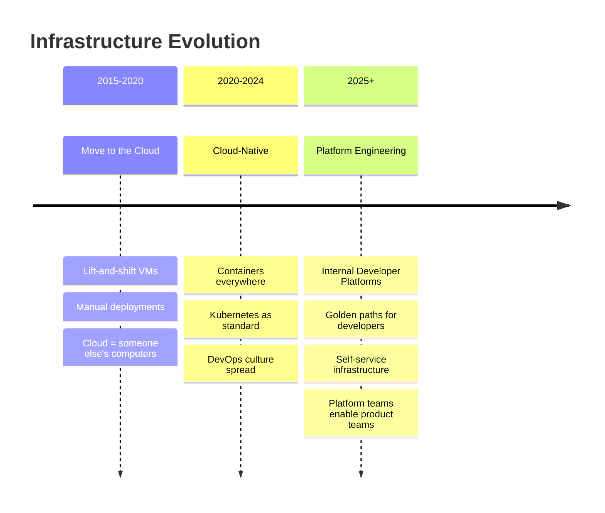
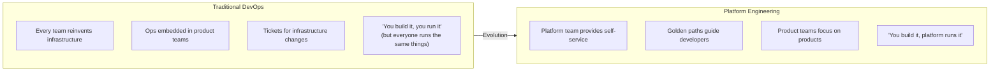

# Market Context

## The Cloud Infrastructure Market

### Market Size

| Metric | Value | Source |
|--------|-------|--------|
| Global cloud infrastructure market | $150B+ annually | Gartner 2025 |
| Platform engineering market | $15B → $50B by 2028 | Gartner |
| Kubernetes adoption in production | 78% of organizations | CNCF Survey 2025 |
| GitOps adoption | 65% of Kubernetes users | Weaveworks 2025 |
| Infrastructure-as-Code adoption | 71% of enterprises | HashiCorp 2025 |

### Why This Matters Now

> **YOU ARE HERE** → Building the next generation of platforms

---

## The Cost Problem

### Hyperscaler Pricing Reality

| Cloud | vCPU/mo | RAM (GB)/mo | Storage (GB)/mo | Bandwidth (GB) |
|-------|---------|-------------|-----------------|----------------|
| **AWS** | $35-50 | $4-8 | $0.10 | $0.09 |
| **GCP** | $30-45 | $4-7 | $0.08 | $0.12 |
| **Azure** | $35-55 | $5-8 | $0.10 | $0.08 |
| **Hetzner** | $4-8 | $2-3 | $0.02 | FREE (20TB) |
| **Savings** | **80-90%** | **60-75%** | **80%** | **100%** |

### Real-World Example

**Typical AI Startup Infrastructure (Monthly)**

```mermaid
xychart-beta
    title "Monthly Infrastructure Cost Comparison"
    x-axis ["Compute", "GPU", "Storage", "Load Balancer", "Bandwidth"]
    y-axis "Cost ($)" 0 --> 1500
    bar [900, 1200, 25, 20, 450]
    bar [90, 180, 10, 0, 0]
```

| Component | AWS Cost | Hetzner Cost | Savings |
|-----------|----------|--------------|---------|
| 3 compute nodes (8 vCPU, 32GB) | $900 | $90 | 90% |
| GPU instance (A10G) | $1,200 | $180 (RTX 4000) | 85% |
| 1TB object storage | $25 | $10 | 60% |
| Load balancer | $20 | Included | 100% |
| Bandwidth (5TB) | $450 | FREE | 100% |
| **Total** | **$2,595** | **$280** | **89%** |

*Annual savings: $27,780*

---

## Competitive Landscape

### Managed Kubernetes

| Service | Provider | Pros | Cons |
|---------|----------|------|------|
| **EKS** | AWS | Integration, support | $73/cluster/mo + complexity |
| **GKE** | Google | Best managed K8s | Expensive, lock-in |
| **AKS** | Azure | Enterprise integration | Learning curve |
| **k3s** | CNCF | Lightweight, free | Self-managed |
| **Talos** | Sidero | Secure, immutable | Newer ecosystem |

### Platform-as-a-Service

| Platform | Approach | Pros | Cons |
|----------|----------|------|------|
| **Heroku** | Managed PaaS | Simple | Expensive, limited control |
| **Railway** | Modern PaaS | Developer-friendly | Scaling limits |
| **Fly.io** | Edge PaaS | Global distribution | Complexity |
| **Render** | Balanced | Good middle ground | Lock-in |
| **Our Platform** | IDP on k3s | Full control, cost-effective | Requires learning |

### Infrastructure-as-Code

| Tool | State | Ecosystem | Learning Curve |
|------|-------|-----------|----------------|
| **Terraform** | Proprietary (BSL) | Massive | Medium |
| **OpenTofu** | Open Source | Growing fast | Medium |
| **Pulumi** | Open Source | Multi-language | High |
| **Crossplane** | Open Source | Kubernetes-native | High |
| **Ansible** | Open Source | Massive | Low |

---

## Identified Gaps

These gaps represent our opportunity:

| Gap | Current State | Our Approach |
|-----|---------------|--------------|
| **Cost** | Hyperscalers are 10x more expensive | Optimize for Hetzner, use k3s |
| **Complexity** | Managed K8s has steep learning curve | Opinionated, documented platform |
| **Security** | "We'll do it later" mentality | Security-first from day 1 |
| **Observability** | Added after first outage | Included in base platform |
| **Developer Experience** | Complex YAML, long feedback loops | Golden paths, fast deployments |

---

## The Platform Engineering Movement

### What Changed

> **Gartner predicts**: 80% of engineering orgs will have platform teams by 2026 (up from 45% in 2024)

### Industry Adoption

| Company | Platform | Impact |
|---------|----------|--------|
| **Spotify** | Backstage | Open-sourced their IDP |
| **Netflix** | Internal tooling | Famous for automation |
| **Airbnb** | Custom platform | Enabled rapid growth |
| **Stripe** | Infrastructure team | Powers reliability culture |
| **Shopify** | Platform engineering | Scales to millions of merchants |

---

## Market Validation

### What Startups Are Asking For

From founder interviews and community discussions:

1. "We need Heroku simplicity with AWS power at Hetzner prices"
2. "Our AWS bill is eating our runway"
3. "We don't have time to learn Kubernetes properly"
4. "Security is always an afterthought until it's a crisis"
5. "Deployments should be boring, not scary"

### What Platform Engineers Report

From engineering surveys:

1. "Every startup builds the same infrastructure from scratch"
2. "Documentation is always out of date"
3. "Onboarding new engineers takes weeks"
4. "We spend 60% of time on toil, not innovation"
5. "GitOps changed everything, but setup was painful"

---

## Our Differentiation

| Dimension | Generic Cloud | Our Platform |
|-----------|---------------|--------------|
| **Cost** | $2,500+/month | $300/month |
| **Control** | Limited | Full |
| **Learning** | Scattered docs | Opinionated guides |
| **Security** | DIY | Included |
| **Observability** | Extra cost | Included |
| **Portability** | Vendor lock-in | Standard tools |

---

## Related

- [Product Vision](./01-Vision.md)
- [Platform Capabilities](./03-Capabilities.md)
- [Target Architecture](./04-Target-Architecture.md)

---

*Last Updated: 2026-02-02*
