# Market Context: Why ContentAI Now

> *"The biggest risk is not taking any risk. In a world that's changing really quickly, the only strategy that is guaranteed to fail is not taking risks."*
> — **Mark Zuckerberg**

## The Content + AI Market Explosion

### Market Size

| Market | 2024 Size | 2028 Projection | CAGR |
|--------|-----------|-----------------|------|
| **Content Management** | $43B | $116B | 28% |
| **AI Writing Tools** | $12B | $65B | 52% |
| **Headless CMS** | $1.7B | $5.8B | 36% |
| **Content Operations** | $8B | $28B | 37% |

**Combined TAM**: Over $200B by 2028

### Why AI + Content NOW

---

## The Problem ContentAI Solves

### For Content Creators

| Pain Point | Current State | ContentAI Solution |
|------------|---------------|-------------------|
| **Speed** | 4-8 hours per blog post | 30 minutes with AI draft |
| **Cost** | $100-500 per piece | $5-10 in API costs |
| **Consistency** | Varies by writer | AI maintains brand voice |
| **Translation** | Days + expensive translators | Minutes via AI |
| **Scale** | 5-10 pieces per month | 50-100+ per month |

### For Businesses

| Challenge | Traditional CMS | ContentAI |
|-----------|----------------|-----------|
| **Time to publish** | Hours (reviews, formatting) | Minutes (AI + workflow) |
| **Multi-channel** | Manual copying | API-first distribution |
| **Localization** | Separate translation process | Built-in AI translation |
| **SEO** | Specialist required | AI-generated metadata |
| **Content gaps** | Discovery takes weeks | AI identifies and fills |

### The Market Gap

```mermaid
flowchart TB
    subgraph Current["Current Options"]
        C1["WordPress + Plugins<br/>Old school, limited AI"]
        C2["AI Writers (Jasper)<br/>No CMS integration"]
        C3["Enterprise CMS (Contentful)<br/>Expensive, no AI"]
        C4["DIY Integration<br/>Painful, time-consuming"]
    end

    subgraph Gap["THE GAP"]
        G["No integrated platform that is:<br/>✅ AI-native<br/>✅ Developer-friendly (API-first)<br/>✅ Cost-effective<br/>✅ Self-hostable"]
    end

    subgraph ContentAI["ContentAI"]
        CA["Strapi + Claude + Platform<br/>Best of all worlds"]
    end

    Current --> Gap --> ContentAI

    style ContentAI fill:#4CAF50
```

---

## Competitive Landscape

### Content Management Systems

| Platform | AI Integration | Self-Hosted | Cost | Developer DX |
|----------|---------------|-------------|------|--------------|
| **WordPress** | Plugins (limited) | ✅ | Free + hosting | ⭐⭐ |
| **Contentful** | Basic AI | ❌ | $$$$ | ⭐⭐⭐⭐ |
| **Sanity** | Sanity AI | ❌ | $$$ | ⭐⭐⭐⭐⭐ |
| **Strapi** | None built-in | ✅ | Free + hosting | ⭐⭐⭐⭐ |
| **ContentAI** | Native Claude/GPT | ✅ | $ (self-hosted) | ⭐⭐⭐⭐⭐ |

### AI Writing Tools

| Tool | CMS Integration | API Access | Self-Hosted | Content Management |
|------|-----------------|------------|-------------|-------------------|
| **Jasper** | Limited | ✅ | ❌ | ❌ |
| **Copy.ai** | None | ✅ | ❌ | ❌ |
| **Writesonic** | None | ✅ | ❌ | ❌ |
| **Claude API** | None (raw API) | ✅ | ❌ | ❌ |
| **ContentAI** | Native (Strapi) | ✅ | ✅ | ✅ |

### Our Position

---

## The Infrastructure Advantage

### Why Self-Hosted Matters

| Factor | SaaS Platforms | ContentAI (Self-Hosted) |
|--------|---------------|-------------------------|
| **Monthly Cost** | $500-5,000 | $100-300 |
| **Data Sovereignty** | Their servers | Your servers |
| **Customization** | Limited | Unlimited |
| **Vendor Lock-in** | High | None |
| **Scaling Cost** | Linear ($$$ per user) | Sub-linear (infra only) |

### Cloud Cost Comparison

| Component | AWS/GCP | Hetzner | Savings |
|-----------|---------|---------|---------|
| 3 compute nodes | $900/mo | $90/mo | 90% |
| PostgreSQL (managed) | $300/mo | $30/mo | 90% |
| Object storage (1TB) | $25/mo | $10/mo | 60% |
| Load balancer | $20/mo | Included | 100% |
| Bandwidth (5TB) | $450/mo | FREE | 100% |
| **Total** | **$1,695** | **$130** | **92%** |

**Annual savings: $18,780**

This savings funds your AI API costs for 3+ years!

---

## Target Customers

### Early Adopters (Year 1)

### Customer Value Proposition

| Segment | Pain Point | ContentAI Value | ROI |
|---------|------------|-----------------|-----|
| **Startups** | Content is expensive | AI cuts costs 90% | Immediate |
| **Agencies** | Managing multiple clients | Multi-tenant, API-first | 50% efficiency |
| **SaaS** | Docs always outdated | AI keeps docs fresh | User satisfaction |
| **Publishers** | Can't scale fast enough | 10x content velocity | Revenue growth |

---

## Business Model Potential

### Revenue Streams

| Stream | Model | Why It Works |
|--------|-------|--------------|
| **Managed Hosting** | $99-999/mo | Convenience premium |
| **Enterprise Support** | $5k-50k/year | SLA guarantees |
| **Custom Integrations** | Project-based | High-touch customers |
| **Training/Consulting** | Day-rate | Knowledge transfer |

### Unit Economics (Projection)

| Metric | Value |
|--------|-------|
| **Customer Acquisition Cost** | ~$200 |
| **Monthly Revenue** | $100-500 |
| **Churn (projected)** | <5%/month |
| **LTV** | $2,000-10,000 |
| **LTV:CAC Ratio** | 10-50x |

---

## Timing: Why 2026

### AI Capability Inflection

| Capability | 2023 | 2026 |
|------------|------|------|
| **Content Quality** | Needs heavy editing | Human-quality drafts |
| **Context Window** | 8k tokens | 200k+ tokens |
| **Speed** | 30-60 seconds | 2-5 seconds |
| **Cost per 1k tokens** | $0.02 | $0.003 |
| **Multimodal** | Limited | Full image/video |

### Market Readiness

- **83% of marketers** plan to use AI for content by 2026 (HubSpot)
- **62% of companies** investing in AI-powered content tools (Gartner)
- **Headless CMS adoption** growing 36% annually
- **API-first architectures** becoming standard

---

## Why This Matters for Your Career

### Skills You're Building

| Skill | Market Demand | ContentAI Experience |
|-------|---------------|---------------------|
| **AI Integration** | Exploding | Real API implementation |
| **Platform Engineering** | Hot | Production deployment |
| **Kubernetes** | Standard | HA cluster management |
| **GitOps** | Growing | ArgoCD automation |

### Portfolio Differentiation

```mermaid
flowchart LR
    subgraph Others["Other Interns"]
        O1["Deployed nginx"]
        O2["Wrote Terraform"]
        O3["Set up CI/CD"]
    end

    subgraph You["ContentAI Intern"]
        Y1["Built AI product"]
        Y2["Integrated Claude API"]
        Y3["Production platform"]
        Y4["Real users could use this"]
    end

    Others -.->|"Generic"| X["🤷"]
    You -.->|"Startup-ready"| Y["🚀"]

    style You fill:#4CAF50
```

---

## Related

- [Product Vision](./01-Vision.md) — What ContentAI is
- [Platform Capabilities](./03-Capabilities.md) — Technical features
- [Target Architecture](./04-Target-Architecture.md) — Full system design

---

*Last Updated: 2026-02-02*
