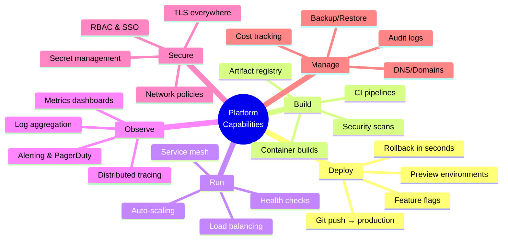
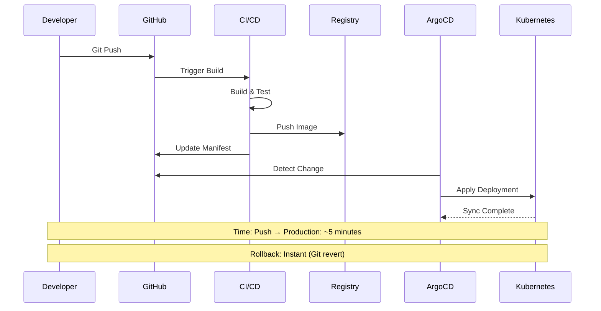
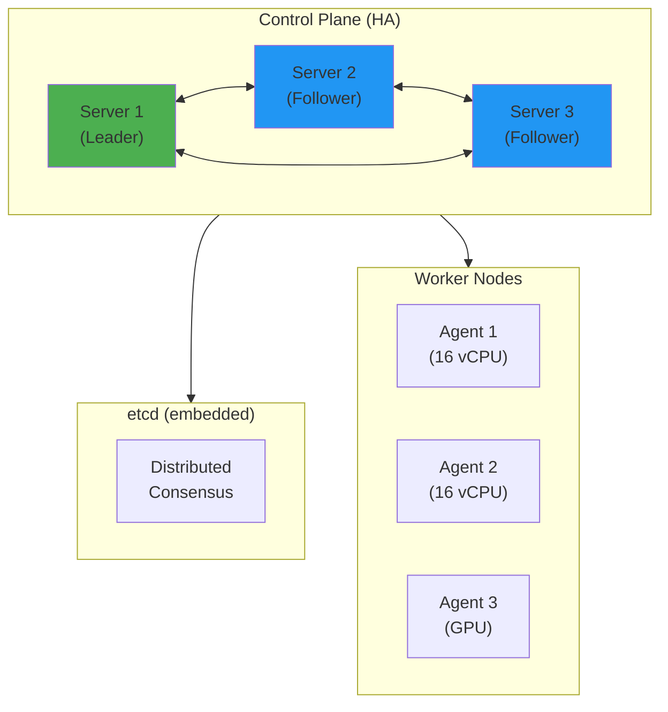
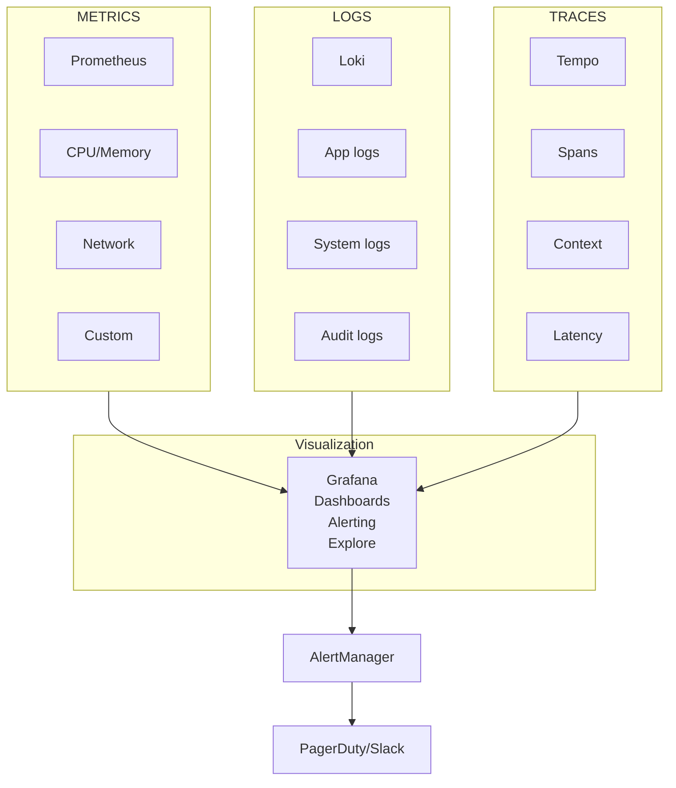
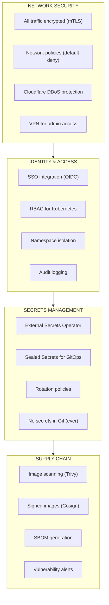
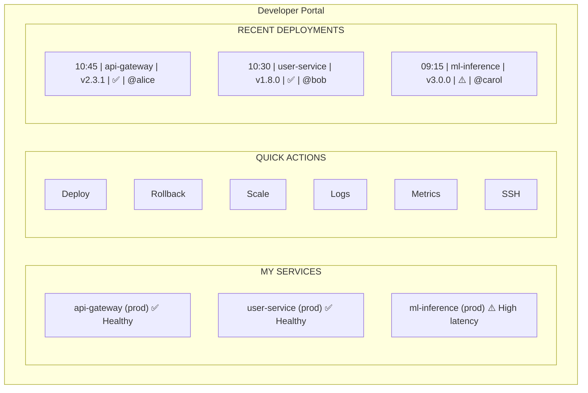

# Platform Capabilities

## Core Capabilities Overview

The platform provides these capabilities to development teams:

---

## Service Level Objectives (SLOs)

### Platform SLOs

| Metric | Target | Measurement |
|--------|--------|-------------|
| **Availability** | 99.9% (8.7h downtime/year) | Synthetic monitoring |
| **Deployment Success Rate** | 99% | GitOps pipeline metrics |
| **Deployment Time** | < 5 minutes | Pipeline duration |
| **Recovery Time (MTTR)** | < 15 minutes | Incident tracking |
| **API Latency (p99)** | < 200ms | Prometheus histograms |

### Developer Experience SLOs

| Metric | Target | Measurement |
|--------|--------|-------------|
| **Time to First Deploy** | < 1 hour | Onboarding tracking |
| **Feedback Loop Time** | < 10 minutes | Push to preview |
| **Documentation Coverage** | 100% of features | Audit |
| **Self-Service Rate** | 80% of requests | Ticket analysis |

---

## Capability 1: Deployment Pipeline

### GitOps Workflow

### Deployment Features

| Feature | Implementation | Benefit |
|---------|----------------|---------|
| **Blue-Green** | ArgoCD rollouts | Zero-downtime deploys |
| **Canary** | Progressive delivery | Risk mitigation |
| **Rollback** | Git revert + sync | Instant recovery |
| **Preview Envs** | PR-triggered | Test before merge |

---

## Capability 2: Container Orchestration

### k3s Cluster Architecture

**Scaling**: Add agents via Ansible, auto-join cluster
**HA**: 3 servers tolerate 1 failure, etcd consensus

### Workload Types

| Type | Use Case | Configuration |
|------|----------|---------------|
| **Deployment** | Stateless services | Replicas, rolling updates |
| **StatefulSet** | Databases, caches | Stable network, ordered |
| **DaemonSet** | Logging, monitoring | One per node |
| **CronJob** | Batch processing | Scheduled execution |
| **Job** | One-time tasks | Run to completion |

---

## Capability 3: Observability Stack

### Three Pillars

### Key Dashboards

| Dashboard | Purpose | Key Metrics |
|-----------|---------|-------------|
| **Cluster Overview** | Health at a glance | Node status, pod counts, resource usage |
| **Application** | Service health | Request rate, error rate, latency (RED) |
| **Infrastructure** | Resource usage | CPU, memory, disk, network (USE) |
| **Deployments** | Release tracking | Deploy frequency, rollback rate |
| **Costs** | Budget tracking | Resource costs by namespace |

---

## Capability 4: Security

### Zero-Trust Architecture

### Security SLOs

| Metric | Target | Measurement |
|--------|--------|-------------|
| **Critical CVE Response** | < 24 hours | Trivy alerts |
| **Secret Rotation** | 90 days max | Vault audit |
| **Compliance Drift** | 0 | Policy as code |
| **Access Reviews** | Quarterly | Audit trail |

---

## Capability 5: Developer Self-Service

### Golden Paths

Developers get self-service access to:

| Capability | Self-Service Method | Approval Needed |
|------------|---------------------|-----------------|
| **Deploy app** | Git push | No |
| **Create database** | Helm chart in GitOps | No |
| **Add domain** | Update ingress manifest | No |
| **View logs** | Grafana access | No |
| **SSH to pod** | kubectl exec | No |
| **Scale up** | Update manifest | No |
| **New namespace** | Terraform PR | Yes (automated) |
| **Production access** | RBAC request | Yes (manual) |

### Developer Portal

---

## Related

- [Product Vision](./01-Vision.md)
- [Market Context](./02-Market-Context.md)
- [Architecture Overview](../02-Engineering/01-Architecture.md)

---

*Last Updated: 2026-02-02*
