# ContentAI Capabilities

> *"Make something people want."*
> — **Paul Graham**, Y Combinator

## What ContentAI Does for Users

ContentAI solves one problem: **Creating quality content is slow and expensive.**

```mermaid
flowchart TB
    subgraph Before["❌ WITHOUT CONTENTAI"]
        B1["4-8 hours per blog post"]
        B2["$100-500 per piece"]
        B3["Days for translation"]
        B4["Manual SEO optimization"]
        B5["5-10 articles per month"]
    end

    subgraph After["✅ WITH CONTENTAI"]
        A1["30 minutes per blog post"]
        A2["$5-10 in API costs"]
        A3["Minutes for translation"]
        A4["AI-generated SEO"]
        A5["50-100+ articles per month"]
    end

    Before -->|"10x improvement"| After

    style After fill:#4CAF50
```

---

## Product Capabilities

### Capability 1: AI Content Generation

**The core feature that makes ContentAI valuable.**

| Feature | What It Does | User Benefit |
|---------|--------------|--------------|
| **Blog Generation** | Creates full articles from topics | 10x content velocity |
| **Summarization** | Condenses long content | Quick briefings, abstracts |
| **Translation** | Multi-language content | Global reach without translators |
| **SEO Metadata** | Generates titles, descriptions | Better search rankings |
| **Brand Voice** | Maintains consistent tone | Professional consistency |

### Capability 2: Content Management

**Strapi CMS provides the foundation for all content operations.**

| Feature | What It Does | User Benefit |
|---------|--------------|--------------|
| **Admin Panel** | Visual content management | No code needed |
| **Content Types** | Custom data structures | Flexible content models |
| **REST/GraphQL** | API-first delivery | Headless flexibility |
| **Media Library** | Asset management | Organized media |
| **Webhooks** | Event notifications | Workflow automation |

### Capability 3: Content Search

**Meilisearch powers instant, typo-tolerant search.**

| Feature | What It Does | User Benefit |
|---------|--------------|--------------|
| **Typo Tolerance** | Finds "devops" from "devpos" | Better user experience |
| **Instant Search** | < 50ms response time | Real-time results |
| **Faceted Filtering** | Filter by category, date, author | Precise discovery |
| **Relevance Ranking** | Best matches first | Quality results |

### Capability 4: Performance & Caching

**Redis ensures ContentAI responds fast.**

| Metric | Without Cache | With Redis |
|--------|---------------|------------|
| **API Response** | 100-500ms | < 10ms |
| **Database Load** | High | Minimal |
| **AI Rate Limiting** | None | Controlled |
| **Session Handling** | Slow | Fast |

---

## Platform Capabilities (What Makes ContentAI Run)

The platform exists to serve ContentAI. Here's what it provides:

### Deployment Pipeline

```mermaid
sequenceDiagram
    participant Dev as Developer
    participant Git as GitHub
    participant CI as GitHub Actions
    participant Reg as ghcr.io
    participant Argo as ArgoCD
    participant K8s as k3s Cluster

    Dev->>Git: Push ContentAI code
    Git->>CI: Trigger workflow
    CI->>CI: Build & Test
    CI->>Reg: Push image
    CI->>Git: Update manifests

    Argo->>Git: Detect change
    Argo->>K8s: Deploy ContentAI
    K8s-->>Dev: ContentAI updated!

    Note over Dev,K8s: Push → Production: ~5 minutes
```

### Auto-Scaling

ContentAI scales automatically based on demand:

| Trigger | Action | Result |
|---------|--------|--------|
| **CPU > 70%** | Add Strapi pod | Handle more requests |
| **Memory > 80%** | Add Strapi pod | Prevent OOM |
| **AI Queue > 100** | Add AI service pod | Faster generation |
| **P99 > 500ms** | Scale horizontally | Better latency |

### High Availability

ContentAI never goes down (almost):

---

## Service Level Objectives

### Product SLOs (What Users Care About)

| Metric | Target | Why It Matters |
|--------|--------|----------------|
| **Availability** | 99.9% (8.7h downtime/year) | Content always accessible |
| **API Latency (p99)** | < 200ms | Fast content delivery |
| **AI Generation Time** | < 5 seconds | Responsive creation |
| **Search Response** | < 50ms | Instant search |
| **Publish Success** | 99.9% | Reliable publishing |

### Platform SLOs (What Supports the Product)

| Metric | Target | Measurement |
|--------|--------|-------------|
| **Deployment Success** | 99% | GitOps pipeline |
| **Recovery Time (MTTR)** | < 15 minutes | Incident tracking |
| **Scaling Response** | < 2 minutes | HPA metrics |
| **Backup Success** | 100% | Backup job status |

---

## ContentAI Dashboard Metrics

What you'll see in Grafana:

```mermaid
flowchart TB
    subgraph Dashboard["CONTENTAI DASHBOARD"]
        subgraph Business["📊 BUSINESS METRICS"]
            BM1["Content created today: 47"]
            BM2["AI generations: 128"]
            BM3["API calls: 12,847"]
            BM4["Active users: 23"]
        end

        subgraph Product["🚀 PRODUCT HEALTH"]
            PM1["API latency: 45ms (p99)"]
            PM2["AI response: 2.3s avg"]
            PM3["Error rate: 0.01%"]
            PM4["Cache hit: 94%"]
        end

        subgraph Platform["⚙️ PLATFORM HEALTH"]
            PL1["CPU: 34%"]
            PL2["Memory: 52%"]
            PL3["Pods: 8/8 healthy"]
            PL4["Storage: 23GB used"]
        end

        subgraph Costs["💰 COST TRACKING"]
            C1["Claude tokens: 45K today"]
            C2["OpenAI tokens: 2K today"]
            C3["Estimated cost: $12.40"]
            C4["Budget remaining: $287.60"]
        end
    end

    style Business fill:#4CAF50
```

---

## Security Capabilities

### What's Protected

| Asset | Protection | Why |
|-------|------------|-----|
| **Content Data** | PostgreSQL + Longhorn | Your content is valuable |
| **User Sessions** | Redis + JWT | Authentication |
| **AI API Keys** | Kubernetes Secrets | API access control |
| **Media Assets** | S3/MinIO | Uploaded files |
| **Admin Access** | RBAC + Network Policies | Access control |

### Security Architecture

---

## Self-Service for Content Teams

What content creators can do without help:

| Action | How | Need Approval? |
|--------|-----|----------------|
| **Create content** | Admin panel | No |
| **Generate AI draft** | AI button | No |
| **Translate content** | Translation plugin | No |
| **Publish content** | Publish button | No |
| **View analytics** | Grafana dashboard | No |
| **Manage media** | Media library | No |
| **Add users** | User management | Yes (admin) |
| **Change content types** | Content-Type Builder | Yes (admin) |

---

## Related

- [Product Vision](./01-Vision.md) — Why we're building ContentAI
- [Market Context](./02-Market-Context.md) — The opportunity
- [Target Architecture](./04-Target-Architecture.md) — Full system design
- [Architecture Overview](../02-Engineering/01-Architecture.md) — Technical details

---

*Last Updated: 2026-02-02*
