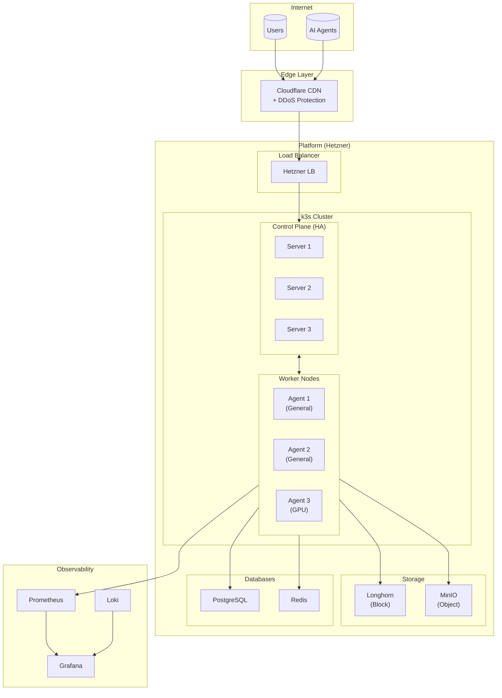
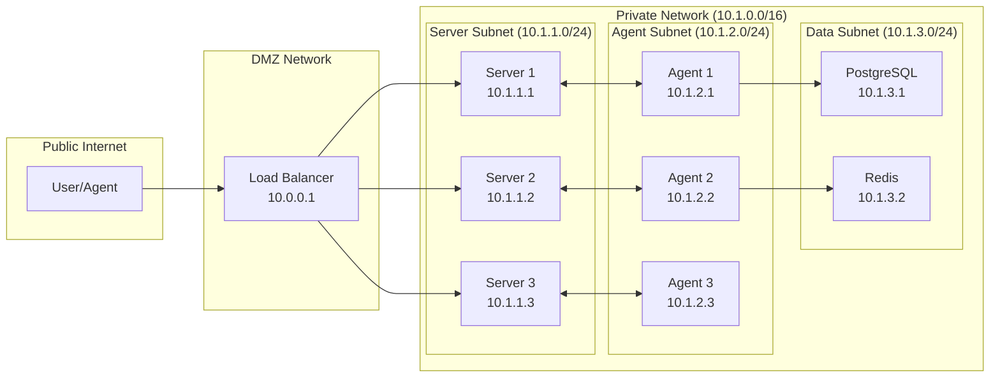
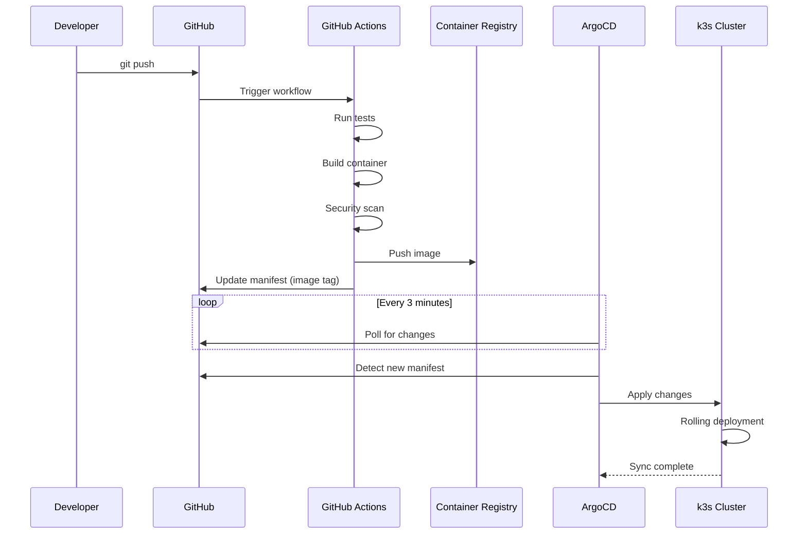
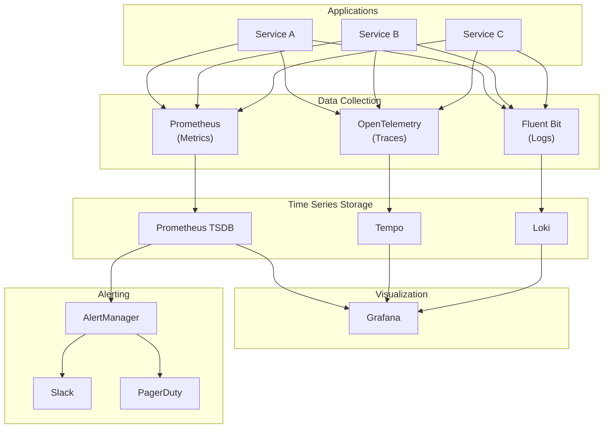
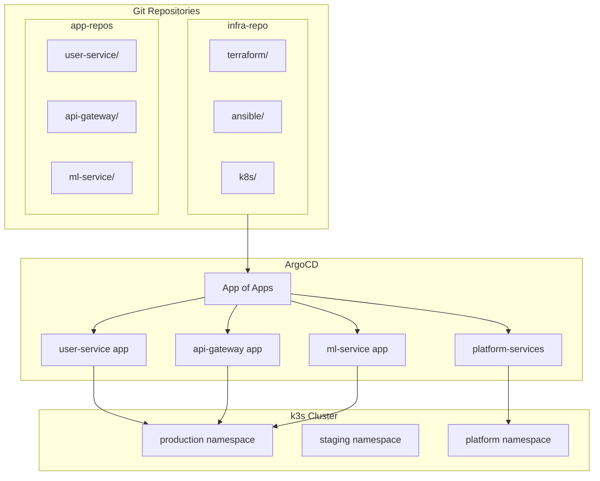
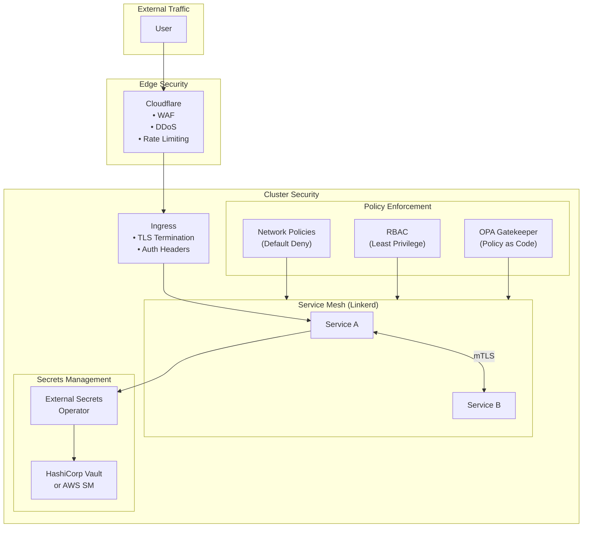
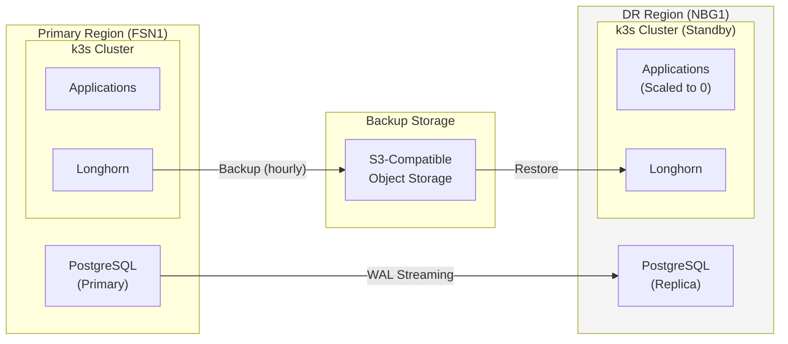
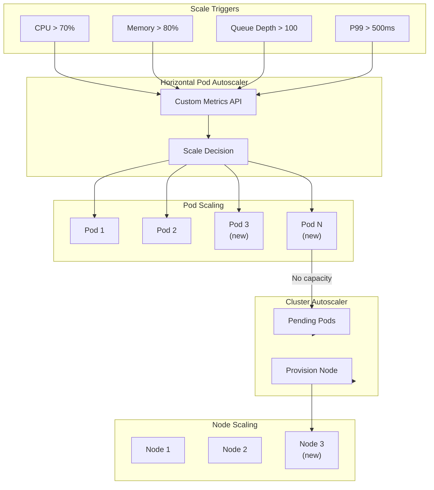

# Target Architecture

## Multi-Region, Multi-Tenant Platform

This document describes the production architecture you'll build incrementally over 4 weeks.

---

## High-Level Architecture

---

## Network Architecture

---

## Deployment Pipeline

---

## Observability Architecture

---

## GitOps Repository Structure

---

## Security Architecture

---

## Disaster Recovery Architecture

---

## Scaling Strategy

---

## Cost Optimization

| Component | Hetzner Spec | Monthly Cost | AWS Equivalent |
|-----------|--------------|--------------|----------------|
| **3x Server (CX31)** | 4 vCPU, 8GB RAM | €30 (€10 each) | $180+ |
| **3x Agent (CX41)** | 8 vCPU, 16GB RAM | €60 (€20 each) | $360+ |
| **1x GPU (CCX33)** | RTX 4000, 32GB | €180 | $1,200+ |
| **Load Balancer** | Standard | €6 | $20+ |
| **Storage (100GB)** | SSD | €5 | $10+ |
| **Bandwidth** | 20TB included | €0 | $1,800 |
| **Total** | | **€281** | **$3,570+** |

*Annual savings: ~$39,000*

---

## Technology Decisions

| Decision | Choice | Rationale |
|----------|--------|-----------|
| **Cloud Provider** | Hetzner | 90% cost savings, EU sovereignty |
| **Kubernetes** | k3s | Lightweight, production-ready, HA |
| **IaC** | OpenTofu | Open source Terraform fork |
| **Config Mgmt** | Ansible | Agentless, Python-based |
| **GitOps** | ArgoCD | UI, multi-cluster, mature |
| **CNI** | Cilium | eBPF, network policies, observability |
| **Storage** | Longhorn | Distributed, built for k8s |
| **Ingress** | Traefik | k3s native, middleware support |
| **Monitoring** | Prometheus + Grafana | Industry standard |
| **Logging** | Loki | Lightweight, Grafana native |

---

## Related

- [Product Vision](./01-Vision.md)
- [Market Context](./02-Market-Context.md)
- [Capabilities](./03-Capabilities.md)
- [Architecture Overview](../02-Engineering/01-Architecture.md)

---

*Last Updated: 2026-02-02*
