# Autograph Target Architecture

> *"The best architectures are those that allow you to defer decisions about details."*
> — **Clean Architecture** (Robert C. Martin)

## This Is What You'll Build

By the end of your 4-week internship, you'll have built a production-ready AI content platform.

**Not a demo. Not a toy. A real product that could serve real users.**

---

## Full System Architecture


---

## Autograph Component Architecture

### Application Components


### Data Flow


---

## Network Architecture


---

## Autograph Deployment Pipeline


---

## Autograph Namespace Layout

```yaml
# How Autograph is organized in Kubernetes

autograph/
├── strapi/
│   ├── deployment.yaml        # 2+ replicas, rolling updates
│   ├── service.yaml           # ClusterIP for internal access
│   ├── ingress.yaml           # HTTPS endpoint
│   ├── configmap.yaml         # Environment configuration
│   ├── secret.yaml            # Credentials (sealed)
│   └── hpa.yaml               # Auto-scaling rules
│
├── ai-service/
│   ├── deployment.yaml        # 2+ replicas
│   ├── service.yaml           # Internal service
│   ├── configmap.yaml         # AI configuration
│   └── secret.yaml            # API keys (Claude, OpenAI)
│
├── database/
│   ├── postgresql/
│   │   ├── statefulset.yaml   # Persistent database
│   │   ├── service.yaml       # Stable network identity
│   │   ├── secret.yaml        # DB credentials
│   │   └── pvc.yaml           # 10Gi storage
│   └── redis/
│       ├── deployment.yaml    # Cache instance
│       ├── service.yaml
│       └── pvc.yaml           # 1Gi persistence
│
└── search/
    └── meilisearch/
        ├── statefulset.yaml   # Search engine
        ├── service.yaml
        └── pvc.yaml           # Index storage
```

---

## Observability Architecture

### Monitoring Autograph

```mermaid
flowchart TB
    subgraph Autograph["AUTOGRAPH METRICS"]
        Strapi["Strapi Metrics\n• requests/sec\n• error rate\n• latency"]
        AI["AI Service Metrics\n• tokens used\n• generation time\n• provider (Claude/OpenAI)"]
        Search["Search Metrics\n• query latency\n• index size"]
    end

    subgraph Collection["COLLECTION"]
        Prom["Prometheus"]
        Loki["Loki (Logs)"]
    end

    subgraph Visualization["VISUALIZATION"]
        Graf["Grafana"]
        Dash1["Autograph Dashboard"]
        Dash2["Infrastructure Dashboard"]
        Dash3["Cost Tracking Dashboard"]
    end

    subgraph Alerting["ALERTING"]
        AM["AlertManager"]
        Slack["Slack"]
    end

    Autograph --> Prom
    Autograph --> Loki
    Prom --> Graf
    Loki --> Graf
    Graf --> Dash1 & Dash2 & Dash3
    Prom --> AM --> Slack

    style Dash1 fill:#4CAF50
```



### Autograph-Specific Alerts

| Alert | Condition | Severity | Action |
|-------|-----------|----------|--------|
| **High AI Cost** | tokens > 100K/hour | Warning | Review usage |
| **AI Provider Down** | Claude AND OpenAI failing | Critical | Check API keys |
| **Strapi Unhealthy** | Health check failed | Critical | Investigate pods |
| **Search Slow** | p99 > 500ms | Warning | Check index |
| **Content DB Full** | Storage > 80% | Warning | Expand storage |

---

## Security Architecture


---

## Disaster Recovery

### Backup Strategy


### Recovery Time Objectives

| Component | RPO (Data Loss) | RTO (Downtime) |
|-----------|-----------------|----------------|
| **PostgreSQL** | 5 minutes | 15 minutes |
| **Media Files** | 1 hour | 30 minutes |
| **Redis Cache** | Acceptable loss | 5 minutes |
| **Search Index** | Rebuilds from DB | 15 minutes |
| **Full Autograph** | 5 minutes | 30 minutes |

---

## Scaling Architecture

### Auto-Scaling Autograph

```mermaid
flowchart TB
    subgraph Triggers["SCALE TRIGGERS"]
        CPU["CPU > 70%"]
        MEM["Memory > 80%"]
        QUEUE["AI Queue > 100"]
        LATENCY["P99 > 500ms"]
    end

    subgraph HPA["HORIZONTAL POD AUTOSCALER"]
        Metrics["Custom Metrics API"]
        Decision["Scale Decision"]
    end

    subgraph Strapi["STRAPI PODS"]
        S1["Pod 1 ✓"]
        S2["Pod 2 ✓"]
        S3["Pod 3 (scaling)"]
    end

    subgraph AI["AI SERVICE PODS"]
        A1["Pod 1 ✓"]
        A2["Pod 2 ✓"]
    end

    Triggers --> Metrics --> Decision
    Decision --> Strapi
    Decision --> AI

    style S1 fill:#4CAF50
    style S2 fill:#4CAF50
    style A1 fill:#4CAF50
    style A2 fill:#4CAF50
```



### Scaling Limits

| Component | Min Replicas | Max Replicas | Scale On |
|-----------|--------------|--------------|----------|
| **Strapi** | 2 | 10 | CPU, Memory |
| **AI Service** | 2 | 5 | Queue depth |
| **Meilisearch** | 1 | 1 | Vertical only |
| **PostgreSQL** | 1 | 1 | Vertical only |
| **Redis** | 1 | 1 | Vertical only |

---

## Cost Architecture

### Hetzner vs AWS Comparison

| Component | Hetzner Spec | Monthly Cost | AWS Equivalent |
|-----------|--------------|--------------|----------------|
| **3x Server (CX31)** | 4 vCPU, 8GB RAM | €30 | $180+ |
| **3x Agent (CX41)** | 8 vCPU, 16GB RAM | €60 | $360+ |
| **Load Balancer** | Standard | €6 | $20+ |
| **Storage (100GB)** | SSD | €5 | $10+ |
| **Bandwidth** | 20TB included | €0 | $1,800 |
| **Total** | | **€101/mo** | **$2,370/mo** |

**Annual savings: ~$27,000** — That's 3 years of AI API costs!

### Autograph Operating Costs

| Cost Center | Monthly Budget | Notes |
|-------------|----------------|-------|
| **Infrastructure** | €101 | Hetzner VMs + Storage |
| **Claude API** | ~$200 | Primary AI provider |
| **OpenAI API** | ~$50 | Backup provider |
| **Domain/SSL** | ~$5 | CloudFlare |
| **Total** | **~$360/mo** | Production-ready AI platform |

---

## Technology Decisions

| Decision | Choice | Why |
|----------|--------|-----|
| **CMS** | Strapi | Open source, API-first, extensible |
| **AI Primary** | Claude | Best content quality |
| **AI Fallback** | OpenAI | Reliability |
| **Database** | PostgreSQL | Strapi default, JSON support |
| **Cache** | Redis | Fast, sessions, rate limiting |
| **Search** | Meilisearch | Typo-tolerant, fast |
| **Orchestration** | k3s | Lightweight, production-ready |
| **GitOps** | ArgoCD | UI, sync status, rollback |
| **Observability** | Prometheus + Grafana | Industry standard |
| **Cloud** | Hetzner | 90% cost savings |

---

## Implementation Timeline

| Week | Focus | Autograph Milestone |
|------|-------|---------------------|
| **Week 1** | Infrastructure | VMs provisioned, hardened |
| **Week 2** | **Autograph** | **Strapi + AI live!** |
| **Week 3** | Automation | GitOps deploys Autograph |
| **Week 4** | Production | Secured, monitored, documented |

---

## Related

- [Product Vision](./01-Vision.md) — Why we're building Autograph
- [Market Context](./02-Market-Context.md) — The opportunity
- [Capabilities](./03-Capabilities.md) — What Autograph does
- [Architecture Overview](../02-Engineering/01-Architecture.md) — Deep dive

---

*Last Updated: 2026-02-02*
