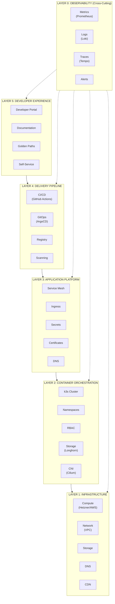
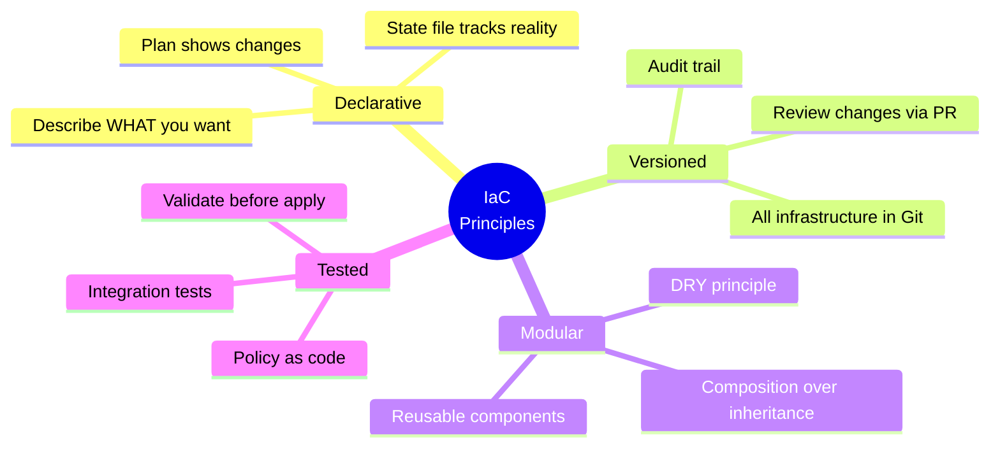
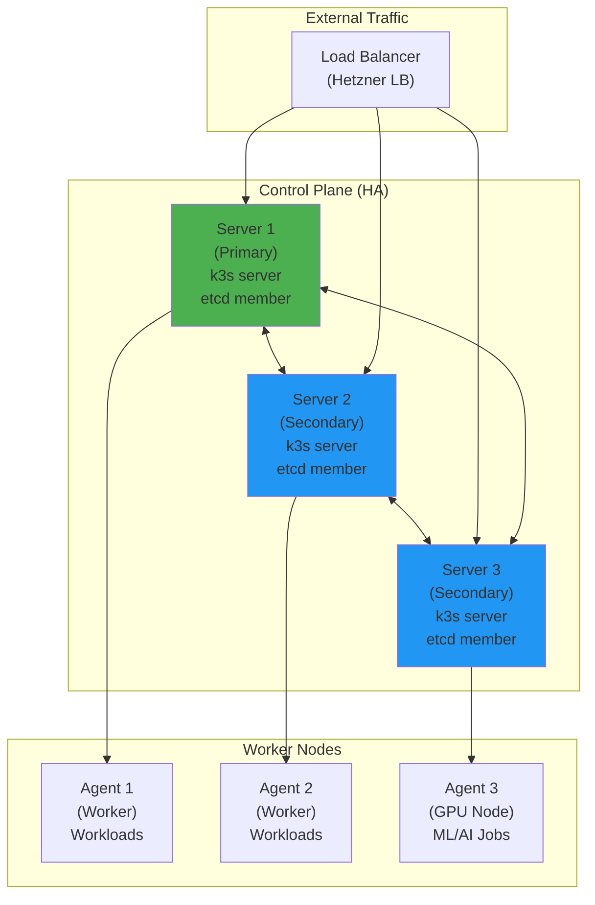
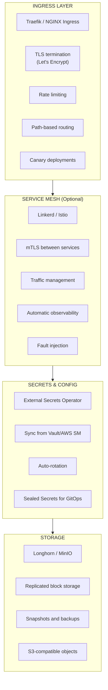
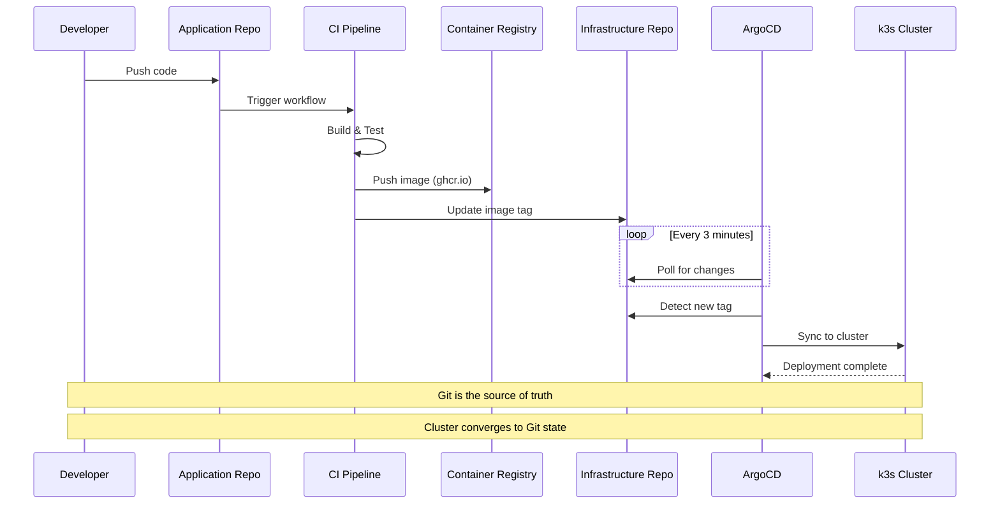
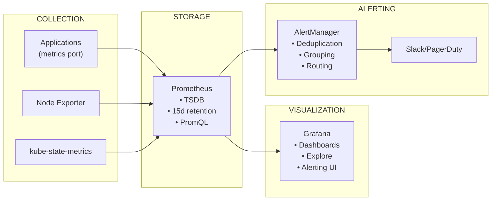
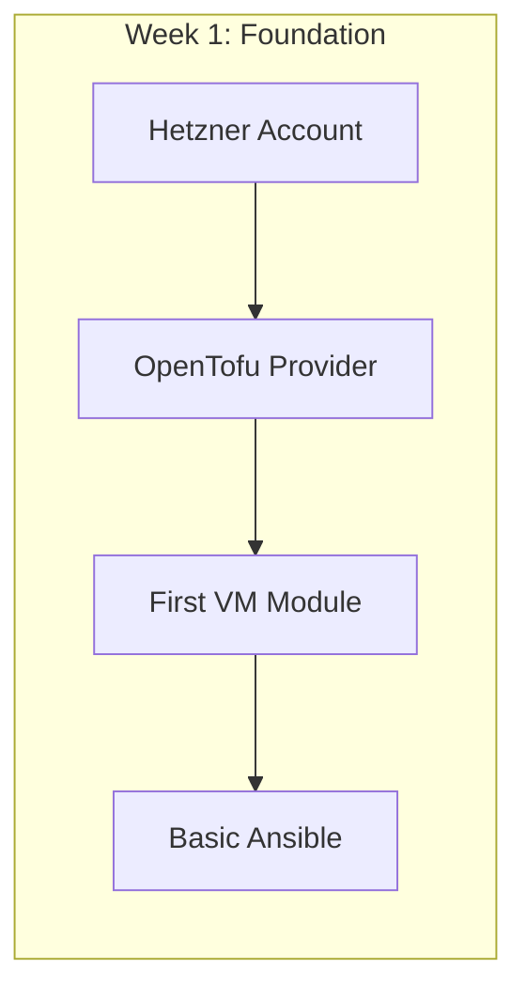
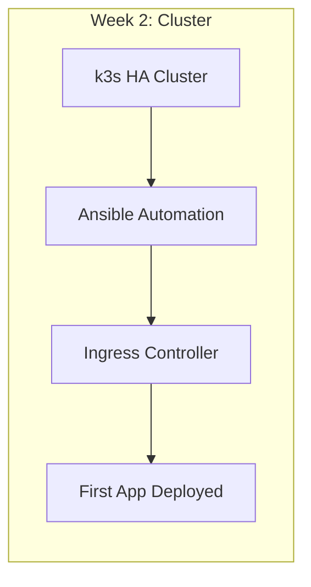
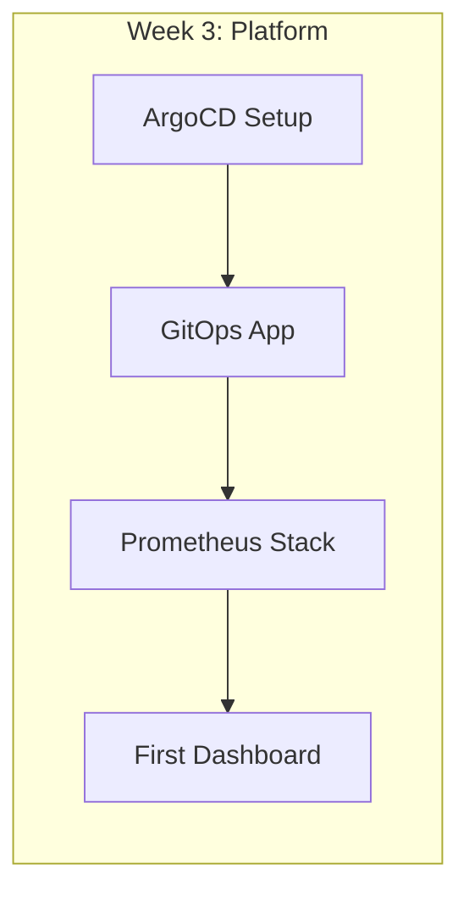
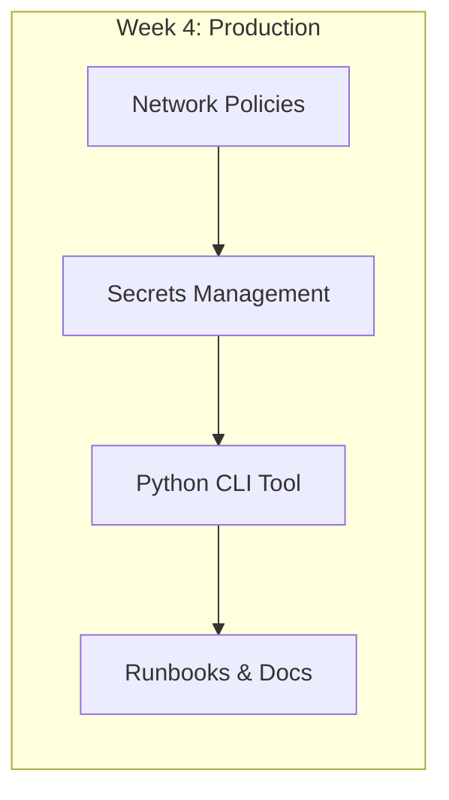

# Platform Architecture

> *"Design for failure. Anticipate and mitigate cascading failures. Build systems that fail fast and recover gracefully."*
> — **Release It!** (Michael Nygard)

## Beyond Traditional Infrastructure

> *Modern platform engineering is about building systems that enable developers to ship faster while maintaining enterprise-grade reliability.*

---

## The Architecture Layers



---

## Layer 1: Infrastructure (OpenTofu)

> *"Treat servers like cattle, not pets. If a server is misbehaving, shoot it in the head and create a new one."*
> — **Infrastructure as Code** (Kief Morris)

### Infrastructure-as-Code Philosophy



### Module Structure

```hcl
# modules/hetzner-k3s-cluster/main.tf

variable "cluster_name" {
  type        = string
  description = "Name of the k3s cluster"
}

variable "server_count" {
  type        = number
  default     = 3
  description = "Number of control plane nodes (odd number for HA)"
}

variable "agent_count" {
  type        = number
  default     = 3
  description = "Number of worker nodes"
}

variable "server_type" {
  type        = string
  default     = "cx31"
  description = "Hetzner server type"
}

# Create servers
resource "hetzner_server" "k3s_server" {
  count       = var.server_count
  name        = "${var.cluster_name}-server-${count.index}"
  image       = "ubuntu-22.04"
  server_type = var.server_type
  location    = "fsn1"

  labels = {
    cluster = var.cluster_name
    role    = "server"
  }
}

# Output for downstream modules
output "server_ips" {
  value = hetzner_server.k3s_server[*].ipv4_address
}
```

### Cloud Provider Comparison

| Resource | Hetzner | AWS | Notes |
|----------|---------|-----|-------|
| **Compute** | `hcloud_server` | `aws_instance` | Hetzner 80% cheaper |
| **Network** | `hcloud_network` | `aws_vpc` | Similar concepts |
| **Load Balancer** | `hcloud_load_balancer` | `aws_lb` | Hetzner included in price |
| **Storage** | `hcloud_volume` | `aws_ebs_volume` | Hetzner simpler |
| **Object Storage** | S3-compatible | `aws_s3_bucket` | Use MinIO for Hetzner |

---

## Layer 2: Container Orchestration (k3s)

### Why k3s?

| Feature | k3s | Full K8s | Impact |
|---------|-----|----------|--------|
| **Binary Size** | ~50MB | ~1GB | Faster installs |
| **Memory** | 512MB minimum | 2GB+ recommended | Lower cost |
| **Components** | Bundled (SQLite/etcd) | Separate | Simpler ops |
| **Certifications** | CNCF Certified | CNCF Certified | Same API |
| **Production Ready** | Yes | Yes | Equal capability |

### Cluster Topology



**Fault Tolerance**: Survives 1 server failure (n/2 + 1 quorum)
**Scaling**: Add agents with single command

### Installation Flow (Ansible)

```yaml
# playbooks/k3s-install.yml

- name: Install k3s cluster
  hosts: all
  become: yes

  tasks:
    - name: Install first server (initializes cluster)
      when: inventory_hostname == groups['servers'][0]
      shell: |
        curl -sfL https://get.k3s.io | sh -s - server \
          --cluster-init \
          --tls-san={{ loadbalancer_ip }} \
          --disable traefik \
          --flannel-backend=none \
          --disable-network-policy

    - name: Get join token
      when: inventory_hostname == groups['servers'][0]
      slurp:
        src: /var/lib/rancher/k3s/server/node-token
      register: k3s_token

    - name: Join additional servers
      when: inventory_hostname in groups['servers'][1:]
      shell: |
        curl -sfL https://get.k3s.io | sh -s - server \
          --server https://{{ groups['servers'][0] }}:6443 \
          --token {{ k3s_token.content | b64decode | trim }} \
          --tls-san={{ loadbalancer_ip }}

    - name: Join agents
      when: inventory_hostname in groups['agents']
      shell: |
        curl -sfL https://get.k3s.io | sh -s - agent \
          --server https://{{ loadbalancer_ip }}:6443 \
          --token {{ k3s_token.content | b64decode | trim }}
```

---

## Layer 3: Application Platform

### Core Platform Services



### Helm Charts vs Kustomize

| Approach | When to Use | Pros | Cons |
|----------|-------------|------|------|
| **Helm** | Third-party apps | Templating, versioned releases | Complexity |
| **Kustomize** | Your apps | Native kubectl, overlays | Limited templating |
| **Both** | Best of both | Flexibility | Learning curve |

---

## Layer 4: Delivery Pipeline

### GitOps Flow



### ArgoCD Application Definition

```yaml
# argocd/applications/user-service.yaml

apiVersion: argoproj.io/v1alpha1
kind: Application
metadata:
  name: user-service
  namespace: argocd
spec:
  project: default

  source:
    repoURL: https://github.com/org/infra
    targetRevision: main
    path: k8s/overlays/prod/user-service

  destination:
    server: https://kubernetes.default.svc
    namespace: production

  syncPolicy:
    automated:
      prune: true
      selfHeal: true
    syncOptions:
      - CreateNamespace=true

  # Health checks
  ignoreDifferences:
    - group: apps
      kind: Deployment
      jsonPointers:
        - /spec/replicas  # Allow HPA to manage replicas
```

---

## Layer 0: Observability

> *"Hope is not a strategy. Without visibility into your systems, you're flying blind."*
> — **Site Reliability Engineering** (Google)

### Metrics Pipeline



### Golden Signals

| Signal | What It Measures | Example Metrics |
|--------|------------------|-----------------|
| **Latency** | Time to serve request | `http_request_duration_seconds` |
| **Traffic** | Demand on system | `http_requests_total` |
| **Errors** | Failed requests | `http_requests_total{status=~"5.."}` |
| **Saturation** | System capacity | `container_memory_usage_bytes` |

---

## Implementation Approach for Interns

### Week 1: Foundation



1. **Infrastructure Setup**
   - Create Hetzner account, configure OpenTofu provider
   - Write first module: single VM with SSH access
   - Learn: State management, plan/apply workflow

2. **Basic Ansible**
   - Inventory file with your VM
   - First playbook: install packages, configure firewall
   - Learn: Idempotency, roles, variables

### Week 2: Cluster



3. **k3s Installation**
   - HA cluster (3 servers, 3 agents)
   - Ansible automation for reproducibility
   - Learn: Kubernetes fundamentals, kubectl

4. **Core Services**
   - Install ingress controller
   - Deploy first application
   - Learn: Services, ingress, namespaces

### Week 3: Platform



5. **GitOps Setup**
   - Install ArgoCD
   - First GitOps-managed application
   - Learn: Declarative operations, self-healing

6. **Observability**
   - Deploy Prometheus stack
   - Create first dashboard
   - Learn: PromQL, alerting

### Week 4: Production Readiness



7. **Security Hardening**
   - Network policies
   - Secrets management
   - Learn: Zero-trust principles

8. **Documentation & Automation**
   - Python CLI tool for common operations
   - Runbooks for incidents
   - Learn: Toil elimination

---

## Related

- [Infrastructure-as-Code](./02-Infrastructure-as-Code.md)
- [Configuration Management](./03-Configuration-Management.md)
- [Container Orchestration](./04-Container-Orchestration.md)
- [GitOps](./05-GitOps.md)

---

*Last Updated: 2026-02-02*
