# Autograph Architecture

> *"The best architectures are those that allow you to defer decisions about details."*
> — **Clean Architecture** (Robert C. Martin)

## Product-First Architecture

Autograph is an AI-powered content platform. The architecture serves one purpose: **enable users to create, manage, and distribute content faster with AI.**

---

## System Overview


---

## Product Layer: The Heart of Autograph

### Content Flow


### Component Details

| Component | Purpose | Technology | Port |
|-----------|---------|------------|------|
| **Strapi CMS** | Content management, admin panel | Node.js, REST/GraphQL | 1337 |
| **AI Service** | Content generation, summarization | Node.js, Claude/OpenAI API | 3001 |
| **PostgreSQL** | Persistent content storage | PostgreSQL 15 | 5432 |
| **Redis** | Caching, session storage | Redis 7 | 6379 |
| **Meilisearch** | Full-text content search | Meilisearch | 7700 |

---

## Architecture Layers

### Layer 1: Infrastructure (OpenTofu)

> *"Treat servers like cattle, not pets."*
> — **Infrastructure as Code** (Kief Morris)

The foundation that runs Autograph:


**Infrastructure Code Structure:**

```
infra/
├── terraform/
│   ├── modules/
│   │   ├── hetzner-server/       # VM provisioning
│   │   ├── network/              # Private networking
│   │   └── k3s-cluster/          # Cluster foundation
│   └── environments/
│       ├── dev/                  # Development
│       └── prod/                 # Production
└── ansible/
    ├── playbooks/
    │   ├── base-hardening.yml    # Security
    │   └── k3s-install.yml       # Kubernetes
    └── roles/
        ├── common/
        └── k3s/
```

### Layer 2: Container Orchestration (k3s)

Autograph runs on Kubernetes for:
- **High Availability**: Survives node failures
- **Auto-scaling**: Handles traffic spikes
- **Rolling Updates**: Zero-downtime deployments
- **Resource Management**: Efficient use of infrastructure

**Cluster Topology:**

| Node Type | Count | Purpose |
|-----------|-------|---------|
| **Servers** | 3 | Control plane, etcd, API server |
| **Agents** | 3 | Autograph workloads |
| **Total** | 6 | HA cluster |

**Why k3s over full Kubernetes:**

| Feature | k3s | Full K8s |
|---------|-----|----------|
| Binary size | 50MB | 1GB+ |
| Memory | 512MB | 2GB+ |
| Setup time | 5 minutes | Hours |
| CNCF Certified | ✅ | ✅ |
| Production Ready | ✅ | ✅ |

### Layer 3: Application Platform

Platform services that Autograph needs:

```mermaid
flowchart TB
    subgraph Ingress["INGRESS"]
        ING["NGINX Ingress"]
        TLS["cert-manager<br/>Let's Encrypt"]
    end

    subgraph DNS["DNS & ROUTING"]
        D1["autograph.domain.com → Strapi"]
        D2["api.domain.com → Strapi API"]
        D3["ai.domain.com → AI Service"]
    end

    subgraph Storage["PERSISTENT STORAGE"]
        LH["Longhorn"]
        S1["PostgreSQL data"]
        S2["Media uploads"]
        S3["Redis persistence"]
    end

    subgraph Secrets["SECRETS"]
        ESO["External Secrets<br/>or Sealed Secrets"]
        K1["Database credentials"]
        K2["AI API keys"]
        K3["JWT secrets"]
    end

    Ingress --> DNS
    DNS --> Storage
    Storage --> Secrets
```



### Layer 4: Delivery Pipeline (GitOps)

How Autograph gets deployed:


**ArgoCD manages Autograph:**

```yaml
# argocd/applications/autograph.yaml
apiVersion: argoproj.io/v1alpha1
kind: Application
metadata:
  name: autograph
  namespace: argocd
spec:
  project: default
  source:
    repoURL: https://github.com/org/autograph-infra
    targetRevision: main
    path: k8s/overlays/prod/autograph
  destination:
    server: https://kubernetes.default.svc
    namespace: autograph
  syncPolicy:
    automated:
      prune: true
      selfHeal: true
```

### Layer 0: Observability (Cross-Cutting)

See everything happening in Autograph:


**Autograph-Specific Metrics:**

| Metric | Purpose | Alert Threshold |
|--------|---------|-----------------|
| `strapi_requests_total` | API usage | > 10k/min |
| `ai_tokens_total` | API cost tracking | > 100k/hour |
| `ai_latency_avg_ms` | Generation speed | > 5000ms |
| `content_created_total` | Product usage | Business metric |

---

## Autograph Namespace Layout

```yaml
# How Autograph is organized in Kubernetes

autograph/
├── strapi/
│   ├── deployment.yaml        # 2 replicas
│   ├── service.yaml           # ClusterIP
│   ├── ingress.yaml           # HTTPS endpoint
│   ├── configmap.yaml         # Environment config
│   ├── secret.yaml            # Credentials
│   └── hpa.yaml               # Auto-scaling
├── ai-service/
│   ├── deployment.yaml        # 2 replicas
│   ├── service.yaml           # Internal only
│   ├── configmap.yaml         # AI config
│   └── secret.yaml            # API keys
├── database/
│   ├── postgresql/
│   │   ├── statefulset.yaml   # Persistent DB
│   │   └── service.yaml
│   └── redis/
│       ├── deployment.yaml
│       └── service.yaml
└── search/
    └── meilisearch/
        ├── statefulset.yaml
        └── service.yaml
```

---

## Implementation Timeline

### Week 1: Foundation


**Deliverables:**
- Infrastructure-as-Code foundation
- 6 VMs provisioned and hardened
- Ready for k3s installation

### Week 2: Autograph Core


**Deliverables:**
- HA Kubernetes cluster
- PostgreSQL, Redis, Meilisearch
- **Strapi CMS running**
- **AI content generation working**

### Week 3: Scale


**Deliverables:**
- GitOps automation
- Autograph dashboards
- Alerting for product metrics

### Week 4: Production Ready


**Deliverables:**
- Network policies, RBAC
- Backup and recovery tested
- Autograph ready for real users

---

## Key Architecture Decisions

| Decision | Choice | Reasoning |
|----------|--------|-----------|
| **CMS** | Strapi | Open source, API-first, extensible |
| **AI Provider** | Claude (primary) | Best content quality |
| **AI Fallback** | OpenAI | Reliability |
| **Database** | PostgreSQL | Strapi default, reliable |
| **Cache** | Redis | Session + API caching |
| **Search** | Meilisearch | Fast, typo-tolerant |
| **Orchestration** | k3s | Lightweight, production-ready |
| **GitOps** | ArgoCD | UI, multi-cluster support |
| **Observability** | Prometheus + Grafana | Industry standard |
| **Cloud** | Hetzner | 90% cost savings |

---

## Security Architecture

```mermaid
flowchart TB
    subgraph External["External"]
        User["Users"]
    end

    subgraph Edge["Edge"]
        WAF["CloudFlare WAF"]
        TLS["TLS 1.3"]
    end

    subgraph Cluster["k3s Cluster"]
        subgraph NetworkPolicies["Network Policies"]
            NP1["Default Deny All"]
            NP2["Allow Strapi → PostgreSQL"]
            NP3["Allow Strapi → AI Service"]
            NP4["Allow Prometheus scraping"]
        end

        subgraph RBAC["RBAC"]
            R1["Admin: Full access"]
            R2["Developer: autograph namespace"]
            R3["CI: Deploy only"]
        end

        subgraph Secrets["Secrets Management"]
            S1["Sealed Secrets (GitOps)"]
            S2["External Secrets (Vault)"]
        end
    end

    User --> WAF --> TLS --> Cluster
```



---

## Related

- [Infrastructure-as-Code](./02-Infrastructure-as-Code.md)
- [Configuration Management](./03-Configuration-Management.md)
- [Container Orchestration](./04-Container-Orchestration.md)
- [GitOps](./05-GitOps.md)
- [Product Vision](../01-Product/01-Vision.md)

---

*Last Updated: 2026-02-02*
