# Infrastructure-as-Code with OpenTofu

## Beyond Click-Ops

> *If it's not in Git, it doesn't exist. If it's not code, it doesn't scale.*

---

## Why Infrastructure-as-Code?

```mermaid
flowchart LR
    subgraph Manual["Manual (Click-Ops)"]
        direction TB
        M1["Login to console"]
        M2["Click through UI"]
        M3["Hope you remember settings"]
        M4["Pray nothing changed"]
        M1 --> M2 --> M3 --> M4
    end

    subgraph IaC["Infrastructure-as-Code"]
        direction TB
        I1["Write code"]
        I2["Review in PR"]
        I3["Apply automatically"]
        I4["Guaranteed consistency"]
        I1 --> I2 --> I3 --> I4
    end

    Manual -.->|"Unrepeatable\nUndocumented\nError-prone"| X["😱"]
    IaC -.->|"Repeatable\nVersioned\nTestable"| Y["🚀"]
```



---

## OpenTofu vs Terraform

| Feature | Terraform | OpenTofu |
|---------|-----------|----------|
| License | BSL (proprietary) | MPL 2.0 (open source) |
| Syntax | HCL | HCL (identical) |
| Providers | Full ecosystem | Full ecosystem |
| State | Same format | Same format |
| Community | HashiCorp controlled | Linux Foundation |

**Why OpenTofu?**
- Truly open source (no license risk)
- Drop-in Terraform replacement
- Community-driven development
- Same syntax and providers

---

## Core Concepts

### Providers

```hcl
# Configure the Hetzner Cloud Provider
terraform {
  required_providers {
    hcloud = {
      source  = "hetznercloud/hcloud"
      version = "~> 1.45"
    }
  }
}

provider "hcloud" {
  token = var.hcloud_token  # From environment or tfvars
}
```

### Resources

```hcl
# Create a server
resource "hcloud_server" "web" {
  name        = "web-1"
  image       = "ubuntu-22.04"
  server_type = "cx31"
  location    = "fsn1"

  ssh_keys = [hcloud_ssh_key.admin.id]

  labels = {
    environment = "production"
    role        = "web"
  }
}

# Create SSH key
resource "hcloud_ssh_key" "admin" {
  name       = "admin-key"
  public_key = file("~/.ssh/id_ed25519.pub")
}
```

### Data Sources

```hcl
# Reference existing resources
data "hcloud_image" "ubuntu" {
  name = "ubuntu-22.04"
}

data "hcloud_location" "frankfurt" {
  name = "fsn1"
}
```

---

## Module Architecture


---

## Module: Hetzner Server

```hcl
# modules/hetzner-server/variables.tf

variable "name" {
  type        = string
  description = "Server name"
}

variable "server_type" {
  type        = string
  default     = "cx31"
  description = "Hetzner server type (cx31 = 4 vCPU, 8GB RAM)"
}

variable "image" {
  type        = string
  default     = "ubuntu-22.04"
  description = "OS image"
}

variable "location" {
  type        = string
  default     = "fsn1"
  description = "Hetzner datacenter"
}

variable "ssh_key_ids" {
  type        = list(string)
  description = "SSH key IDs for access"
}

variable "network_id" {
  type        = string
  description = "Private network to attach"
}

variable "labels" {
  type        = map(string)
  default     = {}
  description = "Labels for the server"
}
```

```hcl
# modules/hetzner-server/main.tf

resource "hcloud_server" "this" {
  name        = var.name
  image       = var.image
  server_type = var.server_type
  location    = var.location
  ssh_keys    = var.ssh_key_ids

  labels = merge(var.labels, {
    managed_by = "opentofu"
  })

  network {
    network_id = var.network_id
  }

  # Cloud-init for initial setup
  user_data = templatefile("${path.module}/cloud-init.yaml", {
    hostname = var.name
  })

  lifecycle {
    ignore_changes = [
      user_data,  # Don't recreate for cloud-init changes
    ]
  }
}

resource "hcloud_server_network" "this" {
  server_id  = hcloud_server.this.id
  network_id = var.network_id
}
```

```hcl
# modules/hetzner-server/outputs.tf

output "id" {
  value       = hcloud_server.this.id
  description = "Server ID"
}

output "ipv4_address" {
  value       = hcloud_server.this.ipv4_address
  description = "Public IPv4 address"
}

output "private_ip" {
  value       = hcloud_server_network.this.ip
  description = "Private network IP"
}

output "status" {
  value       = hcloud_server.this.status
  description = "Server status"
}
```

---

## Module: k3s Cluster

```hcl
# modules/k3s-cluster/main.tf

# Control plane servers
module "servers" {
  source   = "../hetzner-server"
  count    = var.server_count

  name        = "${var.cluster_name}-server-${count.index}"
  server_type = var.server_type
  location    = var.location
  ssh_key_ids = var.ssh_key_ids
  network_id  = var.network_id

  labels = {
    cluster = var.cluster_name
    role    = "server"
    index   = count.index
  }
}

# Worker agents
module "agents" {
  source   = "../hetzner-server"
  count    = var.agent_count

  name        = "${var.cluster_name}-agent-${count.index}"
  server_type = var.agent_type
  location    = var.location
  ssh_key_ids = var.ssh_key_ids
  network_id  = var.network_id

  labels = {
    cluster = var.cluster_name
    role    = "agent"
    index   = count.index
  }
}

# Load balancer for HA control plane
resource "hcloud_load_balancer" "k3s" {
  name               = "${var.cluster_name}-lb"
  load_balancer_type = "lb11"
  location           = var.location

  labels = {
    cluster = var.cluster_name
    role    = "loadbalancer"
  }
}

resource "hcloud_load_balancer_target" "servers" {
  count            = var.server_count
  load_balancer_id = hcloud_load_balancer.k3s.id
  type             = "server"
  server_id        = module.servers[count.index].id
}

resource "hcloud_load_balancer_service" "k3s_api" {
  load_balancer_id = hcloud_load_balancer.k3s.id
  protocol         = "tcp"
  listen_port      = 6443
  destination_port = 6443

  health_check {
    protocol = "tcp"
    port     = 6443
    interval = 10
    timeout  = 5
    retries  = 3
  }
}
```

---

## State Management

### Remote State with S3

```hcl
# backend.tf

terraform {
  backend "s3" {
    bucket = "terraform-state-bucket"
    key    = "clusters/production/terraform.tfstate"
    region = "eu-central-1"

    # For Hetzner S3-compatible storage
    endpoints = {
      s3 = "https://fsn1.your-objectstorage.com"
    }

    skip_credentials_validation = true
    skip_metadata_api_check     = true
    skip_region_validation      = true
    force_path_style            = true
  }
}
```

### State Locking


---

## Workflow

### Development Cycle

```mermaid
flowchart LR
    subgraph Local["Local Development"]
        Write["Write HCL"]
        Format["tofu fmt"]
        Validate["tofu validate"]
    end

    subgraph Plan["Planning"]
        Init["tofu init"]
        Plan["tofu plan"]
        Review["Review Plan"]
    end

    subgraph Apply["Application"]
        Apply1["tofu apply"]
        Verify["Verify Resources"]
    end

    Write --> Format --> Validate
    Validate --> Init --> Plan --> Review
    Review -->|"Approved"| Apply1 --> Verify
    Review -->|"Changes needed"| Write
```

### CI/CD Integration

```yaml
# .github/workflows/terraform.yml

name: Terraform

on:
  pull_request:
    paths:
      - 'terraform/**'
  push:
    branches: [main]
    paths:
      - 'terraform/**'

jobs:
  plan:
    runs-on: ubuntu-latest
    steps:
      - uses: actions/checkout@v4

      - name: Setup OpenTofu
        uses: opentofu/setup-opentofu@v1

      - name: Init
        run: tofu init
        working-directory: terraform

      - name: Validate
        run: tofu validate
        working-directory: terraform

      - name: Plan
        run: tofu plan -out=plan.tfplan
        working-directory: terraform
        env:
          TF_VAR_hcloud_token: ${{ secrets.HCLOUD_TOKEN }}

      - name: Comment PR
        if: github.event_name == 'pull_request'
        uses: actions/github-script@v7
        with:
          script: |
            // Post plan output to PR

  apply:
    needs: plan
    if: github.ref == 'refs/heads/main'
    runs-on: ubuntu-latest
    environment: production
    steps:
      - name: Apply
        run: tofu apply -auto-approve plan.tfplan
        working-directory: terraform
```

---

## Best Practices

### 1. Use Modules for Reusability

```hcl
# Good: Reusable module
module "production_cluster" {
  source = "./modules/k3s-cluster"

  cluster_name = "prod"
  server_count = 3
  agent_count  = 3
}

module "staging_cluster" {
  source = "./modules/k3s-cluster"

  cluster_name = "staging"
  server_count = 1
  agent_count  = 2
}
```

### 2. Use Variables with Validation

```hcl
variable "server_count" {
  type        = number
  description = "Number of control plane servers (must be odd for HA)"

  validation {
    condition     = var.server_count % 2 == 1
    error_message = "Server count must be odd for etcd quorum."
  }
}

variable "environment" {
  type        = string
  description = "Environment name"

  validation {
    condition     = contains(["dev", "staging", "prod"], var.environment)
    error_message = "Environment must be dev, staging, or prod."
  }
}
```

### 3. Use Outputs for Integration

```hcl
# Root outputs.tf
output "kubeconfig_command" {
  value       = "scp root@${module.cluster.server_ips[0]}:/etc/rancher/k3s/k3s.yaml ~/.kube/config"
  description = "Command to get kubeconfig"
}

output "server_ips" {
  value       = module.cluster.server_ips
  description = "Control plane IPs for Ansible inventory"
}

output "agent_ips" {
  value       = module.cluster.agent_ips
  description = "Worker node IPs for Ansible inventory"
}
```

---

## Common Patterns

### Count vs For_Each

```hcl
# Count: For identical resources (index-based)
resource "hcloud_server" "agents" {
  count = 3
  name  = "agent-${count.index}"
}

# For_each: For distinct resources (named)
resource "hcloud_server" "nodes" {
  for_each = {
    server-1 = { type = "cx31", role = "server" }
    server-2 = { type = "cx31", role = "server" }
    agent-1  = { type = "cx41", role = "agent" }
  }

  name        = each.key
  server_type = each.value.type

  labels = {
    role = each.value.role
  }
}
```

### Dynamic Blocks

```hcl
resource "hcloud_firewall" "cluster" {
  name = "k3s-cluster"

  dynamic "rule" {
    for_each = var.firewall_rules
    content {
      direction  = rule.value.direction
      protocol   = rule.value.protocol
      port       = rule.value.port
      source_ips = rule.value.source_ips
    }
  }
}
```

---

## Related

- [Architecture Overview](./01-Architecture.md)
- [Configuration Management](./03-Configuration-Management.md)
- [Container Orchestration](./04-Container-Orchestration.md)

---

*Last Updated: 2026-02-02*
