# Infrastructure-as-Code: Building Autograph's Foundation

> *"Every castle stands on a foundation. OpenTofu is how we lay Autograph's."*

## The Purpose: Infrastructure FOR Autograph

**Why are we doing this?** To give Autograph a home.

Before we can deploy Strapi, AI services, and databases, we need servers. Not just any servers—**reliable, repeatable, documented infrastructure** that we can recreate at will.

```mermaid
flowchart TB
    subgraph Problem["🚫 WITHOUT IaC"]
        P1["Click through Hetzner console"]
        P2["Forget the exact settings"]
        P3["Can't recreate when disaster strikes"]
        P4["Autograph dies, users suffer"]
    end

    subgraph Solution["✅ WITH IaC"]
        S1["Define infrastructure in code"]
        S2["Version control everything"]
        S3["Recreate in minutes"]
        S4["Autograph survives anything"]
    end

    Problem -.->|"Manual chaos"| X["😱"]
    Solution -.->|"Automated reliability"| Y["🚀 Autograph runs forever"]

    style Solution fill:#4CAF50
```



---

## What You'll Build for Autograph

| Infrastructure | Purpose for Autograph |
|---------------|----------------------|
| **3 Server VMs** | k3s control plane (HA) |
| **3 Agent VMs** | Run Strapi, AI service, databases |
| **Private Network** | Secure communication between components |
| **Load Balancer** | Public access to Autograph |
| **Firewall Rules** | Protect Autograph from attacks |

---

## Why OpenTofu (Not Terraform)

> *"We choose open source because vendor lock-in kills startups."*

| Feature | Terraform | OpenTofu |
|---------|-----------|----------|
| License | BSL (proprietary) | MPL 2.0 (open source) |
| Syntax | HCL | HCL (identical) |
| Providers | Full ecosystem | Full ecosystem |
| State | Same format | Same format |
| Community | HashiCorp controlled | Linux Foundation |

**For Autograph:** OpenTofu is a drop-in Terraform replacement with no license risk.

---

## Core Concepts (The Building Blocks)

### Providers: How We Talk to Hetzner

```hcl
# Tell OpenTofu we're using Hetzner Cloud
terraform {
  required_providers {
    hcloud = {
      source  = "hetznercloud/hcloud"
      version = "~> 1.45"
    }
  }
}

provider "hcloud" {
  token = var.hcloud_token  # Your Hetzner API token
}
```

### Resources: The Actual Infrastructure

```hcl
# Create a server for Autograph
resource "hcloud_server" "contentai_server" {
  name        = "contentai-server-1"
  image       = "ubuntu-22.04"
  server_type = "cx31"  # 4 vCPU, 8GB RAM
  location    = "fsn1"  # Frankfurt

  ssh_keys = [hcloud_ssh_key.admin.id]

  labels = {
    product     = "contentai"
    environment = "production"
    role        = "server"
  }
}
```

---

## Module Architecture for Autograph


---

## Module: Hetzner Server (For Autograph Workers)

### Variables

```hcl
# modules/hetzner-server/variables.tf

variable "name" {
  type        = string
  description = "Server name (e.g., contentai-agent-1)"
}

variable "server_type" {
  type        = string
  default     = "cx31"
  description = "Hetzner server type (cx31 = 4 vCPU, 8GB RAM for Strapi)"
}

variable "image" {
  type        = string
  default     = "ubuntu-22.04"
  description = "OS image"
}

variable "location" {
  type        = string
  default     = "fsn1"
  description = "Hetzner datacenter (Frankfurt)"
}

variable "ssh_key_ids" {
  type        = list(string)
  description = "SSH key IDs for admin access"
}

variable "network_id" {
  type        = string
  description = "Private network for Autograph components"
}

variable "labels" {
  type        = map(string)
  default     = { product = "contentai" }
  description = "Labels for organization"
}
```

### Main Resource

```hcl
# modules/hetzner-server/main.tf

resource "hcloud_server" "this" {
  name        = var.name
  image       = var.image
  server_type = var.server_type
  location    = var.location
  ssh_keys    = var.ssh_key_ids

  labels = merge(var.labels, {
    managed_by = "opentofu"
    product    = "contentai"
  })

  network {
    network_id = var.network_id
  }

  # Cloud-init for initial setup
  user_data = templatefile("${path.module}/cloud-init.yaml", {
    hostname = var.name
  })

  lifecycle {
    ignore_changes = [user_data]
  }
}

resource "hcloud_server_network" "this" {
  server_id  = hcloud_server.this.id
  network_id = var.network_id
}
```

### Outputs

```hcl
# modules/hetzner-server/outputs.tf

output "id" {
  value       = hcloud_server.this.id
  description = "Server ID"
}

output "ipv4_address" {
  value       = hcloud_server.this.ipv4_address
  description = "Public IPv4 (for SSH access)"
}

output "private_ip" {
  value       = hcloud_server_network.this.ip
  description = "Private IP (for internal Autograph traffic)"
}
```

---

## Module: k3s Cluster for Autograph

```hcl
# modules/k3s-cluster/main.tf

# Control plane servers (run Kubernetes API, etcd)
module "servers" {
  source   = "../hetzner-server"
  count    = var.server_count  # 3 for HA

  name        = "contentai-server-${count.index}"
  server_type = var.server_type
  location    = var.location
  ssh_key_ids = var.ssh_key_ids
  network_id  = var.network_id

  labels = {
    cluster = "contentai"
    role    = "server"
    index   = count.index
  }
}

# Worker agents (run Strapi, AI service, databases)
module "agents" {
  source   = "../hetzner-server"
  count    = var.agent_count  # 3 for Autograph workloads

  name        = "contentai-agent-${count.index}"
  server_type = var.agent_type  # Bigger for Strapi
  location    = var.location
  ssh_key_ids = var.ssh_key_ids
  network_id  = var.network_id

  labels = {
    cluster = "contentai"
    role    = "agent"
    index   = count.index
  }
}

# Load balancer for public access to Autograph
resource "hcloud_load_balancer" "contentai" {
  name               = "contentai-lb"
  load_balancer_type = "lb11"
  location           = var.location

  labels = {
    cluster = "contentai"
    role    = "loadbalancer"
  }
}

# Point LB to agents (where Strapi runs)
resource "hcloud_load_balancer_target" "agents" {
  count            = var.agent_count
  load_balancer_id = hcloud_load_balancer.contentai.id
  type             = "server"
  server_id        = module.agents[count.index].id
}

# HTTP/HTTPS for Autograph
resource "hcloud_load_balancer_service" "https" {
  load_balancer_id = hcloud_load_balancer.contentai.id
  protocol         = "tcp"
  listen_port      = 443
  destination_port = 443

  health_check {
    protocol = "tcp"
    port     = 443
    interval = 10
    timeout  = 5
    retries  = 3
  }
}
```

---

## State Management

> *"The state file is your source of truth. Lose it, and you lose track of what exists."*

### Remote State (Team Collaboration)

```hcl
# backend.tf

terraform {
  backend "s3" {
    bucket = "contentai-terraform-state"
    key    = "clusters/production/terraform.tfstate"
    region = "eu-central-1"

    # For Hetzner S3-compatible storage
    endpoints = {
      s3 = "https://fsn1.your-objectstorage.com"
    }

    skip_credentials_validation = true
    skip_metadata_api_check     = true
    force_path_style            = true
  }
}
```

### State Locking


---

## Workflow: Building Autograph Infrastructure

```mermaid
flowchart LR
    subgraph Write["✍️ Write"]
        W1["Define Autograph VMs"]
        W2["tofu fmt (format)"]
        W3["tofu validate"]
    end

    subgraph Plan["📋 Plan"]
        P1["tofu init"]
        P2["tofu plan"]
        P3["Review: 6 VMs, 1 LB, 1 network"]
    end

    subgraph Apply["🚀 Apply"]
        A1["tofu apply"]
        A2["VMs created"]
        A3["Ready for Ansible + k3s"]
    end

    Write --> Plan --> Apply

    style Apply fill:#4CAF50
```



### Commands

```bash
# Initialize (download providers)
tofu init

# Format your code
tofu fmt -recursive

# Validate syntax
tofu validate

# Preview what will be created
tofu plan

# Create Autograph infrastructure
tofu apply

# When done, tear it all down (careful!)
tofu destroy
```

---

## CI/CD Integration

```yaml
# .github/workflows/contentai-infra.yml

name: Autograph Infrastructure

on:
  pull_request:
    paths:
      - 'terraform/**'
  push:
    branches: [main]
    paths:
      - 'terraform/**'

jobs:
  plan:
    runs-on: ubuntu-latest
    steps:
      - uses: actions/checkout@v4

      - name: Setup OpenTofu
        uses: opentofu/setup-opentofu@v1

      - name: Init
        run: tofu init
        working-directory: terraform

      - name: Validate
        run: tofu validate
        working-directory: terraform

      - name: Plan Autograph Infrastructure
        run: tofu plan -out=plan.tfplan
        working-directory: terraform
        env:
          TF_VAR_hcloud_token: ${{ secrets.HCLOUD_TOKEN }}

      - name: Comment PR with Plan
        if: github.event_name == 'pull_request'
        uses: actions/github-script@v7
        with:
          script: |
            // Show what infrastructure will be created

  apply:
    needs: plan
    if: github.ref == 'refs/heads/main'
    runs-on: ubuntu-latest
    environment: production
    steps:
      - name: Create Autograph Infrastructure
        run: tofu apply -auto-approve plan.tfplan
        working-directory: terraform
```

---

## Best Practices for Autograph

### 1. Use Modules for Consistency

```hcl
# Production cluster
module "production" {
  source = "./modules/k3s-cluster"

  cluster_name = "contentai-prod"
  server_count = 3
  agent_count  = 3
}

# Staging cluster (smaller)
module "staging" {
  source = "./modules/k3s-cluster"

  cluster_name = "contentai-staging"
  server_count = 1
  agent_count  = 2
}
```

### 2. Validate Inputs

```hcl
variable "server_count" {
  type        = number
  description = "Number of control plane servers (must be odd for HA)"

  validation {
    condition     = var.server_count % 2 == 1
    error_message = "Server count must be odd for etcd quorum (1, 3, or 5)."
  }
}
```

### 3. Output for Ansible

```hcl
# Outputs for the next step: Ansible configuration
output "server_ips" {
  value       = module.cluster.server_ips
  description = "Autograph control plane IPs (for Ansible inventory)"
}

output "agent_ips" {
  value       = module.cluster.agent_ips
  description = "Autograph worker IPs (where Strapi will run)"
}

output "load_balancer_ip" {
  value       = hcloud_load_balancer.contentai.ipv4
  description = "Public IP for Autograph (point DNS here)"
}
```

---

## Autograph Cost Summary

| Resource | Spec | Monthly Cost |
|----------|------|--------------|
| 3x Server VMs | CX31 (4 vCPU, 8GB) | €30 |
| 3x Agent VMs | CX41 (8 vCPU, 16GB) | €60 |
| Load Balancer | LB11 | €6 |
| Private Network | Included | €0 |
| **Total** | | **€96/month** |

*For comparison, this would cost ~$2,000/month on AWS.*

---

## What's Next

Once you've run `tofu apply` and have 6 VMs ready:

1. **[Configuration Management](./03-Configuration-Management.md)** — Use Ansible to install k3s
2. **[Container Orchestration](./04-Container-Orchestration.md)** — Understand k3s
3. **[Exercise: OpenTofu](../04-Internship/Exercises/02-OpenTofu.md)** — Hands-on practice

---

## Related

- [Architecture Overview](./01-Architecture.md)
- [Configuration Management](./03-Configuration-Management.md)
- [Container Orchestration](./04-Container-Orchestration.md)

---

*Last Updated: 2026-02-02*
