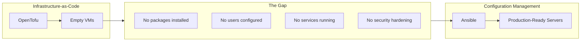
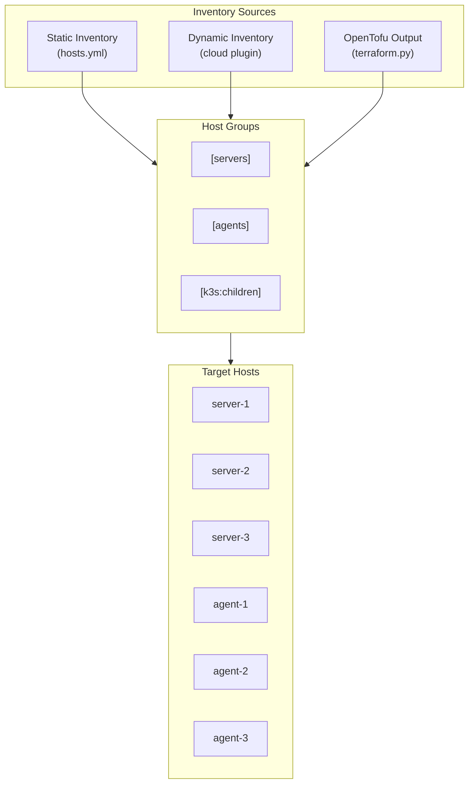
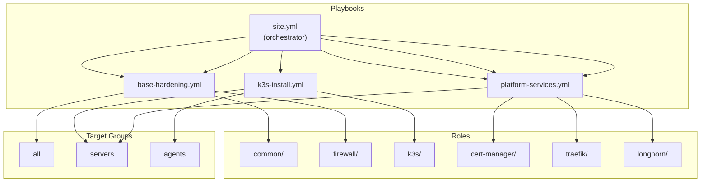
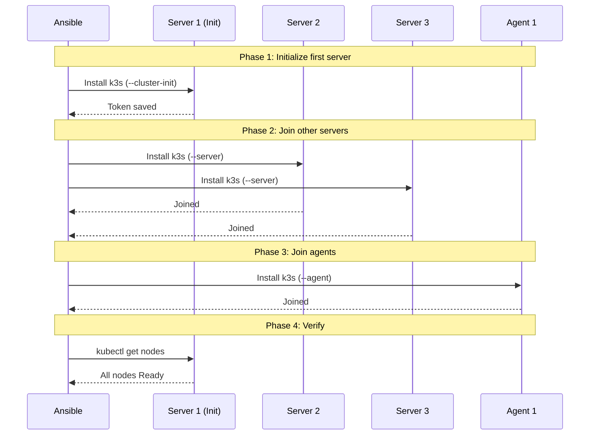
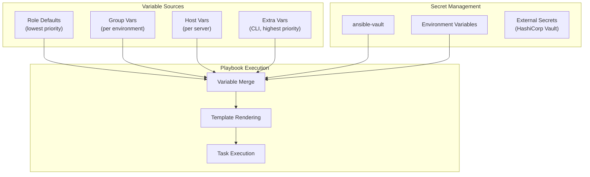
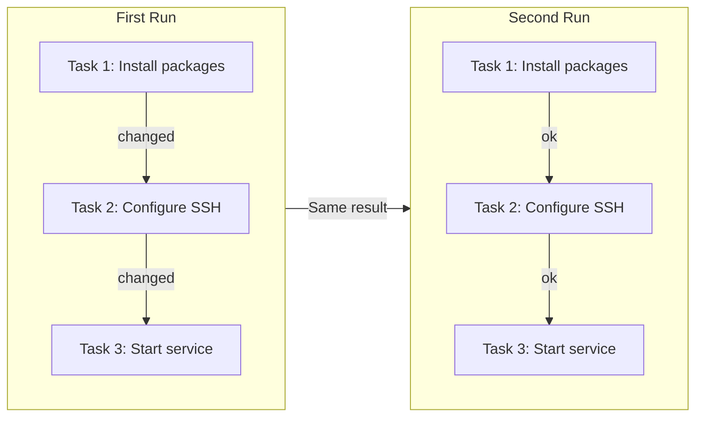
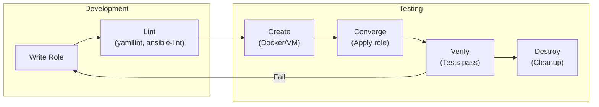

# Configuration Management with Ansible

## Why Configuration Management?

> *Infrastructure-as-Code provisions machines. Configuration Management makes them useful.*

---

## The Configuration Gap



---

## Why Ansible?

| Feature | Ansible | Puppet/Chef |
|---------|---------|-------------|
| **Architecture** | Agentless (SSH) | Requires agent |
| **Language** | YAML (declarative) | Ruby DSL |
| **Learning curve** | Low | High |
| **Ad-hoc commands** | Yes | No |
| **Push vs Pull** | Push | Pull |
| **Python integration** | Native | Limited |

**For this project:** Ansible's agentless model means no software to install on target nodes—perfect for ephemeral cloud infrastructure.

---

## Core Concepts

### Inventory



### Static Inventory Example

```yaml
# inventory/hosts.yml

all:
  children:
    servers:
      hosts:
        server-1:
          ansible_host: 10.1.1.1
          k3s_role: server
          k3s_server_init: true
        server-2:
          ansible_host: 10.1.1.2
          k3s_role: server
        server-3:
          ansible_host: 10.1.1.3
          k3s_role: server

    agents:
      hosts:
        agent-1:
          ansible_host: 10.1.2.1
          k3s_role: agent
        agent-2:
          ansible_host: 10.1.2.2
          k3s_role: agent
        agent-3:
          ansible_host: 10.1.2.3
          k3s_role: agent

    k3s:
      children:
        servers:
        agents:
      vars:
        k3s_version: v1.29.0+k3s1
        k3s_cluster_cidr: 10.42.0.0/16
        k3s_service_cidr: 10.43.0.0/16
```

### Dynamic Inventory from OpenTofu

```yaml
# inventory/hcloud.yml

plugin: hetzner.hcloud.hcloud
token: "{{ lookup('env', 'HCLOUD_TOKEN') }}"

keyed_groups:
  - key: labels.role
    prefix: role
  - key: labels.cluster
    prefix: cluster
  - key: location
    prefix: location

compose:
  ansible_host: ipv4_address
  ansible_user: root
```

---

## Playbook Architecture



---

## Role: Common (Base Hardening)

```yaml
# roles/common/tasks/main.yml

---
- name: Update apt cache
  ansible.builtin.apt:
    update_cache: yes
    cache_valid_time: 3600
  when: ansible_os_family == "Debian"

- name: Install essential packages
  ansible.builtin.apt:
    name:
      - curl
      - wget
      - vim
      - htop
      - unzip
      - jq
      - apt-transport-https
      - ca-certificates
      - gnupg
    state: present

- name: Set timezone
  ansible.builtin.timezone:
    name: "{{ timezone | default('UTC') }}"

- name: Configure sshd
  ansible.builtin.template:
    src: sshd_config.j2
    dest: /etc/ssh/sshd_config
    owner: root
    group: root
    mode: '0644'
    validate: 'sshd -t -f %s'
  notify: Restart sshd

- name: Disable password authentication
  ansible.builtin.lineinfile:
    path: /etc/ssh/sshd_config
    regexp: '^#?PasswordAuthentication'
    line: 'PasswordAuthentication no'
  notify: Restart sshd

- name: Configure fail2ban
  ansible.builtin.include_tasks: fail2ban.yml
  when: enable_fail2ban | default(true)

- name: Configure automatic security updates
  ansible.builtin.include_tasks: unattended-upgrades.yml
```

### Role: Firewall (UFW)

```yaml
# roles/firewall/tasks/main.yml

---
- name: Install UFW
  ansible.builtin.apt:
    name: ufw
    state: present

- name: Set default incoming policy to deny
  community.general.ufw:
    direction: incoming
    policy: deny

- name: Set default outgoing policy to allow
  community.general.ufw:
    direction: outgoing
    policy: allow

- name: Allow SSH
  community.general.ufw:
    rule: allow
    port: "22"
    proto: tcp

- name: Allow internal network
  community.general.ufw:
    rule: allow
    src: "{{ private_network_cidr }}"

- name: Allow k3s API (servers only)
  community.general.ufw:
    rule: allow
    port: "6443"
    proto: tcp
  when: "'servers' in group_names"

- name: Allow HTTP/HTTPS (ingress nodes)
  community.general.ufw:
    rule: allow
    port: "{{ item }}"
    proto: tcp
  loop:
    - "80"
    - "443"
  when: k3s_role == 'agent' or ingress_node | default(false)

- name: Enable UFW
  community.general.ufw:
    state: enabled
```

---

## Role: k3s Installation



### k3s Role Implementation

```yaml
# roles/k3s/tasks/main.yml

---
- name: Download k3s install script
  ansible.builtin.get_url:
    url: https://get.k3s.io
    dest: /tmp/k3s-install.sh
    mode: '0700'

# Server initialization (first server only)
- name: Initialize first k3s server
  ansible.builtin.shell: |
    INSTALL_K3S_VERSION={{ k3s_version }} \
    K3S_TOKEN={{ k3s_token }} \
    sh /tmp/k3s-install.sh server \
      --cluster-init \
      --tls-san {{ k3s_api_endpoint }} \
      --disable traefik \
      --disable servicelb \
      --flannel-backend wireguard-native \
      --write-kubeconfig-mode 644
  args:
    creates: /etc/rancher/k3s/k3s.yaml
  when:
    - k3s_role == 'server'
    - k3s_server_init | default(false)
  register: k3s_init

- name: Wait for first server to be ready
  ansible.builtin.wait_for:
    host: "{{ ansible_host }}"
    port: 6443
    delay: 10
    timeout: 300
  when: k3s_init.changed

# Join additional servers
- name: Join server to cluster
  ansible.builtin.shell: |
    INSTALL_K3S_VERSION={{ k3s_version }} \
    K3S_TOKEN={{ k3s_token }} \
    sh /tmp/k3s-install.sh server \
      --server https://{{ k3s_api_endpoint }}:6443 \
      --tls-san {{ k3s_api_endpoint }} \
      --disable traefik \
      --disable servicelb \
      --flannel-backend wireguard-native
  args:
    creates: /etc/rancher/k3s/k3s.yaml
  when:
    - k3s_role == 'server'
    - not (k3s_server_init | default(false))

# Join agents
- name: Join agent to cluster
  ansible.builtin.shell: |
    INSTALL_K3S_VERSION={{ k3s_version }} \
    K3S_URL=https://{{ k3s_api_endpoint }}:6443 \
    K3S_TOKEN={{ k3s_token }} \
    sh /tmp/k3s-install.sh agent
  args:
    creates: /var/lib/rancher/k3s/agent
  when: k3s_role == 'agent'

# Fetch kubeconfig
- name: Fetch kubeconfig from first server
  ansible.builtin.fetch:
    src: /etc/rancher/k3s/k3s.yaml
    dest: "{{ playbook_dir }}/../kubeconfig"
    flat: yes
  when:
    - k3s_server_init | default(false)
  run_once: true

- name: Update kubeconfig server address
  ansible.builtin.replace:
    path: "{{ playbook_dir }}/../kubeconfig"
    regexp: '127.0.0.1'
    replace: "{{ k3s_api_endpoint }}"
  delegate_to: localhost
  run_once: true
```

---

## Variables and Secrets



### Group Variables

```yaml
# group_vars/all.yml

---
# Common settings for all hosts
timezone: UTC
private_network_cidr: 10.1.0.0/16
enable_fail2ban: true

# k3s settings
k3s_version: v1.29.0+k3s1
k3s_api_endpoint: "{{ hostvars[groups['servers'][0]]['ansible_host'] }}"

# Observability
prometheus_retention: 15d
loki_retention: 7d
```

```yaml
# group_vars/servers.yml

---
# Control plane specific settings
k3s_role: server
etcd_snapshot_retention: 5
etcd_snapshot_schedule: "0 */6 * * *"
```

```yaml
# group_vars/agents.yml

---
# Worker node specific settings
k3s_role: agent
longhorn_disk_path: /var/lib/longhorn
```

### Encrypted Secrets

```yaml
# group_vars/all/vault.yml (encrypted with ansible-vault)

---
k3s_token: "{{ vault_k3s_token }}"
hcloud_token: "{{ vault_hcloud_token }}"
slack_webhook_url: "{{ vault_slack_webhook }}"
```

```bash
# Encrypt secrets
ansible-vault encrypt group_vars/all/vault.yml

# Edit encrypted file
ansible-vault edit group_vars/all/vault.yml

# Run playbook with vault
ansible-playbook site.yml --ask-vault-pass
# Or with password file
ansible-playbook site.yml --vault-password-file ~/.vault_pass
```

---

## Idempotency



**Idempotent patterns:**

```yaml
# ✅ Idempotent: Uses state
- name: Ensure nginx is installed
  ansible.builtin.apt:
    name: nginx
    state: present

# ✅ Idempotent: Uses creates
- name: Download k3s
  ansible.builtin.get_url:
    url: https://get.k3s.io
    dest: /tmp/k3s.sh
    mode: '0700'

# ❌ Not idempotent: Always runs
- name: Restart nginx
  ansible.builtin.service:
    name: nginx
    state: restarted

# ✅ Idempotent: Uses handler
- name: Configure nginx
  ansible.builtin.template:
    src: nginx.conf.j2
    dest: /etc/nginx/nginx.conf
  notify: Restart nginx

# handlers/main.yml
- name: Restart nginx
  ansible.builtin.service:
    name: nginx
    state: restarted
```

---

## Testing with Molecule



### Molecule Configuration

```yaml
# roles/common/molecule/default/molecule.yml

---
dependency:
  name: galaxy

driver:
  name: docker

platforms:
  - name: ubuntu-22
    image: ubuntu:22.04
    command: /sbin/init
    volumes:
      - /sys/fs/cgroup:/sys/fs/cgroup:rw
    privileged: true

provisioner:
  name: ansible
  inventory:
    host_vars:
      ubuntu-22:
        ansible_python_interpreter: /usr/bin/python3

verifier:
  name: ansible
```

### Verification Playbook

```yaml
# roles/common/molecule/default/verify.yml

---
- name: Verify common role
  hosts: all
  gather_facts: true
  tasks:
    - name: Check essential packages installed
      ansible.builtin.package:
        name: "{{ item }}"
        state: present
      check_mode: true
      register: pkg_check
      failed_when: pkg_check.changed
      loop:
        - curl
        - vim
        - htop

    - name: Check SSH config
      ansible.builtin.lineinfile:
        path: /etc/ssh/sshd_config
        line: "PasswordAuthentication no"
        state: present
      check_mode: true
      register: ssh_check
      failed_when: ssh_check.changed

    - name: Check timezone
      ansible.builtin.command: timedatectl show --property=Timezone
      register: tz_result
      changed_when: false
      failed_when: "'Timezone=UTC' not in tz_result.stdout"
```

---

## Best Practices

### 1. Use Roles for Reusability

```
roles/
├── common/           # Base system configuration
├── firewall/         # UFW rules
├── k3s/              # k3s installation
├── longhorn/         # Storage provisioner
├── cert-manager/     # TLS certificates
└── monitoring/       # Prometheus stack
```

### 2. Use Tags for Selective Execution

```yaml
- name: Install packages
  ansible.builtin.apt:
    name: nginx
  tags:
    - packages
    - nginx

- name: Configure nginx
  ansible.builtin.template:
    src: nginx.conf.j2
    dest: /etc/nginx/nginx.conf
  tags:
    - config
    - nginx
```

```bash
# Run only tagged tasks
ansible-playbook site.yml --tags "packages"

# Skip certain tags
ansible-playbook site.yml --skip-tags "config"
```

### 3. Use Blocks for Error Handling

```yaml
- name: Install and configure service
  block:
    - name: Install package
      ansible.builtin.apt:
        name: myservice
        state: present

    - name: Start service
      ansible.builtin.service:
        name: myservice
        state: started

  rescue:
    - name: Cleanup on failure
      ansible.builtin.apt:
        name: myservice
        state: absent

    - name: Notify failure
      ansible.builtin.debug:
        msg: "Service installation failed!"

  always:
    - name: Always run this
      ansible.builtin.debug:
        msg: "Execution complete"
```

---

## Related

- [Infrastructure-as-Code](./02-Infrastructure-as-Code.md)
- [Container Orchestration](./04-Container-Orchestration.md)
- [GitOps](./05-GitOps.md)

---

*Last Updated: 2026-02-02*
