# Configuration Management: Making Servers Ready for ContentAI

> *"OpenTofu creates the castle walls. Ansible fills them with everything ContentAI needs to live."*

## The Purpose: From Empty VMs to Running Platform

**Why are we doing this?** OpenTofu gave us 6 empty servers. Ansible makes them into a working Kubernetes cluster ready for ContentAI.


---

## What Ansible Does for ContentAI

| Task | What It Configures | Why ContentAI Needs It |
|------|-------------------|----------------------|
| **Base hardening** | SSH, firewall, updates | Security before anything else |
| **k3s servers** | Control plane cluster | Kubernetes to run Strapi |
| **k3s agents** | Worker nodes | Where ContentAI actually runs |
| **Platform services** | Ingress, storage, certs | HTTPS, persistent data |

---

## Why Ansible (Not Puppet/Chef)

| Feature | Ansible | Puppet/Chef |
|---------|---------|-------------|
| **Architecture** | Agentless (SSH) | Requires agent |
| **Language** | YAML (easy) | Ruby DSL (complex) |
| **Learning curve** | Low | High |
| **Ad-hoc commands** | Yes | No |

**For ContentAI:** SSH into servers, configure them, done. No agents to manage.

---

## Core Concepts

### Inventory: Which Servers to Configure

```mermaid
flowchart TB
    subgraph Inventory["📋 INVENTORY"]
        subgraph Servers["[servers] - Control Plane"]
            S1["contentai-server-1 (init)"]
            S2["contentai-server-2"]
            S3["contentai-server-3"]
        end

        subgraph Agents["[agents] - ContentAI Workers"]
            A1["contentai-agent-1"]
            A2["contentai-agent-2"]
            A3["contentai-agent-3"]
        end
    end

    subgraph Result["🎯 RESULT"]
        R["6-node k3s cluster ready for Strapi + AI"]
    end

    Inventory --> Result

    style Result fill:#4CAF50
```



### Static Inventory for ContentAI

```yaml
# inventory/contentai.yml

all:
  children:
    servers:
      hosts:
        contentai-server-1:
          ansible_host: 10.1.1.1
          k3s_role: server
          k3s_server_init: true  # First server initializes cluster
        contentai-server-2:
          ansible_host: 10.1.1.2
          k3s_role: server
        contentai-server-3:
          ansible_host: 10.1.1.3
          k3s_role: server

    agents:
      hosts:
        contentai-agent-1:
          ansible_host: 10.1.2.1
          k3s_role: agent
        contentai-agent-2:
          ansible_host: 10.1.2.2
          k3s_role: agent
        contentai-agent-3:
          ansible_host: 10.1.2.3
          k3s_role: agent

    k3s:
      children:
        servers:
        agents:
      vars:
        k3s_version: v1.29.0+k3s1
        k3s_cluster_cidr: 10.42.0.0/16
        k3s_service_cidr: 10.43.0.0/16
```

### Dynamic Inventory from Hetzner

```yaml
# inventory/hcloud.yml

plugin: hetzner.hcloud.hcloud
token: "{{ lookup('env', 'HCLOUD_TOKEN') }}"

keyed_groups:
  - key: labels.role
    prefix: role
  - key: labels.cluster
    prefix: cluster

compose:
  ansible_host: ipv4_address
  ansible_user: root
```

---

## Playbook Architecture for ContentAI

```mermaid
flowchart TB
    subgraph Playbooks["📚 PLAYBOOKS"]
        Site["site.yml<br/>(orchestrator)"]
        Base["base-hardening.yml"]
        K3S["k3s-install.yml"]
        Platform["platform-services.yml"]
    end

    subgraph Roles["🔧 ROLES"]
        Common["common/<br/>packages, users"]
        FW["firewall/<br/>UFW rules"]
        K3SRole["k3s/<br/>cluster install"]
        Cert["cert-manager/<br/>TLS"]
        Ingress["nginx-ingress/<br/>HTTP routing"]
        Storage["longhorn/<br/>persistent storage"]
    end

    subgraph Targets["🎯 TARGETS"]
        All["all hosts"]
        Servers["servers only"]
        Agents["agents only"]
    end

    Site --> Base --> Common
    Site --> Base --> FW
    Site --> K3S --> K3SRole
    Site --> Platform --> Cert
    Site --> Platform --> Ingress
    Site --> Platform --> Storage

    Base --> All
    K3S --> Servers
    K3S --> Agents

    style Site fill:#4CAF50
```



---

## Role: Common (Base Hardening)

Every ContentAI server needs this:

```yaml
# roles/common/tasks/main.yml

---
- name: Update apt cache
  ansible.builtin.apt:
    update_cache: yes
    cache_valid_time: 3600
  when: ansible_os_family == "Debian"

- name: Install essential packages for ContentAI
  ansible.builtin.apt:
    name:
      - curl
      - wget
      - vim
      - htop
      - unzip
      - jq
      - apt-transport-https
      - ca-certificates
      - gnupg
    state: present

- name: Set timezone (for consistent ContentAI logs)
  ansible.builtin.timezone:
    name: "{{ timezone | default('UTC') }}"

- name: Disable password authentication (security)
  ansible.builtin.lineinfile:
    path: /etc/ssh/sshd_config
    regexp: '^#?PasswordAuthentication'
    line: 'PasswordAuthentication no'
  notify: Restart sshd

- name: Configure fail2ban (protect against attacks)
  ansible.builtin.include_tasks: fail2ban.yml
  when: enable_fail2ban | default(true)

- name: Configure automatic security updates
  ansible.builtin.include_tasks: unattended-upgrades.yml
```

---

## Role: Firewall (Protect ContentAI)

```yaml
# roles/firewall/tasks/main.yml

---
- name: Install UFW
  ansible.builtin.apt:
    name: ufw
    state: present

- name: Default deny incoming
  community.general.ufw:
    direction: incoming
    policy: deny

- name: Default allow outgoing
  community.general.ufw:
    direction: outgoing
    policy: allow

- name: Allow SSH (admin access)
  community.general.ufw:
    rule: allow
    port: "22"
    proto: tcp

- name: Allow internal network (ContentAI components talk)
  community.general.ufw:
    rule: allow
    src: "{{ private_network_cidr }}"

- name: Allow k3s API (servers only)
  community.general.ufw:
    rule: allow
    port: "6443"
    proto: tcp
  when: "'servers' in group_names"

- name: Allow HTTP/HTTPS (for Strapi ingress)
  community.general.ufw:
    rule: allow
    port: "{{ item }}"
    proto: tcp
  loop:
    - "80"
    - "443"
  when: k3s_role == 'agent'  # Agents run ContentAI workloads

- name: Enable UFW
  community.general.ufw:
    state: enabled
```

---

## Role: k3s Installation

### The k3s Installation Flow


### k3s Role Implementation

```yaml
# roles/k3s/tasks/main.yml

---
- name: Download k3s install script
  ansible.builtin.get_url:
    url: https://get.k3s.io
    dest: /tmp/k3s-install.sh
    mode: '0700'

# Initialize first server (creates the cluster)
- name: Initialize first k3s server for ContentAI
  ansible.builtin.shell: |
    INSTALL_K3S_VERSION={{ k3s_version }} \
    K3S_TOKEN={{ k3s_token }} \
    sh /tmp/k3s-install.sh server \
      --cluster-init \
      --tls-san {{ k3s_api_endpoint }} \
      --disable traefik \
      --disable servicelb \
      --flannel-backend wireguard-native \
      --write-kubeconfig-mode 644
  args:
    creates: /etc/rancher/k3s/k3s.yaml
  when:
    - k3s_role == 'server'
    - k3s_server_init | default(false)
  register: k3s_init

- name: Wait for first server to be ready
  ansible.builtin.wait_for:
    host: "{{ ansible_host }}"
    port: 6443
    delay: 10
    timeout: 300
  when: k3s_init.changed

# Join additional servers (HA control plane)
- name: Join server to ContentAI cluster
  ansible.builtin.shell: |
    INSTALL_K3S_VERSION={{ k3s_version }} \
    K3S_TOKEN={{ k3s_token }} \
    sh /tmp/k3s-install.sh server \
      --server https://{{ k3s_api_endpoint }}:6443 \
      --tls-san {{ k3s_api_endpoint }} \
      --disable traefik \
      --disable servicelb \
      --flannel-backend wireguard-native
  args:
    creates: /etc/rancher/k3s/k3s.yaml
  when:
    - k3s_role == 'server'
    - not (k3s_server_init | default(false))

# Join agents (where ContentAI actually runs)
- name: Join agent to ContentAI cluster
  ansible.builtin.shell: |
    INSTALL_K3S_VERSION={{ k3s_version }} \
    K3S_URL=https://{{ k3s_api_endpoint }}:6443 \
    K3S_TOKEN={{ k3s_token }} \
    sh /tmp/k3s-install.sh agent
  args:
    creates: /var/lib/rancher/k3s/agent
  when: k3s_role == 'agent'

# Get kubeconfig for local access
- name: Fetch kubeconfig from first server
  ansible.builtin.fetch:
    src: /etc/rancher/k3s/k3s.yaml
    dest: "{{ playbook_dir }}/../kubeconfig"
    flat: yes
  when:
    - k3s_server_init | default(false)
  run_once: true

- name: Update kubeconfig server address
  ansible.builtin.replace:
    path: "{{ playbook_dir }}/../kubeconfig"
    regexp: '127.0.0.1'
    replace: "{{ k3s_api_endpoint }}"
  delegate_to: localhost
  run_once: true
```

---

## Variables: Group and Host Configuration

### Group Variables

```yaml
# group_vars/all.yml

---
# Common settings for all ContentAI hosts
timezone: UTC
private_network_cidr: 10.1.0.0/16
enable_fail2ban: true

# k3s settings
k3s_version: v1.29.0+k3s1
k3s_api_endpoint: "{{ hostvars[groups['servers'][0]]['ansible_host'] }}"

# ContentAI observability
prometheus_retention: 15d
loki_retention: 7d
```

```yaml
# group_vars/servers.yml

---
# Control plane specific
k3s_role: server
etcd_snapshot_retention: 5
etcd_snapshot_schedule: "0 */6 * * *"
```

```yaml
# group_vars/agents.yml

---
# Worker node specific (where ContentAI runs)
k3s_role: agent
longhorn_disk_path: /var/lib/longhorn  # For PostgreSQL, Redis data
```

### Encrypted Secrets

```yaml
# group_vars/all/vault.yml (encrypted with ansible-vault)

---
k3s_token: "{{ vault_k3s_token }}"
hcloud_token: "{{ vault_hcloud_token }}"
slack_webhook_url: "{{ vault_slack_webhook }}"
```

```bash
# Encrypt secrets
ansible-vault encrypt group_vars/all/vault.yml

# Edit encrypted file
ansible-vault edit group_vars/all/vault.yml

# Run playbook with vault
ansible-playbook site.yml --ask-vault-pass
```

---

## Idempotency: Run Multiple Times, Same Result


**Idempotent patterns for ContentAI:**

```yaml
# ✅ Idempotent: Uses state
- name: Ensure nginx is installed
  ansible.builtin.apt:
    name: nginx
    state: present

# ✅ Idempotent: Uses creates
- name: Download k3s
  ansible.builtin.get_url:
    url: https://get.k3s.io
    dest: /tmp/k3s.sh
  args:
    creates: /tmp/k3s.sh

# ✅ Idempotent: Uses handler (only restarts if changed)
- name: Configure nginx for Strapi
  ansible.builtin.template:
    src: nginx.conf.j2
    dest: /etc/nginx/nginx.conf
  notify: Restart nginx

# handlers/main.yml
- name: Restart nginx
  ansible.builtin.service:
    name: nginx
    state: restarted
```

---

## Running the ContentAI Playbooks

### Full Setup (First Time)

```bash
# Run everything: base hardening + k3s + platform services
ansible-playbook -i inventory/contentai.yml site.yml --ask-vault-pass
```

### Selective Runs

```bash
# Just base hardening
ansible-playbook -i inventory/contentai.yml site.yml --tags "base"

# Just k3s installation
ansible-playbook -i inventory/contentai.yml site.yml --tags "k3s"

# Skip certain tasks
ansible-playbook -i inventory/contentai.yml site.yml --skip-tags "monitoring"
```

### Single Host

```bash
# Just reconfigure one agent
ansible-playbook -i inventory/contentai.yml site.yml --limit "contentai-agent-1"
```

---

## Best Practices for ContentAI

### 1. Roles for Each Component

```
roles/
├── common/           # Base system configuration
├── firewall/         # UFW rules
├── k3s/              # k3s installation
├── longhorn/         # Storage for PostgreSQL, Redis
├── cert-manager/     # TLS certificates
└── nginx-ingress/    # HTTP routing to Strapi
```

### 2. Tags for Flexibility

```yaml
- name: Install packages
  ansible.builtin.apt:
    name: nginx
  tags:
    - packages
    - base

- name: Configure k3s
  ansible.builtin.template:
    src: k3s.yaml.j2
    dest: /etc/rancher/k3s/config.yaml
  tags:
    - k3s
    - config
```

### 3. Error Handling

```yaml
- name: Install and configure ContentAI prerequisites
  block:
    - name: Install packages
      ansible.builtin.apt:
        name: "{{ item }}"
        state: present
      loop:
        - curl
        - jq

    - name: Configure system
      ansible.builtin.template:
        src: config.j2
        dest: /etc/contentai/config

  rescue:
    - name: Notify failure
      ansible.builtin.debug:
        msg: "ContentAI prerequisite installation failed!"

  always:
    - name: Log execution
      ansible.builtin.debug:
        msg: "Prerequisite installation complete"
```

---

## What's Next

Once Ansible has configured all 6 nodes:

1. **kubectl get nodes** — Verify your cluster is ready
2. **Deploy ContentAI** — [Exercise 10: Strapi Deployment](../04-Internship/Exercises/10-ContentAI-Strapi-Deployment.md)
3. **GitOps** — [05-GitOps.md](./05-GitOps.md) for automated deployments

---

## Related

- [Infrastructure-as-Code](./02-Infrastructure-as-Code.md) — Create the VMs first
- [Container Orchestration](./04-Container-Orchestration.md) — Understand k3s
- [GitOps](./05-GitOps.md) — Deploy ContentAI automatically

---

*Last Updated: 2026-02-02*
