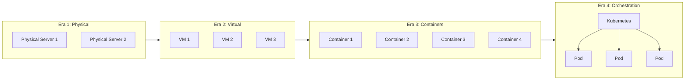
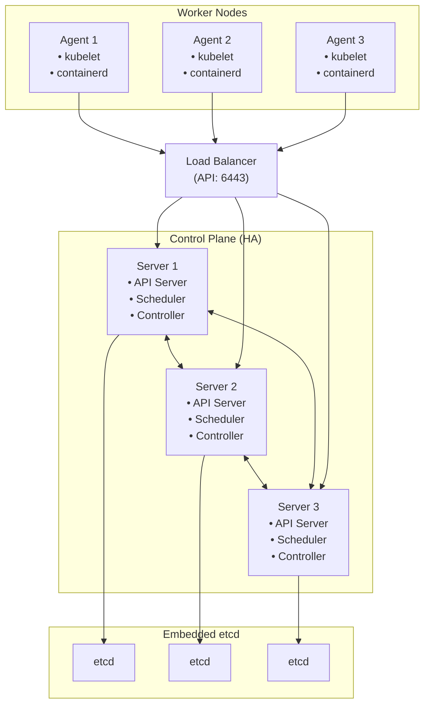
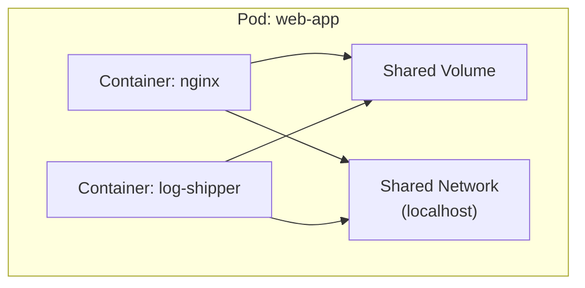
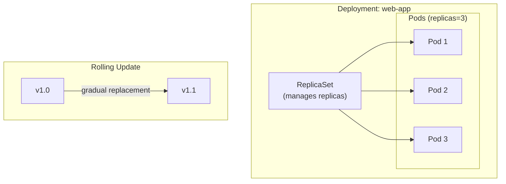
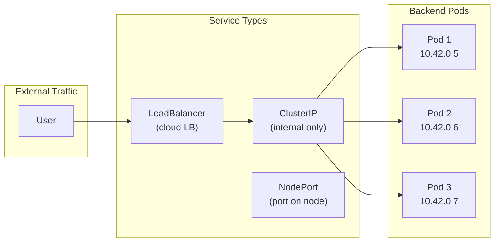
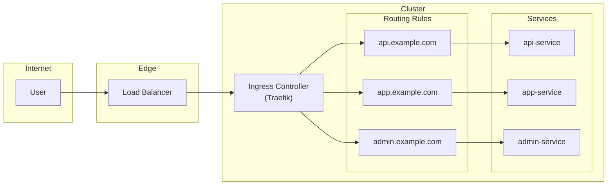
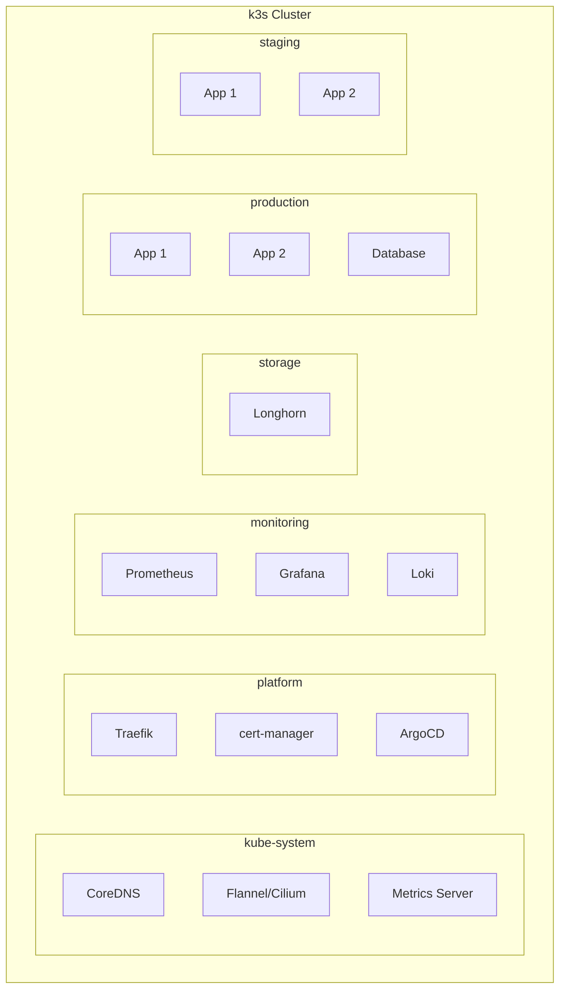
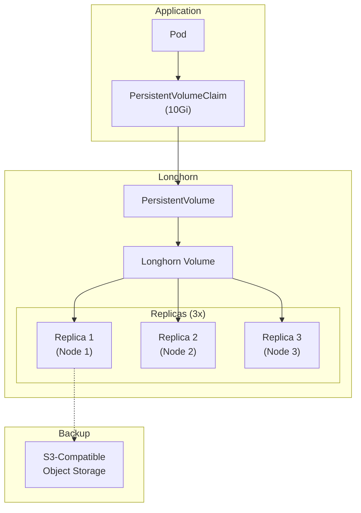
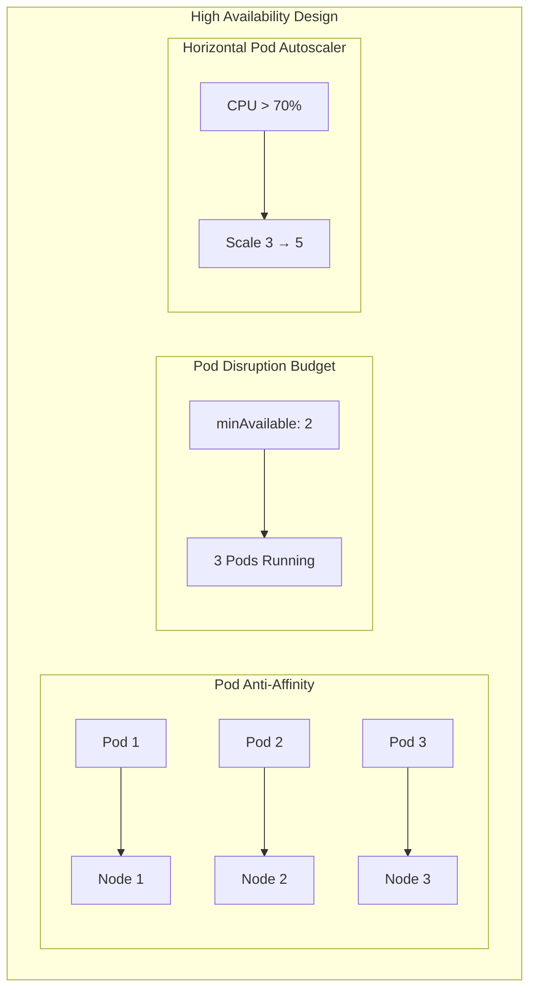
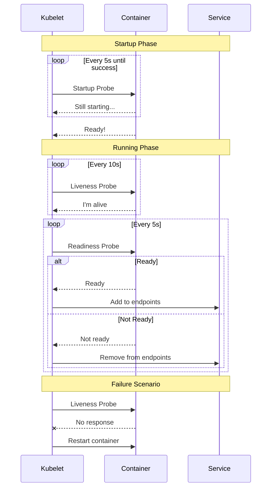

# Container Orchestration with k3s

## Why Kubernetes?

> *Containers are the unit of deployment. Kubernetes is the operating system for the cloud.*

---

## The Container Evolution



---

## Why k3s?

| Feature | k3s | Full Kubernetes |
|---------|-----|-----------------|
| **Binary size** | ~60MB | ~1GB+ |
| **Memory footprint** | ~512MB | ~2GB+ |
| **Install time** | 30 seconds | Hours |
| **Complexity** | Low | High |
| **Production ready** | Yes | Yes |
| **CNCF certified** | Yes | Yes |
| **Built-in components** | SQLite, Traefik, CoreDNS | External deps |

**For this project:** k3s provides full Kubernetes API compatibility with 90% less overhead—perfect for cost-optimized Hetzner infrastructure.

---

## k3s Architecture



---

## Core Concepts

### Pods



```yaml
# Pod definition
apiVersion: v1
kind: Pod
metadata:
  name: web-app
  labels:
    app: web
spec:
  containers:
    - name: nginx
      image: nginx:1.25
      ports:
        - containerPort: 80
      volumeMounts:
        - name: shared-logs
          mountPath: /var/log/nginx

    - name: log-shipper
      image: fluent/fluent-bit:2.1
      volumeMounts:
        - name: shared-logs
          mountPath: /logs
          readOnly: true

  volumes:
    - name: shared-logs
      emptyDir: {}
```

### Deployments



```yaml
# Deployment definition
apiVersion: apps/v1
kind: Deployment
metadata:
  name: web-app
  namespace: production
spec:
  replicas: 3
  selector:
    matchLabels:
      app: web
  strategy:
    type: RollingUpdate
    rollingUpdate:
      maxSurge: 1
      maxUnavailable: 0
  template:
    metadata:
      labels:
        app: web
        version: v1.0.0
    spec:
      containers:
        - name: web
          image: ghcr.io/company/web-app:v1.0.0
          ports:
            - containerPort: 8080
          resources:
            requests:
              cpu: 100m
              memory: 128Mi
            limits:
              cpu: 500m
              memory: 512Mi
          livenessProbe:
            httpGet:
              path: /health
              port: 8080
            initialDelaySeconds: 10
            periodSeconds: 5
          readinessProbe:
            httpGet:
              path: /ready
              port: 8080
            initialDelaySeconds: 5
            periodSeconds: 3
```

### Services



```yaml
# Service definition
apiVersion: v1
kind: Service
metadata:
  name: web-app
  namespace: production
spec:
  type: ClusterIP
  selector:
    app: web
  ports:
    - name: http
      port: 80
      targetPort: 8080
---
# Headless service for StatefulSets
apiVersion: v1
kind: Service
metadata:
  name: database
  namespace: production
spec:
  clusterIP: None
  selector:
    app: postgres
  ports:
    - port: 5432
```

### Ingress



```yaml
# Ingress definition
apiVersion: networking.k8s.io/v1
kind: Ingress
metadata:
  name: web-app
  namespace: production
  annotations:
    cert-manager.io/cluster-issuer: letsencrypt-prod
    traefik.ingress.kubernetes.io/router.middlewares: production-redirect-https@kubernetescrd
spec:
  ingressClassName: traefik
  tls:
    - hosts:
        - app.example.com
      secretName: app-tls
  rules:
    - host: app.example.com
      http:
        paths:
          - path: /
            pathType: Prefix
            backend:
              service:
                name: web-app
                port:
                  number: 80
```

---

## Namespace Organization



```yaml
# Namespace definitions
---
apiVersion: v1
kind: Namespace
metadata:
  name: production
  labels:
    environment: production
    istio-injection: enabled
---
apiVersion: v1
kind: Namespace
metadata:
  name: staging
  labels:
    environment: staging
---
apiVersion: v1
kind: Namespace
metadata:
  name: platform
  labels:
    purpose: platform-services
---
apiVersion: v1
kind: Namespace
metadata:
  name: monitoring
  labels:
    purpose: observability
```

---

## Storage with Longhorn



```yaml
# StorageClass
apiVersion: storage.k8s.io/v1
kind: StorageClass
metadata:
  name: longhorn
provisioner: driver.longhorn.io
allowVolumeExpansion: true
reclaimPolicy: Delete
volumeBindingMode: Immediate
parameters:
  numberOfReplicas: "3"
  staleReplicaTimeout: "2880"
  fromBackup: ""
  fsType: ext4
---
# PersistentVolumeClaim
apiVersion: v1
kind: PersistentVolumeClaim
metadata:
  name: postgres-data
  namespace: production
spec:
  accessModes:
    - ReadWriteOnce
  storageClassName: longhorn
  resources:
    requests:
      storage: 10Gi
```

---

## High Availability



```yaml
# Deployment with HA features
apiVersion: apps/v1
kind: Deployment
metadata:
  name: critical-app
spec:
  replicas: 3
  template:
    spec:
      affinity:
        podAntiAffinity:
          requiredDuringSchedulingIgnoredDuringExecution:
            - labelSelector:
                matchLabels:
                  app: critical-app
              topologyKey: kubernetes.io/hostname

      topologySpreadConstraints:
        - maxSkew: 1
          topologyKey: topology.kubernetes.io/zone
          whenUnsatisfiable: DoNotSchedule
          labelSelector:
            matchLabels:
              app: critical-app
---
# Pod Disruption Budget
apiVersion: policy/v1
kind: PodDisruptionBudget
metadata:
  name: critical-app-pdb
spec:
  minAvailable: 2
  selector:
    matchLabels:
      app: critical-app
---
# Horizontal Pod Autoscaler
apiVersion: autoscaling/v2
kind: HorizontalPodAutoscaler
metadata:
  name: critical-app-hpa
spec:
  scaleTargetRef:
    apiVersion: apps/v1
    kind: Deployment
    name: critical-app
  minReplicas: 3
  maxReplicas: 10
  metrics:
    - type: Resource
      resource:
        name: cpu
        target:
          type: Utilization
          averageUtilization: 70
    - type: Resource
      resource:
        name: memory
        target:
          type: Utilization
          averageUtilization: 80
```

---

## Health Checks



```yaml
# Probe configurations
spec:
  containers:
    - name: app
      # Startup probe: for slow-starting apps
      startupProbe:
        httpGet:
          path: /startup
          port: 8080
        failureThreshold: 30
        periodSeconds: 10

      # Liveness probe: is the app alive?
      livenessProbe:
        httpGet:
          path: /health
          port: 8080
        initialDelaySeconds: 10
        periodSeconds: 10
        timeoutSeconds: 5
        failureThreshold: 3

      # Readiness probe: can the app serve traffic?
      readinessProbe:
        httpGet:
          path: /ready
          port: 8080
        initialDelaySeconds: 5
        periodSeconds: 5
        timeoutSeconds: 3
        successThreshold: 1
        failureThreshold: 3
```

---

## kubectl Essentials

```bash
# Cluster info
kubectl cluster-info
kubectl get nodes -o wide
kubectl top nodes

# Namespaces
kubectl get namespaces
kubectl config set-context --current --namespace=production

# Pods
kubectl get pods -A                     # All namespaces
kubectl get pods -o wide                # With node info
kubectl describe pod <name>             # Detailed info
kubectl logs <pod> -f                   # Stream logs
kubectl logs <pod> -c <container>       # Specific container
kubectl exec -it <pod> -- /bin/sh       # Shell access

# Deployments
kubectl get deployments
kubectl rollout status deployment/<name>
kubectl rollout history deployment/<name>
kubectl rollout undo deployment/<name>
kubectl scale deployment/<name> --replicas=5

# Services & Ingress
kubectl get svc,ing
kubectl port-forward svc/<name> 8080:80

# Debug
kubectl get events --sort-by='.lastTimestamp'
kubectl describe node <name>
kubectl top pods --sort-by=memory
```

---

## k9s: Terminal UI

```
┌──────────────────────────────────────────────────────────────┐
│ k9s - Kubernetes CLI To Manage Your Clusters                 │
├──────────────────────────────────────────────────────────────┤
│                                                              │
│  Navigation:                                                 │
│  :pod      - View pods                                       │
│  :deploy   - View deployments                                │
│  :svc      - View services                                   │
│  :ns       - View namespaces                                 │
│  :node     - View nodes                                      │
│                                                              │
│  Actions:                                                    │
│  l         - View logs                                       │
│  s         - Shell into container                            │
│  d         - Describe resource                               │
│  y         - View YAML                                       │
│  ctrl-d    - Delete resource                                 │
│  /         - Filter resources                                │
│                                                              │
│  Install: brew install k9s                                   │
│                                                              │
└──────────────────────────────────────────────────────────────┘
```

---

## Related

- [Infrastructure-as-Code](./02-Infrastructure-as-Code.md)
- [Configuration Management](./03-Configuration-Management.md)
- [GitOps](./05-GitOps.md)

---

*Last Updated: 2026-02-02*
