# Container Orchestration: Where Autograph Lives

> *"The castle is built, the walls are strong. Now we need rooms, halls, and the magic that brings it all to life."*

## The Purpose: A Home for Autograph

**Why are we doing this?** To give Autograph a place to live and grow.

Ansible gave us a k3s cluster. Now we need to understand how Kubernetes organizes and runs Autograph—Strapi, AI services, databases, and everything that makes the magic happen.

```mermaid
flowchart TB
    subgraph Before["📦 RAW CLUSTER"]
        K1["k3s running"]
        K2["Empty namespaces"]
        K3["No workloads"]
    end

    subgraph After["🏰 CONTENTAI RUNNING"]
        S["Strapi CMS"]
        AI["AI Service"]
        PG["PostgreSQL"]
        R["Redis"]
        M["Meilisearch"]
    end

    subgraph Users["👥 CONTENT CREATORS"]
        U1["Writers"]
        U2["Marketers"]
    end

    Before --> After
    Users --> After

    style After fill:#4CAF50
```



---

## Why k3s for Autograph?

| Feature | k3s | Full Kubernetes |
|---------|-----|-----------------|
| **Binary size** | ~60MB | ~1GB+ |
| **Memory footprint** | ~512MB | ~2GB+ |
| **Install time** | 30 seconds | Hours |
| **Complexity** | Low | High |
| **Production ready** | Yes | Yes |
| **CNCF certified** | Yes | Yes |
| **Built-in components** | SQLite, Traefik, CoreDNS | External deps |

**For Autograph:** k3s provides full Kubernetes API compatibility with 90% less overhead—perfect for our cost-optimized Hetzner infrastructure. *The castle doesn't need a massive foundation when the walls are already strong.*

---

## Autograph Cluster Architecture

```mermaid
flowchart TB
    subgraph CP["Control Plane (HA)"]
        S1["contentai-server-1\n• API Server\n• Scheduler\n• Controller"]
        S2["contentai-server-2\n• API Server\n• Scheduler\n• Controller"]
        S3["contentai-server-3\n• API Server\n• Scheduler\n• Controller"]

        S1 <--> S2 <--> S3
        S1 <--> S3
    end

    subgraph Datastore["Embedded etcd"]
        E1["etcd"]
        E2["etcd"]
        E3["etcd"]
    end

    subgraph Workers["Worker Nodes (Autograph runs here)"]
        A1["contentai-agent-1\n• Strapi pods\n• AI service pods"]
        A2["contentai-agent-2\n• PostgreSQL\n• Redis"]
        A3["contentai-agent-3\n• Meilisearch\n• Overflow"]
    end

    LB["Load Balancer\n(API: 6443)"]

    LB --> S1
    LB --> S2
    LB --> S3

    S1 --> E1
    S2 --> E2
    S3 --> E3

    A1 --> LB
    A2 --> LB
    A3 --> LB

    style Workers fill:#4CAF50
```



---

## Core Concepts (Through Autograph's Eyes)

### Pods: The Smallest Unit

Every Autograph component runs in a pod—Strapi, AI service, databases. A pod is like a room in our castle.


```yaml
# Pod definition for Strapi
apiVersion: v1
kind: Pod
metadata:
  name: strapi-cms
  namespace: contentai
  labels:
    app: strapi
    product: contentai
spec:
  containers:
    - name: strapi
      image: ghcr.io/pearlthoughts/contentai-strapi:v1.0.0
      ports:
        - containerPort: 1337
      env:
        - name: DATABASE_HOST
          value: postgres-headless.contentai.svc.cluster.local
        - name: REDIS_HOST
          value: redis.contentai.svc.cluster.local
      volumeMounts:
        - name: uploads
          mountPath: /app/public/uploads

    - name: log-shipper
      image: fluent/fluent-bit:2.1
      volumeMounts:
        - name: logs
          mountPath: /logs
          readOnly: true

  volumes:
    - name: uploads
      persistentVolumeClaim:
        claimName: strapi-uploads
    - name: logs
      emptyDir: {}
```

### Deployments: Managing Autograph Replicas

Deployments manage multiple copies of our Autograph components, ensuring they stay running and update gracefully.


```yaml
# Strapi Deployment for Autograph
apiVersion: apps/v1
kind: Deployment
metadata:
  name: strapi
  namespace: contentai
spec:
  replicas: 3
  selector:
    matchLabels:
      app: strapi
      product: contentai
  strategy:
    type: RollingUpdate
    rollingUpdate:
      maxSurge: 1
      maxUnavailable: 0
  template:
    metadata:
      labels:
        app: strapi
        product: contentai
        version: v1.0.0
    spec:
      containers:
        - name: strapi
          image: ghcr.io/pearlthoughts/contentai-strapi:v1.0.0
          ports:
            - containerPort: 1337
          resources:
            requests:
              cpu: 200m
              memory: 512Mi
            limits:
              cpu: 1000m
              memory: 1Gi
          env:
            - name: DATABASE_HOST
              value: postgres-headless
            - name: REDIS_HOST
              value: redis
            - name: MEILISEARCH_HOST
              value: meilisearch
          livenessProbe:
            httpGet:
              path: /_health
              port: 1337
            initialDelaySeconds: 30
            periodSeconds: 10
          readinessProbe:
            httpGet:
              path: /_health
              port: 1337
            initialDelaySeconds: 10
            periodSeconds: 5
```

### Services: How Autograph Components Talk

Services provide stable network addresses. Strapi talks to PostgreSQL through a service, not a specific pod IP.


```yaml
# Strapi Service
apiVersion: v1
kind: Service
metadata:
  name: strapi
  namespace: contentai
spec:
  type: ClusterIP
  selector:
    app: strapi
    product: contentai
  ports:
    - name: http
      port: 1337
      targetPort: 1337
---
# PostgreSQL Headless Service (for StatefulSet)
apiVersion: v1
kind: Service
metadata:
  name: postgres-headless
  namespace: contentai
spec:
  clusterIP: None
  selector:
    app: postgres
    product: contentai
  ports:
    - port: 5432
---
# AI Service
apiVersion: v1
kind: Service
metadata:
  name: ai-service
  namespace: contentai
spec:
  type: ClusterIP
  selector:
    app: ai-service
    product: contentai
  ports:
    - name: http
      port: 3001
      targetPort: 3001
```

### Ingress: The Castle Gates

Ingress routes external traffic to Autograph. This is how users reach Strapi.


```yaml
# Autograph Ingress
apiVersion: networking.k8s.io/v1
kind: Ingress
metadata:
  name: contentai
  namespace: contentai
  annotations:
    cert-manager.io/cluster-issuer: letsencrypt-prod
    nginx.ingress.kubernetes.io/proxy-body-size: "50m"
spec:
  ingressClassName: nginx
  tls:
    - hosts:
        - cms.contentai.io
        - api.contentai.io
      secretName: contentai-tls
  rules:
    - host: cms.contentai.io
      http:
        paths:
          - path: /
            pathType: Prefix
            backend:
              service:
                name: strapi
                port:
                  number: 1337
    - host: api.contentai.io
      http:
        paths:
          - path: /ai
            pathType: Prefix
            backend:
              service:
                name: ai-service
                port:
                  number: 3001
```

---

## Autograph Namespace Organization


```yaml
# Autograph Namespace
apiVersion: v1
kind: Namespace
metadata:
  name: contentai
  labels:
    product: contentai
    environment: production
---
# Resource Quota for Autograph
apiVersion: v1
kind: ResourceQuota
metadata:
  name: contentai-quota
  namespace: contentai
spec:
  hard:
    requests.cpu: "8"
    requests.memory: 16Gi
    limits.cpu: "16"
    limits.memory: 32Gi
    persistentvolumeclaims: "10"
```

---

## StatefulSets: Autograph's Treasury

PostgreSQL needs stable identity and persistent storage—it's the treasury where all content lives.


```yaml
# PostgreSQL StatefulSet for Autograph
apiVersion: apps/v1
kind: StatefulSet
metadata:
  name: postgres
  namespace: contentai
spec:
  serviceName: postgres-headless
  replicas: 1
  selector:
    matchLabels:
      app: postgres
      product: contentai
  template:
    metadata:
      labels:
        app: postgres
        product: contentai
    spec:
      containers:
        - name: postgres
          image: postgres:16-alpine
          ports:
            - containerPort: 5432
          env:
            - name: POSTGRES_DB
              value: contentai
            - name: POSTGRES_USER
              valueFrom:
                secretKeyRef:
                  name: postgres-credentials
                  key: username
            - name: POSTGRES_PASSWORD
              valueFrom:
                secretKeyRef:
                  name: postgres-credentials
                  key: password
          volumeMounts:
            - name: data
              mountPath: /var/lib/postgresql/data
          resources:
            requests:
              cpu: 500m
              memory: 1Gi
            limits:
              cpu: 2000m
              memory: 4Gi
  volumeClaimTemplates:
    - metadata:
        name: data
      spec:
        accessModes: ["ReadWriteOnce"]
        storageClassName: longhorn
        resources:
          requests:
            storage: 10Gi
```

---

## Storage with Longhorn

Longhorn replicates Autograph's data across nodes—so even if a server fails, no content is lost.


```yaml
# StorageClass for Autograph
apiVersion: storage.k8s.io/v1
kind: StorageClass
metadata:
  name: longhorn
provisioner: driver.longhorn.io
allowVolumeExpansion: true
reclaimPolicy: Delete
parameters:
  numberOfReplicas: "3"
  staleReplicaTimeout: "2880"
  fsType: ext4
---
# Strapi Uploads PVC
apiVersion: v1
kind: PersistentVolumeClaim
metadata:
  name: strapi-uploads
  namespace: contentai
spec:
  accessModes:
    - ReadWriteOnce
  storageClassName: longhorn
  resources:
    requests:
      storage: 5Gi
```

---

## High Availability for Autograph

Autograph pods spread across nodes—if one server fails, the platform keeps running.

```mermaid
flowchart TB
    subgraph HA["High Availability Design"]
        subgraph AntiAffinity["Pod Anti-Affinity"]
            N1["contentai-agent-1"]
            N2["contentai-agent-2"]
            N3["contentai-agent-3"]

            SP1["Strapi 1"] --> N1
            SP2["Strapi 2"] --> N2
            SP3["Strapi 3"] --> N3
        end

        subgraph PDB["Pod Disruption Budget"]
            MIN["minAvailable: 2"]
            PODS["3 Strapi Pods"]
        end

        subgraph HPA["Auto-Scaling"]
            METRIC["CPU > 70%"]
            SCALE["Scale 3 → 5"]
        end
    end

    style AntiAffinity fill:#4CAF50
```



```yaml
# Strapi Deployment with HA features
apiVersion: apps/v1
kind: Deployment
metadata:
  name: strapi
  namespace: contentai
spec:
  replicas: 3
  template:
    spec:
      affinity:
        podAntiAffinity:
          requiredDuringSchedulingIgnoredDuringExecution:
            - labelSelector:
                matchLabels:
                  app: strapi
                  product: contentai
              topologyKey: kubernetes.io/hostname
---
# Pod Disruption Budget
apiVersion: policy/v1
kind: PodDisruptionBudget
metadata:
  name: strapi-pdb
  namespace: contentai
spec:
  minAvailable: 2
  selector:
    matchLabels:
      app: strapi
      product: contentai
---
# Horizontal Pod Autoscaler
apiVersion: autoscaling/v2
kind: HorizontalPodAutoscaler
metadata:
  name: strapi-hpa
  namespace: contentai
spec:
  scaleTargetRef:
    apiVersion: apps/v1
    kind: Deployment
    name: strapi
  minReplicas: 3
  maxReplicas: 10
  metrics:
    - type: Resource
      resource:
        name: cpu
        target:
          type: Utilization
          averageUtilization: 70
```

---

## Health Checks: Is Autograph Alive?


```yaml
# Autograph Health Probes
spec:
  containers:
    - name: strapi
      # Startup: for slow-starting Strapi
      startupProbe:
        httpGet:
          path: /_health
          port: 1337
        failureThreshold: 30
        periodSeconds: 10

      # Liveness: is Strapi process alive?
      livenessProbe:
        httpGet:
          path: /_health
          port: 1337
        initialDelaySeconds: 30
        periodSeconds: 10
        timeoutSeconds: 5
        failureThreshold: 3

      # Readiness: can Strapi serve content?
      readinessProbe:
        httpGet:
          path: /_health
          port: 1337
        initialDelaySeconds: 10
        periodSeconds: 5
        timeoutSeconds: 3
        failureThreshold: 3
```

---

## kubectl Essentials for Autograph

```bash
# Check Autograph cluster status
kubectl cluster-info
kubectl get nodes -o wide
kubectl top nodes

# Autograph namespace operations
kubectl config set-context --current --namespace=contentai
kubectl get pods
kubectl get pods -o wide  # See which node each pod runs on

# Check Strapi
kubectl get pods -l app=strapi
kubectl logs -l app=strapi -f
kubectl describe pod -l app=strapi

# Check databases
kubectl get pods -l app=postgres
kubectl get pvc  # Persistent volumes

# Debug Autograph issues
kubectl get events --sort-by='.lastTimestamp'
kubectl top pods --sort-by=memory

# Shell into Strapi for debugging
kubectl exec -it deployment/strapi -- /bin/sh

# Port-forward to access locally
kubectl port-forward svc/strapi 1337:1337
kubectl port-forward svc/ai-service 3001:3001
```

---

## k9s: Your Autograph Dashboard

```
┌──────────────────────────────────────────────────────────────┐
│ k9s - Kubernetes CLI To Manage Autograph                     │
├──────────────────────────────────────────────────────────────┤
│                                                              │
│  Quick Access:                                               │
│  :pod      - View Autograph pods                             │
│  :deploy   - View Strapi, AI service deployments             │
│  :svc      - View services                                   │
│  :pvc      - View storage claims (PostgreSQL, uploads)       │
│  :ing      - View ingress (contentai.io routes)              │
│                                                              │
│  Actions:                                                    │
│  l         - View Strapi logs                                │
│  s         - Shell into container                            │
│  d         - Describe resource                               │
│  y         - View YAML                                       │
│  /         - Filter (try: /strapi, /postgres)                │
│                                                              │
│  Namespaces:                                                 │
│  0         - All namespaces                                  │
│  1-9       - Quick switch (contentai = 1)                    │
│                                                              │
│  Install: brew install k9s                                   │
│                                                              │
└──────────────────────────────────────────────────────────────┘
```

---

## What's Next

Once you understand how Autograph runs in Kubernetes:

1. **Deploy Autograph** — [Exercise 10: Strapi Deployment](../04-Internship/Exercises/10-Autograph-Strapi-Deployment.md)
2. **GitOps** — [05-GitOps.md](./05-GitOps.md) for automated deployments
3. **Observability** — [Observability Stack](../03-Platform/02-Observability.md) to watch Autograph

---

## Related

- [Infrastructure-as-Code](./02-Infrastructure-as-Code.md) — Create the VMs
- [Configuration Management](./03-Configuration-Management.md) — Install k3s
- [GitOps](./05-GitOps.md) — Automated Autograph deployments

---

*Last Updated: 2026-02-02*
