# GitOps with ArgoCD

## What is GitOps?

> *Git as the single source of truth for declarative infrastructure and applications.*

---

## GitOps Principles


---

## Traditional vs GitOps


**Key difference:** GitOps uses a **pull model** (cluster pulls from Git) instead of a **push model** (CI pushes to cluster).

---

## Why ArgoCD?

| Feature | ArgoCD | Flux |
|---------|--------|------|
| **UI** | Rich web interface | CLI only |
| **Multi-cluster** | Native support | Requires setup |
| **App of Apps** | Built-in pattern | Manual |
| **RBAC** | Fine-grained | Basic |
| **Rollback** | One-click | Manual |
| **Health checks** | Extensive | Basic |
| **Community** | Largest | Growing |

---

## ArgoCD Architecture


---

## Application Definition

```yaml
# ArgoCD Application CRD
apiVersion: argoproj.io/v1alpha1
kind: Application
metadata:
  name: web-app
  namespace: argocd
  finalizers:
    - resources-finalizer.argocd.argoproj.io
spec:
  project: default

  source:
    repoURL: https://github.com/company/infra.git
    targetRevision: main
    path: k8s/apps/web-app

  destination:
    server: https://kubernetes.default.svc
    namespace: production

  syncPolicy:
    automated:
      prune: true           # Delete resources not in Git
      selfHeal: true        # Fix manual changes
      allowEmpty: false     # Don't sync empty manifests
    syncOptions:
      - CreateNamespace=true
      - PruneLast=true
    retry:
      limit: 5
      backoff:
        duration: 5s
        factor: 2
        maxDuration: 3m
```

---

## Sync Flow


---

## App of Apps Pattern


### Root Application

```yaml
# argocd/app-of-apps.yaml
apiVersion: argoproj.io/v1alpha1
kind: Application
metadata:
  name: app-of-apps
  namespace: argocd
spec:
  project: default
  source:
    repoURL: https://github.com/company/infra.git
    targetRevision: main
    path: argocd/applications
  destination:
    server: https://kubernetes.default.svc
    namespace: argocd
  syncPolicy:
    automated:
      selfHeal: true
      prune: true
```

### Child Applications

```yaml
# argocd/applications/cert-manager.yaml
apiVersion: argoproj.io/v1alpha1
kind: Application
metadata:
  name: cert-manager
  namespace: argocd
spec:
  project: platform
  source:
    repoURL: https://charts.jetstack.io
    chart: cert-manager
    targetRevision: v1.13.0
    helm:
      values: |
        installCRDs: true
        prometheus:
          enabled: true
  destination:
    server: https://kubernetes.default.svc
    namespace: cert-manager
  syncPolicy:
    automated:
      selfHeal: true
    syncOptions:
      - CreateNamespace=true
```

```yaml
# argocd/applications/monitoring.yaml
apiVersion: argoproj.io/v1alpha1
kind: Application
metadata:
  name: monitoring
  namespace: argocd
spec:
  project: platform
  source:
    repoURL: https://prometheus-community.github.io/helm-charts
    chart: kube-prometheus-stack
    targetRevision: 55.0.0
    helm:
      valueFiles:
        - values/monitoring-values.yaml
  destination:
    server: https://kubernetes.default.svc
    namespace: monitoring
  syncPolicy:
    automated:
      selfHeal: true
    syncOptions:
      - CreateNamespace=true
      - ServerSideApply=true
```

---

## Repository Structure

```
infra/
├── argocd/
│   ├── app-of-apps.yaml        # Bootstrap application
│   ├── applications/           # Application definitions
│   │   ├── cert-manager.yaml
│   │   ├── traefik.yaml
│   │   ├── monitoring.yaml
│   │   ├── longhorn.yaml
│   │   └── web-app.yaml
│   └── projects/               # ArgoCD projects
│       ├── platform.yaml
│       └── applications.yaml
│
├── k8s/
│   ├── base/                   # Base manifests
│   │   ├── namespaces/
│   │   └── rbac/
│   │
│   └── apps/                   # Application manifests
│       ├── web-app/
│       │   ├── deployment.yaml
│       │   ├── service.yaml
│       │   ├── ingress.yaml
│       │   └── kustomization.yaml
│       │
│       └── api-service/
│           ├── deployment.yaml
│           ├── service.yaml
│           └── kustomization.yaml
│
└── helm/
    └── values/                 # Helm value files
        ├── monitoring-values.yaml
        └── traefik-values.yaml
```

---

## Projects and RBAC

```yaml
# ArgoCD Project for platform services
apiVersion: argoproj.io/v1alpha1
kind: AppProject
metadata:
  name: platform
  namespace: argocd
spec:
  description: Platform infrastructure services

  sourceRepos:
    - https://github.com/company/infra.git
    - https://charts.jetstack.io
    - https://prometheus-community.github.io/helm-charts
    - https://traefik.github.io/charts

  destinations:
    - namespace: cert-manager
      server: https://kubernetes.default.svc
    - namespace: monitoring
      server: https://kubernetes.default.svc
    - namespace: traefik-system
      server: https://kubernetes.default.svc
    - namespace: longhorn-system
      server: https://kubernetes.default.svc

  clusterResourceWhitelist:
    - group: ""
      kind: Namespace
    - group: apiextensions.k8s.io
      kind: CustomResourceDefinition
    - group: rbac.authorization.k8s.io
      kind: ClusterRole
    - group: rbac.authorization.k8s.io
      kind: ClusterRoleBinding

  namespaceResourceWhitelist:
    - group: "*"
      kind: "*"

  roles:
    - name: platform-admin
      description: Full access to platform project
      policies:
        - p, proj:platform:platform-admin, applications, *, platform/*, allow
      groups:
        - platform-team
```

---

## Sync Waves and Hooks


```yaml
# Sync waves ensure proper ordering
apiVersion: v1
kind: Namespace
metadata:
  name: production
  annotations:
    argocd.argoproj.io/sync-wave: "-1"
---
apiVersion: v1
kind: Secret
metadata:
  name: database-credentials
  annotations:
    argocd.argoproj.io/sync-wave: "0"
---
apiVersion: apps/v1
kind: Deployment
metadata:
  name: postgres
  annotations:
    argocd.argoproj.io/sync-wave: "1"
---
apiVersion: apps/v1
kind: Deployment
metadata:
  name: web-app
  annotations:
    argocd.argoproj.io/sync-wave: "2"
```

### Sync Hooks

```yaml
# Pre-sync hook: Database migration
apiVersion: batch/v1
kind: Job
metadata:
  name: db-migrate
  annotations:
    argocd.argoproj.io/hook: PreSync
    argocd.argoproj.io/hook-delete-policy: HookSucceeded
spec:
  template:
    spec:
      containers:
        - name: migrate
          image: company/web-app:v1.0.0
          command: ["./migrate.sh"]
      restartPolicy: Never
---
# Post-sync hook: Notify Slack
apiVersion: batch/v1
kind: Job
metadata:
  name: notify-deployment
  annotations:
    argocd.argoproj.io/hook: PostSync
    argocd.argoproj.io/hook-delete-policy: HookSucceeded
spec:
  template:
    spec:
      containers:
        - name: notify
          image: curlimages/curl
          command:
            - /bin/sh
            - -c
            - |
              curl -X POST $SLACK_WEBHOOK \
                -d '{"text": "Deployment complete!"}'
      restartPolicy: Never
```

---

## Health Checks

```mermaid
flowchart TB
    subgraph HealthStatus["Health Status"]
        Healthy["✅ Healthy\nAll resources operational"]
        Progressing["🔄 Progressing\nResources updating"]
        Degraded["⚠️ Degraded\nSome issues detected"]
        Suspended["⏸️ Suspended\nManually paused"]
        Missing["❌ Missing\nResources not found"]
    end

    subgraph Checks["Built-in Checks"]
        Deploy["Deployment\n(Replicas ready?)"]
        STS["StatefulSet\n(Pods ready?)"]
        Ing["Ingress\n(Address assigned?)"]
        PVC["PVC\n(Bound?)"]
        Job["Job\n(Succeeded?)"]
    end

    Checks --> HealthStatus
```



### Custom Health Check

```yaml
# ConfigMap for custom health check
apiVersion: v1
kind: ConfigMap
metadata:
  name: argocd-cm
  namespace: argocd
data:
  resource.customizations.health.argoproj.io_Application: |
    hs = {}
    hs.status = "Progressing"
    hs.message = ""
    if obj.status ~= nil then
      if obj.status.health ~= nil then
        hs.status = obj.status.health.status
        if obj.status.health.message ~= nil then
          hs.message = obj.status.health.message
        end
      end
    end
    return hs
```

---

## Multi-Cluster Management


```bash
# Add cluster to ArgoCD
argocd cluster add staging-cluster --name staging

# List clusters
argocd cluster list
```

```yaml
# Application targeting specific cluster
apiVersion: argoproj.io/v1alpha1
kind: Application
metadata:
  name: web-app-staging
spec:
  destination:
    server: https://staging-cluster.example.com
    namespace: production
```

---

## Rollback


```bash
# CLI rollback
argocd app rollback web-app

# To specific revision
argocd app rollback web-app --revision 42
```

---

## Notifications

```yaml
# ArgoCD Notifications ConfigMap
apiVersion: v1
kind: ConfigMap
metadata:
  name: argocd-notifications-cm
  namespace: argocd
data:
  service.slack: |
    token: $slack-token

  template.app-deployed: |
    message: |
      {{if eq .serviceType "slack"}}:white_check_mark:{{end}} Application {{.app.metadata.name}} is now {{.app.status.sync.status}}.

  trigger.on-deployed: |
    - when: app.status.operationState.phase in ['Succeeded'] and app.status.health.status == 'Healthy'
      send: [app-deployed]

  subscriptions: |
    - recipients:
        - slack:deployments
      triggers:
        - on-deployed
        - on-health-degraded
```

---

## ArgoCD CLI Essentials

```bash
# Login
argocd login argocd.example.com

# List applications
argocd app list

# Get application details
argocd app get web-app

# Sync application
argocd app sync web-app

# Sync with prune
argocd app sync web-app --prune

# Force sync (ignore hooks)
argocd app sync web-app --force

# Diff (what would change)
argocd app diff web-app

# History
argocd app history web-app

# Delete application
argocd app delete web-app

# Refresh (check Git for changes)
argocd app refresh web-app

# Set parameters
argocd app set web-app --parameter image.tag=v2.0.0
```

---

## Related

- [Infrastructure-as-Code](./02-Infrastructure-as-Code.md)
- [Configuration Management](./03-Configuration-Management.md)
- [Container Orchestration](./04-Container-Orchestration.md)

---

*Last Updated: 2026-02-02*
