# GitOps: The Castle Builds Itself

> *"Write the blueprint once, and the castle rebuilds itself every time you change the plans."*

## The Purpose: ContentAI Deploys Automatically

**Why are we doing this?** So ContentAI deploys itself whenever we push code.

No more `kubectl apply` commands. No more "it works on my machine." Push to Git, and ArgoCD makes the cluster match your intent. *The castle watches its blueprints and rebuilds any room that changes.*


---

## GitOps Principles (For ContentAI)


---

## Traditional vs GitOps (ContentAI Flow)


**Key difference:** ArgoCD **pulls** from Git (secure) instead of CI **pushing** to cluster (risky).

---

## Why ArgoCD for ContentAI?

| Feature | ArgoCD | Flux |
|---------|--------|------|
| **UI** | Rich web dashboard | CLI only |
| **Multi-cluster** | Native support | Requires setup |
| **App of Apps** | Built-in pattern | Manual |
| **Rollback** | One-click | Manual |
| **Health checks** | Extensive (perfect for Strapi) | Basic |
| **RBAC** | Fine-grained | Basic |

**For ContentAI:** ArgoCD's UI lets you see Strapi deployment status at a glance. One click to rollback if an AI service update fails.

---

## ArgoCD Architecture


---

## ContentAI Application Definition

```yaml
# argocd/applications/strapi.yaml
apiVersion: argoproj.io/v1alpha1
kind: Application
metadata:
  name: contentai-strapi
  namespace: argocd
  finalizers:
    - resources-finalizer.argocd.argoproj.io
spec:
  project: contentai

  source:
    repoURL: https://github.com/pearlthoughts/contentai-infra.git
    targetRevision: main
    path: k8s/apps/strapi

  destination:
    server: https://kubernetes.default.svc
    namespace: contentai

  syncPolicy:
    automated:
      prune: true           # Delete resources not in Git
      selfHeal: true        # Fix manual kubectl changes
      allowEmpty: false
    syncOptions:
      - CreateNamespace=true
      - PruneLast=true
    retry:
      limit: 5
      backoff:
        duration: 5s
        factor: 2
        maxDuration: 3m
```

---

## ContentAI Sync Flow


---

## App of Apps: ContentAI's Magic Trick

One root application deploys ALL of ContentAI. *One ring to rule them all.*


### Root Application

```yaml
# argocd/app-of-apps.yaml
apiVersion: argoproj.io/v1alpha1
kind: Application
metadata:
  name: contentai-app-of-apps
  namespace: argocd
spec:
  project: default
  source:
    repoURL: https://github.com/pearlthoughts/contentai-infra.git
    targetRevision: main
    path: argocd/applications
  destination:
    server: https://kubernetes.default.svc
    namespace: argocd
  syncPolicy:
    automated:
      selfHeal: true
      prune: true
```

### Child Applications

```yaml
# argocd/applications/strapi.yaml
apiVersion: argoproj.io/v1alpha1
kind: Application
metadata:
  name: strapi
  namespace: argocd
spec:
  project: contentai
  source:
    repoURL: https://github.com/pearlthoughts/contentai-infra.git
    targetRevision: main
    path: k8s/apps/strapi
  destination:
    server: https://kubernetes.default.svc
    namespace: contentai
  syncPolicy:
    automated:
      selfHeal: true
    syncOptions:
      - CreateNamespace=true
---
# argocd/applications/ai-service.yaml
apiVersion: argoproj.io/v1alpha1
kind: Application
metadata:
  name: ai-service
  namespace: argocd
spec:
  project: contentai
  source:
    repoURL: https://github.com/pearlthoughts/contentai-infra.git
    targetRevision: main
    path: k8s/apps/ai-service
  destination:
    server: https://kubernetes.default.svc
    namespace: contentai
  syncPolicy:
    automated:
      selfHeal: true
---
# argocd/applications/postgres.yaml
apiVersion: argoproj.io/v1alpha1
kind: Application
metadata:
  name: postgres
  namespace: argocd
spec:
  project: contentai
  source:
    repoURL: https://github.com/pearlthoughts/contentai-infra.git
    targetRevision: main
    path: k8s/apps/postgres
  destination:
    server: https://kubernetes.default.svc
    namespace: contentai
  syncPolicy:
    automated:
      selfHeal: true
      prune: false  # Never auto-delete database!
```

---

## ContentAI Repository Structure

```
contentai-infra/
├── argocd/
│   ├── app-of-apps.yaml         # Bootstrap (deploy this first)
│   ├── applications/            # One file per app
│   │   ├── strapi.yaml
│   │   ├── ai-service.yaml
│   │   ├── postgres.yaml
│   │   ├── redis.yaml
│   │   ├── meilisearch.yaml
│   │   ├── cert-manager.yaml
│   │   ├── nginx-ingress.yaml
│   │   └── monitoring.yaml
│   └── projects/
│       ├── contentai.yaml       # ContentAI project RBAC
│       └── platform.yaml        # Platform project RBAC
│
├── k8s/
│   ├── base/
│   │   ├── namespaces/
│   │   │   └── contentai.yaml
│   │   └── rbac/
│   │       └── contentai-sa.yaml
│   │
│   └── apps/
│       ├── strapi/
│       │   ├── deployment.yaml
│       │   ├── service.yaml
│       │   ├── ingress.yaml
│       │   ├── configmap.yaml
│       │   ├── sealed-secret.yaml
│       │   └── kustomization.yaml
│       │
│       ├── ai-service/
│       │   ├── deployment.yaml
│       │   ├── service.yaml
│       │   └── sealed-secret.yaml  # API keys
│       │
│       ├── postgres/
│       │   ├── statefulset.yaml
│       │   ├── service.yaml
│       │   ├── pvc.yaml
│       │   └── sealed-secret.yaml
│       │
│       ├── redis/
│       │   ├── deployment.yaml
│       │   └── service.yaml
│       │
│       └── meilisearch/
│           ├── statefulset.yaml
│           ├── service.yaml
│           └── pvc.yaml
│
└── helm/
    └── values/
        ├── monitoring-values.yaml
        └── nginx-ingress-values.yaml
```

---

## Sync Waves: Deploy in Order

ContentAI components must deploy in order: namespace → secrets → database → app.


```yaml
# Namespace first (wave -1)
apiVersion: v1
kind: Namespace
metadata:
  name: contentai
  annotations:
    argocd.argoproj.io/sync-wave: "-1"
---
# Secrets next (wave 0)
apiVersion: bitnami.com/v1alpha1
kind: SealedSecret
metadata:
  name: postgres-credentials
  namespace: contentai
  annotations:
    argocd.argoproj.io/sync-wave: "0"
---
# Database before app (wave 1)
apiVersion: apps/v1
kind: StatefulSet
metadata:
  name: postgres
  namespace: contentai
  annotations:
    argocd.argoproj.io/sync-wave: "1"
---
# Strapi after database (wave 2)
apiVersion: apps/v1
kind: Deployment
metadata:
  name: strapi
  namespace: contentai
  annotations:
    argocd.argoproj.io/sync-wave: "2"
```

---

## Sync Hooks: Database Migrations

Run Strapi migrations before deploying new version:

```yaml
# Pre-sync hook: Run database migrations
apiVersion: batch/v1
kind: Job
metadata:
  name: strapi-migrate
  namespace: contentai
  annotations:
    argocd.argoproj.io/hook: PreSync
    argocd.argoproj.io/hook-delete-policy: HookSucceeded
spec:
  template:
    spec:
      containers:
        - name: migrate
          image: ghcr.io/pearlthoughts/contentai-strapi:v1.2.3
          command: ["npm", "run", "strapi", "migrate"]
          env:
            - name: DATABASE_HOST
              value: postgres-headless
            - name: DATABASE_PASSWORD
              valueFrom:
                secretKeyRef:
                  name: postgres-credentials
                  key: password
      restartPolicy: Never
---
# Post-sync hook: Notify team
apiVersion: batch/v1
kind: Job
metadata:
  name: notify-deployment
  annotations:
    argocd.argoproj.io/hook: PostSync
    argocd.argoproj.io/hook-delete-policy: HookSucceeded
spec:
  template:
    spec:
      containers:
        - name: notify
          image: curlimages/curl
          command:
            - /bin/sh
            - -c
            - |
              curl -X POST $SLACK_WEBHOOK \
                -d '{"text": "🚀 ContentAI Strapi deployed!"}'
      restartPolicy: Never
```

---

## ContentAI Health Checks

ArgoCD monitors ContentAI health—green means users can create content.

```mermaid
flowchart TB
    subgraph HealthStatus["ContentAI Health Status"]
        Healthy["✅ Healthy\nStrapi serving, DB connected"]
        Progressing["🔄 Progressing\nRolling update in progress"]
        Degraded["⚠️ Degraded\nStrapi crashlooping"]
        Missing["❌ Missing\nPods not scheduled"]
    end

    subgraph Components["What ArgoCD Checks"]
        Strapi["Strapi Deployment\n(3/3 replicas ready?)"]
        PG["PostgreSQL StatefulSet\n(Pod running?)"]
        ING["Ingress\n(Address assigned?)"]
        PVC["PVC\n(Storage bound?)"]
    end

    Components --> HealthStatus

    style Healthy fill:#4CAF50
```



---

## ContentAI Projects and RBAC

Separate permissions for platform team vs. interns:

```yaml
# ArgoCD Project for ContentAI
apiVersion: argoproj.io/v1alpha1
kind: AppProject
metadata:
  name: contentai
  namespace: argocd
spec:
  description: ContentAI product applications

  sourceRepos:
    - https://github.com/pearlthoughts/contentai-infra.git
    - https://github.com/pearlthoughts/contentai-strapi.git

  destinations:
    - namespace: contentai
      server: https://kubernetes.default.svc

  # What resources ContentAI apps can create
  namespaceResourceWhitelist:
    - group: ""
      kind: ConfigMap
    - group: ""
      kind: Secret
    - group: ""
      kind: Service
    - group: ""
      kind: PersistentVolumeClaim
    - group: apps
      kind: Deployment
    - group: apps
      kind: StatefulSet
    - group: networking.k8s.io
      kind: Ingress

  # No cluster-wide resources (interns can't break the cluster)
  clusterResourceWhitelist: []

  roles:
    - name: intern
      description: Intern access - can sync and view
      policies:
        - p, proj:contentai:intern, applications, get, contentai/*, allow
        - p, proj:contentai:intern, applications, sync, contentai/*, allow
      groups:
        - interns

    - name: admin
      description: Full access to ContentAI
      policies:
        - p, proj:contentai:admin, applications, *, contentai/*, allow
      groups:
        - platform-team
```

---

## Rollback: One Click to Safety

Something broke? ArgoCD makes rollback instant.


```bash
# CLI rollback
argocd app rollback contentai-strapi

# To specific revision
argocd app rollback contentai-strapi --revision 42

# History shows all deployments
argocd app history contentai-strapi
```

---

## Notifications: Know When ContentAI Deploys

```yaml
# ArgoCD Notifications ConfigMap
apiVersion: v1
kind: ConfigMap
metadata:
  name: argocd-notifications-cm
  namespace: argocd
data:
  service.slack: |
    token: $slack-token

  template.contentai-deployed: |
    message: |
      {{if eq .serviceType "slack"}}:rocket:{{end}} ContentAI {{.app.metadata.name}} deployed!
      Version: {{.app.status.sync.revision | substr 0 7}}
      Status: {{.app.status.health.status}}

  template.contentai-degraded: |
    message: |
      {{if eq .serviceType "slack"}}:warning:{{end}} ContentAI {{.app.metadata.name}} is DEGRADED!
      Check ArgoCD: https://argocd.contentai.io/applications/{{.app.metadata.name}}

  trigger.on-deployed: |
    - when: app.status.operationState.phase in ['Succeeded'] and app.status.health.status == 'Healthy'
      send: [contentai-deployed]

  trigger.on-health-degraded: |
    - when: app.status.health.status == 'Degraded'
      send: [contentai-degraded]

  subscriptions: |
    - recipients:
        - slack:contentai-deploys
      triggers:
        - on-deployed
        - on-health-degraded
```

---

## ArgoCD CLI Essentials for ContentAI

```bash
# Login to ArgoCD
argocd login argocd.contentai.io

# List all ContentAI applications
argocd app list

# Check Strapi status
argocd app get contentai-strapi

# Sync Strapi (if auto-sync disabled)
argocd app sync contentai-strapi

# Force sync (recreate resources)
argocd app sync contentai-strapi --force

# See what would change
argocd app diff contentai-strapi

# View deployment history
argocd app history contentai-strapi

# Rollback to previous version
argocd app rollback contentai-strapi

# Refresh (check Git for new commits)
argocd app refresh contentai-strapi
```

---

## CI/CD Integration: Full ContentAI Pipeline


---

## What's Next

Once ArgoCD is deploying ContentAI:

1. **Deploy ContentAI** — [Exercise 10: Strapi Deployment](../04-Internship/Exercises/10-ContentAI-Strapi-Deployment.md)
2. **Observability** — [Observability Stack](../03-Platform/02-Observability.md) to watch ContentAI
3. **Security** — [Security](../03-Platform/03-Security.md) to protect ContentAI

---

## Related

- [Infrastructure-as-Code](./02-Infrastructure-as-Code.md) — Create the VMs
- [Configuration Management](./03-Configuration-Management.md) — Install k3s
- [Container Orchestration](./04-Container-Orchestration.md) — Understand k3s concepts

---

*Last Updated: 2026-02-02*
