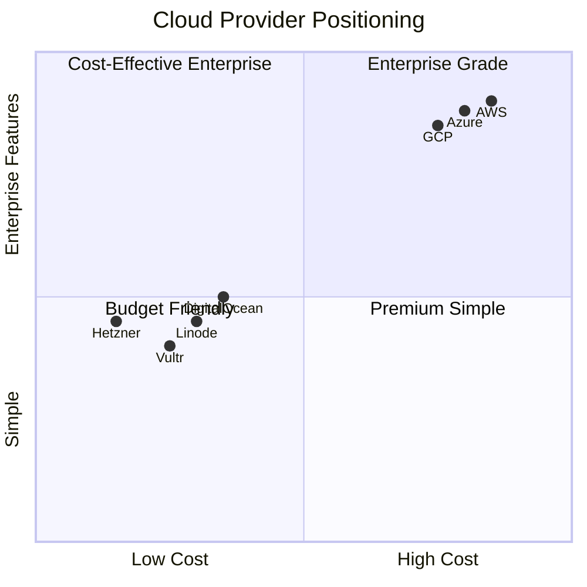
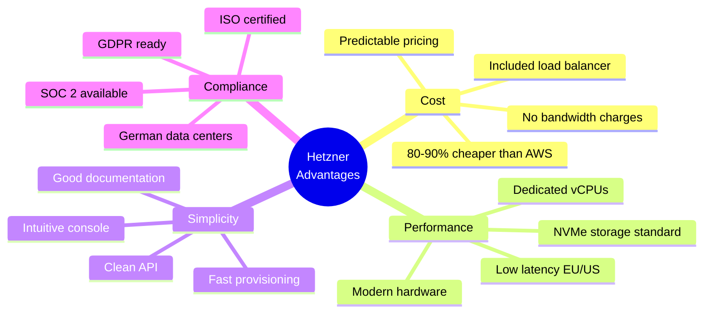
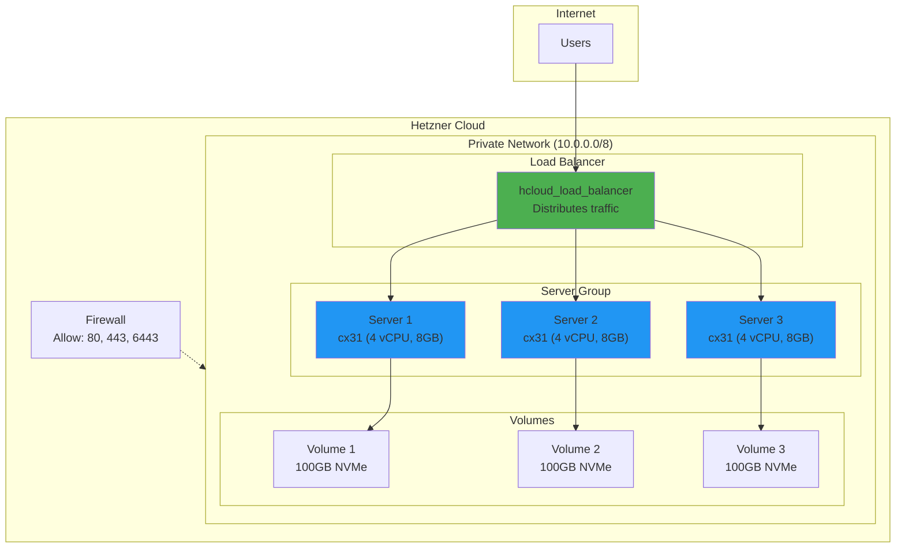
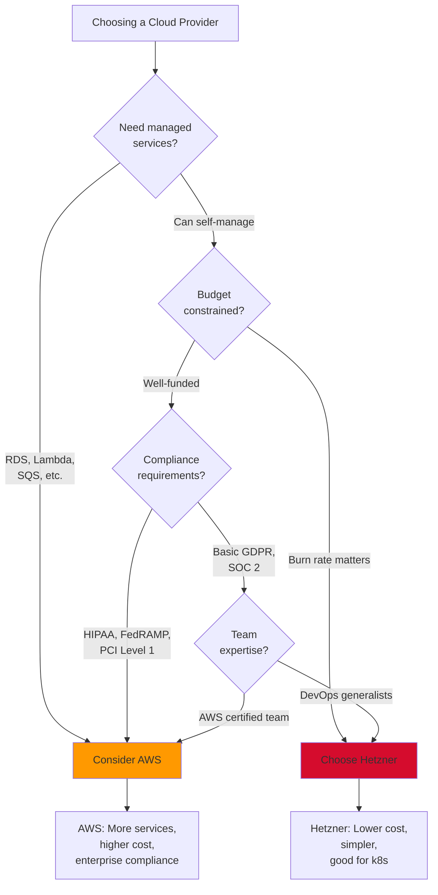
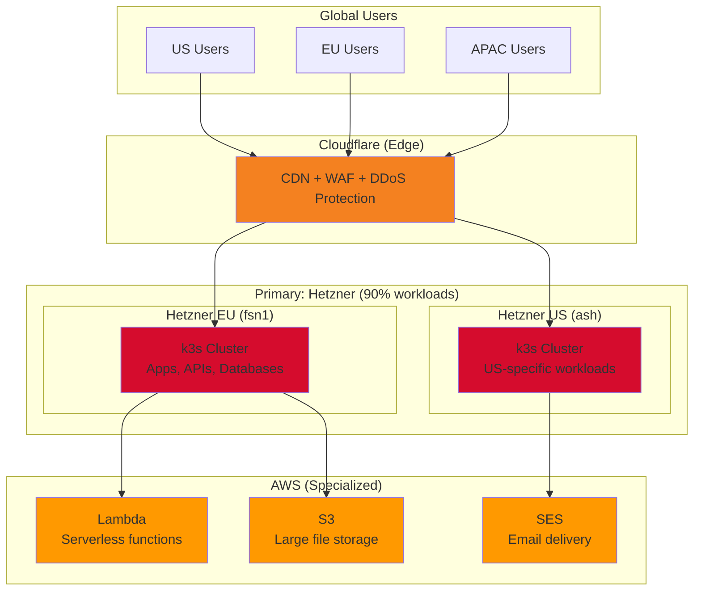
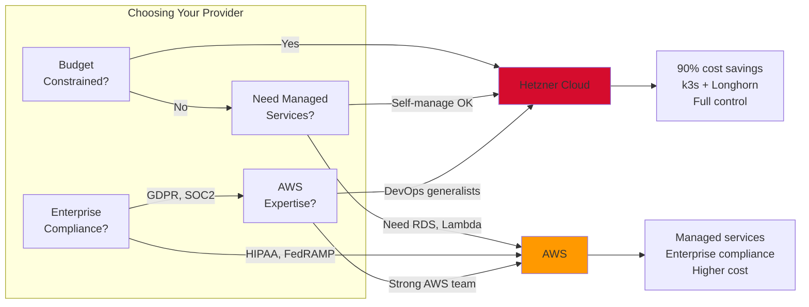

# Cloud Platforms

## The Cloud Provider Landscape

> *Choosing the right cloud provider isn't about which is "best" — it's about which fits your constraints: budget, compliance, team skills, and growth trajectory.*

---

## Provider Comparison



---

## Hetzner Cloud (Primary Platform)

### Why Hetzner for Startups?



### Hetzner Services

| Service | Purpose | OpenTofu Resource |
|---------|---------|-------------------|
| **Cloud Servers** | Compute instances | `hcloud_server` |
| **Networks** | Private networking | `hcloud_network` |
| **Load Balancers** | Traffic distribution | `hcloud_load_balancer` |
| **Volumes** | Block storage | `hcloud_volume` |
| **Floating IPs** | Static public IPs | `hcloud_floating_ip` |
| **Firewalls** | Network security | `hcloud_firewall` |
| **SSH Keys** | Authentication | `hcloud_ssh_key` |
| **Placement Groups** | HA distribution | `hcloud_placement_group` |

### Hetzner Architecture



### Server Types

| Type | vCPU | RAM | Storage | Price/mo | Use Case |
|------|------|-----|---------|----------|----------|
| **cx11** | 1 | 2GB | 20GB | €3.29 | Dev, testing |
| **cx21** | 2 | 4GB | 40GB | €5.83 | Small workloads |
| **cx31** | 4 | 8GB | 80GB | €10.59 | Production nodes |
| **cx41** | 8 | 16GB | 160GB | €18.59 | Database servers |
| **cx51** | 16 | 32GB | 240GB | €35.59 | Heavy workloads |
| **ccx13** | 2 | 8GB | 80GB | €12.99 | Dedicated CPU |
| **ccx23** | 4 | 16GB | 160GB | €24.99 | CPU-intensive |

### Locations

| Code | Location | Region | Use For |
|------|----------|--------|---------|
| `fsn1` | Falkenstein | Germany | EU primary |
| `nbg1` | Nuremberg | Germany | EU backup |
| `hel1` | Helsinki | Finland | Nordic users |
| `ash` | Ashburn | USA East | US primary |
| `hil` | Hillsboro | USA West | US West Coast |

---

## AWS (When You Need It)

### When to Choose AWS



### AWS Services for k8s

| Service | Purpose | Alternative on Hetzner |
|---------|---------|------------------------|
| **EKS** | Managed Kubernetes | k3s (self-managed) |
| **EC2** | Compute | hcloud_server |
| **VPC** | Networking | hcloud_network |
| **ALB** | Load balancing | hcloud_load_balancer |
| **EBS** | Block storage | hcloud_volume / Longhorn |
| **S3** | Object storage | MinIO / Hetzner Object Storage |
| **RDS** | Managed databases | Self-managed PostgreSQL |
| **Route 53** | DNS | Cloudflare (external) |

### Cost Comparison

```mermaid
xychart-beta
    title "Monthly Cost: 6-Node k8s Cluster"
    x-axis ["Compute", "Storage", "Load Balancer", "Bandwidth", "Total"]
    y-axis "Cost ($)" 0 --> 1200
    bar [540, 150, 20, 450, 1160]
    bar [60, 30, 0, 0, 90]
```



| Component | AWS Cost | Hetzner Cost | Savings |
|-----------|----------|--------------|---------|
| 6x Compute (4 vCPU, 8GB) | $540 | $60 | 89% |
| 600GB Storage | $150 | $30 | 80% |
| Load Balancer | $20 | Included | 100% |
| Bandwidth (5TB) | $450 | Included | 100% |
| **Total** | **$1,160** | **$90** | **92%** |

*Annual savings: $12,840*

---

## Multi-Cloud Strategy

### Hybrid Architecture



### When to Use Each

| Workload | Platform | Reason |
|----------|----------|--------|
| **Web apps** | Hetzner | Cost, simplicity |
| **APIs** | Hetzner | Predictable performance |
| **Databases** | Hetzner | No per-IOPS charges |
| **AI/ML training** | AWS/GCP | GPU availability |
| **Serverless** | AWS Lambda | No Hetzner equivalent |
| **Email** | AWS SES | Deliverability |
| **Large files** | AWS S3 | Ecosystem integration |
| **CDN/Security** | Cloudflare | Best-in-class WAF |

---

## OpenTofu Provider Configuration

### Hetzner Provider

```hcl
# providers.tf

terraform {
  required_providers {
    hcloud = {
      source  = "hetznercloud/hcloud"
      version = "~> 1.45"
    }
  }
}

provider "hcloud" {
  token = var.hcloud_token
}

variable "hcloud_token" {
  type        = string
  sensitive   = true
  description = "Hetzner Cloud API token"
}
```

### AWS Provider (for hybrid)

```hcl
# providers.tf (multi-cloud)

terraform {
  required_providers {
    hcloud = {
      source  = "hetznercloud/hcloud"
      version = "~> 1.45"
    }
    aws = {
      source  = "hashicorp/aws"
      version = "~> 5.0"
    }
  }
}

provider "hcloud" {
  token = var.hcloud_token
}

provider "aws" {
  region = "us-east-1"
  # Credentials from environment or IAM role
}
```

---

## Hetzner OpenTofu Modules

### Server Module

```hcl
# modules/hetzner-server/main.tf

variable "name" {
  type        = string
  description = "Server name"
}

variable "server_type" {
  type        = string
  default     = "cx31"
  description = "Hetzner server type"
}

variable "location" {
  type        = string
  default     = "fsn1"
  description = "Datacenter location"
}

variable "image" {
  type        = string
  default     = "ubuntu-22.04"
  description = "OS image"
}

variable "ssh_keys" {
  type        = list(string)
  description = "SSH key IDs"
}

variable "network_id" {
  type        = number
  description = "Private network ID"
}

variable "labels" {
  type        = map(string)
  default     = {}
  description = "Resource labels"
}

resource "hcloud_server" "this" {
  name        = var.name
  image       = var.image
  server_type = var.server_type
  location    = var.location
  ssh_keys    = var.ssh_keys
  labels      = var.labels

  network {
    network_id = var.network_id
  }

  public_net {
    ipv4_enabled = true
    ipv6_enabled = true
  }
}

output "id" {
  value = hcloud_server.this.id
}

output "ipv4_address" {
  value = hcloud_server.this.ipv4_address
}

output "private_ip" {
  value = hcloud_server.this.network[*].ip[0]
}
```

### Cluster Module

```hcl
# modules/hetzner-k3s-cluster/main.tf

variable "cluster_name" {
  type = string
}

variable "server_count" {
  type    = number
  default = 3
}

variable "agent_count" {
  type    = number
  default = 3
}

variable "server_type" {
  type    = string
  default = "cx31"
}

variable "location" {
  type    = string
  default = "fsn1"
}

# Private Network
resource "hcloud_network" "cluster" {
  name     = "${var.cluster_name}-network"
  ip_range = "10.0.0.0/8"
}

resource "hcloud_network_subnet" "cluster" {
  network_id   = hcloud_network.cluster.id
  type         = "cloud"
  network_zone = "eu-central"
  ip_range     = "10.0.1.0/24"
}

# SSH Key
resource "hcloud_ssh_key" "cluster" {
  name       = "${var.cluster_name}-key"
  public_key = file("~/.ssh/id_rsa.pub")
}

# Placement Group (spread servers across hosts)
resource "hcloud_placement_group" "servers" {
  name = "${var.cluster_name}-servers"
  type = "spread"
}

# Server Nodes (Control Plane)
resource "hcloud_server" "server" {
  count              = var.server_count
  name               = "${var.cluster_name}-server-${count.index}"
  image              = "ubuntu-22.04"
  server_type        = var.server_type
  location           = var.location
  ssh_keys           = [hcloud_ssh_key.cluster.id]
  placement_group_id = hcloud_placement_group.servers.id

  labels = {
    cluster = var.cluster_name
    role    = "server"
  }

  network {
    network_id = hcloud_network.cluster.id
    ip         = "10.0.1.${count.index + 10}"
  }
}

# Agent Nodes (Workers)
resource "hcloud_server" "agent" {
  count       = var.agent_count
  name        = "${var.cluster_name}-agent-${count.index}"
  image       = "ubuntu-22.04"
  server_type = var.server_type
  location    = var.location
  ssh_keys    = [hcloud_ssh_key.cluster.id]

  labels = {
    cluster = var.cluster_name
    role    = "agent"
  }

  network {
    network_id = hcloud_network.cluster.id
    ip         = "10.0.1.${count.index + 20}"
  }
}

# Load Balancer
resource "hcloud_load_balancer" "cluster" {
  name               = "${var.cluster_name}-lb"
  load_balancer_type = "lb11"
  location           = var.location

  labels = {
    cluster = var.cluster_name
  }
}

resource "hcloud_load_balancer_network" "cluster" {
  load_balancer_id = hcloud_load_balancer.cluster.id
  network_id       = hcloud_network.cluster.id
}

resource "hcloud_load_balancer_target" "servers" {
  count            = var.server_count
  load_balancer_id = hcloud_load_balancer.cluster.id
  type             = "server"
  server_id        = hcloud_server.server[count.index].id
  use_private_ip   = true
}

# Outputs
output "server_ips" {
  value = hcloud_server.server[*].ipv4_address
}

output "agent_ips" {
  value = hcloud_server.agent[*].ipv4_address
}

output "load_balancer_ip" {
  value = hcloud_load_balancer.cluster.ipv4
}

output "network_id" {
  value = hcloud_network.cluster.id
}
```

---

## Provider Decision Matrix



---

## Related

- [Infrastructure-as-Code](../02-Engineering/02-Infrastructure-as-Code.md)
- [Container Orchestration](../02-Engineering/04-Container-Orchestration.md)
- [Observability](./02-Observability.md)

---

*Last Updated: 2026-02-02*
