# Cloud Platforms: Where Autograph Lives

> *"Every castle needs land. The cloud is where we build Autograph's kingdom."*

## The Purpose: A Home for Autograph

**Why are we doing this?** Autograph needs servers, networks, and storage. Choosing the right cloud provider determines:

- **How much it costs** to run Strapi and AI services
- **How fast** users can publish content
- **How reliable** the platform is during traffic spikes
- **How quickly** you can scale when Autograph goes viral

```mermaid
flowchart TB
    subgraph Problem["🚫 WITHOUT THE RIGHT CLOUD"]
        P1["AWS bills eat your runway"]
        P2["$1,000+/month for 6 servers"]
        P3["Bandwidth charges surprise you"]
        P4["Autograph shuts down, no money left"]
    end

    subgraph Solution["✅ WITH HETZNER"]
        S1["€90/month for same infrastructure"]
        S2["Bandwidth included"]
        S3["10x runway extension"]
        S4["Autograph thrives, money for growth"]
    end

    Problem -.->|"Burn rate kills startups"| X["😱"]
    Solution -.->|"Smart economics"| Y["🚀 Autograph scales!"]

    style Solution fill:#4CAF50
```



---

## Who Needs to Understand This?

| Stakeholder | Why Cloud Choice Matters |
|-------------|-------------------------|
| **DevOps** | "Where do I provision Autograph's servers?" |
| **Developers** | "How do I connect to the Strapi database?" |
| **Business** | "How much does it cost to serve 10,000 users?" |
| **Customers** | "Is my content safe in your data center?" |

---

## The Cloud Provider Landscape

```mermaid
quadrantChart
    title Cloud Provider Positioning for Autograph
    x-axis Low Cost --> High Cost
    y-axis Simple --> Enterprise Features
    quadrant-1 Enterprise Grade
    quadrant-2 Cost-Effective Enterprise
    quadrant-3 Budget Friendly (Autograph Sweet Spot)
    quadrant-4 Premium Simple
    AWS: [0.85, 0.9]
    GCP: [0.75, 0.85]
    Azure: [0.8, 0.88]
    Hetzner: [0.15, 0.45]
    DigitalOcean: [0.35, 0.5]
    Linode: [0.3, 0.45]
    Vultr: [0.25, 0.4]
```

**For Autograph:** Hetzner sits in the sweet spot—affordable enough for a startup, capable enough for production.

---

## Hetzner Cloud: Autograph's Home

### Why Hetzner for Autograph?


### Hetzner Services for Autograph

| Service | What It Provides | Autograph Use Case |
|---------|-----------------|-------------------|
| **Cloud Servers** | Virtual machines | Run k3s, Strapi, AI Service |
| **Networks** | Private networking | Secure comms between components |
| **Load Balancers** | Traffic distribution | Public access to Autograph |
| **Volumes** | Block storage | PostgreSQL data, uploads |
| **Floating IPs** | Static public IPs | DNS for autograph.example.com |
| **Firewalls** | Network security | Protect k3s API, databases |
| **Placement Groups** | HA distribution | Spread servers across hosts |

---

## Autograph Infrastructure Architecture


---

## Server Types for Autograph

| Type | vCPU | RAM | Storage | €/month | Autograph Role |
|------|------|-----|---------|---------|----------------|
| **cx21** | 2 | 4GB | 40GB | €5.83 | Dev environment |
| **cx31** | 4 | 8GB | 80GB | €10.59 | k3s control plane |
| **cx41** | 8 | 16GB | 160GB | €18.59 | Workers (Strapi, AI) |
| **cx51** | 16 | 32GB | 240GB | €35.59 | Heavy AI workloads |
| **ccx23** | 4 | 16GB | 160GB | €24.99 | AI inference (dedicated CPU) |

### Autograph Recommended Setup

| Component | Server Type | Count | Purpose |
|-----------|-------------|-------|---------|
| **Control Plane** | cx31 | 3 | k3s API, etcd (HA) |
| **Workers** | cx41 | 3 | Strapi, AI Service, DBs |

---

## Location Strategy

| Code | Location | Region | Autograph Use |
|------|----------|--------|---------------|
| `fsn1` | Falkenstein | Germany | **Primary** (EU users) |
| `nbg1` | Nuremberg | Germany | Disaster recovery |
| `ash` | Ashburn | USA East | US customers |
| `hil` | Hillsboro | USA West | West Coast users |

**For Autograph:** Start with `fsn1` for EU-first, add US later as customers demand.

---

## AWS vs Hetzner: The Autograph Math

### When to Choose Each


### Cost Comparison: Autograph Production Cluster


| Component | AWS Cost | Hetzner Cost | Savings |
|-----------|----------|--------------|---------|
| 3x Control (cx31 equiv) | $270 | €30 | 89% |
| 3x Workers (cx41 equiv) | $270 | €60 | 78% |
| 600GB NVMe Storage | $150 | €30 | 80% |
| Load Balancer | $20 | Included | 100% |
| Bandwidth (5TB/month) | $450 | Included | 100% |
| **Monthly Total** | **$1,160** | **€120** | **90%** |

**Annual savings for Autograph: ~$12,500** — That's runway for 10 more months!

---

## Multi-Cloud Strategy for Autograph

### Hybrid Architecture


### What Goes Where

| Autograph Workload | Platform | Why |
|--------------------|----------|-----|
| **Strapi CMS** | Hetzner | Cost, predictable performance |
| **AI Service** | Hetzner | No per-request charges |
| **PostgreSQL** | Hetzner | No per-IOPS charges |
| **Redis** | Hetzner | Low cost caching |
| **Media Storage (>10GB)** | AWS S3 | Scalability, CDN integration |
| **Email Delivery** | AWS SES | Deliverability, reputation |
| **AI API Fallback** | AWS Bedrock | Alternative to direct OpenAI |

---

## OpenTofu: Provisioning Autograph Infrastructure

### Provider Configuration

```hcl
# providers.tf - Autograph Infrastructure

terraform {
  required_providers {
    hcloud = {
      source  = "hetznercloud/hcloud"
      version = "~> 1.45"
    }
  }
}

provider "hcloud" {
  token = var.hcloud_token  # Your Hetzner API token
}

variable "hcloud_token" {
  type        = string
  sensitive   = true
  description = "Hetzner Cloud API token for Autograph"
}
```

### Autograph Cluster Module

```hcl
# modules/autograph-cluster/main.tf

variable "cluster_name" {
  type    = string
  default = "autograph"
}

variable "server_count" {
  type    = number
  default = 3
  description = "Control plane nodes (must be odd for etcd quorum)"
}

variable "agent_count" {
  type    = number
  default = 3
  description = "Worker nodes for Strapi, AI Service"
}

variable "location" {
  type    = string
  default = "fsn1"
  description = "Hetzner datacenter (fsn1 for EU)"
}

# Private Network for Autograph
resource "hcloud_network" "autograph" {
  name     = "${var.cluster_name}-network"
  ip_range = "10.0.0.0/8"
}

resource "hcloud_network_subnet" "autograph" {
  network_id   = hcloud_network.autograph.id
  type         = "cloud"
  network_zone = "eu-central"
  ip_range     = "10.0.1.0/24"
}

# SSH Key for Admin Access
resource "hcloud_ssh_key" "autograph" {
  name       = "${var.cluster_name}-key"
  public_key = file("~/.ssh/id_rsa.pub")
}

# Placement Group (spread control plane across hosts)
resource "hcloud_placement_group" "servers" {
  name = "${var.cluster_name}-servers"
  type = "spread"
}

# Control Plane Nodes
resource "hcloud_server" "server" {
  count              = var.server_count
  name               = "${var.cluster_name}-server-${count.index + 1}"
  image              = "ubuntu-22.04"
  server_type        = "cx31"  # 4 vCPU, 8GB for k3s control plane
  location           = var.location
  ssh_keys           = [hcloud_ssh_key.autograph.id]
  placement_group_id = hcloud_placement_group.servers.id

  labels = {
    cluster = var.cluster_name
    role    = "server"
    product = "autograph"
  }

  network {
    network_id = hcloud_network.autograph.id
    ip         = "10.0.1.${count.index + 10}"
  }
}

# Worker Nodes (Where Autograph Actually Runs)
resource "hcloud_server" "agent" {
  count       = var.agent_count
  name        = "${var.cluster_name}-agent-${count.index + 1}"
  image       = "ubuntu-22.04"
  server_type = "cx41"  # 8 vCPU, 16GB for Strapi + AI
  location    = var.location
  ssh_keys    = [hcloud_ssh_key.autograph.id]

  labels = {
    cluster = var.cluster_name
    role    = "agent"
    product = "autograph"
  }

  network {
    network_id = hcloud_network.autograph.id
    ip         = "10.0.1.${count.index + 20}"
  }
}

# Load Balancer for Public Access
resource "hcloud_load_balancer" "autograph" {
  name               = "${var.cluster_name}-lb"
  load_balancer_type = "lb11"
  location           = var.location

  labels = {
    cluster = var.cluster_name
    product = "autograph"
  }
}

resource "hcloud_load_balancer_network" "autograph" {
  load_balancer_id = hcloud_load_balancer.autograph.id
  network_id       = hcloud_network.autograph.id
}

# Point LB to worker nodes (where Strapi runs)
resource "hcloud_load_balancer_target" "agents" {
  count            = var.agent_count
  load_balancer_id = hcloud_load_balancer.autograph.id
  type             = "server"
  server_id        = hcloud_server.agent[count.index].id
  use_private_ip   = true
}

# HTTPS for Autograph
resource "hcloud_load_balancer_service" "https" {
  load_balancer_id = hcloud_load_balancer.autograph.id
  protocol         = "tcp"
  listen_port      = 443
  destination_port = 443

  health_check {
    protocol = "tcp"
    port     = 443
    interval = 10
    timeout  = 5
    retries  = 3
  }
}

# Firewall Rules
resource "hcloud_firewall" "autograph" {
  name = "${var.cluster_name}-firewall"

  # Allow SSH (for admin)
  rule {
    direction = "in"
    protocol  = "tcp"
    port      = "22"
    source_ips = ["0.0.0.0/0"]
  }

  # Allow HTTP/HTTPS (for Autograph users)
  rule {
    direction = "in"
    protocol  = "tcp"
    port      = "80"
    source_ips = ["0.0.0.0/0"]
  }

  rule {
    direction = "in"
    protocol  = "tcp"
    port      = "443"
    source_ips = ["0.0.0.0/0"]
  }

  # Allow k3s API (for kubectl)
  rule {
    direction = "in"
    protocol  = "tcp"
    port      = "6443"
    source_ips = ["0.0.0.0/0"]  # Restrict in production!
  }
}

# Outputs for Ansible
output "server_ips" {
  value       = hcloud_server.server[*].ipv4_address
  description = "Autograph control plane IPs"
}

output "agent_ips" {
  value       = hcloud_server.agent[*].ipv4_address
  description = "Autograph worker IPs (Strapi runs here)"
}

output "load_balancer_ip" {
  value       = hcloud_load_balancer.autograph.ipv4
  description = "Public IP for autograph.example.com"
}

output "private_network_id" {
  value       = hcloud_network.autograph.id
  description = "Network ID for additional resources"
}
```

---

## Autograph Cost Summary

| Resource | Spec | Monthly Cost |
|----------|------|--------------|
| 3x Control Plane | cx31 (4 vCPU, 8GB) | €30 |
| 3x Workers | cx41 (8 vCPU, 16GB) | €60 |
| Load Balancer | lb11 | €6 |
| Volumes (300GB) | NVMe | €12 |
| Private Network | Included | €0 |
| Bandwidth | Included | €0 |
| **Total** | | **€108/month** |

*For comparison: Same setup on AWS would cost **$1,200+/month***

---

## What's Next

Once you've provisioned Autograph's infrastructure with OpenTofu:

1. **[Configuration Management](../02-Engineering/03-Configuration-Management.md)** — Use Ansible to install k3s
2. **[Container Orchestration](../02-Engineering/04-Container-Orchestration.md)** — Understand your k3s cluster
3. **[Security](./03-Security.md)** — Protect Autograph from attackers

---

## Related

- [Infrastructure-as-Code](../02-Engineering/02-Infrastructure-as-Code.md) — OpenTofu fundamentals
- [Container Orchestration](../02-Engineering/04-Container-Orchestration.md) — k3s for Autograph
- [Observability](./02-Observability.md) — Monitor Autograph's health

---

*Last Updated: 2026-02-02*
