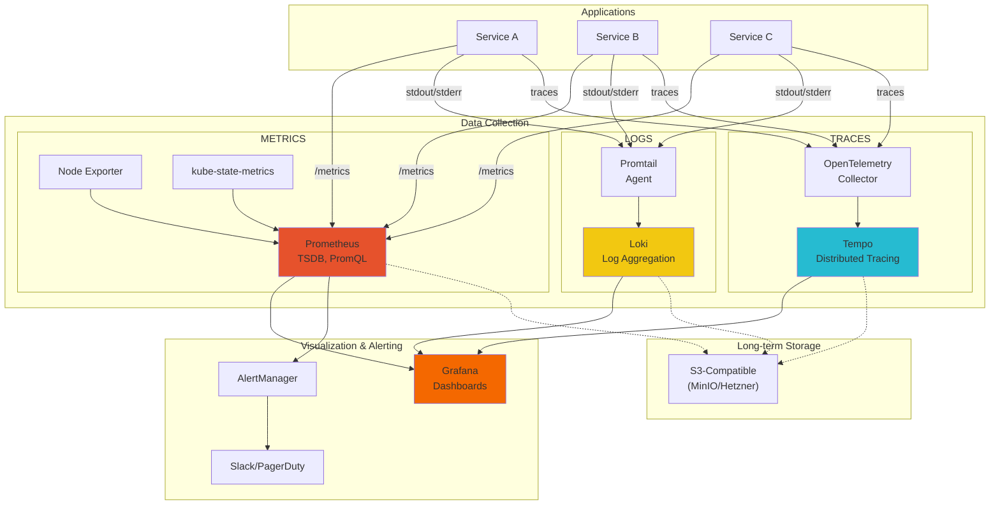
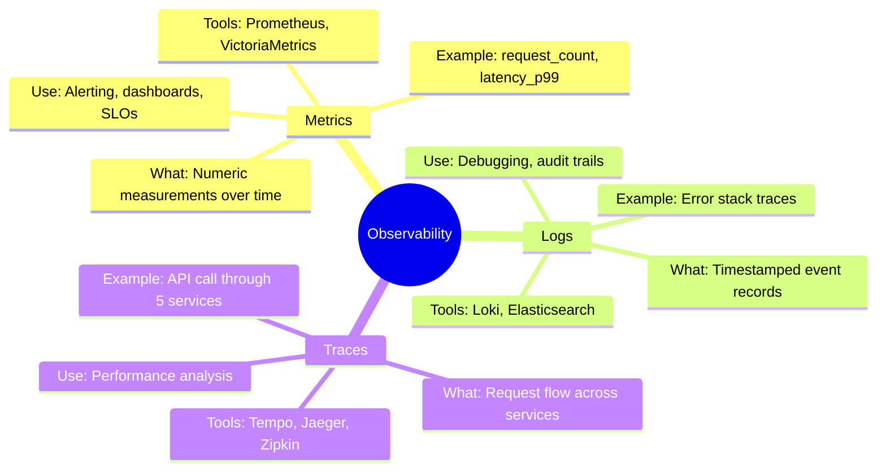
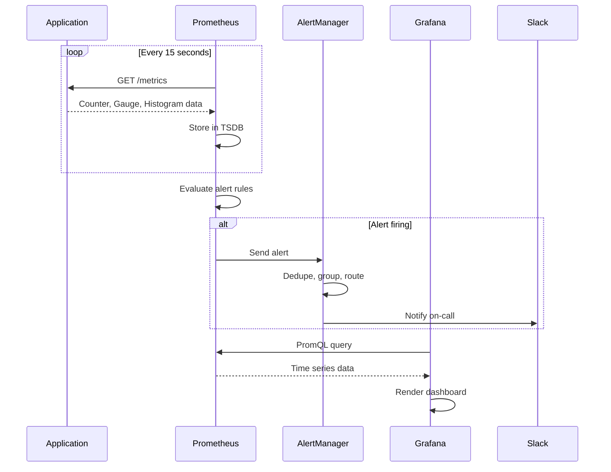
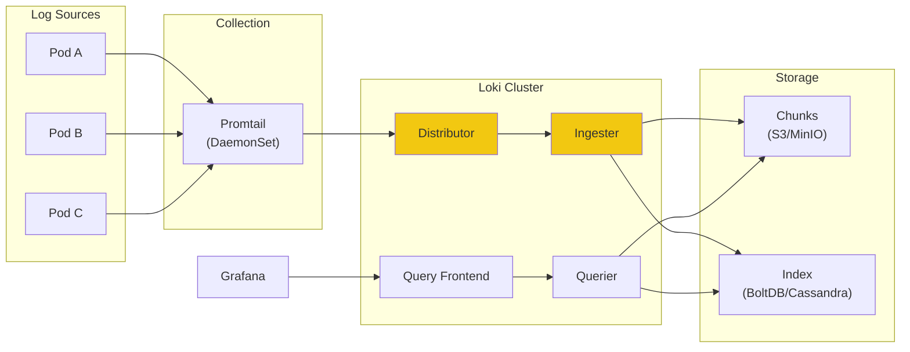
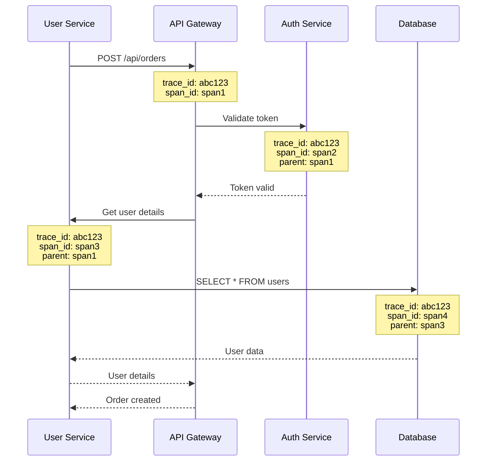
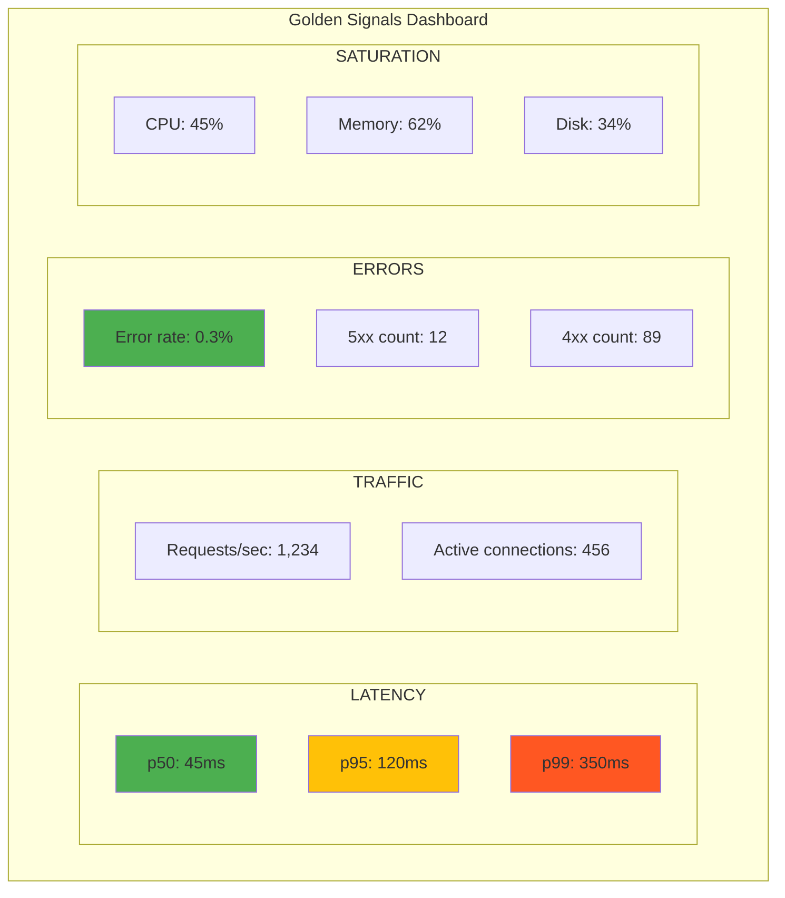

# Observability

> *"Monitoring tells you whether a system is working. Observability lets you ask why it's not."*
> — **Distributed Systems Observability** (Cindy Sridharan)

## The Three Pillars

> *You can't fix what you can't see. Observability transforms "the system is broken" into "the API latency increased at 14:32 when the database connection pool exhausted."*

---

## Observability Architecture



---

## The Three Pillars Explained



### When to Use Each

| Question | Pillar | Example |
|----------|--------|---------|
| "How many requests per second?" | **Metrics** | `rate(http_requests_total[5m])` |
| "What error did user X see?" | **Logs** | Search for user ID in Loki |
| "Why is this API slow?" | **Traces** | Follow request through services |
| "Is the system healthy?" | **Metrics** | Dashboard with uptime, error rates |
| "What happened at 2:45 AM?" | **Logs** | Time-range query in Grafana |

---

## Prometheus Deep Dive

### How Prometheus Works



### Metric Types

| Type | Description | Example |
|------|-------------|---------|
| **Counter** | Monotonically increasing | `http_requests_total` |
| **Gauge** | Can go up or down | `temperature_celsius` |
| **Histogram** | Distribution of values | `http_request_duration_seconds` |
| **Summary** | Similar to histogram, calculates quantiles | `request_duration_summary` |

### PromQL Essentials

```promql
# Request rate (requests per second)
rate(http_requests_total[5m])

# Error rate percentage
sum(rate(http_requests_total{status=~"5.."}[5m]))
/
sum(rate(http_requests_total[5m])) * 100

# 95th percentile latency
histogram_quantile(0.95, rate(http_request_duration_seconds_bucket[5m]))

# Memory usage percentage
(node_memory_MemTotal_bytes - node_memory_MemAvailable_bytes)
/
node_memory_MemTotal_bytes * 100

# Pod restarts in last hour
increase(kube_pod_container_status_restarts_total[1h])

# Top 5 pods by CPU
topk(5, sum by (pod) (rate(container_cpu_usage_seconds_total[5m])))
```

### Prometheus Configuration

```yaml
# prometheus.yml

global:
  scrape_interval: 15s
  evaluation_interval: 15s

alerting:
  alertmanagers:
    - static_configs:
        - targets:
            - alertmanager:9093

rule_files:
  - /etc/prometheus/rules/*.yml

scrape_configs:
  # Prometheus itself
  - job_name: 'prometheus'
    static_configs:
      - targets: ['localhost:9090']

  # Kubernetes service discovery
  - job_name: 'kubernetes-pods'
    kubernetes_sd_configs:
      - role: pod
    relabel_configs:
      - source_labels: [__meta_kubernetes_pod_annotation_prometheus_io_scrape]
        action: keep
        regex: true
      - source_labels: [__meta_kubernetes_pod_annotation_prometheus_io_path]
        action: replace
        target_label: __metrics_path__
        regex: (.+)
      - source_labels: [__meta_kubernetes_pod_annotation_prometheus_io_port]
        action: replace
        target_label: __address__
        regex: (.+)

  # Node exporter
  - job_name: 'node-exporter'
    kubernetes_sd_configs:
      - role: node
    relabel_configs:
      - action: replace
        target_label: __address__
        replacement: node-exporter.monitoring.svc:9100
```

---

## Grafana Loki for Logs

### Loki Architecture



### LogQL Examples

```logql
# All logs from a specific app
{app="user-service"}

# Errors only
{app="user-service"} |= "error"

# JSON parsing
{app="api-gateway"} | json | status >= 500

# Rate of errors
rate({app="user-service"} |= "error" [5m])

# Top error messages
{app="user-service"} |= "error" | pattern "<_> error: <msg>" | topk(5, msg)

# Logs with specific trace ID
{app=~".+"} |= "trace_id=abc123"
```

### Promtail Configuration

```yaml
# promtail.yml

server:
  http_listen_port: 9080

positions:
  filename: /tmp/positions.yaml

clients:
  - url: http://loki:3100/loki/api/v1/push

scrape_configs:
  - job_name: kubernetes-pods
    kubernetes_sd_configs:
      - role: pod
    pipeline_stages:
      - docker: {}
      - json:
          expressions:
            level: level
            msg: msg
      - labels:
          level:
    relabel_configs:
      - source_labels: [__meta_kubernetes_pod_label_app]
        target_label: app
      - source_labels: [__meta_kubernetes_namespace]
        target_label: namespace
      - source_labels: [__meta_kubernetes_pod_name]
        target_label: pod
```

---

## Grafana Tempo for Traces

### Distributed Tracing Concept



### OpenTelemetry Configuration

```yaml
# otel-collector-config.yaml

receivers:
  otlp:
    protocols:
      grpc:
        endpoint: 0.0.0.0:4317
      http:
        endpoint: 0.0.0.0:4318

processors:
  batch:
    timeout: 1s
    send_batch_size: 1024

  memory_limiter:
    check_interval: 1s
    limit_percentage: 80

exporters:
  otlp/tempo:
    endpoint: tempo:4317
    tls:
      insecure: true

  prometheus:
    endpoint: 0.0.0.0:8889

service:
  pipelines:
    traces:
      receivers: [otlp]
      processors: [memory_limiter, batch]
      exporters: [otlp/tempo]

    metrics:
      receivers: [otlp]
      processors: [memory_limiter, batch]
      exporters: [prometheus]
```

---

## Alert Rules

### Critical Alerts

```yaml
# alerts/critical.yml

groups:
  - name: critical
    interval: 30s
    rules:
      # High error rate
      - alert: HighErrorRate
        expr: |
          sum(rate(http_requests_total{status=~"5.."}[5m]))
          /
          sum(rate(http_requests_total[5m])) > 0.05
        for: 5m
        labels:
          severity: critical
        annotations:
          summary: "High error rate detected"
          description: "Error rate is {{ $value | humanizePercentage }}"

      # Pod crash looping
      - alert: PodCrashLooping
        expr: |
          increase(kube_pod_container_status_restarts_total[1h]) > 5
        for: 5m
        labels:
          severity: critical
        annotations:
          summary: "Pod {{ $labels.pod }} is crash looping"
          description: "{{ $value }} restarts in the last hour"

      # Node not ready
      - alert: NodeNotReady
        expr: |
          kube_node_status_condition{condition="Ready", status="true"} == 0
        for: 5m
        labels:
          severity: critical
        annotations:
          summary: "Node {{ $labels.node }} is not ready"

      # Disk space critical
      - alert: DiskSpaceCritical
        expr: |
          (node_filesystem_avail_bytes / node_filesystem_size_bytes) < 0.1
        for: 5m
        labels:
          severity: critical
        annotations:
          summary: "Disk space critical on {{ $labels.instance }}"
          description: "Only {{ $value | humanizePercentage }} free"
```

### Warning Alerts

```yaml
# alerts/warning.yml

groups:
  - name: warning
    rules:
      # High latency
      - alert: HighLatency
        expr: |
          histogram_quantile(0.95, rate(http_request_duration_seconds_bucket[5m])) > 0.5
        for: 10m
        labels:
          severity: warning
        annotations:
          summary: "High latency detected"
          description: "p95 latency is {{ $value }}s"

      # Memory usage high
      - alert: HighMemoryUsage
        expr: |
          (node_memory_MemTotal_bytes - node_memory_MemAvailable_bytes)
          /
          node_memory_MemTotal_bytes > 0.85
        for: 15m
        labels:
          severity: warning
        annotations:
          summary: "High memory usage on {{ $labels.instance }}"

      # Certificate expiring soon
      - alert: CertificateExpiringSoon
        expr: |
          (cert_exporter_cert_not_after - time()) / 86400 < 30
        for: 1h
        labels:
          severity: warning
        annotations:
          summary: "Certificate expiring in {{ $value }} days"
```

---

## AlertManager Configuration

```yaml
# alertmanager.yml

global:
  resolve_timeout: 5m
  slack_api_url: 'https://hooks.slack.com/services/xxx'

route:
  group_by: ['alertname', 'severity']
  group_wait: 30s
  group_interval: 5m
  repeat_interval: 4h
  receiver: 'slack-notifications'

  routes:
    - match:
        severity: critical
      receiver: 'pagerduty-critical'
      continue: true

    - match:
        severity: warning
      receiver: 'slack-warnings'

receivers:
  - name: 'slack-notifications'
    slack_configs:
      - channel: '#alerts'
        title: '{{ .GroupLabels.alertname }}'
        text: '{{ range .Alerts }}{{ .Annotations.description }}{{ end }}'

  - name: 'slack-warnings'
    slack_configs:
      - channel: '#alerts-low'
        title: '{{ .GroupLabels.alertname }}'

  - name: 'pagerduty-critical'
    pagerduty_configs:
      - service_key: '<pagerduty-key>'
        severity: critical

inhibit_rules:
  - source_match:
      severity: 'critical'
    target_match:
      severity: 'warning'
    equal: ['alertname']
```

---

## Golden Signals Dashboard



### Grafana Dashboard JSON

```json
{
  "title": "Golden Signals",
  "panels": [
    {
      "title": "Request Rate",
      "type": "graph",
      "targets": [
        {
          "expr": "sum(rate(http_requests_total[5m]))",
          "legendFormat": "Requests/s"
        }
      ]
    },
    {
      "title": "Error Rate",
      "type": "stat",
      "targets": [
        {
          "expr": "sum(rate(http_requests_total{status=~\"5..\"}[5m])) / sum(rate(http_requests_total[5m])) * 100",
          "legendFormat": "Error %"
        }
      ],
      "thresholds": {
        "steps": [
          {"color": "green", "value": null},
          {"color": "yellow", "value": 1},
          {"color": "red", "value": 5}
        ]
      }
    },
    {
      "title": "Latency (p95)",
      "type": "graph",
      "targets": [
        {
          "expr": "histogram_quantile(0.95, rate(http_request_duration_seconds_bucket[5m]))",
          "legendFormat": "p95"
        }
      ]
    }
  ]
}
```

---

## Helm Installation

### kube-prometheus-stack

```bash
# Add Helm repo
helm repo add prometheus-community https://prometheus-community.github.io/helm-charts
helm repo update

# Install with custom values
helm install prometheus prometheus-community/kube-prometheus-stack \
  --namespace monitoring \
  --create-namespace \
  -f prometheus-values.yaml
```

```yaml
# prometheus-values.yaml

prometheus:
  prometheusSpec:
    retention: 15d
    storageSpec:
      volumeClaimTemplate:
        spec:
          storageClassName: longhorn
          resources:
            requests:
              storage: 50Gi

grafana:
  adminPassword: "changeme"
  persistence:
    enabled: true
    size: 10Gi

alertmanager:
  config:
    global:
      slack_api_url: "https://hooks.slack.com/..."
```

### Loki Stack

```bash
helm repo add grafana https://grafana.github.io/helm-charts

helm install loki grafana/loki-stack \
  --namespace monitoring \
  -f loki-values.yaml
```

```yaml
# loki-values.yaml

loki:
  persistence:
    enabled: true
    size: 50Gi

promtail:
  enabled: true
```

---

## Related

- [Architecture](../02-Engineering/01-Architecture.md)
- [Security](./03-Security.md)
- [GitOps](../02-Engineering/05-GitOps.md)

---

*Last Updated: 2026-02-02*
