# Observability: Watching Autograph's Heartbeat

> *"You can't fix what you can't see. Observability transforms 'Autograph is broken' into 'The AI service latency increased at 14:32 when Claude's API rate limit hit.'"*

## The Purpose: Why Watch Autograph?

**Why are we doing this?** Different people need different answers from Autograph.

| Who | What They Ask | What Observability Tells Them |
|-----|---------------|-------------------------------|
| **DevOps** | "Is the platform healthy?" | Node status, pod restarts, disk usage |
| **Developers** | "Why is Strapi slow?" | API latency, database query times, error logs |
| **AI Agents** | "Is content generation working?" | Token usage, generation latency, API success rates |
| **Business** | "Are users happy?" | Content creation time, error rates, SLA compliance |
| **Customers** | "Can I publish my content?" | System status, estimated wait times |

```mermaid
flowchart TB
    subgraph Autograph["🏰 AUTOGRAPH PLATFORM"]
        Strapi["Strapi CMS\n(content)"]
        AI["AI Service\n(generation)"]
        PG["PostgreSQL\n(storage)"]
        Redis["Redis\n(cache)"]
        Meili["Meilisearch\n(search)"]
    end

    subgraph Observability["👁️ OBSERVABILITY"]
        Metrics["METRICS\n(how much, how fast)"]
        Logs["LOGS\n(what happened)"]
        Traces["TRACES\n(where it went)"]
    end

    subgraph Stakeholders["👥 WHO NEEDS IT"]
        DevOps["DevOps\n'Is it running?'"]
        Dev["Developers\n'Why is it slow?'"]
        AgentAI["AI Agents\n'Did generation work?'"]
        Biz["Business\n'Are users creating?'"]
    end

    Autograph --> Observability
    Observability --> Stakeholders

    style Autograph fill:#4CAF50
```



---

## The Three Pillars (For Autograph)


### When to Use Each Pillar

| Question | Pillar | Autograph Example |
|----------|--------|-------------------|
| "How many articles created today?" | **Metrics** | `increase(strapi_content_created_total[24h])` |
| "Why did AI generation fail for user X?" | **Logs** | Search for user ID in Loki |
| "Why is article creation slow?" | **Traces** | Follow request: Strapi → AI Service → Claude |
| "Is Autograph meeting SLAs?" | **Metrics** | Dashboard showing p99 latency, error rate |
| "What happened during the outage?" | **Logs** | Time-range query showing the cascade |

---

## Autograph Observability Architecture


---

## Why Each Stakeholder Needs Observability

### 🔧 DevOps: "Is the Platform Healthy?"

**What they watch:**
- Node CPU, memory, disk usage
- Pod status (Running, CrashLoopBackOff)
- Kubernetes events
- Longhorn storage health

```mermaid
flowchart LR
    subgraph DevOpsView["DevOps Dashboard"]
        Nodes["3/3 Servers Healthy\n3/3 Agents Healthy"]
        Pods["12/12 Pods Running"]
        Storage["Longhorn: 3 replicas OK"]
        Network["Ingress: 200 OK"]
    end

    DevOpsView -->|"All green"| Happy["😊 Sleep well"]
    DevOpsView -->|"Red alerts"| PagerDuty["📱 Wake up!"]

    style Happy fill:#4CAF50
```



**Key metrics for DevOps:**

```promql
# Are all Autograph pods running?
kube_deployment_status_replicas_available{namespace="autograph"}
/
kube_deployment_spec_replicas{namespace="autograph"}

# Any pods crashing?
increase(kube_pod_container_status_restarts_total{namespace="autograph"}[1h])

# Disk space on agents
(node_filesystem_avail_bytes{mountpoint="/var/lib/longhorn"} / node_filesystem_size_bytes) * 100
```

---

### 👩‍💻 Developers: "Why Is Strapi Slow?"

**What they watch:**
- API endpoint latency
- Database query duration
- Error stack traces
- Redis cache hit/miss ratio


**Key metrics for Developers:**

```promql
# Strapi API latency by endpoint
histogram_quantile(0.95, rate(strapi_http_request_duration_seconds_bucket[5m]))

# Slowest Strapi endpoints
topk(5, histogram_quantile(0.99, rate(strapi_http_request_duration_seconds_bucket[5m])))

# PostgreSQL query duration
pg_stat_activity_max_tx_duration{datname="autograph"}

# Redis cache hit ratio
redis_keyspace_hits_total / (redis_keyspace_hits_total + redis_keyspace_misses_total)
```

**LogQL for debugging:**

```logql
# Find errors in Strapi
{namespace="autograph", app="strapi"} |= "error"

# Find slow database queries
{namespace="autograph", app="strapi"} | json | duration > 1s

# Track specific content creation
{namespace="autograph"} |= "article_id=12345"
```

---

### 🤖 AI Agents: "Is Content Generation Working?"

**What they watch:**
- AI API success/failure rates
- Token usage (cost tracking)
- Generation latency
- Provider health (Claude vs OpenAI fallback)

```mermaid
flowchart TB
    subgraph AIMetrics["AI Service Metrics"]
        Tokens["Token Usage\n45,234 today\n$12.50 cost"]
        Latency["Generation Latency\np50: 1.2s\np99: 4.8s"]
        Success["Success Rate\n99.2%"]
        Provider["Provider Status\nClaude: ✅\nOpenAI: ✅ (fallback)"]
    end

    subgraph Alerts["AI-Specific Alerts"]
        Cost["⚠️ Cost > $50/day"]
        Timeout["🚨 Generation timeout"]
        RateLimit["⚠️ Rate limit approaching"]
    end

    AIMetrics --> Alerts

    style Success fill:#4CAF50
    style Latency fill:#FFC107
```



**Key metrics for AI Agents:**

```promql
# Token usage today
increase(ai_service_tokens_used_total[24h])

# AI cost tracking (assuming $0.003 per 1K tokens)
increase(ai_service_tokens_used_total[24h]) / 1000 * 0.003

# AI generation success rate
sum(rate(ai_service_requests_total{status="success"}[5m]))
/
sum(rate(ai_service_requests_total[5m])) * 100

# AI generation latency
histogram_quantile(0.95, rate(ai_service_generation_duration_seconds_bucket[5m]))

# Provider fallback rate
rate(ai_service_provider_fallback_total[1h])
```

---

### 📊 Business: "Are Users Creating Content?"

**What they watch:**
- Content created per hour/day
- User activity metrics
- Error rates affecting UX
- SLA compliance

```mermaid
flowchart TB
    subgraph BusinessDashboard["Autograph Business Dashboard"]
        subgraph Today["Today's Activity"]
            Articles["📝 Articles Created: 234"]
            AI["🤖 AI Generations: 1,456"]
            Users["👥 Active Users: 89"]
        end

        subgraph SLA["SLA Status"]
            Uptime["Uptime: 99.95%\n✅ Target: 99.9%"]
            Latency["Content API: 85ms\n✅ Target: 100ms"]
            AITime["AI Generation: 2.1s\n✅ Target: 3s"]
        end

        subgraph Alerts["Business Alerts"]
            Low["⚠️ Content creation down 20%"]
            High["📈 AI usage up 50%"]
        end
    end

    style Uptime fill:#4CAF50
    style Latency fill:#4CAF50
    style AITime fill:#4CAF50
```



**Key metrics for Business:**

```promql
# Content created today
increase(strapi_content_entries_total{content_type="article"}[24h])

# Active users (unique API tokens)
count(count by (user_id) (rate(strapi_http_requests_total[1h]) > 0))

# Platform availability (uptime)
avg_over_time(up{job="strapi"}[30d]) * 100

# Revenue-impacting errors
sum(rate(strapi_http_requests_total{status=~"5.."}[5m])) * 60 * 60 * 24
```

---

## Autograph-Specific Dashboards

### Strapi CMS Dashboard


### AI Service Dashboard


---

## Autograph Alert Rules

### Critical Alerts (Wake Someone Up)

```yaml
# alerts/autograph-critical.yml

groups:
  - name: autograph-critical
    interval: 30s
    rules:
      # Strapi is down
      - alert: StrapiDown
        expr: up{job="strapi"} == 0
        for: 1m
        labels:
          severity: critical
          product: autograph
        annotations:
          summary: "🚨 Strapi CMS is DOWN"
          description: "Content creators cannot access Autograph"
          runbook: "Check pod status: kubectl get pods -n autograph -l app=strapi"

      # AI Service errors blocking content creation
      - alert: AIServiceHighErrorRate
        expr: |
          sum(rate(ai_service_requests_total{status="error"}[5m]))
          /
          sum(rate(ai_service_requests_total[5m])) > 0.1
        for: 5m
        labels:
          severity: critical
          product: autograph
        annotations:
          summary: "🚨 AI Service error rate > 10%"
          description: "AI content generation failing, affecting users"
          impact: "Users cannot generate AI content"

      # PostgreSQL down (data loss risk)
      - alert: PostgreSQLDown
        expr: up{job="postgres"} == 0
        for: 1m
        labels:
          severity: critical
          product: autograph
        annotations:
          summary: "🚨 PostgreSQL database is DOWN"
          description: "Autograph data layer unavailable"

      # Content API SLA breach
      - alert: ContentAPISLABreach
        expr: |
          histogram_quantile(0.95, rate(strapi_http_request_duration_seconds_bucket[5m])) > 0.5
        for: 10m
        labels:
          severity: critical
          product: autograph
        annotations:
          summary: "🚨 Content API p95 latency > 500ms"
          description: "SLA breach: p95 = {{ $value }}s"
          impact: "User experience degraded"
```

### Warning Alerts (Look at it Soon)

```yaml
# alerts/autograph-warning.yml

groups:
  - name: autograph-warning
    rules:
      # AI token usage high (cost control)
      - alert: AITokenUsageHigh
        expr: increase(ai_service_tokens_used_total[1h]) > 100000
        for: 5m
        labels:
          severity: warning
          product: autograph
        annotations:
          summary: "⚠️ High AI token usage"
          description: "{{ $value }} tokens in last hour"
          cost_impact: "Estimated ${{ $value | humanize }} / 1000 * 0.003"

      # AI rate limit approaching
      - alert: AIRateLimitApproaching
        expr: ai_service_rate_limit_remaining < 10
        for: 1m
        labels:
          severity: warning
          product: autograph
        annotations:
          summary: "⚠️ AI rate limit approaching"
          description: "Only {{ $value }} requests remaining"

      # Redis cache hit ratio low (performance issue)
      - alert: RedisCacheHitRatioLow
        expr: |
          redis_keyspace_hits_total
          /
          (redis_keyspace_hits_total + redis_keyspace_misses_total) < 0.8
        for: 15m
        labels:
          severity: warning
          product: autograph
        annotations:
          summary: "⚠️ Redis cache hit ratio low"
          description: "Cache hit ratio: {{ $value | humanizePercentage }}"
          impact: "Strapi may be slower than expected"

      # Meilisearch index lag
      - alert: MeilisearchIndexLag
        expr: meilisearch_index_lag_seconds > 60
        for: 5m
        labels:
          severity: warning
          product: autograph
        annotations:
          summary: "⚠️ Search index lagging"
          description: "Search results may be stale"
```

---

## Instrumenting Autograph

### Strapi Metrics Plugin

```javascript
// strapi/src/plugins/metrics/server/services/metrics.js

module.exports = ({ strapi }) => ({
  // Custom metrics for Autograph
  contentCreated: new client.Counter({
    name: 'strapi_content_created_total',
    help: 'Total content entries created',
    labelNames: ['content_type', 'user_id'],
  }),

  aiGenerationDuration: new client.Histogram({
    name: 'strapi_ai_generation_duration_seconds',
    help: 'Time spent generating AI content',
    labelNames: ['content_type', 'provider'],
    buckets: [0.5, 1, 2, 3, 5, 10],
  }),

  recordContentCreation(contentType, userId) {
    this.contentCreated.inc({ content_type: contentType, user_id: userId });
  },

  recordAIGeneration(contentType, provider, duration) {
    this.aiGenerationDuration.observe(
      { content_type: contentType, provider },
      duration
    );
  },
});
```

### AI Service Metrics

```typescript
// ai-service/src/metrics.ts

import { Counter, Histogram, Gauge } from 'prom-client';

export const aiMetrics = {
  tokensUsed: new Counter({
    name: 'ai_service_tokens_used_total',
    help: 'Total tokens used for AI generation',
    labelNames: ['provider', 'model', 'operation'],
  }),

  generationDuration: new Histogram({
    name: 'ai_service_generation_duration_seconds',
    help: 'Time to generate AI content',
    labelNames: ['provider', 'operation'],
    buckets: [0.5, 1, 2, 3, 5, 10, 30],
  }),

  requestsTotal: new Counter({
    name: 'ai_service_requests_total',
    help: 'Total AI service requests',
    labelNames: ['provider', 'status', 'operation'],
  }),

  rateLimitRemaining: new Gauge({
    name: 'ai_service_rate_limit_remaining',
    help: 'Remaining rate limit quota',
    labelNames: ['provider'],
  }),

  estimatedCost: new Gauge({
    name: 'ai_service_estimated_cost_dollars',
    help: 'Estimated cost of AI usage',
    labelNames: ['provider', 'period'],
  }),
};
```

---

## Autograph Tracing

### Distributed Trace: Article Creation


### OpenTelemetry for Strapi

```javascript
// strapi/src/instrumentation.js

const { NodeSDK } = require('@opentelemetry/sdk-node');
const { getNodeAutoInstrumentations } = require('@opentelemetry/auto-instrumentations-node');
const { OTLPTraceExporter } = require('@opentelemetry/exporter-trace-otlp-grpc');

const sdk = new NodeSDK({
  traceExporter: new OTLPTraceExporter({
    url: process.env.OTEL_EXPORTER_OTLP_ENDPOINT || 'http://otel-collector:4317',
  }),
  instrumentations: [
    getNodeAutoInstrumentations({
      '@opentelemetry/instrumentation-http': {
        ignoreIncomingPaths: ['/health', '/metrics'],
      },
      '@opentelemetry/instrumentation-pg': {
        enhancedDatabaseReporting: true,
      },
    }),
  ],
  serviceName: 'autograph-strapi',
});

sdk.start();
```

---

## Golden Signals for Autograph


---

## Grafana Dashboard Panels

### Autograph Overview Dashboard JSON

```json
{
  "title": "Autograph Overview",
  "panels": [
    {
      "title": "Content Created (24h)",
      "type": "stat",
      "targets": [{
        "expr": "increase(strapi_content_created_total[24h])",
        "legendFormat": "Articles"
      }],
      "fieldConfig": {
        "defaults": {
          "thresholds": {
            "steps": [
              {"color": "red", "value": 0},
              {"color": "yellow", "value": 50},
              {"color": "green", "value": 100}
            ]
          }
        }
      }
    },
    {
      "title": "AI Token Usage",
      "type": "graph",
      "targets": [{
        "expr": "increase(ai_service_tokens_used_total[1h])",
        "legendFormat": "Tokens/hour"
      }]
    },
    {
      "title": "AI Cost Today",
      "type": "stat",
      "targets": [{
        "expr": "increase(ai_service_tokens_used_total[24h]) / 1000 * 0.003",
        "legendFormat": "$ Cost"
      }],
      "fieldConfig": {
        "defaults": {
          "unit": "currencyUSD",
          "thresholds": {
            "steps": [
              {"color": "green", "value": 0},
              {"color": "yellow", "value": 25},
              {"color": "red", "value": 50}
            ]
          }
        }
      }
    },
    {
      "title": "Content API Latency",
      "type": "graph",
      "targets": [
        {
          "expr": "histogram_quantile(0.50, rate(strapi_http_request_duration_seconds_bucket[5m]))",
          "legendFormat": "p50"
        },
        {
          "expr": "histogram_quantile(0.95, rate(strapi_http_request_duration_seconds_bucket[5m]))",
          "legendFormat": "p95"
        },
        {
          "expr": "histogram_quantile(0.99, rate(strapi_http_request_duration_seconds_bucket[5m]))",
          "legendFormat": "p99"
        }
      ]
    }
  ]
}
```

---

## Helm Installation for Autograph

### Prometheus Stack

```bash
helm repo add prometheus-community https://prometheus-community.github.io/helm-charts

helm install prometheus prometheus-community/kube-prometheus-stack \
  --namespace monitoring \
  --create-namespace \
  -f prometheus-autograph-values.yaml
```

```yaml
# prometheus-autograph-values.yaml

prometheus:
  prometheusSpec:
    retention: 15d
    storageSpec:
      volumeClaimTemplate:
        spec:
          storageClassName: longhorn
          resources:
            requests:
              storage: 50Gi

    # Scrape Autograph services
    additionalScrapeConfigs:
      - job_name: 'strapi'
        kubernetes_sd_configs:
          - role: pod
            namespaces:
              names: ['autograph']
        relabel_configs:
          - source_labels: [__meta_kubernetes_pod_label_app]
            regex: strapi
            action: keep

      - job_name: 'ai-service'
        kubernetes_sd_configs:
          - role: pod
            namespaces:
              names: ['autograph']
        relabel_configs:
          - source_labels: [__meta_kubernetes_pod_label_app]
            regex: ai-service
            action: keep

grafana:
  adminPassword: "changeme"
  dashboardProviders:
    dashboardproviders.yaml:
      providers:
        - name: 'autograph'
          folder: 'Autograph'
          type: file
          options:
            path: /var/lib/grafana/dashboards/autograph

alertmanager:
  config:
    route:
      receiver: 'autograph-slack'
      routes:
        - match:
            product: autograph
          receiver: 'autograph-slack'
    receivers:
      - name: 'autograph-slack'
        slack_configs:
          - channel: '#autograph-alerts'
            title: 'Autograph Alert: {{ .GroupLabels.alertname }}'
```

---

## What's Next

With Autograph observability in place:

1. **Security** — [03-Security.md](./03-Security.md) to protect Autograph
2. **Networking** — [04-Networking.md](./04-Networking.md) for ingress and service mesh
3. **Exercises** — Build actual dashboards for Autograph

---

## Related

- [Architecture](../02-Engineering/01-Architecture.md) — Autograph system design
- [Container Orchestration](../02-Engineering/04-Container-Orchestration.md) — Where Autograph runs
- [GitOps](../02-Engineering/05-GitOps.md) — How Autograph deploys

---

*Last Updated: 2026-02-02*
