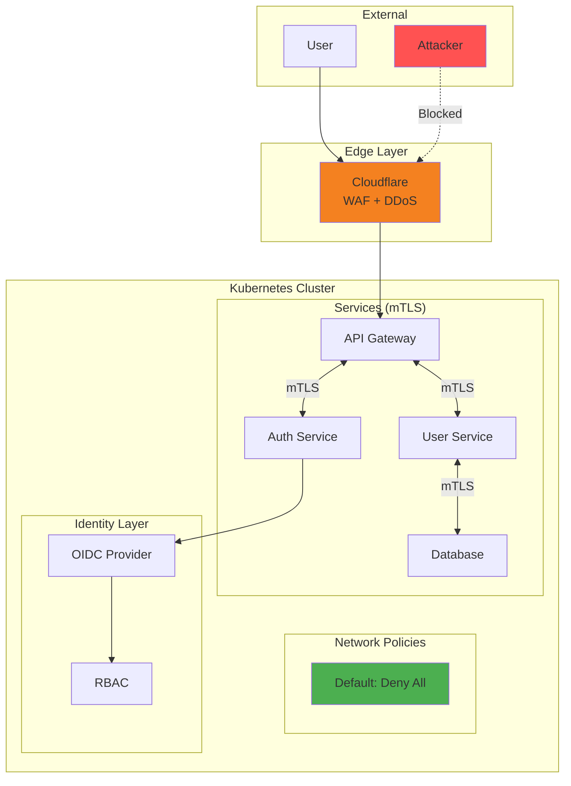
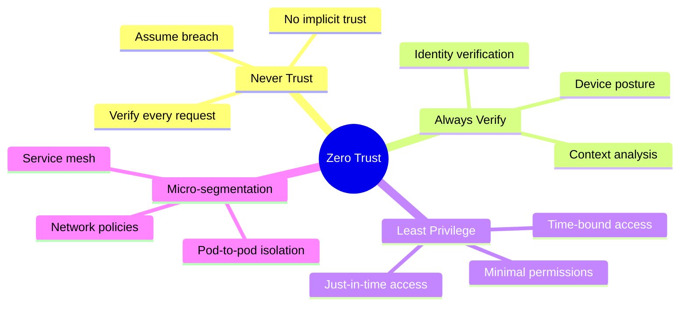
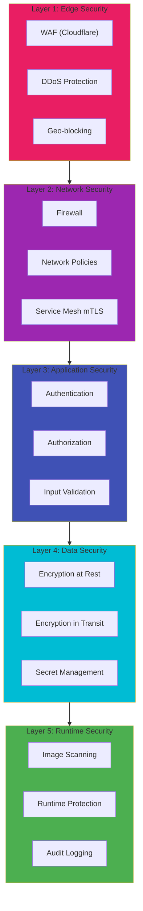
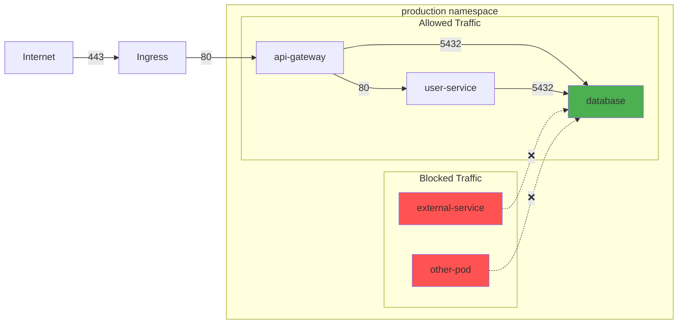
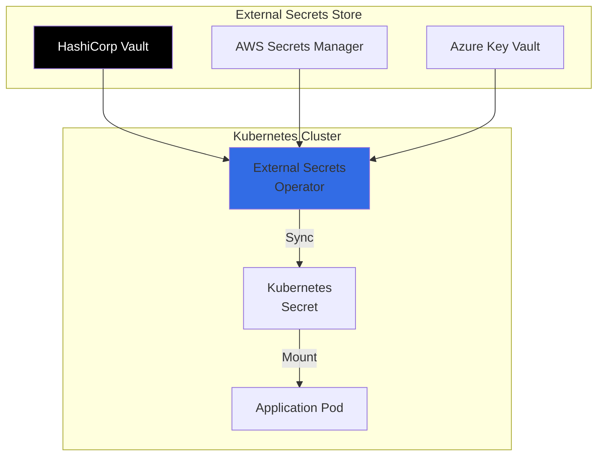
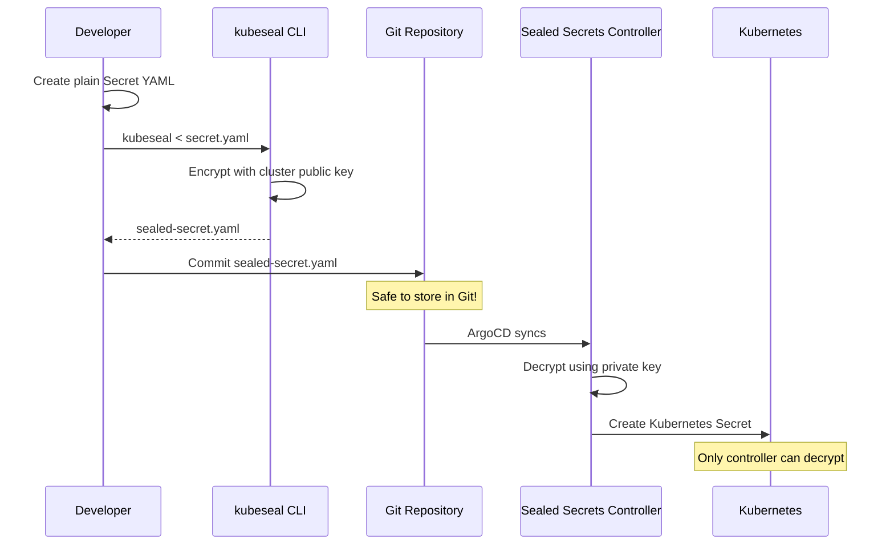
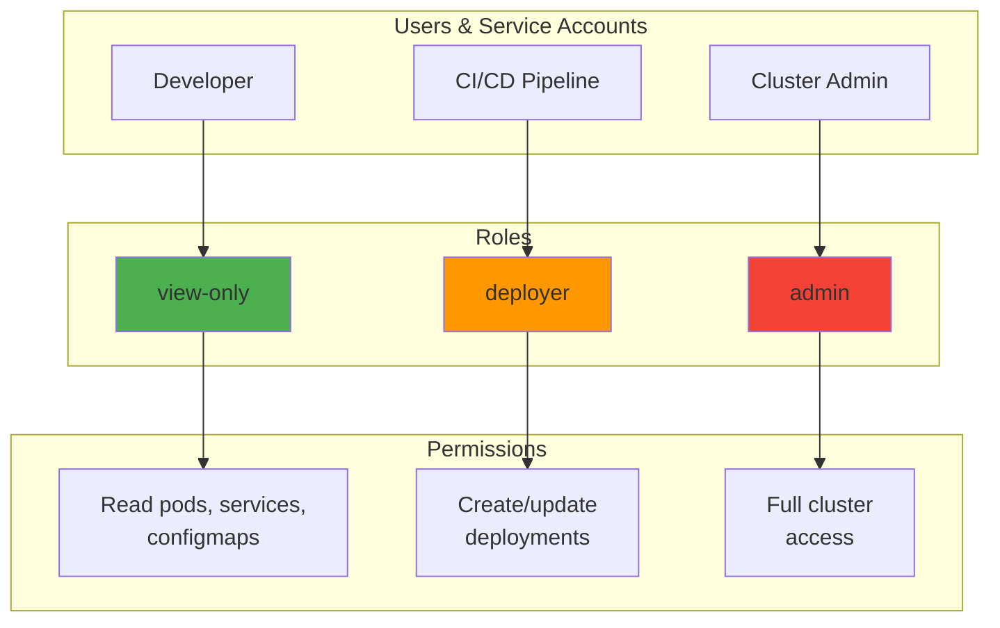
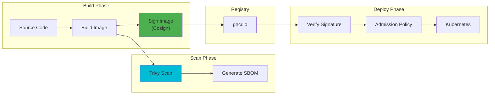
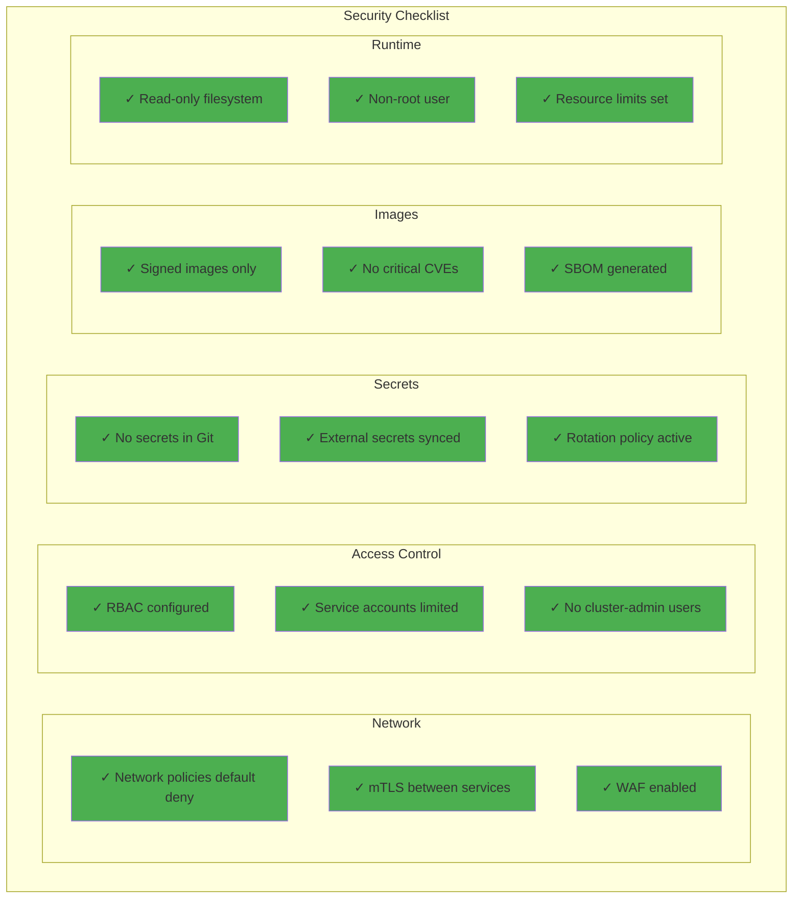

# Platform Security

> *"Security is always excessive until it's not enough."*
> — **Robbie Sinclair**

## Security-First Mindset

> *Security isn't a feature you add later. It's a design constraint that shapes every decision. A breach can end a startup overnight.*

---

## Zero-Trust Architecture



### Zero-Trust Principles



---

## Defense in Depth



---

## Network Policies

### Default Deny Policy

```yaml
# network-policies/default-deny.yaml

apiVersion: networking.k8s.io/v1
kind: NetworkPolicy
metadata:
  name: default-deny-all
  namespace: production
spec:
  podSelector: {}  # Applies to all pods
  policyTypes:
    - Ingress
    - Egress
  # No ingress/egress rules = deny all
```

### Allow Specific Traffic

```yaml
# network-policies/allow-api-to-db.yaml

apiVersion: networking.k8s.io/v1
kind: NetworkPolicy
metadata:
  name: allow-api-to-database
  namespace: production
spec:
  podSelector:
    matchLabels:
      app: database
  policyTypes:
    - Ingress
  ingress:
    - from:
        - podSelector:
            matchLabels:
              app: api-gateway
      ports:
        - protocol: TCP
          port: 5432
```

### Network Policy Flow



### Complete Network Policy Example

```yaml
# network-policies/api-gateway.yaml

apiVersion: networking.k8s.io/v1
kind: NetworkPolicy
metadata:
  name: api-gateway-policy
  namespace: production
spec:
  podSelector:
    matchLabels:
      app: api-gateway
  policyTypes:
    - Ingress
    - Egress

  ingress:
    # Allow from ingress controller
    - from:
        - namespaceSelector:
            matchLabels:
              name: ingress-nginx
          podSelector:
            matchLabels:
              app.kubernetes.io/name: ingress-nginx
      ports:
        - protocol: TCP
          port: 8080

  egress:
    # Allow to auth service
    - to:
        - podSelector:
            matchLabels:
              app: auth-service
      ports:
        - protocol: TCP
          port: 8080

    # Allow to user service
    - to:
        - podSelector:
            matchLabels:
              app: user-service
      ports:
        - protocol: TCP
          port: 8080

    # Allow DNS
    - to:
        - namespaceSelector: {}
          podSelector:
            matchLabels:
              k8s-app: kube-dns
      ports:
        - protocol: UDP
          port: 53
```

---

## Secrets Management

### Secret Hierarchy



### External Secrets Operator

```yaml
# external-secrets/secret-store.yaml

apiVersion: external-secrets.io/v1beta1
kind: SecretStore
metadata:
  name: vault-backend
  namespace: production
spec:
  provider:
    vault:
      server: "https://vault.example.com"
      path: "secret"
      version: "v2"
      auth:
        kubernetes:
          mountPath: "kubernetes"
          role: "production-role"
          serviceAccountRef:
            name: "vault-auth"

---
# external-secrets/database-credentials.yaml

apiVersion: external-secrets.io/v1beta1
kind: ExternalSecret
metadata:
  name: database-credentials
  namespace: production
spec:
  refreshInterval: 1h
  secretStoreRef:
    name: vault-backend
    kind: SecretStore
  target:
    name: database-credentials
    creationPolicy: Owner
  data:
    - secretKey: username
      remoteRef:
        key: production/database
        property: username
    - secretKey: password
      remoteRef:
        key: production/database
        property: password
```

### Sealed Secrets for GitOps



```bash
# Create sealed secret
kubectl create secret generic my-secret \
  --from-literal=api-key=supersecret \
  --dry-run=client -o yaml | \
  kubeseal --format yaml > sealed-secret.yaml

# Apply sealed secret
kubectl apply -f sealed-secret.yaml
```

```yaml
# sealed-secrets/database.yaml

apiVersion: bitnami.com/v1alpha1
kind: SealedSecret
metadata:
  name: database-credentials
  namespace: production
spec:
  encryptedData:
    username: AgBy3i4O...encrypted...
    password: AgBy3i4O...encrypted...
  template:
    type: Opaque
    metadata:
      name: database-credentials
      namespace: production
```

---

## RBAC Configuration

### Role-Based Access Control



### Developer Role

```yaml
# rbac/developer-role.yaml

apiVersion: rbac.authorization.k8s.io/v1
kind: Role
metadata:
  name: developer
  namespace: development
rules:
  # Read-only for most resources
  - apiGroups: [""]
    resources: ["pods", "services", "configmaps", "secrets"]
    verbs: ["get", "list", "watch"]

  - apiGroups: ["apps"]
    resources: ["deployments", "replicasets"]
    verbs: ["get", "list", "watch"]

  # Can view logs
  - apiGroups: [""]
    resources: ["pods/log"]
    verbs: ["get"]

  # Can exec into pods (for debugging)
  - apiGroups: [""]
    resources: ["pods/exec"]
    verbs: ["create"]

---
apiVersion: rbac.authorization.k8s.io/v1
kind: RoleBinding
metadata:
  name: developer-binding
  namespace: development
subjects:
  - kind: Group
    name: developers
    apiGroup: rbac.authorization.k8s.io
roleRef:
  kind: Role
  name: developer
  apiGroup: rbac.authorization.k8s.io
```

### CI/CD Service Account

```yaml
# rbac/cicd-role.yaml

apiVersion: v1
kind: ServiceAccount
metadata:
  name: cicd-deployer
  namespace: production

---
apiVersion: rbac.authorization.k8s.io/v1
kind: Role
metadata:
  name: deployer
  namespace: production
rules:
  - apiGroups: ["apps"]
    resources: ["deployments"]
    verbs: ["get", "list", "watch", "create", "update", "patch"]

  - apiGroups: [""]
    resources: ["services", "configmaps"]
    verbs: ["get", "list", "watch", "create", "update", "patch"]

  # Cannot access secrets directly
  # Cannot delete resources

---
apiVersion: rbac.authorization.k8s.io/v1
kind: RoleBinding
metadata:
  name: deployer-binding
  namespace: production
subjects:
  - kind: ServiceAccount
    name: cicd-deployer
    namespace: production
roleRef:
  kind: Role
  name: deployer
  apiGroup: rbac.authorization.k8s.io
```

---

## Image Security

### Supply Chain Security



### Trivy Scanning

```yaml
# .github/workflows/security-scan.yaml

name: Security Scan
on:
  push:
    branches: [main]
  pull_request:

jobs:
  trivy:
    runs-on: ubuntu-latest
    steps:
      - uses: actions/checkout@v4

      - name: Build image
        run: docker build -t myapp:${{ github.sha }} .

      - name: Trivy vulnerability scan
        uses: aquasecurity/trivy-action@master
        with:
          image-ref: myapp:${{ github.sha }}
          format: 'sarif'
          output: 'trivy-results.sarif'
          severity: 'CRITICAL,HIGH'
          exit-code: '1'  # Fail on critical/high

      - name: Upload Trivy scan results
        uses: github/codeql-action/upload-sarif@v2
        with:
          sarif_file: 'trivy-results.sarif'
```

### Image Signing with Cosign

```bash
# Generate key pair
cosign generate-key-pair

# Sign image
cosign sign --key cosign.key ghcr.io/org/app:v1.0.0

# Verify image
cosign verify --key cosign.pub ghcr.io/org/app:v1.0.0
```

### Admission Controller Policy

```yaml
# policies/require-signed-images.yaml

apiVersion: kyverno.io/v1
kind: ClusterPolicy
metadata:
  name: require-signed-images
spec:
  validationFailureAction: Enforce
  background: true
  rules:
    - name: verify-signature
      match:
        any:
          - resources:
              kinds:
                - Pod
      verifyImages:
        - imageReferences:
            - "ghcr.io/org/*"
          attestors:
            - entries:
                - keys:
                    publicKeys: |-
                      -----BEGIN PUBLIC KEY-----
                      MFkwEwYHKoZI...
                      -----END PUBLIC KEY-----
```

---

## Pod Security Standards

### Restricted Security Context

```yaml
# deployments/secure-app.yaml

apiVersion: apps/v1
kind: Deployment
metadata:
  name: secure-app
spec:
  template:
    spec:
      securityContext:
        runAsNonRoot: true
        runAsUser: 1000
        runAsGroup: 1000
        fsGroup: 1000
        seccompProfile:
          type: RuntimeDefault

      containers:
        - name: app
          image: ghcr.io/org/app:v1.0.0
          securityContext:
            allowPrivilegeEscalation: false
            readOnlyRootFilesystem: true
            capabilities:
              drop:
                - ALL
          resources:
            limits:
              memory: "256Mi"
              cpu: "500m"
            requests:
              memory: "128Mi"
              cpu: "100m"
          volumeMounts:
            - name: tmp
              mountPath: /tmp

      volumes:
        - name: tmp
          emptyDir: {}
```

### Pod Security Admission

```yaml
# namespaces/production.yaml

apiVersion: v1
kind: Namespace
metadata:
  name: production
  labels:
    pod-security.kubernetes.io/enforce: restricted
    pod-security.kubernetes.io/enforce-version: latest
    pod-security.kubernetes.io/warn: restricted
    pod-security.kubernetes.io/warn-version: latest
    pod-security.kubernetes.io/audit: restricted
    pod-security.kubernetes.io/audit-version: latest
```

---

## Security Checklist



---

## Related

- [Architecture](../02-Engineering/01-Architecture.md)
- [Networking](./04-Networking.md)
- [GitOps](../02-Engineering/05-GitOps.md)

---

*Last Updated: 2026-02-02*
