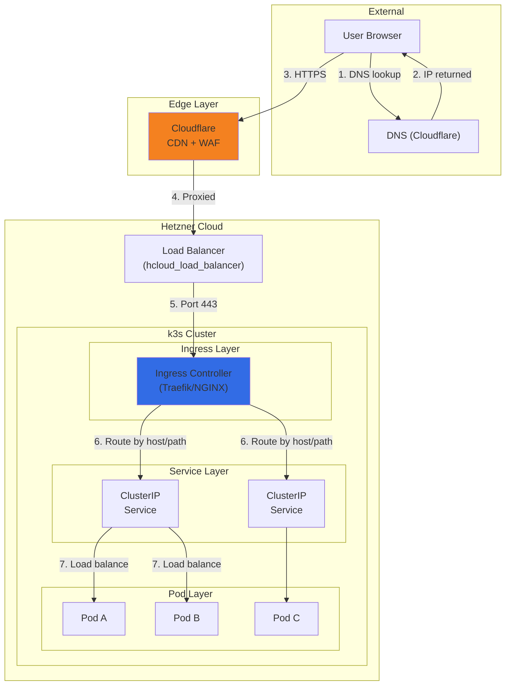
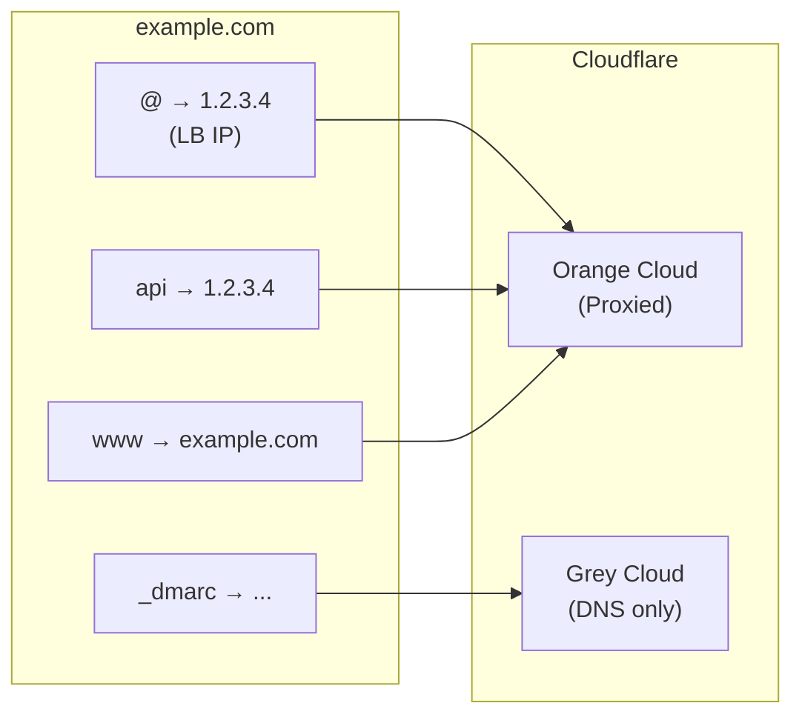
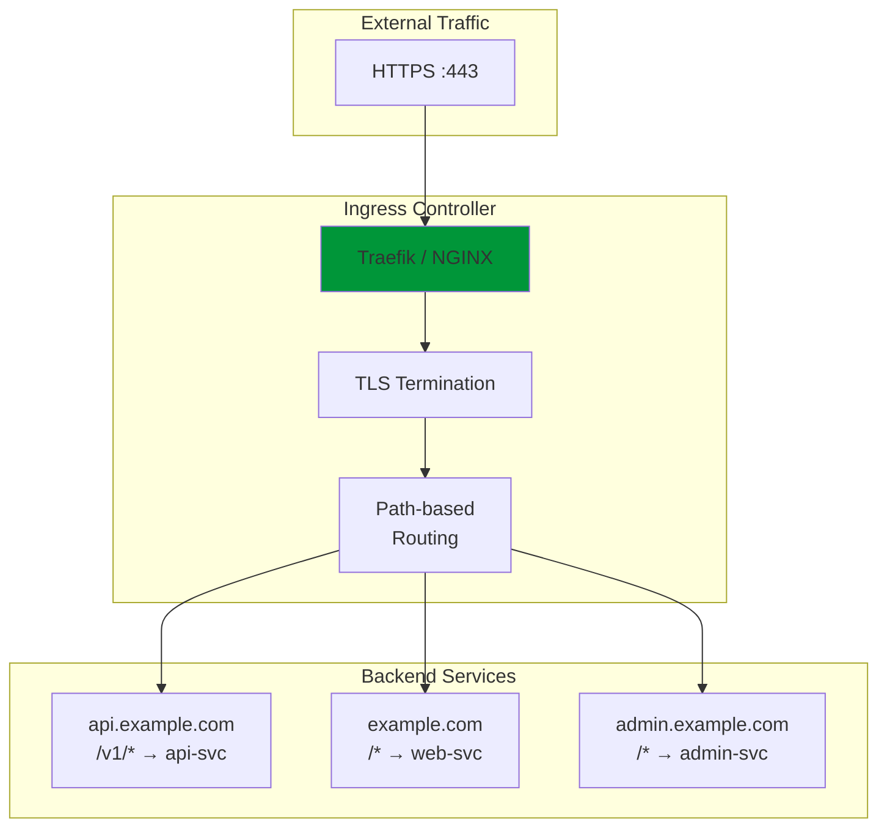
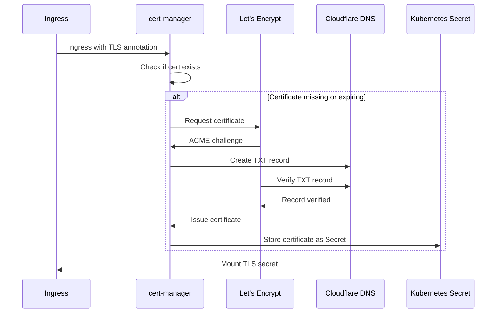
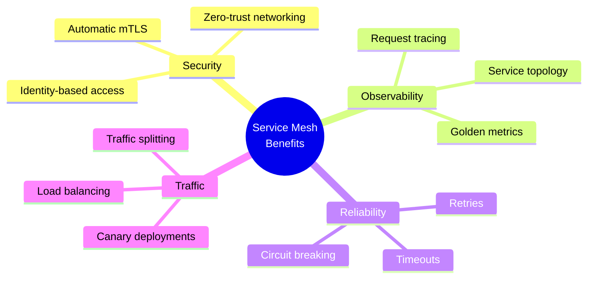
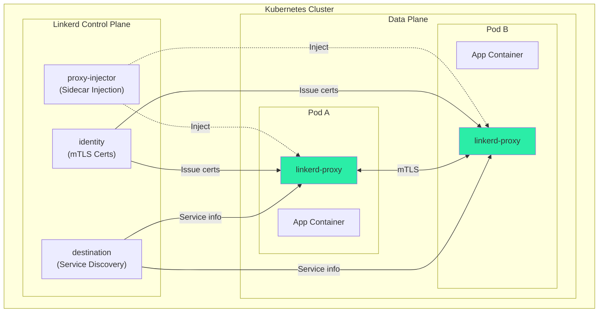
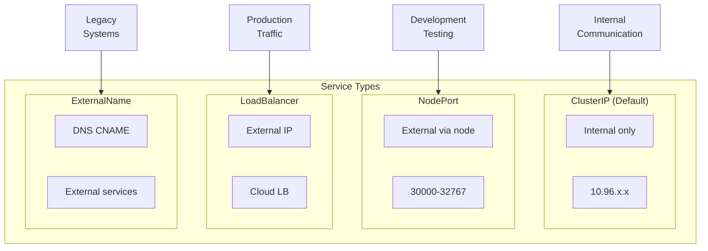
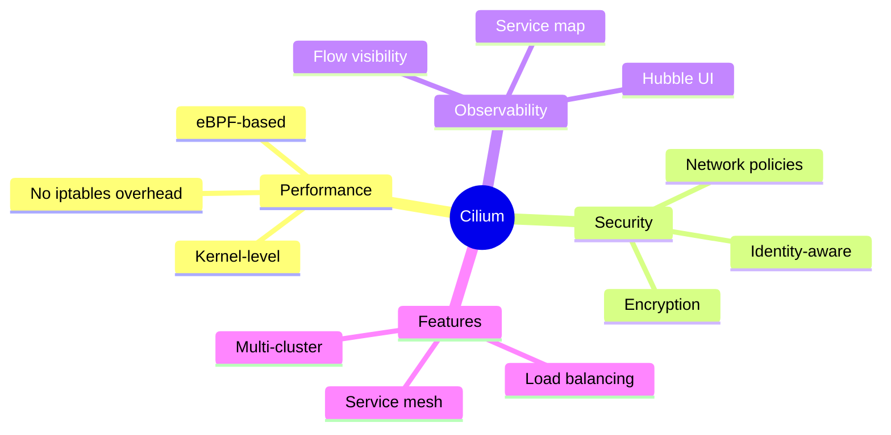
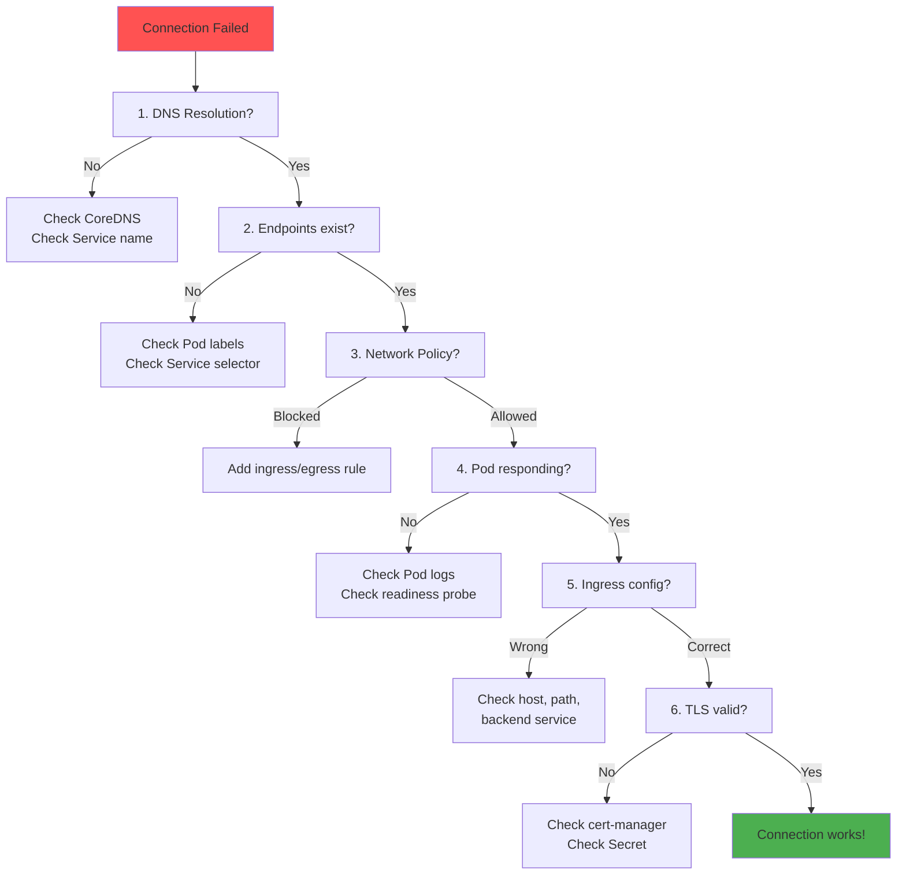

# Platform Networking

## Networking Layers

> *Every packet tells a story. Understanding how traffic flows from user to pod—and back—is the foundation of reliable, secure infrastructure.*

---

## Traffic Flow Overview



---

## DNS Configuration

### Cloudflare DNS Setup



### DNS Records

| Type | Name | Value | Proxy | Purpose |
|------|------|-------|-------|---------|
| **A** | @ | LB IP | Yes | Root domain |
| **A** | api | LB IP | Yes | API subdomain |
| **A** | grafana | LB IP | Yes | Monitoring |
| **CNAME** | www | example.com | Yes | WWW redirect |
| **CNAME** | *.dev | dev-lb.example.com | No | Dev wildcard |
| **TXT** | @ | v=spf1... | No | Email SPF |

### External DNS Operator

```yaml
# external-dns/deployment.yaml

apiVersion: apps/v1
kind: Deployment
metadata:
  name: external-dns
  namespace: kube-system
spec:
  template:
    spec:
      containers:
        - name: external-dns
          image: registry.k8s.io/external-dns/external-dns:v0.14.0
          args:
            - --source=ingress
            - --domain-filter=example.com
            - --provider=cloudflare
            - --cloudflare-proxied
          env:
            - name: CF_API_TOKEN
              valueFrom:
                secretKeyRef:
                  name: cloudflare-api-token
                  key: token
```

---

## Ingress Controller

### Ingress Architecture



### Ingress Resource

```yaml
# ingress/api-ingress.yaml

apiVersion: networking.k8s.io/v1
kind: Ingress
metadata:
  name: api-ingress
  namespace: production
  annotations:
    # TLS via cert-manager
    cert-manager.io/cluster-issuer: letsencrypt-prod
    # Rate limiting
    nginx.ingress.kubernetes.io/rate-limit: "100"
    nginx.ingress.kubernetes.io/rate-limit-window: "1m"
    # CORS
    nginx.ingress.kubernetes.io/enable-cors: "true"
    nginx.ingress.kubernetes.io/cors-allow-origin: "https://example.com"
spec:
  ingressClassName: nginx
  tls:
    - hosts:
        - api.example.com
      secretName: api-tls
  rules:
    - host: api.example.com
      http:
        paths:
          - path: /v1
            pathType: Prefix
            backend:
              service:
                name: api-gateway
                port:
                  number: 8080
          - path: /health
            pathType: Exact
            backend:
              service:
                name: api-gateway
                port:
                  number: 8080
```

### Multiple Ingresses Example

```yaml
# ingress/full-ingress.yaml

apiVersion: networking.k8s.io/v1
kind: Ingress
metadata:
  name: main-ingress
  annotations:
    cert-manager.io/cluster-issuer: letsencrypt-prod
spec:
  ingressClassName: nginx
  tls:
    - hosts:
        - example.com
        - www.example.com
        - api.example.com
        - grafana.example.com
      secretName: main-tls
  rules:
    # Main website
    - host: example.com
      http:
        paths:
          - path: /
            pathType: Prefix
            backend:
              service:
                name: web-frontend
                port:
                  number: 80

    # WWW redirect handled by web-frontend
    - host: www.example.com
      http:
        paths:
          - path: /
            pathType: Prefix
            backend:
              service:
                name: web-frontend
                port:
                  number: 80

    # API
    - host: api.example.com
      http:
        paths:
          - path: /
            pathType: Prefix
            backend:
              service:
                name: api-gateway
                port:
                  number: 8080

    # Monitoring (with basic auth)
    - host: grafana.example.com
      http:
        paths:
          - path: /
            pathType: Prefix
            backend:
              service:
                name: grafana
                port:
                  number: 3000
```

---

## Certificate Management

### Cert-Manager Architecture



### Cert-Manager Configuration

```yaml
# cert-manager/cluster-issuer.yaml

apiVersion: cert-manager.io/v1
kind: ClusterIssuer
metadata:
  name: letsencrypt-prod
spec:
  acme:
    email: admin@example.com
    server: https://acme-v02.api.letsencrypt.org/directory
    privateKeySecretRef:
      name: letsencrypt-prod-key
    solvers:
      # DNS challenge (required for wildcard)
      - dns01:
          cloudflare:
            email: admin@example.com
            apiTokenSecretRef:
              name: cloudflare-api-token
              key: token
        selector:
          dnsZones:
            - "example.com"

---
# Staging issuer for testing
apiVersion: cert-manager.io/v1
kind: ClusterIssuer
metadata:
  name: letsencrypt-staging
spec:
  acme:
    email: admin@example.com
    server: https://acme-staging-v02.api.letsencrypt.org/directory
    privateKeySecretRef:
      name: letsencrypt-staging-key
    solvers:
      - http01:
          ingress:
            class: nginx
```

### Wildcard Certificate

```yaml
# cert-manager/wildcard-cert.yaml

apiVersion: cert-manager.io/v1
kind: Certificate
metadata:
  name: wildcard-cert
  namespace: production
spec:
  secretName: wildcard-tls
  issuerRef:
    name: letsencrypt-prod
    kind: ClusterIssuer
  commonName: "*.example.com"
  dnsNames:
    - "example.com"
    - "*.example.com"
```

---

## Service Mesh (Linkerd)

### Why Service Mesh?



### Linkerd Architecture



### Linkerd Installation

```bash
# Install Linkerd CLI
curl -sL run.linkerd.io/install | sh

# Validate cluster
linkerd check --pre

# Install CRDs
linkerd install --crds | kubectl apply -f -

# Install control plane
linkerd install | kubectl apply -f -

# Verify installation
linkerd check

# Install viz extension (dashboards)
linkerd viz install | kubectl apply -f -
```

### Meshed Deployment

```yaml
# deployments/meshed-app.yaml

apiVersion: apps/v1
kind: Deployment
metadata:
  name: api-gateway
  annotations:
    linkerd.io/inject: enabled  # Enable sidecar injection
spec:
  template:
    metadata:
      annotations:
        linkerd.io/inject: enabled
    spec:
      containers:
        - name: api
          image: ghcr.io/org/api:v1.0.0
          ports:
            - containerPort: 8080
```

### Service Profiles

```yaml
# service-profiles/api-profile.yaml

apiVersion: linkerd.io/v1alpha2
kind: ServiceProfile
metadata:
  name: api-gateway.production.svc.cluster.local
  namespace: production
spec:
  routes:
    - name: GET /v1/users/{id}
      condition:
        method: GET
        pathRegex: /v1/users/[^/]+
      timeout: 5s
      retryBudget:
        retryRatio: 0.2
        minRetriesPerSecond: 10
        ttl: 10s

    - name: POST /v1/orders
      condition:
        method: POST
        pathRegex: /v1/orders
      timeout: 30s
      # No retries for mutations
```

---

## Load Balancing Strategies

### Kubernetes Service Types



### Service Configuration

```yaml
# services/api-service.yaml

apiVersion: v1
kind: Service
metadata:
  name: api-gateway
  namespace: production
  annotations:
    # Sticky sessions (if needed)
    service.kubernetes.io/session-affinity-config: |
      clientIP:
        timeoutSeconds: 3600
spec:
  type: ClusterIP
  selector:
    app: api-gateway
  ports:
    - name: http
      port: 8080
      targetPort: 8080
      protocol: TCP
  # Session affinity (optional)
  sessionAffinity: ClientIP
```

### Hetzner Load Balancer

```yaml
# services/external-lb.yaml

apiVersion: v1
kind: Service
metadata:
  name: ingress-nginx
  namespace: ingress-nginx
  annotations:
    # Hetzner-specific annotations
    load-balancer.hetzner.cloud/name: "k3s-lb"
    load-balancer.hetzner.cloud/location: "fsn1"
    load-balancer.hetzner.cloud/use-private-ip: "true"
    load-balancer.hetzner.cloud/health-check-interval: "5s"
    load-balancer.hetzner.cloud/health-check-timeout: "3s"
spec:
  type: LoadBalancer
  selector:
    app.kubernetes.io/name: ingress-nginx
  ports:
    - name: http
      port: 80
      targetPort: 80
    - name: https
      port: 443
      targetPort: 443
```

---

## CNI: Cilium

### Why Cilium?



### Cilium Installation

```bash
# Install Cilium CLI
curl -L --remote-name-all https://github.com/cilium/cilium-cli/releases/latest/download/cilium-linux-amd64.tar.gz
tar xzvfC cilium-linux-amd64.tar.gz /usr/local/bin
rm cilium-linux-amd64.tar.gz

# Install Cilium on k3s (disable default CNI first)
cilium install --version 1.15.0

# Enable Hubble
cilium hubble enable --ui

# Verify
cilium status
```

### Cilium Network Policy

```yaml
# cilium-policies/api-policy.yaml

apiVersion: cilium.io/v2
kind: CiliumNetworkPolicy
metadata:
  name: api-gateway-policy
  namespace: production
spec:
  endpointSelector:
    matchLabels:
      app: api-gateway
  ingress:
    - fromEndpoints:
        - matchLabels:
            app.kubernetes.io/name: ingress-nginx
      toPorts:
        - ports:
            - port: "8080"
              protocol: TCP
  egress:
    - toEndpoints:
        - matchLabels:
            app: auth-service
      toPorts:
        - ports:
            - port: "8080"
    - toEndpoints:
        - matchLabels:
            app: user-service
      toPorts:
        - ports:
            - port: "8080"
    # Allow DNS
    - toEndpoints:
        - matchLabels:
            io.kubernetes.pod.namespace: kube-system
            k8s-app: kube-dns
      toPorts:
        - ports:
            - port: "53"
              protocol: UDP
```

---

## Network Debugging

### Debugging Commands

```bash
# Check DNS resolution
kubectl run -it --rm debug --image=busybox -- nslookup api-gateway.production.svc.cluster.local

# Test connectivity
kubectl run -it --rm debug --image=curlimages/curl -- curl http://api-gateway.production.svc.cluster.local:8080/health

# Check endpoints
kubectl get endpoints api-gateway -n production

# Trace packet flow (Cilium)
hubble observe --namespace production --follow

# Check network policies
kubectl get networkpolicies -A
kubectl describe networkpolicy api-gateway-policy -n production

# Ingress controller logs
kubectl logs -n ingress-nginx deployment/ingress-nginx-controller -f
```

### Network Troubleshooting Flow



---

## Related

- [Security](./03-Security.md)
- [Container Orchestration](../02-Engineering/04-Container-Orchestration.md)
- [Cloud Platforms](./01-Cloud-Platforms.md)

---

*Last Updated: 2026-02-02*
