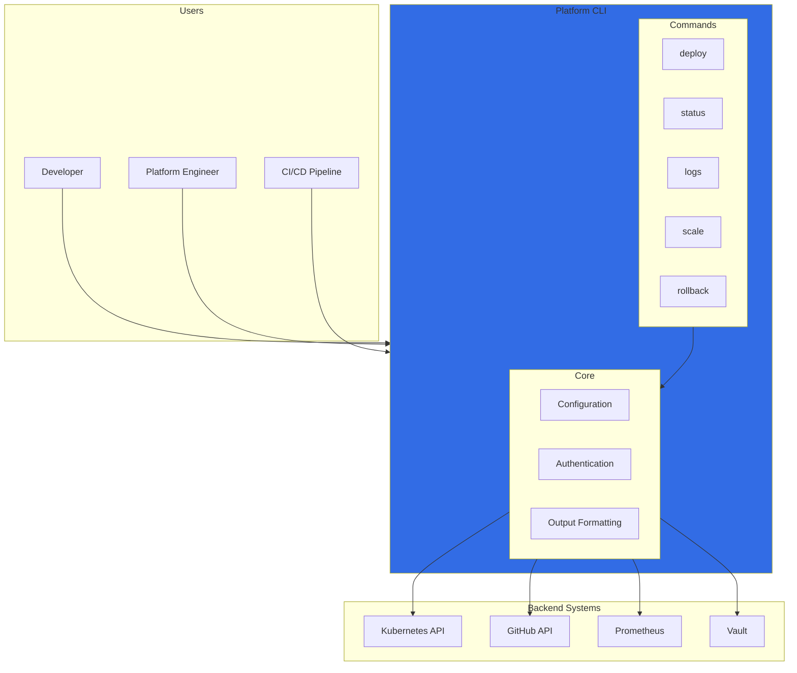
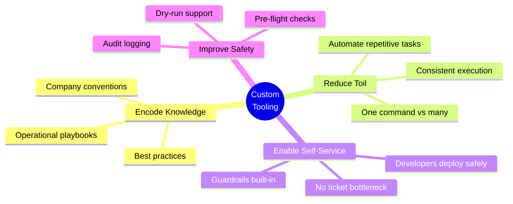
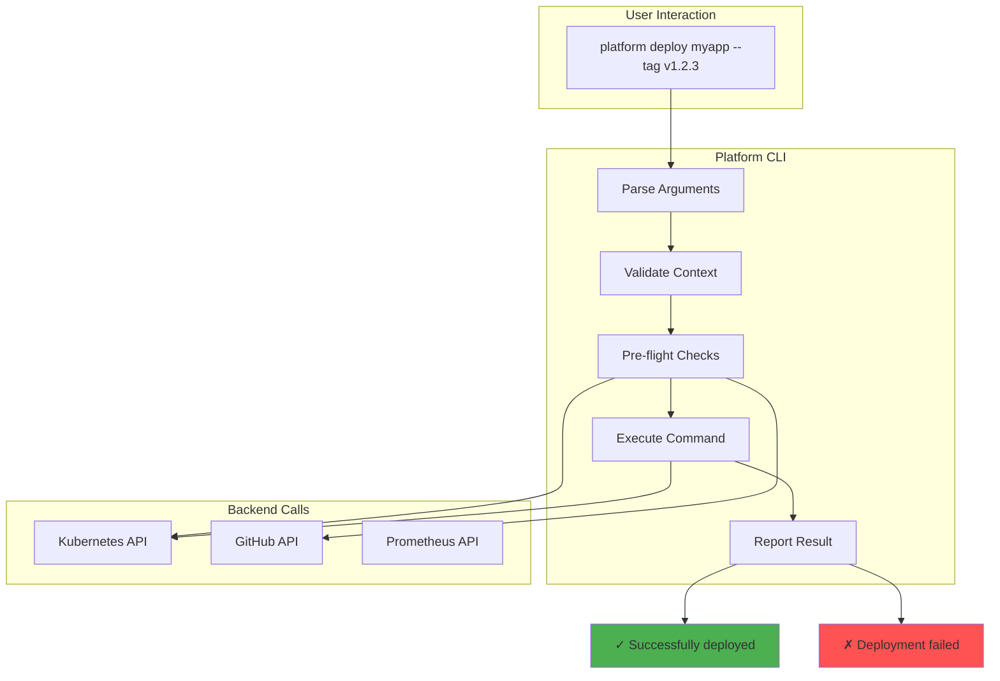

# Custom Tooling

## Platform CLI Philosophy

> *The best infrastructure is invisible to developers. Custom tools encode operational knowledge into reusable commands, turning tribal knowledge into self-service capabilities.*

---

## Tool Architecture



---

## Why Custom Tools?



### Before vs After

| Task | Before (Manual) | After (CLI) |
|------|-----------------|-------------|
| **Deploy app** | 12 kubectl commands | `platform deploy myapp` |
| **Check status** | kubectl + Grafana + Loki | `platform status myapp` |
| **View logs** | Find pod name, kubectl logs | `platform logs myapp` |
| **Scale service** | Edit manifest, apply, wait | `platform scale myapp 5` |
| **Rollback** | Find old version, edit, apply | `platform rollback myapp` |

---

## Python CLI with Typer

### Project Structure

```
platform-cli/
├── pyproject.toml
├── src/
│   └── platform_cli/
│       ├── __init__.py
│       ├── __main__.py
│       ├── cli.py              # Main CLI entry
│       ├── commands/
│       │   ├── __init__.py
│       │   ├── deploy.py
│       │   ├── status.py
│       │   ├── logs.py
│       │   ├── scale.py
│       │   └── rollback.py
│       ├── core/
│       │   ├── __init__.py
│       │   ├── config.py
│       │   ├── kubernetes.py
│       │   ├── github.py
│       │   └── output.py
│       └── models/
│           ├── __init__.py
│           └── app.py
└── tests/
    └── ...
```

### Main CLI Entry

```python
# src/platform_cli/cli.py

import typer
from rich.console import Console

from platform_cli.commands import deploy, status, logs, scale, rollback

app = typer.Typer(
    name="platform",
    help="Platform engineering CLI for managing deployments",
    add_completion=True,
)
console = Console()

# Register subcommands
app.add_typer(deploy.app, name="deploy")
app.add_typer(status.app, name="status")
app.add_typer(logs.app, name="logs")
app.add_typer(scale.app, name="scale")
app.add_typer(rollback.app, name="rollback")


@app.callback()
def main(
    ctx: typer.Context,
    verbose: bool = typer.Option(False, "--verbose", "-v", help="Verbose output"),
    namespace: str = typer.Option("production", "--namespace", "-n", help="Kubernetes namespace"),
):
    """Platform CLI - Self-service infrastructure management."""
    ctx.ensure_object(dict)
    ctx.obj["verbose"] = verbose
    ctx.obj["namespace"] = namespace


if __name__ == "__main__":
    app()
```

### Deploy Command

```python
# src/platform_cli/commands/deploy.py

import typer
from rich.console import Console
from rich.progress import Progress, SpinnerColumn, TextColumn
from rich.table import Table

from platform_cli.core.kubernetes import KubernetesClient
from platform_cli.core.github import GitHubClient
from platform_cli.core.output import success, error, warning, info

app = typer.Typer(help="Deploy applications")
console = Console()


@app.command("app")
def deploy_app(
    ctx: typer.Context,
    app_name: str = typer.Argument(..., help="Application name"),
    image_tag: str = typer.Option(None, "--tag", "-t", help="Image tag to deploy"),
    dry_run: bool = typer.Option(False, "--dry-run", help="Preview changes without applying"),
    wait: bool = typer.Option(True, "--wait/--no-wait", help="Wait for rollout completion"),
):
    """Deploy an application to the cluster."""
    namespace = ctx.obj["namespace"]
    verbose = ctx.obj["verbose"]

    k8s = KubernetesClient(namespace=namespace)
    gh = GitHubClient()

    # Pre-flight checks
    info(f"Deploying [bold]{app_name}[/bold] to [bold]{namespace}[/bold]")

    with Progress(
        SpinnerColumn(),
        TextColumn("[progress.description]{task.description}"),
        console=console,
    ) as progress:

        # 1. Check deployment exists
        task = progress.add_task("Checking deployment exists...", total=None)
        deployment = k8s.get_deployment(app_name)
        if not deployment:
            error(f"Deployment '{app_name}' not found in namespace '{namespace}'")
            raise typer.Exit(1)
        progress.update(task, completed=True)

        # 2. Get current image
        task = progress.add_task("Getting current image...", total=None)
        current_image = k8s.get_deployment_image(app_name)
        progress.update(task, completed=True)

        # 3. Determine target image
        if image_tag:
            target_image = f"ghcr.io/org/{app_name}:{image_tag}"
        else:
            # Get latest from GitHub
            task = progress.add_task("Fetching latest image tag...", total=None)
            target_image = gh.get_latest_image(app_name)
            progress.update(task, completed=True)

        # Show diff
        console.print()
        table = Table(title="Deployment Plan")
        table.add_column("Property", style="cyan")
        table.add_column("Current", style="yellow")
        table.add_column("Target", style="green")
        table.add_row("Image", current_image, target_image)
        table.add_row("Namespace", namespace, namespace)
        console.print(table)
        console.print()

        if dry_run:
            warning("Dry run mode - no changes applied")
            return

        # 4. Apply deployment
        task = progress.add_task("Updating deployment...", total=None)
        k8s.update_deployment_image(app_name, target_image)
        progress.update(task, completed=True)

        # 5. Wait for rollout
        if wait:
            task = progress.add_task("Waiting for rollout...", total=None)
            success_flag = k8s.wait_for_rollout(app_name, timeout=300)
            progress.update(task, completed=True)

            if not success_flag:
                error("Rollout failed or timed out")
                warning("Consider running: platform rollback {app_name}")
                raise typer.Exit(1)

    success(f"Successfully deployed {app_name} to {namespace}")


@app.command("list")
def list_deployments(
    ctx: typer.Context,
):
    """List all deployments in the namespace."""
    namespace = ctx.obj["namespace"]
    k8s = KubernetesClient(namespace=namespace)

    deployments = k8s.list_deployments()

    table = Table(title=f"Deployments in {namespace}")
    table.add_column("Name", style="cyan")
    table.add_column("Ready", style="green")
    table.add_column("Image", style="yellow")
    table.add_column("Age", style="magenta")

    for dep in deployments:
        table.add_row(
            dep["name"],
            f"{dep['ready']}/{dep['replicas']}",
            dep["image"],
            dep["age"],
        )

    console.print(table)
```

### Kubernetes Client

```python
# src/platform_cli/core/kubernetes.py

from kubernetes import client, config
from kubernetes.client.rest import ApiException
from datetime import datetime, timezone
from typing import Optional, Dict, List


class KubernetesClient:
    """Kubernetes API client wrapper."""

    def __init__(self, namespace: str = "default"):
        try:
            config.load_kube_config()
        except config.ConfigException:
            config.load_incluster_config()

        self.namespace = namespace
        self.apps_v1 = client.AppsV1Api()
        self.core_v1 = client.CoreV1Api()

    def get_deployment(self, name: str) -> Optional[Dict]:
        """Get deployment by name."""
        try:
            dep = self.apps_v1.read_namespaced_deployment(name, self.namespace)
            return {
                "name": dep.metadata.name,
                "replicas": dep.spec.replicas,
                "ready": dep.status.ready_replicas or 0,
                "image": dep.spec.template.spec.containers[0].image,
            }
        except ApiException as e:
            if e.status == 404:
                return None
            raise

    def get_deployment_image(self, name: str) -> str:
        """Get current image for deployment."""
        dep = self.apps_v1.read_namespaced_deployment(name, self.namespace)
        return dep.spec.template.spec.containers[0].image

    def update_deployment_image(self, name: str, image: str) -> None:
        """Update deployment image."""
        patch = {
            "spec": {
                "template": {
                    "spec": {
                        "containers": [{"name": name, "image": image}]
                    }
                }
            }
        }
        self.apps_v1.patch_namespaced_deployment(name, self.namespace, patch)

    def wait_for_rollout(self, name: str, timeout: int = 300) -> bool:
        """Wait for deployment rollout to complete."""
        import time

        start = time.time()
        while time.time() - start < timeout:
            dep = self.apps_v1.read_namespaced_deployment(name, self.namespace)
            if (
                dep.status.updated_replicas == dep.spec.replicas
                and dep.status.ready_replicas == dep.spec.replicas
                and dep.status.available_replicas == dep.spec.replicas
            ):
                return True
            time.sleep(2)
        return False

    def list_deployments(self) -> List[Dict]:
        """List all deployments in namespace."""
        deps = self.apps_v1.list_namespaced_deployment(self.namespace)
        result = []
        for dep in deps.items:
            age = datetime.now(timezone.utc) - dep.metadata.creation_timestamp
            result.append({
                "name": dep.metadata.name,
                "replicas": dep.spec.replicas,
                "ready": dep.status.ready_replicas or 0,
                "image": dep.spec.template.spec.containers[0].image,
                "age": f"{age.days}d" if age.days > 0 else f"{age.seconds // 3600}h",
            })
        return result

    def get_pods(self, app_name: str) -> List[Dict]:
        """Get pods for an application."""
        pods = self.core_v1.list_namespaced_pod(
            self.namespace,
            label_selector=f"app={app_name}"
        )
        return [
            {
                "name": pod.metadata.name,
                "status": pod.status.phase,
                "ready": all(c.ready for c in (pod.status.container_statuses or [])),
                "restarts": sum(c.restart_count for c in (pod.status.container_statuses or [])),
            }
            for pod in pods.items
        ]
```

### Output Helpers

```python
# src/platform_cli/core/output.py

from rich.console import Console
from rich.panel import Panel
from rich.text import Text

console = Console()


def success(message: str) -> None:
    """Print success message."""
    console.print(f"[bold green]✓[/bold green] {message}")


def error(message: str) -> None:
    """Print error message."""
    console.print(f"[bold red]✗[/bold red] {message}")


def warning(message: str) -> None:
    """Print warning message."""
    console.print(f"[bold yellow]⚠[/bold yellow] {message}")


def info(message: str) -> None:
    """Print info message."""
    console.print(f"[bold blue]ℹ[/bold blue] {message}")


def banner(title: str, content: str) -> None:
    """Print a banner panel."""
    console.print(Panel(content, title=title, border_style="blue"))
```

---

## Status Command

```python
# src/platform_cli/commands/status.py

import typer
from rich.console import Console
from rich.table import Table
from rich.panel import Panel
from rich.layout import Layout
from rich.live import Live

from platform_cli.core.kubernetes import KubernetesClient
from platform_cli.core.prometheus import PrometheusClient
from platform_cli.core.output import success, error, warning

app = typer.Typer(help="Check application status")
console = Console()


@app.command("app")
def status_app(
    ctx: typer.Context,
    app_name: str = typer.Argument(..., help="Application name"),
    watch: bool = typer.Option(False, "--watch", "-w", help="Watch for changes"),
):
    """Get comprehensive status of an application."""
    namespace = ctx.obj["namespace"]
    k8s = KubernetesClient(namespace=namespace)
    prom = PrometheusClient()

    def render_status():
        # Get deployment info
        deployment = k8s.get_deployment(app_name)
        if not deployment:
            error(f"Deployment '{app_name}' not found")
            raise typer.Exit(1)

        # Get pods
        pods = k8s.get_pods(app_name)

        # Get metrics
        metrics = prom.get_app_metrics(app_name, namespace)

        # Build status table
        status_table = Table(title="Deployment Status", show_header=False)
        status_table.add_column("Property", style="cyan")
        status_table.add_column("Value")

        health = "✓ Healthy" if deployment["ready"] == deployment["replicas"] else "✗ Degraded"
        health_style = "green" if "Healthy" in health else "red"

        status_table.add_row("Application", f"[bold]{app_name}[/bold]")
        status_table.add_row("Namespace", namespace)
        status_table.add_row("Replicas", f"{deployment['ready']}/{deployment['replicas']}")
        status_table.add_row("Health", f"[{health_style}]{health}[/{health_style}]")
        status_table.add_row("Image", deployment["image"])

        # Build pods table
        pods_table = Table(title="Pods")
        pods_table.add_column("Name", style="cyan")
        pods_table.add_column("Status")
        pods_table.add_column("Ready")
        pods_table.add_column("Restarts")

        for pod in pods:
            status_style = "green" if pod["status"] == "Running" else "yellow"
            ready_style = "green" if pod["ready"] else "red"
            restart_style = "red" if pod["restarts"] > 3 else "white"

            pods_table.add_row(
                pod["name"],
                f"[{status_style}]{pod['status']}[/{status_style}]",
                f"[{ready_style}]{'Yes' if pod['ready'] else 'No'}[/{ready_style}]",
                f"[{restart_style}]{pod['restarts']}[/{restart_style}]",
            )

        # Build metrics table
        metrics_table = Table(title="Metrics (5m)")
        metrics_table.add_column("Metric", style="cyan")
        metrics_table.add_column("Value")

        metrics_table.add_row("Request Rate", f"{metrics.get('request_rate', 'N/A')}/s")
        metrics_table.add_row("Error Rate", f"{metrics.get('error_rate', 'N/A')}%")
        metrics_table.add_row("p50 Latency", f"{metrics.get('p50_latency', 'N/A')}ms")
        metrics_table.add_row("p99 Latency", f"{metrics.get('p99_latency', 'N/A')}ms")
        metrics_table.add_row("CPU Usage", f"{metrics.get('cpu', 'N/A')}%")
        metrics_table.add_row("Memory Usage", f"{metrics.get('memory', 'N/A')}%")

        return Panel(
            f"{status_table}\n\n{pods_table}\n\n{metrics_table}",
            title=f"[bold]Status: {app_name}[/bold]",
            border_style="blue",
        )

    if watch:
        with Live(render_status(), refresh_per_second=1, console=console) as live:
            import time
            while True:
                time.sleep(2)
                live.update(render_status())
    else:
        console.print(render_status())
```

---

## Logs Command

```python
# src/platform_cli/commands/logs.py

import typer
from rich.console import Console
from rich.syntax import Syntax
import subprocess
import sys

from platform_cli.core.kubernetes import KubernetesClient

app = typer.Typer(help="View application logs")
console = Console()


@app.command("app")
def logs_app(
    ctx: typer.Context,
    app_name: str = typer.Argument(..., help="Application name"),
    follow: bool = typer.Option(False, "--follow", "-f", help="Follow logs"),
    tail: int = typer.Option(100, "--tail", "-t", help="Number of lines"),
    since: str = typer.Option("1h", "--since", "-s", help="Time duration (e.g., 1h, 30m)"),
    container: str = typer.Option(None, "--container", "-c", help="Container name"),
    all_pods: bool = typer.Option(False, "--all", "-a", help="Show logs from all pods"),
):
    """View logs for an application."""
    namespace = ctx.obj["namespace"]
    k8s = KubernetesClient(namespace=namespace)

    # Get pods
    pods = k8s.get_pods(app_name)
    if not pods:
        console.print(f"[red]No pods found for {app_name}[/red]")
        raise typer.Exit(1)

    if all_pods:
        # Use stern for multi-pod logs
        cmd = [
            "stern",
            app_name,
            f"--namespace={namespace}",
            f"--since={since}",
            f"--tail={tail}",
        ]
        if follow:
            cmd.append("--follow")
    else:
        # Single pod logs
        pod_name = pods[0]["name"]
        cmd = [
            "kubectl", "logs",
            pod_name,
            f"--namespace={namespace}",
            f"--since={since}",
            f"--tail={tail}",
        ]
        if follow:
            cmd.append("--follow")
        if container:
            cmd.extend(["--container", container])

    # Stream logs
    try:
        process = subprocess.Popen(
            cmd,
            stdout=subprocess.PIPE,
            stderr=subprocess.STDOUT,
            text=True,
        )
        for line in process.stdout:
            console.print(line, end="")
    except KeyboardInterrupt:
        process.terminate()
```

---

## Configuration

```python
# src/platform_cli/core/config.py

from pydantic import BaseSettings
from pathlib import Path
from typing import Optional
import yaml


class Settings(BaseSettings):
    """CLI configuration."""

    # Kubernetes
    kubeconfig: Path = Path.home() / ".kube" / "config"
    default_namespace: str = "production"

    # GitHub
    github_token: Optional[str] = None
    github_org: str = "org"

    # Prometheus
    prometheus_url: str = "http://prometheus.monitoring.svc:9090"

    # Vault
    vault_addr: Optional[str] = None
    vault_token: Optional[str] = None

    class Config:
        env_prefix = "PLATFORM_"
        env_file = ".env"


def load_config() -> Settings:
    """Load configuration from file and environment."""
    config_path = Path.home() / ".config" / "platform" / "config.yaml"

    if config_path.exists():
        with open(config_path) as f:
            file_config = yaml.safe_load(f)
        return Settings(**file_config)

    return Settings()
```

---

## pyproject.toml

```toml
[project]
name = "platform-cli"
version = "0.1.0"
description = "Platform engineering CLI"
requires-python = ">=3.11"
dependencies = [
    "typer[all]>=0.9.0",
    "rich>=13.0.0",
    "kubernetes>=28.0.0",
    "pydantic>=2.0.0",
    "pydantic-settings>=2.0.0",
    "httpx>=0.25.0",
    "pyyaml>=6.0.0",
]

[project.scripts]
platform = "platform_cli.cli:app"

[build-system]
requires = ["hatchling"]
build-backend = "hatchling.build"

[tool.ruff]
line-length = 100
select = ["E", "F", "I", "W"]

[tool.pytest.ini_options]
testpaths = ["tests"]
```

---

## CLI Command Flow



---

## Related

- [Architecture](../02-Engineering/01-Architecture.md)
- [GitOps](../02-Engineering/05-GitOps.md)
- [Observability](./02-Observability.md)

---

*Last Updated: 2026-02-02*
