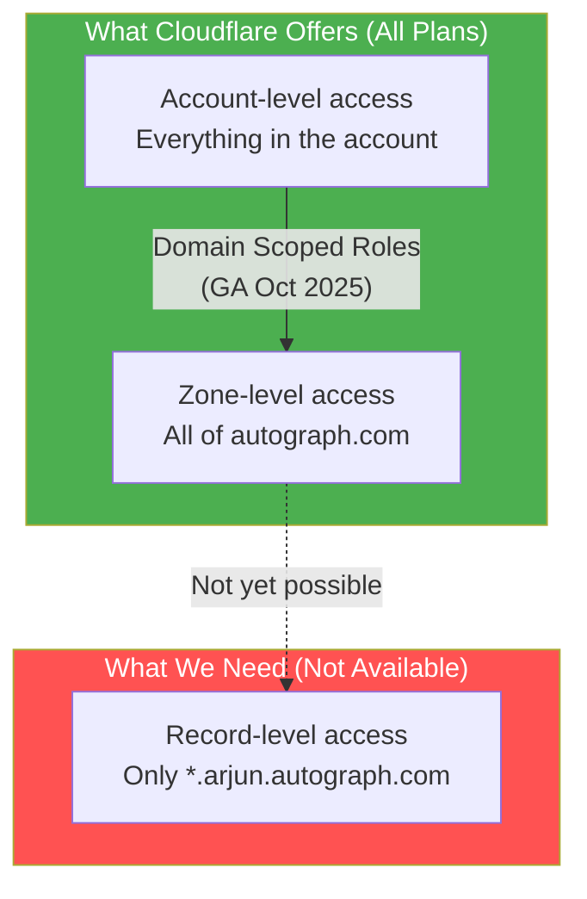
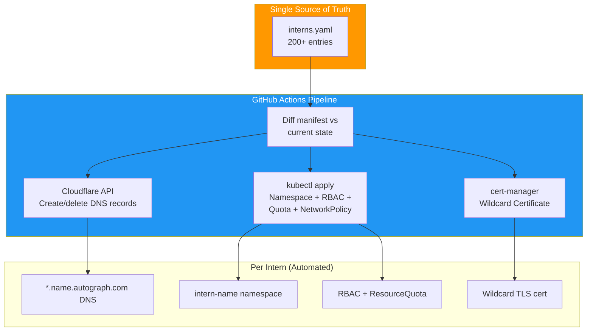
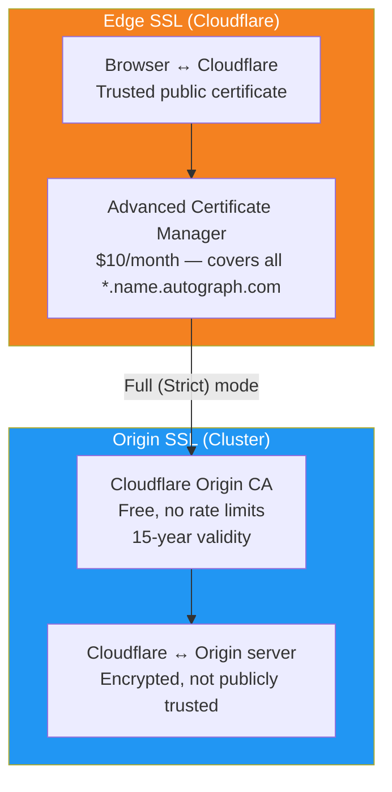
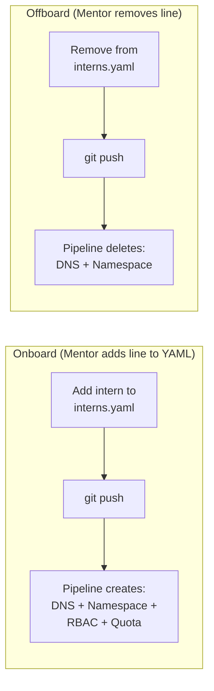
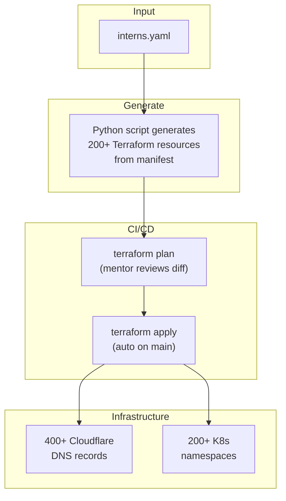
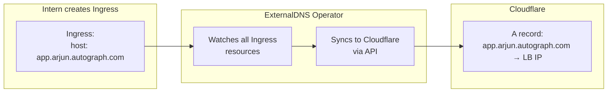
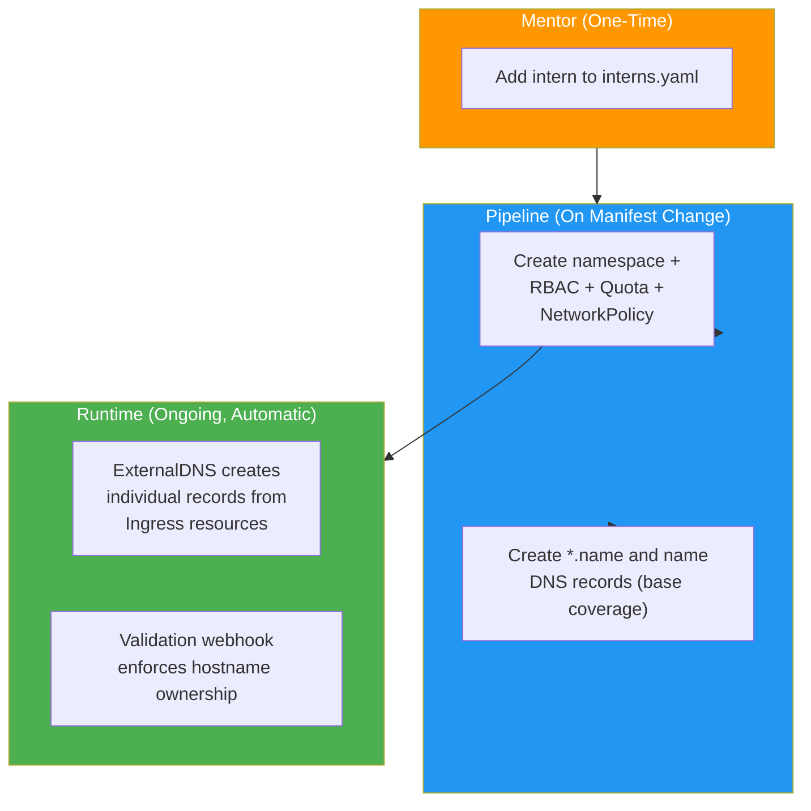

# Intern DNS Isolation

## One Subdomain Per Intern — At Scale

> *"Every hero needs their own kingdom. But when 200 heroes arrive at once, you need a kingdom factory."*

**Scale:** 200+ interns, 2 mentors. Manual provisioning is not an option.

Each intern gets their own subdomain tree under `autograph.com`:

| Intern | Subdomain Tree | Example Apps |
|--------|---------------|--------------|
| Arjun | `*.arjun.autograph.com` | `api.arjun.autograph.com`, `app.arjun.autograph.com` |
| Priya | `*.priya.autograph.com` | `api.priya.autograph.com`, `grafana.priya.autograph.com` |
| ... | ... | ... |
| Intern #200 | `*.intern200.autograph.com` | `cms.intern200.autograph.com` |

---

## The Problem: Cloudflare Has No Record-Level Access Control

Cloudflare's permission model scopes to **zones** (entire domains), not individual DNS records.



**Enterprise plan** ($5,000+/mo) offers "child zones" that solve this natively. We're not doing that. Isolation happens at a different layer.

---

## Approach 1: Automated Onboarding Pipeline (Recommended)

> *"The kingdom factory: one manifest in, 200 kingdoms out."*

**How it works:** A single YAML manifest defines all interns. A CI/CD pipeline (GitHub Actions) reconciles Cloudflare DNS records, Kubernetes namespaces, RBAC, resource quotas, and TLS certificates — all automatically. Interns never touch Cloudflare. Mentors never click buttons 400 times.



### The Intern Manifest

One file. All interns. This is the only thing mentors edit.

```yaml
# interns.yaml

cluster:
  lb_ip: "116.203.xx.xx"              # Hetzner LB IP
  cloudflare_zone: "autograph.com"

defaults:
  resource_quota:
    cpu: "4"                           # 4 cores per intern
    memory: "8Gi"                      # 8 GB per intern
    pods: "20"                         # Max 20 pods
    services: "10"                     # Max 10 services
    persistent_volume_claims: "5"      # Max 5 PVCs
  limit_range:
    default_cpu: "500m"                # Default container CPU
    default_memory: "512Mi"            # Default container memory
    max_cpu: "2"                       # Max single container CPU
    max_memory: "4Gi"                  # Max single container memory

interns:
  - name: arjun
    github: arjun-kumar
    email: arjun@example.com
    cohort: 2026-q1

  - name: priya
    github: priya-dev
    email: priya@example.com
    cohort: 2026-q1

  - name: kiran
    github: kiran-ops
    email: kiran@example.com
    cohort: 2026-q1

  # ... 197 more entries
  # Mentor adds a line, pipeline does the rest
```

### Cloudflare DNS Provisioning

The pipeline uses the Cloudflare API to create 2 records per intern (base + wildcard). For 200 interns = 400 API calls, well within Cloudflare's rate limits (1200 requests/5 min).

```python
# provisioner/dns.py — Conceptual reconciliation logic
# Implement as proper CLI with Click/Typer

import httpx
import yaml

CF_API = "https://api.cloudflare.com/client/v4"
HEADERS = {
    "Authorization": f"Bearer {CF_API_TOKEN}",
    "Content-Type": "application/json",
}


def reconcile_dns(manifest_path: str):
    """Reconcile DNS records from intern manifest."""
    manifest = yaml.safe_load(open(manifest_path))
    zone_id = get_zone_id(manifest["cluster"]["cloudflare_zone"])
    lb_ip = manifest["cluster"]["lb_ip"]

    # Get current intern DNS records
    existing = list_records(zone_id)
    existing_names = {r["name"] for r in existing}

    desired = set()
    for intern in manifest["interns"]:
        name = intern["name"]
        desired.add(f"{name}.autograph.com")
        desired.add(f"*.{name}.autograph.com")

    # Create missing records
    to_create = desired - existing_names
    for fqdn in to_create:
        create_record(zone_id, fqdn, lb_ip)
        print(f"  Created: {fqdn} -> {lb_ip}")

    # Remove records for interns no longer in manifest
    intern_pattern = get_intern_record_pattern(existing, manifest)
    to_delete = intern_pattern - desired
    for fqdn in to_delete:
        record_id = next(r["id"] for r in existing if r["name"] == fqdn)
        delete_record(zone_id, record_id)
        print(f"  Deleted: {fqdn}")


def create_record(zone_id: str, name: str, content: str):
    """Create a proxied A record."""
    httpx.post(
        f"{CF_API}/zones/{zone_id}/dns_records",
        headers=HEADERS,
        json={
            "type": "A",
            "name": name,
            "content": content,
            "proxied": True,
            "ttl": 1,  # Auto TTL when proxied
        },
    )
```

### Kubernetes Namespace Provisioning

Each intern gets an isolated namespace with resource limits. One Jinja2 template, rendered 200 times:

```yaml
# templates/intern-namespace.yaml.j2
# Rendered per intern by the pipeline

apiVersion: v1
kind: Namespace
metadata:
  name: intern-{{ intern.name }}
  labels:
    purpose: internship
    intern: "{{ intern.name }}"
    cohort: "{{ intern.cohort }}"

---
# Prevent one intern from consuming all cluster resources
apiVersion: v1
kind: ResourceQuota
metadata:
  name: intern-quota
  namespace: intern-{{ intern.name }}
spec:
  hard:
    requests.cpu: "{{ defaults.resource_quota.cpu }}"
    requests.memory: "{{ defaults.resource_quota.memory }}"
    pods: "{{ defaults.resource_quota.pods }}"
    services: "{{ defaults.resource_quota.services }}"
    persistentvolumeclaims: "{{ defaults.resource_quota.persistent_volume_claims }}"

---
# Set sensible defaults so interns don't need to specify resources
apiVersion: v1
kind: LimitRange
metadata:
  name: intern-limits
  namespace: intern-{{ intern.name }}
spec:
  limits:
    - default:
        cpu: "{{ defaults.limit_range.default_cpu }}"
        memory: "{{ defaults.limit_range.default_memory }}"
      defaultRequest:
        cpu: "100m"
        memory: "128Mi"
      max:
        cpu: "{{ defaults.limit_range.max_cpu }}"
        memory: "{{ defaults.limit_range.max_memory }}"
      type: Container

---
# RBAC: intern can only operate in their namespace
apiVersion: rbac.authorization.k8s.io/v1
kind: RoleBinding
metadata:
  name: intern-editor
  namespace: intern-{{ intern.name }}
subjects:
  - kind: User
    name: "{{ intern.github }}"
    apiGroup: rbac.authorization.k8s.io
roleRef:
  kind: ClusterRole
  name: edit
  apiGroup: rbac.authorization.k8s.io

---
# Network isolation: interns can't reach each other's namespaces
apiVersion: networking.k8s.io/v1
kind: NetworkPolicy
metadata:
  name: isolate-namespace
  namespace: intern-{{ intern.name }}
spec:
  podSelector: {}
  policyTypes:
    - Ingress
    - Egress
  ingress:
    # Allow traffic from ingress controller
    - from:
        - namespaceSelector:
            matchLabels:
              app.kubernetes.io/name: ingress-nginx
    # Allow traffic within same namespace
    - from:
        - podSelector: {}
  egress:
    # Allow DNS
    - to:
        - namespaceSelector:
            matchLabels:
              kubernetes.io/metadata.name: kube-system
      ports:
        - protocol: UDP
          port: 53
    # Allow traffic within same namespace
    - to:
        - podSelector: {}
    # Allow external traffic (internet APIs, registries)
    - to:
        - ipBlock:
            cidr: 0.0.0.0/0
            except:
              - 10.0.0.0/8     # Block other cluster pods
              - 172.16.0.0/12
              - 192.168.0.0/16
```

### SSL Strategy at Scale

At 200+ interns, Let's Encrypt rate limits become a concern (50 certificates per registered domain per week). The right approach uses **two layers**:



**Why not Let's Encrypt for origin certs?**

| | Let's Encrypt | Cloudflare Origin CA |
|---|---|---|
| Rate limit | 50 certs/week/domain | None |
| Provisioning 200+ | Takes 4+ weeks to stagger | Instant |
| Cert validity | 90 days (auto-renew) | Up to 15 years |
| cert-manager load | 200+ Certificate resources | 1 Origin CA cert or few shared |
| Cost | Free | Free |

Since all traffic passes through Cloudflare proxy (orange cloud), browsers only see the edge certificate (ACM). The origin cert just encrypts the Cloudflare-to-server hop.

#### Origin CA Certificate (Shared)

One origin cert covers all intern subdomains:

```yaml
# tls/origin-ca-secret.yaml
# Generated via Cloudflare dashboard: SSL/TLS > Origin Server > Create Certificate
# Covers: *.autograph.com, *.*.autograph.com

apiVersion: v1
kind: Secret
metadata:
  name: cloudflare-origin-ca
  namespace: ingress-nginx    # Shared at ingress level
type: kubernetes.io/tls
data:
  tls.crt: <base64-encoded-origin-cert>
  tls.key: <base64-encoded-private-key>
```

#### Ingress Default Certificate

Configure the ingress controller to use the Origin CA cert as default, so every intern's Ingress gets TLS without individual cert resources:

```yaml
# ingress-nginx/values.yaml (Helm)

controller:
  extraArgs:
    default-ssl-certificate: "ingress-nginx/cloudflare-origin-ca"
```

Now interns don't need to specify TLS in their Ingress at all — it happens automatically.

### GitHub Actions Pipeline

```yaml
# .github/workflows/reconcile-interns.yml

name: Reconcile Intern Environments

on:
  push:
    paths:
      - 'interns.yaml'
    branches:
      - main
  workflow_dispatch:    # Manual trigger for ad-hoc runs

jobs:
  reconcile:
    runs-on: ubuntu-latest
    steps:
      - uses: actions/checkout@v4

      - name: Setup Python
        uses: actions/setup-python@v5
        with:
          python-version: '3.12'

      - name: Install dependencies
        run: pip install httpx pyyaml jinja2

      - name: Reconcile Cloudflare DNS
        env:
          CF_API_TOKEN: ${{ secrets.CLOUDFLARE_API_TOKEN }}
          CF_ZONE_ID: ${{ secrets.CLOUDFLARE_ZONE_ID }}
        run: python provisioner/dns.py interns.yaml

      - name: Render Kubernetes manifests
        run: python provisioner/render_k8s.py interns.yaml > rendered/all-interns.yaml

      - name: Apply Kubernetes resources
        uses: azure/k8s-set-context@v4
        with:
          kubeconfig: ${{ secrets.KUBECONFIG }}
      - run: kubectl apply -f rendered/all-interns.yaml

      - name: Summary
        run: |
          echo "## Reconciliation Complete" >> $GITHUB_STEP_SUMMARY
          echo "- Interns: $(yq '.interns | length' interns.yaml)" >> $GITHUB_STEP_SUMMARY
          echo "- DNS records: $(yq '.interns | length' interns.yaml) x 2" >> $GITHUB_STEP_SUMMARY
          echo "- Namespaces: $(yq '.interns | length' interns.yaml)" >> $GITHUB_STEP_SUMMARY
```

### Onboarding and Offboarding



**Onboarding one intern:** Add 4 lines to `interns.yaml`, push. Done.

**Offboarding:** Remove those lines, push. Pipeline cleans up DNS records and (optionally) deletes the namespace.

### Why This Is Most Pragmatic at Scale

| Factor | At 200+ interns |
|--------|-----------------|
| **Mentor effort** | Add a line to YAML, push |
| **Provisioning time** | ~3 min (pipeline run) |
| **Cost** | $10/month ACM (total, not per-intern) |
| **Consistency** | Every intern gets identical setup |
| **Audit trail** | Git history shows who was added/removed when |
| **Blast radius** | Intern can only affect their namespace |
| **Offboarding** | Remove line, push — everything cleaned up |
| **No Cloudflare access needed** | Interns never see dashboard or API tokens |

---

## Approach 2: Terraform with Auto-Approval (Scale Variant)

> *"Infrastructure-as-Code at industrial scale — review the pattern, not every instance."*

**How it works:** Same as Terraform/GitOps, but at 200+ scale you can't have CODEOWNERS per intern or review every PR. Instead: auto-generate Terraform from the manifest, auto-apply on merge to main.



### Generated Terraform

```hcl
# generated/interns.tf — Auto-generated, do not edit manually

# Intern: arjun
resource "cloudflare_record" "intern_arjun_base" {
  zone_id = var.zone_id
  name    = "arjun"
  content = var.lb_ip
  type    = "A"
  proxied = true
}

resource "cloudflare_record" "intern_arjun_wildcard" {
  zone_id = var.zone_id
  name    = "*.arjun"
  content = var.lb_ip
  type    = "A"
  proxied = true
}

# Intern: priya
resource "cloudflare_record" "intern_priya_base" {
  zone_id = var.zone_id
  name    = "priya"
  content = var.lb_ip
  type    = "A"
  proxied = true
}

resource "cloudflare_record" "intern_priya_wildcard" {
  zone_id = var.zone_id
  name    = "*.priya"
  content = var.lb_ip
  type    = "A"
  proxied = true
}

# ... 198 more intern blocks (auto-generated)
```

### When to Choose Terraform Over Pipeline

| Factor | Pipeline (Approach 1) | Terraform (Approach 2) |
|--------|----------------------|----------------------|
| State tracking | Reconciliation loop | Terraform state file |
| Drift detection | Must build it | Built-in (`terraform plan`) |
| Rollback | Git revert + re-run | `terraform apply` to previous state |
| Learning value | Python + APIs | Terraform + HCL (industry standard) |
| Complexity | Lower | Higher (state management, locking) |

**Best for:** When the team already uses Terraform, or when drift detection and state management matter.

---

## Approach 3: ExternalDNS Operator (Kubernetes-Native)

> *"Let the cluster manage its own DNS — the machines talk to each other."*

**How it works:** ExternalDNS watches Ingress resources in the cluster and automatically creates/updates Cloudflare DNS records. Interns create Ingress resources; DNS records appear automatically. No pipeline needed for DNS.



### ExternalDNS Configuration

```yaml
# external-dns/deployment.yaml

apiVersion: apps/v1
kind: Deployment
metadata:
  name: external-dns
  namespace: kube-system
spec:
  template:
    spec:
      containers:
        - name: external-dns
          image: registry.k8s.io/external-dns/external-dns:v0.15.0
          args:
            - --source=ingress
            - --provider=cloudflare
            - --cloudflare-proxied
            # Only manage records under autograph.com
            - --domain-filter=autograph.com
            # Prevent ExternalDNS from deleting records
            # it didn't create (safety for production records)
            - --policy=upsert-only
            # Tag records so we know ExternalDNS created them
            - --txt-owner-id=intern-cluster
            # Limit to intern namespaces only
            - --namespace=intern-arjun,intern-priya,intern-kiran
            # Or use label selector:
            # - --label-filter=purpose=internship
          env:
            - name: CF_API_TOKEN
              valueFrom:
                secretKeyRef:
                  name: cloudflare-api-token
                  key: token
```

### Scaling to 200+ Namespaces

Instead of listing all 200 namespaces in args, use label selectors:

```yaml
args:
  # Watch all namespaces with the internship label
  - --label-filter=purpose=internship
```

This works because the namespace template (from Approach 1) already labels namespaces with `purpose: internship`.

### Intern Ingress (Self-Service DNS)

When an intern creates an Ingress, ExternalDNS creates the Cloudflare record automatically:

```yaml
# Intern creates this — DNS record appears within 60 seconds
apiVersion: networking.k8s.io/v1
kind: Ingress
metadata:
  name: my-app
  namespace: intern-arjun
  labels:
    purpose: internship
spec:
  ingressClassName: nginx
  rules:
    - host: app.arjun.autograph.com
      http:
        paths:
          - path: /
            pathType: Prefix
            backend:
              service:
                name: my-app
                port:
                  number: 8080
```

No TLS block needed — the ingress controller's default Origin CA cert handles it.

### Guardrail: Hostname Validation Webhook

ExternalDNS alone doesn't prevent an intern from claiming `app.priya.autograph.com` via Ingress in their namespace. Add a validating webhook to enforce hostname ownership:

```yaml
# webhook/intern-hostname-policy.yaml

apiVersion: admissionregistration.k8s.io/v1
kind: ValidatingWebhookConfiguration
metadata:
  name: intern-hostname-validator
webhooks:
  - name: validate-intern-hostname.autograph.com
    rules:
      - apiGroups: ["networking.k8s.io"]
        apiVersions: ["v1"]
        operations: ["CREATE", "UPDATE"]
        resources: ["ingresses"]
    namespaceSelector:
      matchLabels:
        purpose: internship
    clientConfig:
      service:
        name: hostname-validator
        namespace: kube-system
        path: /validate
    failurePolicy: Fail
    sideEffects: None
```

The webhook logic: extract intern name from namespace (`intern-arjun` → `arjun`), verify all Ingress hostnames end with `.arjun.autograph.com`. Reject if not.

### When to Choose ExternalDNS

| Factor | Pipeline (Approach 1) | ExternalDNS (Approach 3) |
|--------|----------------------|--------------------------|
| DNS provisioning | Batch (on manifest change) | Real-time (on Ingress create) |
| Intern self-service | Namespace + Ingress only | Full self-service DNS via Ingress |
| Wildcard needed? | Yes (pre-created) | No (individual records per app) |
| ACM needed? | Yes ($10/mo for wildcard edge certs) | Maybe not (individual hostnames covered by Universal SSL if single-level) |
| Extra infrastructure | None | ExternalDNS pod + validation webhook |
| DNS cleanup | On offboarding pipeline | Automatic when Ingress deleted |

> **Note on ACM:** If using ExternalDNS with individual (non-wildcard) records like `app.arjun.autograph.com`, Cloudflare's free Universal SSL covers `*.autograph.com` — but that only handles the first subdomain level. `app.arjun.autograph.com` is two levels deep, so **ACM ($10/mo) is still needed** for proxied deeper-level hostnames.

**Best for:** When interns need to dynamically create subdomains for different services without any mentor involvement.

---

## Approach 4: Hybrid — Pipeline + ExternalDNS (Maximum Scale)

> *"The factory builds the kingdom. The kingdom manages itself."*

Combine Approach 1 and 3 for the best of both:



| Responsibility | Handled By |
|----------------|------------|
| Namespace, RBAC, Quota | Pipeline (from manifest) |
| Base DNS (`*.name` wildcard) | Pipeline (Cloudflare API) |
| Per-app DNS records | ExternalDNS (from Ingress) |
| Hostname enforcement | Validating webhook |
| TLS (edge) | Cloudflare ACM ($10/mo) |
| TLS (origin) | Cloudflare Origin CA (free) |
| Onboarding | Add line to YAML |
| Offboarding | Remove line, pipeline cleans up |

---

## Comparison Matrix (at 200+ Scale)

| | Pipeline | Terraform | ExternalDNS | Hybrid |
|---|---|---|---|---|
| **Pragmatism** | Highest | High | High | Highest (long-term) |
| **Mentor effort per intern** | 1 YAML line | 1 YAML line | 1 YAML line | 1 YAML line |
| **Initial setup** | 4-6 hours | 6-8 hours | 3-4 hours | 8-10 hours |
| **DNS self-service** | No (wildcard covers it) | No | Yes (via Ingress) | Yes |
| **Drift detection** | Must build | Built-in | Built-in | Partial |
| **Hostname guardrail** | K8s RBAC only | K8s RBAC only | Webhook (strong) | Webhook (strong) |
| **Cleanup on offboard** | Pipeline | Terraform destroy | Manual NS delete | Pipeline |
| **Cost** | $10/mo ACM | $10/mo ACM | $10/mo ACM | $10/mo ACM |
| **Learning value for interns** | Low (invisible) | Low (invisible) | Medium (Ingress = DNS) | Medium |

---

## Recommended: Pipeline Now, Hybrid Later

For the Autograph internship at 200+ interns:

**Week 1:** Deploy **Approach 1 (Pipeline)** — fastest to set up, covers all needs on day one.

**Week 3-4:** Layer on **Approach 3 (ExternalDNS)** — gives interns real-time DNS self-service as they learn Ingress patterns. Good exercise for the more advanced interns to help set up.

### Quick Setup Checklist

**One-time infrastructure (mentor):**

- [ ] Enable Advanced Certificate Manager in Cloudflare ($10/month)
- [ ] Generate Cloudflare Origin CA certificate (covers `*.autograph.com` and `*.*.autograph.com`)
- [ ] Store Origin CA cert as K8s Secret in `ingress-nginx` namespace
- [ ] Configure ingress controller default TLS certificate to Origin CA
- [ ] Set Cloudflare SSL mode to **Full (Strict)**
- [ ] Create `interns.yaml` manifest with first batch of interns
- [ ] Set up GitHub Actions workflow with `CF_API_TOKEN` and `KUBECONFIG` secrets
- [ ] Run pipeline — verify DNS records appear in Cloudflare, namespaces created in cluster

**Per-intern onboarding (mentor, 30 seconds):**

- [ ] Add 4 lines to `interns.yaml`
- [ ] Push to main
- [ ] Pipeline provisions everything automatically

**Intern verification (intern, self-service):**

- [ ] Deploy a test app in their namespace
- [ ] Create Ingress with `app.{name}.autograph.com`
- [ ] Access `https://app.{name}.autograph.com` in browser — TLS works

---

## Approaches That Don't Scale to 200+

These were viable at 5-10 interns but fail at 200+:

| Approach | Why It Breaks |
|----------|---------------|
| **Manual Cloudflare dashboard** | 400+ clicks, error-prone, no audit trail |
| **CODEOWNERS per intern** | 200+ entries, 2 mentors can't review 200 PRs |
| **Delegate to external NS** | 200 external DNS accounts to manage, interns need provider signup |
| **Individual Let's Encrypt certs** | Rate limit: 50 certs/week/domain — takes 4+ weeks for 200 |

---

## Related

- [Networking](./04-Networking.md) — Traffic flow, ingress controller, cert-manager basics
- [Security](./03-Security.md) — Zero-trust, secrets management
- [Cloud Platforms](./01-Cloud-Platforms.md) — Hetzner infrastructure

---

*Last Updated: 2026-02-06*
