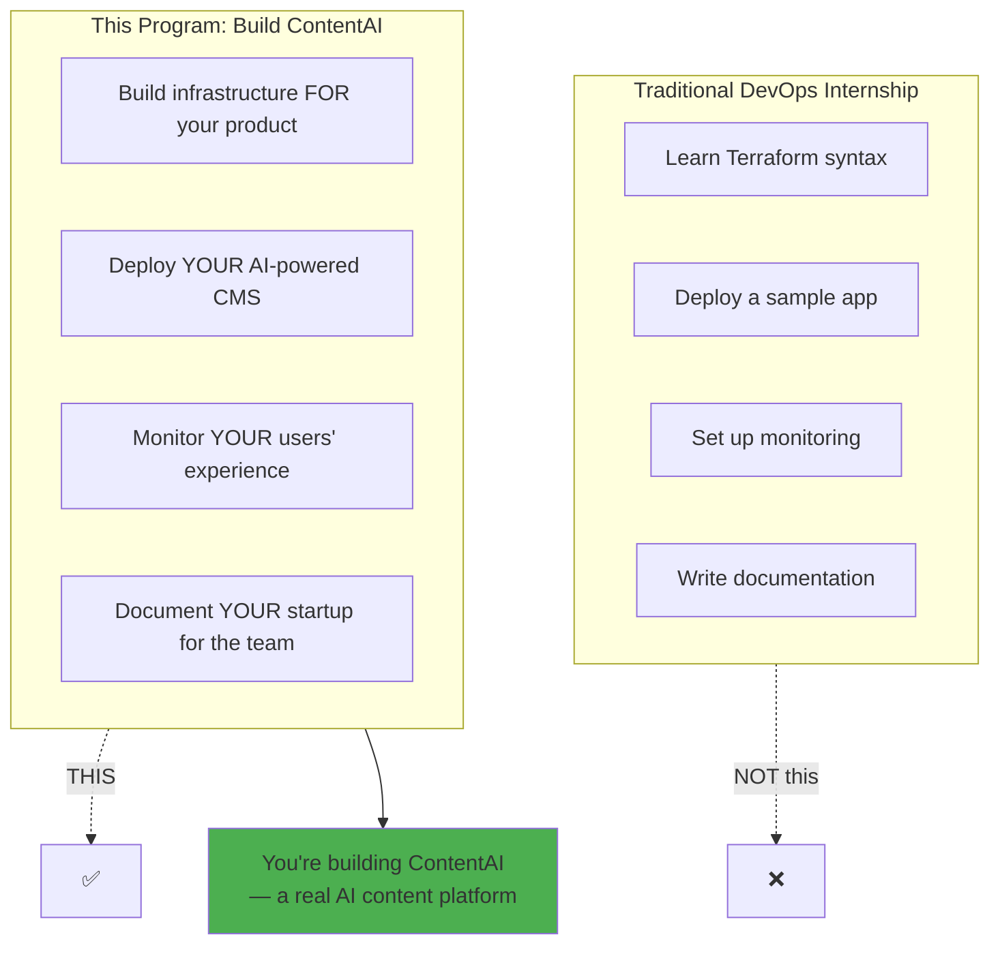
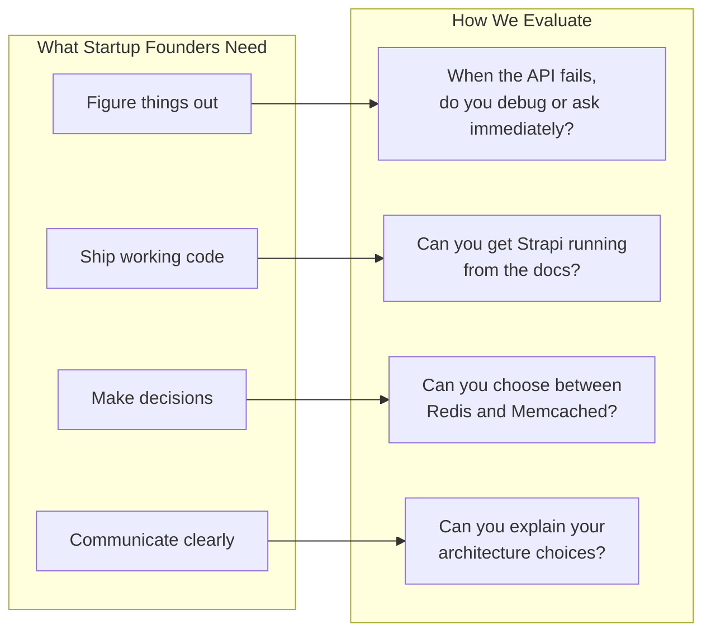
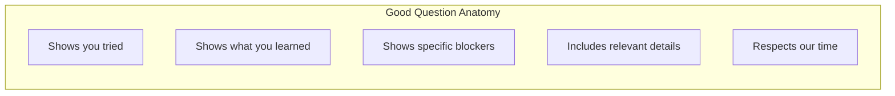
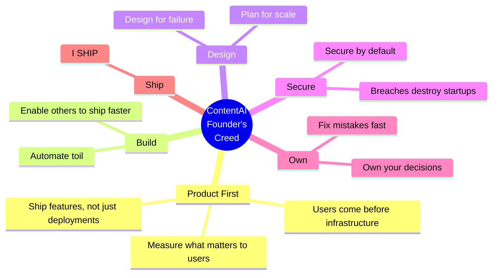

# Before You Begin

> *"The best startups seem to start from scratch. The founders just decided what they wanted to build, then built it."*
> — **Paul Graham**, Y Combinator

> **Read this first.** It sets the context for everything that follows.

---

## First: Set Up Your Communication Tools

Before diving into building ContentAI, ensure you can participate in the program:

| Step | Guide |
|------|-------|
| 1. Set up Microsoft Teams | [Teams Setup](../../How-We-Communicate/01-Teams-Getting-Started.md) |
| 2. Understand communication channels | [Communication Protocol](../../How-We-Communicate/02-Communication-Protocol.md) |
| 3. Know the live session format | [Live Sessions](../../How-We-Communicate/03-Live-Sessions.md) |
| 4. Get your tools ready (Git, SSH keys) | [Tools & Workflows](../../How-We-Communicate/04-Tools-and-Workflows.md) |

---

## The Reality of This Internship

We're a **small organization** with limited time and resources. We offered this internship **without any fee** because we believe in growing the next generation of builders. But we need you to understand something important:

**You're not learning DevOps. You're building a startup.**

---

## What This Means for You

### We Understand

- **Building a product is hard** — you're not just learning tools, you're shipping something real
- **Infrastructure is complex** — networking, Kubernetes, IaC have steep learning curves
- **AI integration is new territory** — API costs, prompt engineering, latency concerns
- **Remote work is challenging** — no one sitting next to you to debug issues

### We Commit To

- **Sharing real-world patterns** we use in production
- **Reviewing your infrastructure code** and giving feedback
- **Answering architecture questions** when you're truly stuck
- **Treating you like a founding engineer**, not a student

### We Expect You To

- **Think like a founder** — "How do I make ContentAI better for users?"
- **Research first, ask second** — Google the error, read the docs, try things
- **Show working systems** — not just "I read about Strapi"
- **Document your decisions** — "I chose X because Y, trade-off is Z"
- **Break things and learn** — this is a sandbox, experiment boldly

---

## The Startup Test

Your performance this week determines whether we continue together. We invest mentorship capacity in people who demonstrate they can:

This is not about being harsh. It's about being honest: **startups need people who ship**.

---

## How to Ask Good Questions

When you're stuck, don't just say "it doesn't work."

### Bad Question

> "How do I deploy Strapi?"

### Good Question

> "I'm trying to deploy Strapi on my k3s cluster. I followed the Helm chart documentation and created a values.yaml with PostgreSQL connection. When I run `helm install`, the pod starts but crashes with 'ECONNREFUSED' for the database. I've verified:
> - PostgreSQL is running (`kubectl get pods` shows Running)
> - Service exists (`kubectl get svc` shows postgres-headless)
> - I can connect via `psql` from another pod
> Here's my values.yaml: [code]. What am I missing?"

---

## Required Tools Setup

Before Week 1 starts, you need:

### Local Development

| Tool | Purpose | Install |
|------|---------|---------|
| **Git** | Version control | `brew install git` |
| **OpenTofu** | Infrastructure-as-Code | `brew install opentofu` |
| **Ansible** | Configuration management | `pip install ansible` |
| **kubectl** | Kubernetes CLI | `brew install kubectl` |
| **k9s** | Kubernetes TUI | `brew install k9s` |
| **Helm** | Package manager | `brew install helm` |

### Cloud Access

| Provider | What You Need | How to Get It |
|----------|---------------|---------------|
| **Hetzner** | API token | Create account, generate in Console |
| **GitHub** | SSH key, PAT | Settings → SSH keys, Developer settings |
| **Container Registry** | ghcr.io access | Automatic with GitHub |

### Knowledge Prerequisites

| Topic | Minimum Level | Why for ContentAI |
|-------|---------------|-------------------|
| **Linux CLI** | Navigate, edit files, SSH | Server management |
| **Git** | Commit, branch, merge, PR | Code collaboration |
| **YAML** | Read and write | All K8s configs |
| **Networking** | IP, ports, DNS, HTTP | Strapi + AI service communication |
| **Containers** | Build and run Docker | Everything runs in containers |
| **Databases** | Basic SQL, connection strings | PostgreSQL for Strapi |

---

## Your Opportunity

If you pass this week:
- You get **3 more weeks** building a real AI product
- You work on **production-grade patterns**
- You build **portfolio-worthy projects** — not just infrastructure, a product
- You get **references** for future opportunities

If you demonstrate exceptional initiative:
- Extended internship opportunities
- Potential project collaboration
- Direct mentorship on advanced topics

---

## The Founder's Manifesto

> *"If it hurts, do it more frequently, and bring the pain forward."*
> — **Continuous Delivery** (Humble & Farley)

### The Principles

1. **I build products that solve real problems.**
2. **I create infrastructure that enables the product to scale.**
3. **I automate toil so humans can focus on what matters.**
4. **I design for failure because failures are inevitable.**
5. **I document because future-me is a stranger who deserves context.**
6. **I measure because hope is not a strategy.**
7. **I secure by default because breaches are catastrophic.**
8. **I own my mistakes publicly and fix them faster.**
9. **I ship.**

---

## Ready?

Now proceed to:
1. [Vision](../01-Product/01-Vision.md) — **Start here**: What is ContentAI?
2. [Week by Week Guide](./02-Week-by-Week.md) — the 4-week plan
3. [What You Build](./03-What-You-Build.md) — technical deliverables
4. [Your Role](./04-Your-Role.md) — understand your responsibilities

Then jump to [Environment Setup](./Exercises/01-Environment-Setup.md) for your Week 1 tasks.

---

*We're rooting for you. Now show us what you can build.*
