# Before You Begin: The Cinderella Moment

> *"A dream is a wish your heart makes, when you're fast asleep. But the real magic? That happens when you wake up and build it yourself."*

> **Read this first.** Every great transformation begins with understanding what you're becoming.

---

## Your Cinderella Story Begins

You know the story. A young person, full of potential, stuck in circumstances that don't show their worth. Ashes on their face, dreams in their heart, invisible to the world.

**That's you on Day 1.**

Not because there's anything wrong with you — but because the world hasn't seen what you can do yet. You don't have the platform, the portfolio, the proof.

But here's what the fairy tales don't tell you: **Cinderella didn't wait for someone else to save her.** She showed up at the ball. She seized the moment. The fairy godmother just gave her the tools — *she* did the dancing.

```mermaid
flowchart TB
    subgraph Before["🧹 IN THE ASHES (Before)"]
        B1["Unknown to the industry"]
        B2["Learning tools in isolation"]
        B3["Building demos that go nowhere"]
        B4["Dreams without a stage"]
    end

    subgraph Threshold["✨ THE TRANSFORMATION (This Internship)"]
        T1["Build Autograph - a real AI platform"]
        T2["Own your creation end-to-end"]
        T3["Ship to production"]
        T4["Create your glass slipper"]
    end

    subgraph After["👑 AT THE BALL (After)"]
        A1["Portfolio-worthy product"]
        A2["Founding engineer story"]
        A3["Skills that transfer everywhere"]
        A4["A transformation no one can take away"]
    end

    Before -->|"You cross the threshold"| Threshold
    Threshold -->|"The clock strikes Demo Day"| After

    style Threshold fill:#9C27B0
    style After fill:#FFD700
```

---

## The Glass Slipper You'll Build

In the fairy tale, the glass slipper was proof of who Cinderella really was. It fit only her.

**Your glass slipper is Autograph** — the AI-powered content platform you'll build from scratch. No one else will have built exactly what you build. It's your signature, your proof, your story.

| The Fairy Tale | Your Reality |
|----------------|--------------|
| Glass slipper | The Autograph platform |
| The ball | Demo Day presentation |
| Prince charming | Future employers/opportunities |
| Fairy godmother | The tools and mentorship we provide |
| **You** | **The one who does the work** |

---

## First: Join the Fellowship

Before you can begin your quest, you must join your companions:

| Step | Guide | What You'll Do |
|------|-------|----------------|
| 1. **Enter the Council Chamber** | [Teams Setup](../../How-We-Communicate/01-Teams-Getting-Started.md) | Set up Microsoft Teams |
| 2. **Learn the Signals** | [Communication Protocol](../../How-We-Communicate/02-Communication-Protocol.md) | Know which channel for what |
| 3. **Mark the Gatherings** | [Live Sessions](../../How-We-Communicate/03-Live-Sessions.md) | Webinar format, demos |
| 4. **Gather Your Equipment** | [Tools & Workflows](../../How-We-Communicate/04-Tools-and-Workflows.md) | Git, SSH keys, cloud access |

---

## The Honest Truth (The Stepmother's Reality)

Here's where we break from the fairy tale fantasy: **there's no magic that does the work for you.**

We're a **small organization** with limited time and resources. We offered this internship **without any fee** because we believe in growing the next generation of builders.

But understand this clearly:

> **You're not here to learn DevOps. You're here to build a startup.**

The transformation is real, but it requires real work. Cinderella didn't become royalty by wishing — she sewed, she cleaned, she endured, and when the moment came, **she danced better than anyone**.

```mermaid
flowchart TB
    subgraph Traditional["🎓 TRADITIONAL INTERNSHIP"]
        T1["Learn Terraform syntax"]
        T2["Deploy a sample app"]
        T3["Set up monitoring"]
        T4["Write documentation"]
    end

    subgraph Startup["🚀 YOUR CINDERELLA STORY: BUILD AUTOGRAPH"]
        P1["Build infrastructure FOR your product"]
        P2["Deploy YOUR AI-powered CMS"]
        P3["Monitor YOUR users' experience"]
        P4["Document YOUR startup"]
    end

    Traditional -.->|"Stay in the ashes"| X["❌"]
    Startup -.->|"Go to the ball"| Y["✅"]

    Result["You're building Autograph<br/>— your glass slipper"]

    Startup --> Result

    style Result fill:#FFD700
```

---

## The Trials of Transformation

Every transformation has challenges. Cinderella faced mockery, exhaustion, impossible tasks. Here's what you'll face:

| Challenge | The Reality | The Cinderella Approach |
|-----------|-------------|------------------------|
| **Building is hard** | You're not just learning tools, you're shipping something real | The dress wasn't perfect on the first try either |
| **Infrastructure is complex** | Networking, Kubernetes, IaC have steep learning curves | One stitch at a time, one concept at a time |
| **AI integration is uncharted** | API costs, prompt engineering, latency concerns | Even fairy godmothers had to learn their spells |
| **Remote work is isolating** | No one sitting next to you to debug | Write your own story, document your journey |

---

## The Covenant (What We Promise Each Other)

### What We Give You (The Fairy Godmother's Gifts)

- **Real-world patterns** we use in production
- **Code reviews** with actual feedback
- **Architecture guidance** when you're truly stuck
- **Respect** — we treat you like a founding engineer, not a student

### What We Ask of You (The Price of Transformation)

| Principle | What It Looks Like |
|-----------|-------------------|
| **Think like a founder** | "How do I make Autograph better for users?" |
| **Research first, ask second** | Google the error, read the docs, try things |
| **Show working systems** | Not just "I read about Strapi" — show me it running |
| **Document your decisions** | "I chose X because Y, trade-off is Z" |
| **Break things boldly** | This is your sandbox, experiment fearlessly |

---

## The Trial of the First Week

> *"The stepsisters laughed and said she couldn't possibly go to the ball. She went anyway."*

Your performance this week determines if we continue together. This isn't harsh—it's honest. **Startups need people who ship.**

```mermaid
flowchart LR
    subgraph Qualities["🎯 WHAT THE BALL REQUIRES"]
        S1["Figure things out"]
        S2["Ship working code"]
        S3["Make decisions"]
        S4["Communicate clearly"]
    end

    subgraph Test["⚖️ HOW WE SEE IT"]
        Q1["When the API fails,<br/>do you debug or ask immediately?"]
        Q2["Can you get Strapi running<br/>from the docs?"]
        Q3["Can you choose between<br/>Redis and Memcached?"]
        Q4["Can you explain your<br/>architecture choices?"]
    end

    S1 --> Q1
    S2 --> Q2
    S3 --> Q3
    S4 --> Q4
```

---

## The Art of Asking Questions

Cinderella didn't just say "Help me go to the ball!" She explained her situation, showed she was willing to work, and asked for specific assistance.

### The Quest for Knowledge

**Wrong Way** (The Helpless Stepsister):
> "How do I deploy Strapi?"

**Right Way** (The Prepared Cinderella):
> "I'm deploying Strapi on my k3s cluster. I followed the Helm chart documentation and created a values.yaml with PostgreSQL connection. When I run `helm install`, the pod starts but crashes with 'ECONNREFUSED' for the database. I've verified:
> - PostgreSQL is running (`kubectl get pods` shows Running)
> - Service exists (`kubectl get svc` shows postgres-headless)
> - I can connect via `psql` from another pod
> Here's my values.yaml: [code]. What am I missing?"

---

## Your Arsenal (The Fairy Godmother's Toolkit)

Every hero needs equipment. Gather these before you begin:

### Local Weapons

| Tool | Purpose | How to Obtain |
|------|---------|---------------|
| **Git** | Version control | `brew install git` |
| **OpenTofu** | Infrastructure-as-Code | `brew install opentofu` |
| **Ansible** | Configuration magic | `pip install ansible` |
| **kubectl** | Kubernetes command | `brew install kubectl` |
| **k9s** | Kubernetes vision | `brew install k9s` |
| **Helm** | Package management | `brew install helm` |

### Keys to the Kingdom

| Provider | What You Need | How to Get It |
|----------|---------------|---------------|
| **Hetzner** | API token | Create account, generate in Console |
| **GitHub** | SSH key, PAT | Settings → SSH keys, Developer settings |
| **Container Registry** | ghcr.io access | Automatic with GitHub |

### Knowledge Prerequisites

| Skill | Level Needed | Why for Autograph |
|-------|--------------|-------------------|
| **Linux CLI** | Navigate, edit, SSH | Server management |
| **Git** | Commit, branch, PR | Code collaboration |
| **YAML** | Read and write | All K8s configs |
| **Networking** | IP, ports, DNS | Service communication |
| **Containers** | Build and run | Everything containerized |
| **Databases** | Basic SQL | PostgreSQL for Strapi |

---

## The Rewards (What Awaits at the Ball)

Those who complete the transformation earn more than knowledge:

### If You Complete Week 1
- **3 more weeks** building a real AI product
- **Production-grade patterns** you can use anywhere
- **Portfolio-worthy project** — not just infrastructure, a product
- **References** for future opportunities

### If You Demonstrate Excellence
- Extended internship opportunities
- Potential project collaboration
- Direct mentorship on advanced topics
- **A story worth telling for the rest of your career**

---

## The Founder's Oath

Before you begin, speak these words (or at least read them with conviction):

### The Nine Principles

1. **I build products that solve real problems.**
2. **I create infrastructure that enables the product to scale.**
3. **I automate toil so humans can focus on what matters.**
4. **I design for failure because failures are inevitable.**
5. **I document because future-me is a stranger who deserves context.**
6. **I measure because hope is not a strategy.**
7. **I secure by default because breaches are catastrophic.**
8. **I own my mistakes publicly and fix them faster.**
9. **I ship.**

---

## The Journey Begins

> *"At the stroke of midnight, everything changed. But Cinderella had already changed herself."*

Now proceed to:

| Step | Document | Your Task |
|------|----------|-----------|
| 1 | [Vision](../01-Product/01-Vision.md) | Understand what Autograph is |
| 2 | [Week by Week](./02-Week-by-Week.md) | See the 4-act transformation |
| 3 | [What You Build](./03-What-You-Build.md) | Know your deliverables |
| 4 | [Your Role](./04-Your-Role.md) | Embrace the founding engineer mindset |
| 5 | [Environment Setup](./Exercises/01-Environment-Setup.md) | **Start building!** |

---

## The Midnight Promise

The greatest stories aren't about perfect heroes. They're about ordinary people who **decided to do something extraordinary**.

In the original fairy tale, the magic faded at midnight. The dress turned back to rags, the carriage to a pumpkin. But what remained? **The glass slipper** — proof of who Cinderella really was.

Your glass slipper is different. **It doesn't fade at midnight.** The Autograph platform you build, the skills you develop, the transformation you undergo — no one can take that back. Because **you built it yourself.**

Autograph is waiting. The music is starting.

**It's time to dance.**

---

*We're rooting for you. Now show us what you can build.*
