# Before You Begin: The Hero's Call

> *"A hero is someone who has given his or her life to something bigger than oneself."*
> — **Joseph Campbell**, The Hero with a Thousand Faces

> **Read this first.** Every great adventure begins with understanding the journey ahead.

---

## The Call to Adventure

Every fairy tale has a moment when the ordinary becomes extraordinary. When Cinderella met her fairy godmother. When Alice fell down the rabbit hole. When Luke Skywalker received Obi-Wan's message.

**This is your moment.**

You didn't sign up for a typical internship. You signed up to build something that matters—an AI-powered content platform that could change how millions of people create content.

```mermaid
flowchart TB
    subgraph Ordinary["🏠 THE ORDINARY WORLD"]
        O1["Learning tools in isolation"]
        O2["Following tutorials"]
        O3["Building demos that go nowhere"]
    end

    subgraph Call["📯 THE CALL"]
        C1["Build a real AI product"]
        C2["Own the entire stack"]
        C3["Ship something users could use"]
    end

    subgraph Adventure["🗡️ THE ADVENTURE"]
        A1["ContentAI comes alive"]
        A2["You become a founding engineer"]
        A3["The story is yours to tell"]
    end

    Ordinary -->|"You cross the threshold"| Call
    Call --> Adventure

    style Adventure fill:#4CAF50
```

---

## First: Join the Fellowship

Before you can begin your quest, you must join your companions:

| Step | Guide | What You'll Do |
|------|-------|----------------|
| 1. **Enter the Council Chamber** | [Teams Setup](../../How-We-Communicate/01-Teams-Getting-Started.md) | Set up Microsoft Teams |
| 2. **Learn the Signals** | [Communication Protocol](../../How-We-Communicate/02-Communication-Protocol.md) | Know which channel for what |
| 3. **Mark the Gatherings** | [Live Sessions](../../How-We-Communicate/03-Live-Sessions.md) | Webinar format, demos |
| 4. **Gather Your Equipment** | [Tools & Workflows](../../How-We-Communicate/04-Tools-and-Workflows.md) | Git, SSH keys, cloud access |

---

## The Honest Truth (No Fairy Godmothers Here)

Here's where we break from the fairy tales: **there's no magic that does the work for you.**

We're a **small organization** with limited time and resources. We offered this internship **without any fee** because we believe in growing the next generation of builders.

But understand this clearly:

> **You're not here to learn DevOps. You're here to build a startup.**

```mermaid
flowchart TB
    subgraph Traditional["🎓 TRADITIONAL INTERNSHIP"]
        T1["Learn Terraform syntax"]
        T2["Deploy a sample app"]
        T3["Set up monitoring"]
        T4["Write documentation"]
    end

    subgraph Startup["🚀 THIS INTERNSHIP: BUILD CONTENTAI"]
        P1["Build infrastructure FOR your product"]
        P2["Deploy YOUR AI-powered CMS"]
        P3["Monitor YOUR users' experience"]
        P4["Document YOUR startup"]
    end

    Traditional -.->|"Not this"| X["❌"]
    Startup -.->|"This"| Y["✅"]

    Result["You're building ContentAI<br/>— a real AI content platform"]

    Startup --> Result

    style Result fill:#4CAF50
```

---

## The Trials You'll Face

Every hero faces challenges. Here's what's ahead:

| Challenge | The Reality | How Heroes Handle It |
|-----------|-------------|---------------------|
| **Building is hard** | You're not just learning tools, you're shipping something real | You push through, not around |
| **Infrastructure is complex** | Networking, Kubernetes, IaC have steep learning curves | You read the docs, experiment, fail, learn |
| **AI integration is uncharted** | API costs, prompt engineering, latency concerns | You measure, iterate, optimize |
| **Remote work is isolating** | No one sitting next to you to debug | You document your journey, ask good questions |

---

## The Covenant (What We Promise Each Other)

### What We Give You

- **Real-world patterns** we use in production
- **Code reviews** with actual feedback
- **Architecture guidance** when you're truly stuck
- **Respect** — we treat you like a founding engineer, not a student

### What We Ask of You

| Principle | What It Looks Like |
|-----------|-------------------|
| **Think like a founder** | "How do I make ContentAI better for users?" |
| **Research first, ask second** | Google the error, read the docs, try things |
| **Show working systems** | Not just "I read about Strapi" — show me it running |
| **Document your decisions** | "I chose X because Y, trade-off is Z" |
| **Break things boldly** | This is your sandbox, experiment fearlessly |

---

## The Trial of the First Week

> *"The cave you fear to enter holds the treasure you seek."*
> — Joseph Campbell

Your performance this week determines if we continue together. This isn't harsh—it's honest. **Startups need people who ship.**

```mermaid
flowchart LR
    subgraph Qualities["🎯 WHAT FOUNDERS NEED"]
        S1["Figure things out"]
        S2["Ship working code"]
        S3["Make decisions"]
        S4["Communicate clearly"]
    end

    subgraph Test["⚖️ HOW WE SEE IT"]
        Q1["When the API fails,<br/>do you debug or ask immediately?"]
        Q2["Can you get Strapi running<br/>from the docs?"]
        Q3["Can you choose between<br/>Redis and Memcached?"]
        Q4["Can you explain your<br/>architecture choices?"]
    end

    S1 --> Q1
    S2 --> Q2
    S3 --> Q3
    S4 --> Q4
```

---

## The Art of Asking Questions

Heroes don't just shout "Help!" They describe the dragon, show what weapons they've tried, and ask specific questions.

### The Quest for Knowledge

**Wrong Way** (The Lost Wanderer):
> "How do I deploy Strapi?"

**Right Way** (The Prepared Hero):
> "I'm deploying Strapi on my k3s cluster. I followed the Helm chart documentation and created a values.yaml with PostgreSQL connection. When I run `helm install`, the pod starts but crashes with 'ECONNREFUSED' for the database. I've verified:
> - PostgreSQL is running (`kubectl get pods` shows Running)
> - Service exists (`kubectl get svc` shows postgres-headless)
> - I can connect via `psql` from another pod
> Here's my values.yaml: [code]. What am I missing?"

---

## Your Arsenal (Required Tools)

Every hero needs equipment. Gather these before you begin:

### Local Weapons

| Tool | Purpose | How to Obtain |
|------|---------|---------------|
| **Git** | Version control | `brew install git` |
| **OpenTofu** | Infrastructure-as-Code | `brew install opentofu` |
| **Ansible** | Configuration magic | `pip install ansible` |
| **kubectl** | Kubernetes command | `brew install kubectl` |
| **k9s** | Kubernetes vision | `brew install k9s` |
| **Helm** | Package management | `brew install helm` |

### Keys to the Kingdom

| Provider | What You Need | How to Get It |
|----------|---------------|---------------|
| **Hetzner** | API token | Create account, generate in Console |
| **GitHub** | SSH key, PAT | Settings → SSH keys, Developer settings |
| **Container Registry** | ghcr.io access | Automatic with GitHub |

### Knowledge Prerequisites

| Skill | Level Needed | Why for ContentAI |
|-------|--------------|-------------------|
| **Linux CLI** | Navigate, edit, SSH | Server management |
| **Git** | Commit, branch, PR | Code collaboration |
| **YAML** | Read and write | All K8s configs |
| **Networking** | IP, ports, DNS | Service communication |
| **Containers** | Build and run | Everything containerized |
| **Databases** | Basic SQL | PostgreSQL for Strapi |

---

## The Rewards (What Awaits)

Heroes who complete the journey earn more than knowledge:

### If You Complete Week 1
- **3 more weeks** building a real AI product
- **Production-grade patterns** you can use anywhere
- **Portfolio-worthy project** — not just infrastructure, a product
- **References** for future opportunities

### If You Demonstrate Excellence
- Extended internship opportunities
- Potential project collaboration
- Direct mentorship on advanced topics
- A story worth telling

---

## The Founder's Oath

Before you begin, speak these words (or at least read them with conviction):

### The Nine Principles

1. **I build products that solve real problems.**
2. **I create infrastructure that enables the product to scale.**
3. **I automate toil so humans can focus on what matters.**
4. **I design for failure because failures are inevitable.**
5. **I document because future-me is a stranger who deserves context.**
6. **I measure because hope is not a strategy.**
7. **I secure by default because breaches are catastrophic.**
8. **I own my mistakes publicly and fix them faster.**
9. **I ship.**

---

## The Journey Begins

> *"The beginning is always today."*
> — Mary Shelley

Now proceed to:

| Step | Document | Your Task |
|------|----------|-----------|
| 1 | [Vision](../01-Product/01-Vision.md) | Understand what ContentAI is |
| 2 | [Week by Week](./02-Week-by-Week.md) | See the 4-week journey |
| 3 | [What You Build](./03-What-You-Build.md) | Know your deliverables |
| 4 | [Your Role](./04-Your-Role.md) | Embrace the founding engineer mindset |
| 5 | [Environment Setup](./Exercises/01-Environment-Setup.md) | **Start building!** |

---

## One Last Word

The greatest stories aren't about perfect heroes. They're about ordinary people who **decided to do something extraordinary**.

Cinderella didn't wait for rescue. She showed up at the ball.
Luke didn't stay on the farm. He answered the call.
Alice didn't turn back. She went deeper into Wonderland.

**ContentAI is waiting. The first chapter is written.**

**What happens next is up to you.**

---

*We're rooting for you. Now show us what you can build.*
