# Week-by-Week Guide

## Your Mission (4 Weeks)

> *Design, build, deploy, and operate a production-grade infrastructure platform for an AI-native startup.*

---

## End-to-End Ownership

Unlike typical internships where you support an existing team, **you own everything end-to-end**:

---

## Week 1: Foundation Phase

### Goal: Cloud Infrastructure & Configuration Management

Before you can orchestrate containers, you need infrastructure. This week you build the foundation.

### Day 1-2: Environment Setup

| Task | Deliverable | Time |
|------|-------------|------|
| Set up Hetzner account | API token generated | 1h |
| Install local tools | OpenTofu, Ansible, kubectl working | 2h |
| Create GitHub repo | `infra` repository with structure | 1h |
| First VM via OpenTofu | Single VM accessible via SSH | 4h |

### Day 3-4: OpenTofu Mastery

| Task | Deliverable | Time |
|------|-------------|------|
| Module for VMs | Reusable `hetzner-server` module | 4h |
| Network configuration | Private network for cluster | 2h |
| Load balancer setup | LB pointing to server group | 2h |
| State management | Remote state in Hetzner S3 | 2h |

### Day 5: Ansible Foundation

| Task | Deliverable | Time |
|------|-------------|------|
| Inventory from Terraform | Dynamic inventory plugin | 2h |
| Base hardening playbook | SSH, firewall, updates | 4h |
| Role structure | Reusable roles directory | 2h |

### Week 1 Checkpoint

```mermaid
flowchart LR
    subgraph Success["Week 1 Success Criteria"]
        C1["✓ OpenTofu provisions 6 VMs<br/>(3 servers + 3 agents)"]
        C2["✓ Private network connects all VMs"]
        C3["✓ Load balancer distributes to servers"]
        C4["✓ Ansible can reach all nodes<br/>(SSH key auth)"]
        C5["✓ Base hardening applied"]
        C6["✓ Infrastructure can be destroyed<br/>and recreated in < 10 min"]
    end

    Deliverable["📦 Deliverable:<br/>Infrastructure code in Git,<br/>working environment"]

    Success --> Deliverable
```

---

## Week 2: Orchestration Phase

### Goal: Production k3s Cluster with Core Services

Now you have infrastructure. Time to run containers at scale.

### Day 1-2: k3s Installation

| Task | Deliverable | Time |
|------|-------------|------|
| k3s server installation | 3-node HA control plane | 4h |
| k3s agent joining | 3 worker nodes joined | 2h |
| Kubeconfig setup | Local kubectl access | 1h |
| Basic verification | Nodes healthy, pods running | 1h |

### Day 3: Networking

| Task | Deliverable | Time |
|------|-------------|------|
| CNI configuration | Cilium or Flannel working | 3h |
| Ingress controller | Traefik or NGINX installed | 2h |
| Cert-manager | Let's Encrypt certificates | 3h |

### Day 4: Storage

| Task | Deliverable | Time |
|------|-------------|------|
| Longhorn installation | Distributed block storage | 3h |
| Storage classes | Default SC configured | 1h |
| Test PVC | StatefulSet with persistent data | 2h |
| Backup configuration | Longhorn backup target | 2h |

### Day 5: First Application

| Task | Deliverable | Time |
|------|-------------|------|
| Deploy sample app | Nginx or httpbin | 2h |
| Expose via ingress | Public HTTPS endpoint | 2h |
| Horizontal scaling | HPA configured | 2h |
| Health checks | Liveness/readiness probes | 2h |

### Week 2 Checkpoint

```mermaid
flowchart LR
    subgraph Success["Week 2 Success Criteria"]
        C1["✓ k3s cluster operational<br/>(3 servers + 3 agents)"]
        C2["✓ All nodes show Ready status"]
        C3["✓ Ingress routes traffic with TLS"]
        C4["✓ Let's Encrypt certs auto-renew"]
        C5["✓ Longhorn provides persistent storage"]
        C6["✓ Sample app accessible via HTTPS"]
        C7["✓ Cluster survives single node failure"]
    end

    Deliverable["📦 Deliverable:<br/>Working Kubernetes cluster,<br/>application deployed"]

    Success --> Deliverable
```

---

## Week 3: Automation Phase

### Goal: GitOps, CI/CD, and Observability

Manual deployments don't scale. This week you automate everything.

### Day 1-2: GitOps

| Task | Deliverable | Time |
|------|-------------|------|
| ArgoCD installation | ArgoCD running in cluster | 3h |
| First application | GitOps-managed deployment | 2h |
| App of Apps pattern | Multi-app management | 3h |
| Sync policies | Auto-sync, self-heal | 2h |

### Day 3: CI/CD Pipeline

| Task | Deliverable | Time |
|------|-------------|------|
| GitHub Actions workflow | Build → Test → Push image | 4h |
| Image versioning | Semantic versioning or SHA | 2h |
| Automated promotion | Dev → Staging → Prod | 2h |

### Day 4: Observability

| Task | Deliverable | Time |
|------|-------------|------|
| Prometheus installation | Metrics collection working | 3h |
| Grafana dashboards | Cluster overview dashboard | 3h |
| Loki for logs | Log aggregation working | 2h |

### Day 5: Alerting & Python Tools

| Task | Deliverable | Time |
|------|-------------|------|
| AlertManager | Critical alerts to Slack | 2h |
| Alert rules | CPU, memory, pod failures | 2h |
| Python CLI tool | `platform-cli` for common tasks | 4h |

### Week 3 Checkpoint

```mermaid
flowchart LR
    subgraph Success["Week 3 Success Criteria"]
        C1["✓ ArgoCD manages all applications"]
        C2["✓ Git push triggers auto deployment"]
        C3["✓ Prometheus collects metrics"]
        C4["✓ Grafana shows health dashboards"]
        C5["✓ Logs searchable in Grafana/Loki"]
        C6["✓ Critical alerts fire to Slack"]
        C7["✓ Python CLI automates common tasks"]
    end

    Deliverable["📦 Deliverable:<br/>Fully automated platform,<br/>self-service deployments"]

    Success --> Deliverable
```

---

## Week 4: Production Readiness Phase

### Goal: Security, DR, Documentation

A platform isn't production-ready until it's secure, recoverable, and documented.

### Day 1-2: Security Hardening

| Task | Deliverable | Time |
|------|-------------|------|
| Network policies | Default deny, explicit allow | 3h |
| RBAC configuration | Least privilege access | 2h |
| Secrets management | External Secrets or Sealed | 3h |
| Security scanning | Trivy for images | 2h |

### Day 3: Disaster Recovery

| Task | Deliverable | Time |
|------|-------------|------|
| Backup verification | Longhorn backups tested | 2h |
| Cluster restore test | Full cluster recovery | 4h |
| Runbook creation | Step-by-step recovery docs | 2h |

### Day 4: Documentation

| Task | Deliverable | Time |
|------|-------------|------|
| Architecture docs | Diagrams, decision records | 4h |
| Operational runbooks | Incident response guides | 2h |
| Onboarding guide | New developer setup | 2h |

### Day 5: Demo & Presentation

| Task | Deliverable | Time |
|------|-------------|------|
| Demo preparation | Walkthrough script | 2h |
| Demo recording | Video demonstrating platform | 3h |
| Retrospective | Lessons learned document | 2h |
| Next steps | Recommendations for improvement | 1h |

### Week 4 Checkpoint

```mermaid
flowchart LR
    subgraph Success["Week 4 Success Criteria"]
        C1["✓ Network policies enforce least privilege"]
        C2["✓ Secrets never stored in Git"]
        C3["✓ Image scanning prevents vulnerable deploys"]
        C4["✓ Cluster can be fully restored from backup"]
        C5["✓ Documentation complete and accurate"]
        C6["✓ Demo video showcases capabilities"]
        C7["✓ Retrospective complete"]
    end

    Deliverable["📦 Deliverable:<br/>Production-ready platform,<br/>comprehensive documentation"]

    Success --> Deliverable
```

---

## Daily Rhythm

**Live Session (when scheduled)**: 10:00 AM

---

## Success Criteria Summary

### Minimum Bar (Pass)

- [ ] Infrastructure provisioned via OpenTofu
- [ ] k3s cluster operational
- [ ] At least one application deployed
- [ ] Basic monitoring in place
- [ ] Documentation exists

### Exceeds Expectations

- [ ] HA configuration for all components
- [ ] GitOps fully implemented
- [ ] Comprehensive observability
- [ ] Security hardening complete
- [ ] Python automation tools

### Outstanding

- [ ] Multi-environment (dev/staging/prod)
- [ ] Disaster recovery tested and documented
- [ ] Novel optimizations or improvements
- [ ] Contribution to open source tools
- [ ] Research-quality documentation

---

## Related

- [Before You Begin](./01-Before-You-Begin.md)
- [What You Build](./03-What-You-Build.md)
- [Your Role](./04-Your-Role.md)
- [Exercises](./Exercises/)

---

*Last Updated: 2026-02-02*
