# Week-by-Week: Building Autograph

> *"The best startups seem to start from scratch. The founders just decided what they wanted to build, then built it."*
> — **Paul Graham**, Y Combinator

## Your Mission (4 Weeks)

> *Build Autograph—an AI-powered content platform—from infrastructure to production.*

---

## The Startup Journey

Unlike typical internships where you support an existing team, **you're founding a startup**:

---

## Week 1: Foundation Phase

### Goal: Cloud Infrastructure for Autograph

Before you can build the product, you need infrastructure. This week you lay the foundation.

### Day 1-2: Environment Setup

| Task | Deliverable | Time |
|------|-------------|------|
| Set up Hetzner account | API token generated | 1h |
| Install local tools | OpenTofu, Ansible, kubectl | 2h |
| Create `autograph-infra` repo | Repository with structure | 1h |
| First VM via OpenTofu | Single VM accessible | 4h |

### Day 3-4: Infrastructure-as-Code

| Task | Deliverable | Time |
|------|-------------|------|
| VM module | Reusable `hetzner-server` | 4h |
| Network setup | Private network for cluster | 2h |
| Load balancer | LB for Autograph traffic | 2h |
| State management | Remote state in S3 | 2h |

### Day 5: Server Configuration

| Task | Deliverable | Time |
|------|-------------|------|
| Dynamic inventory | Ansible reads from Terraform | 2h |
| Base hardening | SSH, firewall, updates | 4h |
| Role structure | Reusable Ansible roles | 2h |

### Week 1 Checkpoint

```mermaid
flowchart LR
    subgraph Success["Week 1: Infrastructure Ready"]
        C1["✓ 6 VMs provisioned\n(3 servers + 3 agents)"]
        C2["✓ Private network connecting all"]
        C3["✓ Load balancer configured"]
        C4["✓ Ansible can reach all nodes"]
        C5["✓ Servers hardened"]
        C6["✓ Can destroy & recreate in < 10 min"]
    end

    Outcome["📦 Outcome:\nAutograph has infrastructure"]

    Success --> Outcome
```

---

## Week 2: Product Phase

### Goal: Autograph Running on Kubernetes

This is the heart of the internship—**launching the actual product**.

### Day 1-2: Kubernetes Cluster

| Task | Deliverable | Time |
|------|-------------|------|
| k3s server install | 3-node HA control plane | 4h |
| k3s agents | 3 worker nodes joined | 2h |
| Kubeconfig | Local kubectl access | 1h |
| Verification | All nodes Ready | 1h |

### Day 3: Platform Services

| Task | Deliverable | Time |
|------|-------------|------|
| Ingress controller | NGINX or Traefik | 2h |
| cert-manager | Let's Encrypt TLS | 3h |
| Longhorn storage | Distributed block storage | 3h |

### Day 4: Autograph Deployment (The Product!)

| Task | Deliverable | Time |
|------|-------------|------|
| **PostgreSQL** | Database for Strapi | 2h |
| **Strapi CMS** | Headless content management | 3h |
| **Redis** | Caching layer | 1h |
| **Meilisearch** | Content search | 2h |

### Day 5: AI Integration

| Task | Deliverable | Time |
|------|-------------|------|
| **AI service deployment** | Content generation service | 3h |
| **Claude/OpenAI integration** | API key configuration | 2h |
| **Test AI generation** | End-to-end content creation | 2h |
| **HTTPS endpoint** | Autograph accessible | 1h |

### Week 2 Checkpoint

```mermaid
flowchart LR
    subgraph Success["Week 2: Autograph Live!"]
        C1["✓ k3s cluster operational"]
        C2["✓ Strapi CMS running"]
        C3["✓ PostgreSQL storing data"]
        C4["✓ AI content generation works"]
        C5["✓ Search returns results"]
        C6["✓ HTTPS at autograph.domain.com"]
        C7["✓ Survives node failure"]
    end

    Outcome["🚀 Outcome:\nAutograph is LIVE"]

    Success --> Outcome

    style Outcome fill:#4CAF50
```

---

## Week 3: Scale Phase

### Goal: GitOps, CI/CD, and Observability

Manual deployments don't scale. This week you automate everything so Autograph can iterate fast.

### Day 1-2: GitOps

| Task | Deliverable | Time |
|------|-------------|------|
| ArgoCD installation | GitOps operator running | 3h |
| Autograph app | GitOps-managed Strapi | 2h |
| App of Apps | All components managed | 3h |
| Sync policies | Auto-sync, self-heal | 2h |

### Day 3: CI/CD Pipeline

| Task | Deliverable | Time |
|------|-------------|------|
| GitHub Actions | Build → Test → Push | 4h |
| Image versioning | Semantic or SHA-based | 2h |
| Promotion flow | Dev → Staging → Prod | 2h |

### Day 4: Observability

| Task | Deliverable | Time |
|------|-------------|------|
| Prometheus | Metrics collection | 3h |
| Grafana dashboards | Autograph-specific metrics | 3h |
| Loki | Log aggregation | 2h |

### Day 5: Alerting & Autograph Metrics

| Task | Deliverable | Time |
|------|-------------|------|
| AlertManager | Critical alerts to Slack | 2h |
| Autograph dashboard | Product metrics (AI costs, content created) | 3h |
| Alert rules | API errors, AI failures, DB issues | 3h |

### Week 3 Checkpoint

```mermaid
flowchart LR
    subgraph Success["Week 3: Automated"]
        C1["✓ ArgoCD manages Autograph"]
        C2["✓ Git push triggers deploy"]
        C3["✓ Prometheus collecting metrics"]
        C4["✓ Grafana shows AI generation costs"]
        C5["✓ Logs searchable"]
        C6["✓ Alerts fire to Slack"]
    end

    Outcome["📦 Outcome:\nAutograph deploys itself"]

    Success --> Outcome
```

---

## Week 4: Launch Ready Phase

### Goal: Security, DR, Documentation

A startup isn't ready to launch until it's secure, recoverable, and documented.

### Day 1-2: Security Hardening

| Task | Deliverable | Time |
|------|-------------|------|
| Network policies | Default deny, explicit allow | 3h |
| RBAC | Least privilege access | 2h |
| Secrets management | No secrets in Git | 3h |
| Image scanning | Trivy for vulnerabilities | 2h |

### Day 3: Disaster Recovery

| Task | Deliverable | Time |
|------|-------------|------|
| Backup verification | Longhorn + PostgreSQL backups | 2h |
| Cluster restore test | Full Autograph recovery | 4h |
| Runbook creation | Step-by-step recovery | 2h |

### Day 4: Documentation

| Task | Deliverable | Time |
|------|-------------|------|
| Product documentation | Autograph user guide, API docs | 3h |
| Architecture docs | System design, data flow | 3h |
| Operational runbooks | Incident response | 2h |

### Day 5: Demo & Presentation

| Task | Deliverable | Time |
|------|-------------|------|
| Demo preparation | Walkthrough script | 2h |
| Demo recording | 15-min video of Autograph | 3h |
| Retrospective | Lessons learned | 2h |
| Next steps | What would you build next? | 1h |

### Week 4 Checkpoint

```mermaid
flowchart LR
    subgraph Success["Week 4: Launch Ready"]
        C1["✓ Security hardened"]
        C2["✓ Secrets encrypted"]
        C3["✓ Vulnerabilities scanned"]
        C4["✓ DR tested - recovery < 1 hour"]
        C5["✓ Documentation complete"]
        C6["✓ Demo video ready"]
    end

    Outcome["🎉 Outcome:\nAutograph ready for users"]

    Success --> Outcome

    style Outcome fill:#4CAF50
```

---

## Daily Rhythm

**Live Session (when scheduled)**: 10:00 AM

---

## Success Criteria Summary

### Minimum Bar (Pass)

- [ ] Infrastructure provisioned via OpenTofu
- [ ] k3s cluster operational
- [ ] **Strapi CMS deployed and accessible**
- [ ] Basic monitoring in place
- [ ] Documentation exists

### Exceeds Expectations

- [ ] HA configuration for all components
- [ ] **AI integration working (content generation)**
- [ ] GitOps fully implemented
- [ ] Comprehensive observability
- [ ] Security hardening complete

### Outstanding

- [ ] **Full Autograph product with all features**
- [ ] Multi-environment (dev/staging/prod)
- [ ] **AI cost tracking dashboard**
- [ ] Disaster recovery tested
- [ ] Research-quality documentation
- [ ] Novel optimizations

---

## The Startup Mindset

> *"If you can't deploy on Friday at 5 PM without sweating, your infrastructure isn't good enough."*
> — PearlThoughts Engineering

Throughout these 4 weeks, think like a founder:

| Week | Traditional Intern Thinks | Startup Founder Thinks |
|------|---------------------------|------------------------|
| **Week 1** | "I'm learning Terraform" | "I'm building the foundation for my product" |
| **Week 2** | "I'm deploying Kubernetes" | "My product is going live!" |
| **Week 3** | "I'm setting up CI/CD" | "I'm enabling my team to ship 50x/day" |
| **Week 4** | "I'm documenting" | "I'm making Autograph ready for real users" |

---

## Related

- [Before You Begin](./01-Before-You-Begin.md)
- [What You Build](./03-What-You-Build.md)
- [Your Role](./04-Your-Role.md)
- [Exercises](./Exercises/)

---

*Last Updated: 2026-02-02*
