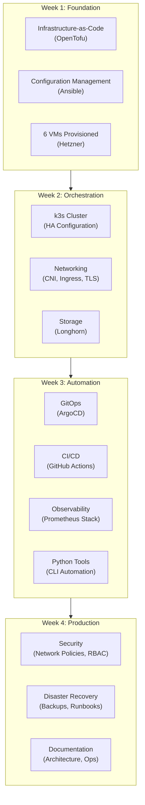
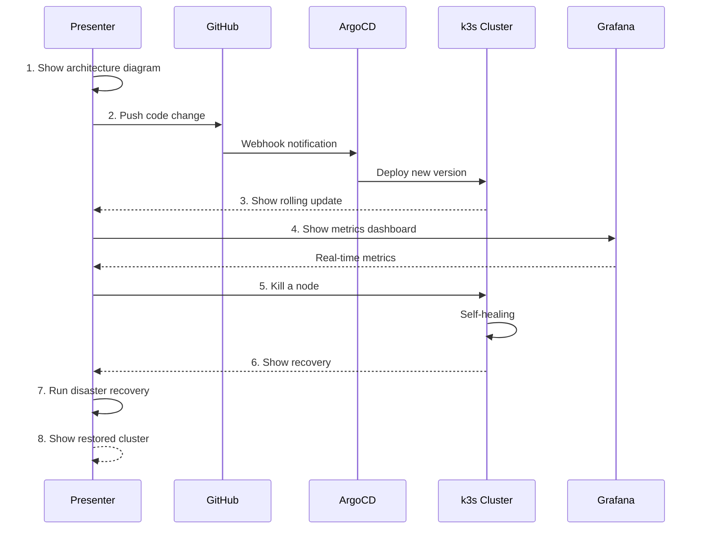

# What You Build

## Deliverables Overview

By the end of 4 weeks, you'll have built a **complete, production-grade infrastructure platform**.

---

## The Complete Platform



---

## Week 1 Artifacts

### Infrastructure Code Repository

```
infra/
├── terraform/
│   ├── modules/
│   │   ├── hetzner-server/
│   │   │   ├── main.tf
│   │   │   ├── variables.tf
│   │   │   └── outputs.tf
│   │   ├── network/
│   │   │   ├── main.tf
│   │   │   ├── variables.tf
│   │   │   └── outputs.tf
│   │   └── k3s-cluster/
│   │       ├── main.tf
│   │       ├── variables.tf
│   │       └── outputs.tf
│   ├── environments/
│   │   ├── dev/
│   │   │   ├── main.tf
│   │   │   ├── variables.tf
│   │   │   └── terraform.tfvars
│   │   └── prod/
│   │       ├── main.tf
│   │       ├── variables.tf
│   │       └── terraform.tfvars
│   └── backend.tf
├── ansible/
│   ├── inventory/
│   │   └── hosts.yml
│   ├── playbooks/
│   │   ├── base-hardening.yml
│   │   └── k3s-install.yml
│   ├── roles/
│   │   ├── common/
│   │   ├── firewall/
│   │   └── k3s/
│   └── ansible.cfg
└── README.md
```

### Key Deliverables

| Artifact | Description | Success Criteria |
|----------|-------------|------------------|
| **OpenTofu modules** | Reusable infrastructure components | `tofu apply` creates cluster from scratch |
| **Ansible playbooks** | Server configuration automation | Playbook runs idempotently |
| **Network config** | Private network, firewall rules | Nodes communicate privately |
| **Documentation** | README with architecture diagram | New team member can understand |

---

## Week 2 Artifacts

### Kubernetes Manifests

```
k8s/
├── base/
│   ├── namespaces/
│   │   ├── production.yaml
│   │   ├── staging.yaml
│   │   └── platform.yaml
│   ├── ingress/
│   │   ├── traefik-config.yaml
│   │   └── middleware.yaml
│   ├── cert-manager/
│   │   ├── cluster-issuer.yaml
│   │   └── certificates.yaml
│   └── storage/
│       ├── longhorn-config.yaml
│       └── storage-classes.yaml
├── apps/
│   └── sample-app/
│       ├── deployment.yaml
│       ├── service.yaml
│       ├── ingress.yaml
│       └── hpa.yaml
└── kustomization.yaml
```

### Key Deliverables

| Artifact | Description | Success Criteria |
|----------|-------------|------------------|
| **HA k3s cluster** | 3 servers + 3 agents | Survives 1 node failure |
| **Ingress controller** | Traefik with TLS | HTTPS endpoint works |
| **Storage** | Longhorn distributed | PVC provisions successfully |
| **Sample app** | Running workload | Accessible via domain |

---

## Week 3 Artifacts

### GitOps Configuration

```
argocd/
├── projects/
│   └── platform.yaml
├── applications/
│   ├── app-of-apps.yaml
│   ├── ingress.yaml
│   ├── cert-manager.yaml
│   ├── monitoring.yaml
│   └── sample-app.yaml
└── applicationsets/
    └── environments.yaml
```

### Observability Stack

```
monitoring/
├── prometheus/
│   ├── values.yaml
│   └── rules/
│       ├── cluster.yaml
│       └── applications.yaml
├── grafana/
│   ├── values.yaml
│   └── dashboards/
│       ├── cluster-overview.json
│       ├── node-exporter.json
│       └── application-red.json
├── loki/
│   └── values.yaml
└── alertmanager/
    ├── values.yaml
    └── config.yaml
```

### Python CLI Tool

```python
# platform_cli/main.py

import click
from rich.console import Console
from kubernetes import client, config

console = Console()

@click.group()
def cli():
    """Platform CLI - Automate common operations"""
    pass

@cli.command()
@click.argument('namespace')
def pods(namespace):
    """List pods in a namespace"""
    config.load_kube_config()
    v1 = client.CoreV1Api()

    pods = v1.list_namespaced_pod(namespace)
    for pod in pods.items:
        status = "✅" if pod.status.phase == "Running" else "❌"
        console.print(f"{status} {pod.metadata.name}")

@cli.command()
@click.argument('deployment')
@click.argument('replicas', type=int)
def scale(deployment, replicas):
    """Scale a deployment"""
    config.load_kube_config()
    apps = client.AppsV1Api()

    body = {"spec": {"replicas": replicas}}
    apps.patch_namespaced_deployment_scale(
        deployment, "production", body
    )
    console.print(f"Scaled {deployment} to {replicas} replicas")

@cli.command()
def status():
    """Show cluster health status"""
    # Implementation
    pass

if __name__ == "__main__":
    cli()
```

### Key Deliverables

| Artifact | Description | Success Criteria |
|----------|-------------|------------------|
| **ArgoCD setup** | GitOps operator | Auto-sync on git push |
| **CI/CD pipeline** | GitHub Actions | Build → Test → Deploy works |
| **Prometheus stack** | Metrics collection | Dashboard shows data |
| **Grafana dashboards** | Visualization | Cluster overview visible |
| **Alert rules** | Critical alerts | Alerts fire to Slack |
| **Python CLI** | Automation tool | Common tasks automated |

---

## Week 4 Artifacts

### Security Configuration

```
security/
├── network-policies/
│   ├── default-deny.yaml
│   ├── allow-dns.yaml
│   ├── allow-ingress.yaml
│   └── allow-monitoring.yaml
├── rbac/
│   ├── cluster-roles.yaml
│   ├── service-accounts.yaml
│   └── role-bindings.yaml
├── secrets/
│   ├── sealed-secrets-controller.yaml
│   └── external-secrets-config.yaml
└── policies/
    └── image-policy.yaml
```

### Documentation

```
docs/
├── architecture/
│   ├── overview.md
│   ├── network-topology.md
│   ├── storage-architecture.md
│   └── diagrams/
│       ├── high-level.mmd
│       └── network.mmd
├── operations/
│   ├── runbooks/
│   │   ├── node-failure.md
│   │   ├── deployment-rollback.md
│   │   └── disaster-recovery.md
│   ├── troubleshooting.md
│   └── common-tasks.md
├── onboarding/
│   ├── developer-setup.md
│   ├── access-request.md
│   └── first-deployment.md
└── decisions/
    ├── adr-001-k3s-over-k8s.md
    ├── adr-002-hetzner-over-aws.md
    └── adr-003-argocd-over-flux.md
```

### Key Deliverables

| Artifact | Description | Success Criteria |
|----------|-------------|------------------|
| **Network policies** | Default deny + explicit allow | Traffic blocked by default |
| **RBAC** | Least privilege access | Users have minimal permissions |
| **Secrets management** | External or sealed secrets | No secrets in Git |
| **DR test** | Cluster restore | Recovery time < 1 hour |
| **Architecture docs** | Complete documentation | Peer review passes |
| **Runbooks** | Incident procedures | Step-by-step guides |
| **Demo video** | Platform walkthrough | 10-15 minute demo |

---

## Demo Scenario

Your final demo should showcase:



### Demo Script

1. **Architecture Overview** (2 min)
   - Show high-level diagram
   - Explain technology choices

2. **Infrastructure-as-Code** (2 min)
   - Show OpenTofu modules
   - Demonstrate `tofu plan`

3. **GitOps Deployment** (3 min)
   - Push a change to Git
   - Watch ArgoCD sync
   - Verify deployment

4. **Observability** (2 min)
   - Show Grafana dashboards
   - Query logs in Loki
   - Show an alert rule

5. **Resilience** (3 min)
   - Kill a pod, watch recovery
   - (Optional) Kill a node

6. **Automation** (2 min)
   - Demo Python CLI tool
   - Show common tasks automated

7. **Q&A** (remaining time)

---

## Portfolio Value

After this internship, you'll have:

### GitHub Repository

- Production-grade IaC
- Complete Kubernetes manifests
- Observability configuration
- Python automation tools
- Comprehensive documentation

### Demonstrated Skills

| Skill | Evidence |
|-------|----------|
| **Infrastructure-as-Code** | OpenTofu modules |
| **Configuration Management** | Ansible playbooks |
| **Kubernetes** | HA cluster operation |
| **GitOps** | ArgoCD implementation |
| **Observability** | Prometheus/Grafana |
| **Security** | Network policies, RBAC |
| **Automation** | Python CLI tools |
| **Documentation** | Architecture, runbooks |

### Talking Points for Interviews

- "I designed and built a production-grade Kubernetes platform from scratch"
- "I implemented GitOps with ArgoCD for automated deployments"
- "I saved 90% on infrastructure costs by using Hetzner over AWS"
- "I built Python automation tools to eliminate operational toil"
- "I documented the architecture and created runbooks for incident response"

---

## Related

- [Before You Begin](./01-Before-You-Begin.md)
- [Week-by-Week](./02-Week-by-Week.md)
- [Your Role](./04-Your-Role.md)
- [Architecture](../02-Engineering/01-Architecture.md)

---

*Last Updated: 2026-02-02*
