# What You Build: ContentAI

## The Product You're Creating

By the end of 4 weeks, you'll have built **ContentAI**—a real, working AI-powered content platform with production-grade infrastructure.

---

## ContentAI: The Complete Product


---

## Week 1: Foundation

### What You Build

The cloud infrastructure that will run ContentAI.

```
infra/
├── terraform/
│   ├── modules/
│   │   ├── hetzner-server/     # VM provisioning
│   │   ├── network/            # Private networking
│   │   └── k3s-cluster/        # Cluster foundation
│   └── environments/
│       ├── dev/                # Development setup
│       └── prod/               # Production setup
├── ansible/
│   ├── playbooks/
│   │   ├── base-hardening.yml  # Security basics
│   │   └── k3s-install.yml     # Kubernetes setup
│   └── roles/
│       ├── common/             # Base server config
│       └── k3s/                # Kubernetes roles
└── README.md
```

### Success Criteria

| Artifact | Description | Success Test |
|----------|-------------|--------------|
| **OpenTofu modules** | Infrastructure code | `tofu apply` creates cluster |
| **Ansible playbooks** | Server configuration | Idempotent runs |
| **Network config** | Private cluster network | Nodes communicate |
| **Documentation** | Architecture diagram | Team can understand |

---

## Week 2: The Product (ContentAI Core)

### What You Build

The actual ContentAI product—this is why infrastructure exists.

```
contentai/
├── strapi/
│   ├── deployment.yaml         # Strapi CMS
│   ├── service.yaml
│   ├── ingress.yaml            # HTTPS endpoint
│   └── config/
│       └── plugins.js          # AI plugin config
├── database/
│   ├── postgresql/
│   │   ├── statefulset.yaml    # HA database
│   │   └── service.yaml
│   └── redis/
│       └── deployment.yaml     # Caching layer
├── ai-services/
│   ├── content-generator/      # AI content generation
│   │   ├── deployment.yaml
│   │   └── configmap.yaml      # API keys, prompts
│   └── summarizer/             # Document summarization
│       └── deployment.yaml
└── search/
    └── meilisearch/
        └── deployment.yaml     # Fast content search
```

### ContentAI Features You'll Deploy

| Component | What It Does | User Value |
|-----------|--------------|------------|
| **Strapi CMS** | Headless content management | Creators manage content |
| **PostgreSQL** | Persistent data storage | Reliable content storage |
| **AI Content Generator** | Generate text from prompts | 10x content creation speed |
| **AI Summarizer** | Summarize long documents | Save hours of reading |
| **Meilisearch** | Fast full-text search | Find content instantly |
| **Redis** | Caching layer | Sub-100ms responses |

### Success Criteria

| Artifact | Description | Success Test |
|----------|-------------|--------------|
| **Strapi running** | CMS accessible | Can create content types |
| **AI integration** | Content generation works | Prompt → Generated text |
| **Database** | PostgreSQL operational | Data persists across restarts |
| **Search** | Meilisearch indexed | Search returns results |
| **HTTPS endpoint** | TLS certificates | `https://contentai.yourdomain.com` works |

---

## Week 3: Scale (Automation & Observability)

### What You Build

The automation that lets ContentAI scale.

```
platform/
├── argocd/
│   ├── projects/
│   │   └── contentai.yaml      # ContentAI project
│   ├── applications/
│   │   ├── app-of-apps.yaml    # Manages all apps
│   │   ├── strapi.yaml         # CMS deployment
│   │   ├── ai-services.yaml    # AI services
│   │   ├── database.yaml       # PostgreSQL
│   │   └── monitoring.yaml     # Observability
│   └── applicationsets/
│       └── environments.yaml   # Multi-env support
├── monitoring/
│   ├── prometheus/
│   │   ├── values.yaml
│   │   └── rules/
│   │       ├── contentai.yaml  # Product metrics
│   │       └── cluster.yaml    # Platform metrics
│   ├── grafana/
│   │   ├── values.yaml
│   │   └── dashboards/
│   │       ├── contentai-overview.json
│   │       ├── ai-generation-metrics.json
│   │       └── api-latency.json
│   └── loki/
│       └── values.yaml
└── ci/
    └── .github/
        └── workflows/
            ├── build.yaml      # Build containers
            ├── test.yaml       # Run tests
            └── deploy.yaml     # Trigger ArgoCD
```

### ContentAI Dashboards


### Success Criteria

| Artifact | Description | Success Test |
|----------|-------------|--------------|
| **GitOps** | ArgoCD manages everything | Git push → Auto deploy |
| **CI/CD** | Automated pipeline | PR → Build → Test → Deploy |
| **Metrics** | Prometheus collecting | Dashboard shows real data |
| **Logs** | Loki aggregating | Can search logs |
| **Alerts** | Critical alerts fire | Slack notification works |

---

## Week 4: Launch Ready (Security & Polish)

### What You Build

Production hardening to make ContentAI ready for real users.

```
security/
├── network-policies/
│   ├── default-deny.yaml       # Block all by default
│   ├── allow-strapi.yaml       # Strapi → PostgreSQL
│   ├── allow-ai.yaml           # Strapi → AI services
│   └── allow-monitoring.yaml   # Prometheus scraping
├── rbac/
│   ├── contentai-admin.yaml    # Admin access
│   ├── contentai-viewer.yaml   # Read-only access
│   └── ci-deployer.yaml        # CI service account
├── secrets/
│   ├── sealed-secrets/
│   │   ├── database-creds.yaml
│   │   ├── ai-api-keys.yaml
│   │   └── strapi-keys.yaml
│   └── external-secrets/
│       └── config.yaml
└── policies/
    └── image-policy.yaml       # Only trusted images

docs/
├── product/
│   ├── contentai-overview.md   # What the product does
│   ├── api-documentation.md    # GraphQL/REST docs
│   └── user-guide.md           # How to use it
├── architecture/
│   ├── system-overview.md
│   ├── data-flow.md
│   └── diagrams/
├── operations/
│   ├── runbooks/
│   │   ├── strapi-restart.md
│   │   ├── database-recovery.md
│   │   └── ai-service-failure.md
│   └── troubleshooting.md
└── decisions/
    ├── adr-001-strapi-over-alternatives.md
    ├── adr-002-hetzner-over-aws.md
    └── adr-003-claude-api-integration.md
```

### Success Criteria

| Artifact | Description | Success Test |
|----------|-------------|--------------|
| **Network policies** | Default deny | Unauthorized traffic blocked |
| **Secrets management** | No secrets in Git | Sealed secrets work |
| **RBAC** | Least privilege | Limited access by role |
| **DR test** | Full recovery | Restore ContentAI from backup |
| **Documentation** | Complete | New person can understand |
| **Demo** | 15 min walkthrough | Shows working product |

---

## Demo Day: Showcasing ContentAI

Your final demo tells the story of building a startup:


### Demo Script

1. **The Product** (3 min)
   - Show ContentAI in action
   - Create content with AI generation
   - Demonstrate search

2. **The Architecture** (2 min)
   - High-level diagram
   - How product and platform connect

3. **GitOps in Action** (3 min)
   - Push a code change
   - Watch ArgoCD sync
   - See new feature deployed

4. **Observability** (2 min)
   - Content creation metrics
   - AI cost tracking
   - API latency dashboard

5. **Resilience** (2 min)
   - Kill a pod, watch recovery
   - Show self-healing

6. **Q&A** (remaining time)

---

## Your Portfolio After This

### What You Can Show

| Artifact | Description |
|----------|-------------|
| **GitHub Repository** | Production IaC, K8s manifests, CI/CD |
| **Live Product** | Working ContentAI (if infra still up) |
| **Documentation** | Architecture docs, runbooks, ADRs |
| **Demo Video** | 15-min recorded walkthrough |

### Interview Talking Points

```
✅ "I built an AI-powered content platform from scratch—Strapi CMS with Claude API integration"
✅ "I deployed the entire product on Kubernetes with GitOps automation"
✅ "I saved 90% on infrastructure costs by using Hetzner over AWS"
✅ "I built observability that tracks AI generation costs in real-time"
✅ "I designed the platform that could scale from 0 to millions of users"
```

### Skills Demonstrated

| Category | What You Built |
|----------|----------------|
| **Product** | AI-powered content platform |
| **Infrastructure** | OpenTofu modules, Ansible playbooks |
| **Kubernetes** | HA cluster with production workloads |
| **GitOps** | ArgoCD managing real applications |
| **Observability** | Prometheus/Grafana with custom dashboards |
| **Security** | Network policies, RBAC, secrets management |
| **Documentation** | Architecture, operations, decisions |

---

## The Difference

```mermaid
flowchart LR
    subgraph Traditional["Other DevOps Internships"]
        T1["Built a CI pipeline"]
        T2["Deployed nginx"]
        T3["Infrastructure project"]
    end

    subgraph ContentAI["This Internship"]
        P1["Built a real product"]
        P2["Deployed AI services"]
        P3["Startup from scratch"]
    end

    Traditional -.->|"Generic portfolio"| X["🤷"]
    ContentAI -.->|"Founder-level experience"| Y["🚀"]
```



---

## Related

- [Before You Begin](./01-Before-You-Begin.md)
- [Week-by-Week](./02-Week-by-Week.md)
- [Your Role](./04-Your-Role.md)
- [Vision](../01-Product/01-Vision.md)

---

*Last Updated: 2026-02-02*
