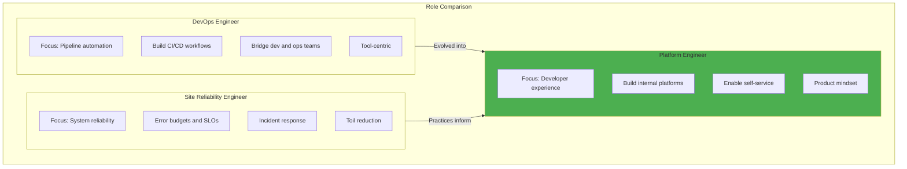
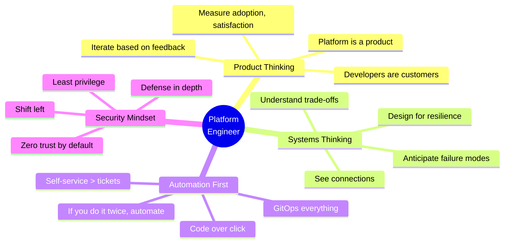
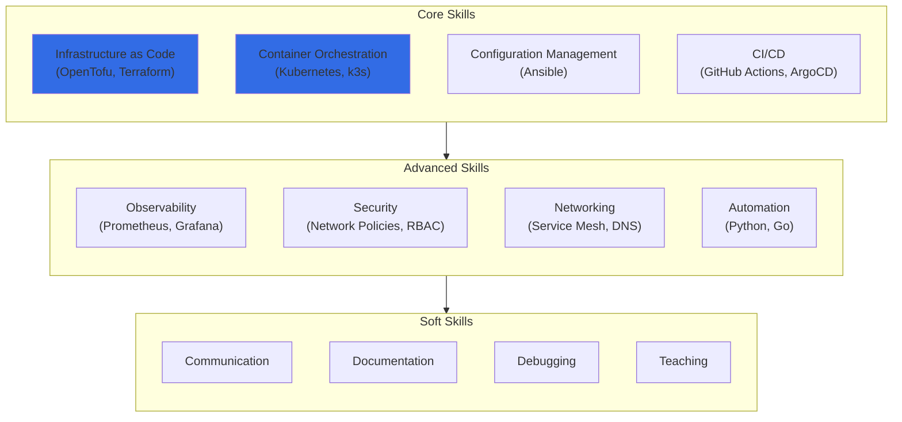
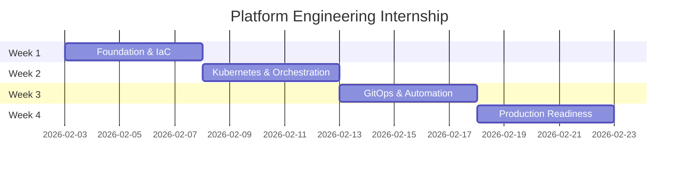
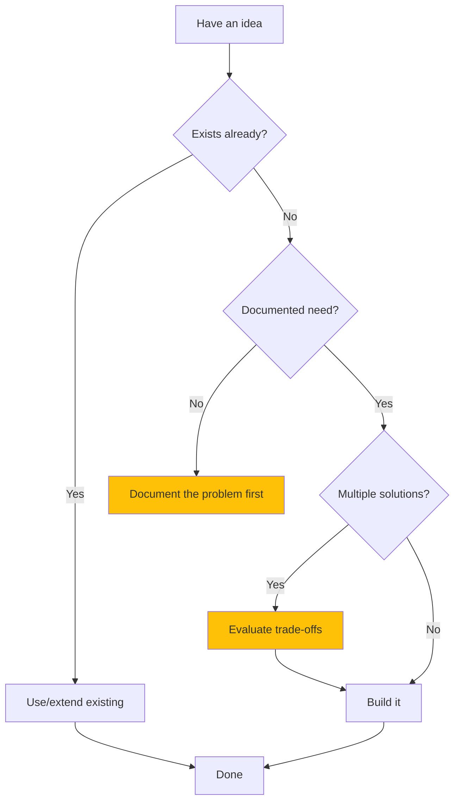
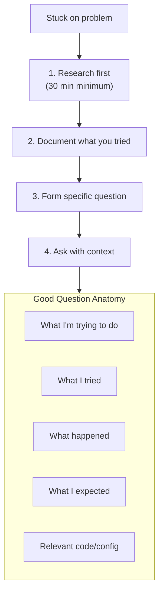
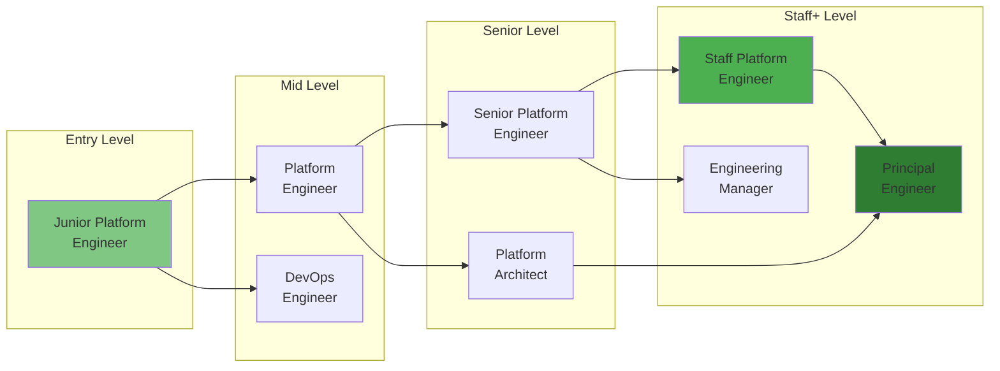

# Your Role: Platform Engineer

> *"A Platform team enables stream-aligned teams to deliver work with substantial autonomy."*
> — **Team Topologies** (Skelton & Pais)

## What Platform Engineers Do

> *Platform engineers build the roads that let developers drive fast without crashing. We create leverage—one hour of platform work saves hundreds of developer hours.*

---

## Platform Engineer vs DevOps vs SRE



### Role Characteristics

| Aspect | DevOps | SRE | Platform Engineering |
|--------|--------|-----|----------------------|
| **Primary Focus** | Process automation | Reliability | Developer productivity |
| **Customers** | Development teams | End users | Developers (internal) |
| **Metrics** | Deployment frequency | SLOs, error budgets | DORA metrics, adoption |
| **Output** | Pipelines, scripts | Runbooks, incident response | Self-service platforms |
| **Mindset** | Tool-centric | Operations-centric | Product-centric |

---

## The Platform Engineer Mindset

> *"The Three Ways: Flow (left to right), Feedback (right to left), and Continual Learning and Experimentation."*
> — **The Phoenix Project** (Kim, Behr, Spafford)



---

## Daily Responsibilities

```mermaid
flowchart LR
    subgraph Morning["Morning"]
        M1["Check alerts, dashboards"]
        M2["Review PRs"]
        M3["Triage issues"]
    end

    subgraph Build["Build Time"]
        B1["Design infrastructure"]
        B2["Write IaC code"]
        B3["Build automation"]
        B4["Create documentation"]
    end

    subgraph Support["Support"]
        S1["Unblock developers"]
        S2["Investigate issues"]
        S3["Improve golden paths"]
    end

    subgraph Learn["Continuous Learning"]
        L1["Research new tools"]
        L2["Evaluate trade-offs"]
        L3["Share knowledge"]
    end

    Morning --> Build --> Support --> Learn
```



### Typical Day Breakdown

| Activity | Time | Examples |
|----------|------|----------|
| **Observability Review** | 30 min | Check Grafana, review overnight alerts |
| **Deep Work: Building** | 4 hours | OpenTofu modules, Ansible playbooks, CLI tools |
| **Code Review** | 1 hour | Review infrastructure PRs, provide feedback |
| **Developer Support** | 1 hour | Unblock teams, answer questions, debug issues |
| **Documentation** | 1 hour | Update runbooks, write ADRs, improve guides |
| **Learning** | 30 min | Read docs, try new tools, attend talks |

---

## Core Skills

> *"Toil is the kind of work that tends to be manual, repetitive, automatable, tactical, devoid of enduring value, and that scales linearly as a service grows."*
> — **Site Reliability Engineering** (Google)

### Technical Skills



### Skill Progression

| Level | Skills | Outcomes |
|-------|--------|----------|
| **Junior** | Linux, Git, Docker, basic Ansible | Deploy single apps, follow runbooks |
| **Mid** | OpenTofu, Kubernetes, CI/CD, monitoring | Design modules, build pipelines |
| **Senior** | Architecture, security, automation, strategy | Lead platform initiatives, mentor |
| **Staff** | Org-wide impact, vendor evaluation, culture | Shape technical direction |

---

## Your Internship Journey



### Week-by-Week Growth

| Week | You Start As | You End As |
|------|--------------|------------|
| **Week 1** | "I can SSH into a server" | "I provision infrastructure with code" |
| **Week 2** | "I can run kubectl commands" | "I manage a HA Kubernetes cluster" |
| **Week 3** | "I manually deploy apps" | "I have GitOps automating everything" |
| **Week 4** | "I hope it doesn't break" | "I have monitoring, alerting, and runbooks" |

---

## The Builder's Checklist

### Before You Build



### Building Checklist

- [ ] **Problem documented** — What am I solving? Why does it matter?
- [ ] **Alternatives evaluated** — Is there an existing solution?
- [ ] **Design reviewed** — Did I get feedback before building?
- [ ] **Tests written** — How will I know it works?
- [ ] **Documentation updated** — Can someone else use this?
- [ ] **Monitoring added** — How will I know if it breaks?

---

## Communication Patterns

### How to Ask for Help



### Question Template

```markdown
## Context
I'm working on [task] in [project].

## Goal
I'm trying to [specific goal].

## What I Tried
1. [First approach] — [what happened]
2. [Second approach] — [what happened]

## Error/Behavior
```
[paste error message or unexpected behavior]
```

## Expected
I expected [specific expected behavior].

## Question
[Specific question about the blocker]
```

---

## Career Path



### What Gets You Promoted

| From → To | What Demonstrates Readiness |
|-----------|----------------------------|
| **Junior → Mid** | Owns features end-to-end, unblocks self |
| **Mid → Senior** | Designs systems, mentors juniors, handles ambiguity |
| **Senior → Staff** | Org-wide impact, technical strategy, grows others |

---

## Resources for Growth

### Books

| Book | Focus |
|------|-------|
| *Site Reliability Engineering* (Google) | SRE principles |
| *The Phoenix Project* | DevOps culture |
| *Infrastructure as Code* (Kief Morris) | IaC patterns |
| *Kubernetes Up & Running* | Container orchestration |
| *Team Topologies* | Platform team design |

### Certifications (Optional)

| Certification | Value |
|---------------|-------|
| CKA (Certified Kubernetes Administrator) | Validates K8s skills |
| AWS Solutions Architect | Cloud architecture |
| HashiCorp Terraform Associate | IaC fundamentals |

### Communities

- **CNCF Slack** — Cloud-native discussions
- **r/devops, r/kubernetes** — Peer learning
- **Platform Engineering Slack** — Platform-specific
- **Local meetups** — Networking

---

## Your Success Metrics

### During Internship

| Metric | Target | How |
|--------|--------|-----|
| **Infrastructure deployed** | Full cluster | Week 2 |
| **Automation coverage** | 80%+ GitOps | Week 3 |
| **Documentation** | Complete | Week 4 |
| **Demo quality** | Production-grade | Week 4 |

### After Internship

| Metric | Sign of Success |
|--------|-----------------|
| **Portfolio** | Can demonstrate what you built |
| **Knowledge** | Can explain architectural decisions |
| **Network** | Have references for future opportunities |
| **Skills** | Can interview for platform roles |

---

## Related

- [Week by Week](./02-Week-by-Week.md)
- [What You Build](./03-What-You-Build.md)
- [Architecture](../02-Engineering/01-Architecture.md)

---

*Last Updated: 2026-02-02*
