# Your Role: Founding Engineer

> *"The best engineers I know treat every project as if it were their own startup."*
> — Anonymous Startup CTO

## What You Are (and What You're Not)

You're not a "DevOps intern." **You're a founding engineer building ContentAI.**

---

## The Founding Engineer vs DevOps vs Platform Engineer


### What Makes a Founding Engineer Different

| Aspect | DevOps | Platform Engineer | Founding Engineer |
|--------|--------|-------------------|-------------------|
| **Primary Focus** | Infrastructure | Developer experience | **The product** |
| **Customers** | Development teams | Developers (internal) | **End users** |
| **Measures** | Uptime, deployments | DORA metrics | **User adoption, revenue** |
| **Thinks About** | "Is it deployed?" | "Can devs use it?" | **"Do users love it?"** |
| **Infrastructure Is** | The job | A product | **A means to an end** |

---

## Your Mindset: Product-First

> *"The best startups seem to start from scratch. The founders just decided what they wanted to build, then built it."*
> — **Paul Graham**, Y Combinator


---

## What You Own During This Internship

### The ContentAI Stack (All of It)


**You own the entire stack.** Not just the infrastructure—the product.

---

## Daily Responsibilities

### What a Day Looks Like


### Typical Time Breakdown

| Activity | Time | Examples |
|----------|------|----------|
| **Product check** | 15 min | Is Strapi up? AI services responding? |
| **Deep work: Building** | 4 hours | Infrastructure, deployments, features |
| **Testing & Verification** | 1.5 hours | Does it work? Is it secure? |
| **Documentation** | 1 hour | Update runbooks, architecture docs |
| **Learning & Research** | 1 hour | Read docs, debug blockers |

---

## The Founder's Checklist

### Before Building Anything


### Building Checklist

- [ ] **Problem documented** — What user problem does this solve?
- [ ] **Alternatives evaluated** — Is there an existing solution?
- [ ] **Design reviewed** — Does this fit ContentAI's architecture?
- [ ] **Tests written** — How will I know it works?
- [ ] **Documentation updated** — Can someone else understand this?
- [ ] **Monitoring added** — How will I know if it breaks?

---

## Skills You'll Develop

### Technical Skills


### Soft Skills

| Skill | How You Develop It |
|-------|-------------------|
| **Decision Making** | Choosing between alternatives (Redis vs Memcached) |
| **Documentation** | Writing architecture docs, runbooks |
| **Communication** | Explaining what you built and why |
| **Problem Solving** | Debugging production issues |
| **Prioritization** | Deciding what to build first |

---

## Your Week-by-Week Growth

| Week | You Start As | You End As |
|------|--------------|------------|
| **Week 1** | "I can run Terraform" | "I provision infrastructure for ContentAI" |
| **Week 2** | "I can use Kubernetes" | "I run a production CMS with AI" |
| **Week 3** | "I deploy manually" | "ContentAI deploys itself via GitOps" |
| **Week 4** | "I hope it works" | "ContentAI is monitored, secure, and documented" |

---

## Communication Patterns

### How to Ask for Help


### Question Template

```markdown
## Context
I'm working on [ContentAI feature] in [week/exercise].

## Goal
I'm trying to [specific goal].

## What I Tried
1. [First approach] — [what happened]
2. [Second approach] — [what happened]

## Error/Behavior
```
[paste error message or unexpected behavior]
```

## Expected
I expected [specific expected behavior].

## Question
[Specific question about the blocker]
```

---

## Career Trajectory

This internship demonstrates skills for multiple paths:


### What Gets You Noticed

| Achievement | What It Demonstrates |
|-------------|---------------------|
| **Built ContentAI end-to-end** | Full-stack ownership |
| **Integrated AI services** | Modern tech adoption |
| **GitOps automation** | Infrastructure maturity |
| **Production-ready security** | Security mindset |
| **Clear documentation** | Communication skills |
| **Handled production issues** | Incident response |

---

## Your Success Metrics

### During Internship

| Metric | Target | How |
|--------|--------|-----|
| **ContentAI running** | Week 2 | Product deployed |
| **AI integration** | Week 2 | Content generation works |
| **GitOps coverage** | Week 3 | 100% managed by ArgoCD |
| **Documentation** | Week 4 | Complete and accurate |
| **Demo quality** | Week 4 | Can show to investors |

### After Internship

| Metric | Sign of Success |
|--------|-----------------|
| **Portfolio** | Can demo ContentAI live |
| **Knowledge** | Can explain any architectural decision |
| **Network** | Have references from PearlThoughts |
| **Skills** | Can interview for founding engineer roles |

---

## The Difference This Makes

```mermaid
flowchart LR
    subgraph Other["Other Internships"]
        O1["Learned Terraform"]
        O2["Deployed nginx"]
        O3["Set up CI/CD"]
    end

    subgraph You["ContentAI Internship"]
        Y1["Built an AI content platform"]
        Y2["Full-stack from infra to AI"]
        Y3["Production-ready in 4 weeks"]
    end

    Other -.->|"Generic skills"| X["🤷"]
    You -.->|"Startup-ready"| Y["🚀"]

    style You fill:#4CAF50
```



---

## Related

- [Vision](../01-Product/01-Vision.md) — What ContentAI is
- [Week by Week](./02-Week-by-Week.md) — Your timeline
- [What You Build](./03-What-You-Build.md) — Technical deliverables
- [Architecture](../02-Engineering/01-Architecture.md) — How it all fits together

---

*Last Updated: 2026-02-02*
