# Communication Culture: The Human Side of Platform Engineering

> *"We don't just debug systems. We work with people who are having hard days, facing deadlines, and trying their best."*

## Why This Matters

Platform engineering isn't just about servers, containers, and code. **It's about people building things together.** The best technical teams fail when communication breaks down. The most challenging bugs get solved when people collaborate kindly.


---

## The Platform Team Reality

When you join a platform team, you become the person others come to when things are broken. This creates specific interpersonal dynamics:

| Situation | What They Feel | What You Should Remember |
|-----------|----------------|-------------------------|
| **Production is down** | Panic, stress, blame-seeking | They're not attacking you personally |
| **Feature is delayed** | Frustration, pressure from above | They need solutions, not excuses |
| **Something is confusing** | Embarrassment, fear of looking stupid | Everyone was a beginner once |
| **Request was denied** | Rejection, confusion | Explain the "why" with empathy |

---

## The Gentle Art of Technical Communication

### 1. Assume Good Intent

Before you respond to a message that feels rude or demanding, pause. Consider:

```mermaid
flowchart LR
    Message["Incoming Message"] --> Pause["Pause ⏸️"]
    Pause --> Ask["Ask yourself:"]
    Ask --> Q1["Are they stressed?"]
    Ask --> Q2["Do they know the context?"]
    Ask --> Q3["What do they actually need?"]
    Q1 --> Response["Respond with empathy"]
    Q2 --> Response
    Q3 --> Response

    style Pause fill:#FFD700
```



**Example:**

| Received | Reactive Response (❌) | Empathetic Response (✅) |
|----------|----------------------|-------------------------|
| "Why is deployment broken AGAIN?" | "It's not broken, you're using it wrong." | "I see the frustration. Let me check what happened and get back to you in 10 minutes." |
| "This should be simple!" | "Well it's not, deal with it." | "I understand it feels like it should be simpler. Let me walk you through why it works this way." |
| "Who approved this change?" | "Why does it matter?" | "I did. Here's the context behind the decision. Happy to discuss." |

---

### 2. Separate the Problem from the Person

When debugging issues caused by others:

```
❌ "You broke the deployment"
✅ "The deployment is having issues. Let's figure out what happened."

❌ "Your code caused the outage"
✅ "There's something in the recent changes causing problems. Let's look together."

❌ "Didn't you test this?"
✅ "I'm seeing unexpected behavior. Was there specific testing that covered this case?"
```

**The rule:** Attack the problem, never the person.

---

### 3. The Praise/Critique Balance

When reviewing someone's work or giving feedback:

| Type | Poor Approach | Better Approach |
|------|---------------|-----------------|
| **Critique** | "This is wrong" | "This approach has a potential issue with X. What if we tried Y?" |
| **Suggestion** | "You should do X" | "One option could be X. What do you think?" |
| **Praise** | (Often forgotten) | "Nice solution for the caching problem!" |


---

## Handling Conflict

Conflict is normal. How you handle it defines your career.

### The HEAT Framework

When someone is upset:

```
H - Hear them out (don't interrupt)
E - Empathize with their situation
A - Apologize if appropriate (or acknowledge their frustration)
T - Take action or explain next steps
```

**Example scenario:** A developer is upset because their feature can't be deployed.

```
❌ Bad:
"That's not a platform issue, talk to your manager."

✅ Good:
"I hear you — it's frustrating when you're ready to ship and something blocks you.
Let me understand what's happening... [listen]
I can see why this feels like a blocker.
Here's what I can do: [action] or [explain constraints]
Let's check back in an hour?"
```

---

## Written Communication Excellence

Since this internship is remote, most communication is written. Written words lack tone, so:

### Be Explicit About Intent

```
❌ "This won't work"
   (Sounds dismissive)

✅ "I don't think this approach will work because of X.
   What if we tried Y instead? Happy to chat if useful."
   (Explains why, offers alternative, invites dialogue)
```

### Use Emoji Intentionally (Not Excessively)

| Emoji | Conveys |
|-------|---------|
| 👍 | Acknowledgment |
| 🙏 | Gratitude |
| 🤔 | Thinking/considering |
| ✅ | Done/approved |
| ⚠️ | Warning/caution |

Use sparingly. Too many emojis can feel unprofessional.

### The "Read Aloud" Test

Before sending a message:
1. Read it out loud
2. Would you say this to their face?
3. Could it be misinterpreted?
4. Is it necessary? Kind? True?

---

## Code Reviews: The Ultimate Test

Code reviews are where communication skills shine or fail.

### The Reviewer's Mindset


| Instead of... | Try... |
|---------------|--------|
| "Why did you do it this way?" | "I'm curious about the approach here. What led to this design?" |
| "This is inefficient" | "I wonder if we could optimize this. What if we...?" |
| "You missed error handling" | "What happens if this fails? Maybe we need error handling here?" |
| "Wrong" | "This might cause issues because X. Consider Y?" |

### Receiving Feedback

When someone reviews your code:

1. **Don't take it personally** — they're reviewing code, not you
2. **Assume good intent** — they want to help improve the code
3. **Ask for clarification** — "Can you help me understand why?"
4. **Say thank you** — even for tough feedback

---

## The Platform Engineer's Creed


---

## Real-World Scenarios

### Scenario 1: The 2 AM Page

**Situation:** You're paged at 2 AM. The person who deployed the breaking change is asleep.

**Your response (next morning):**

```
❌ "Your deployment last night woke me up at 2 AM"

✅ "Hey, we had an incident last night related to the recent deployment.
I've documented what happened here: [link].
No blame — these things happen. Let's add a test to prevent this?"
```

### Scenario 2: The Frustrated Developer

**Situation:** A developer is frustrated because the CI is slow.

```
❌ "The CI is fine, your tests are just slow"

✅ "I understand CI wait times are frustrating.
Looking at your build, I see the tests take 15 minutes.
A few options:
1. We could parallelize the test suite
2. I can look at caching improvements
What would be most helpful?"
```

### Scenario 3: The Unreasonable Request

**Situation:** Someone asks for something that would compromise security.

```
❌ "No, that's a security risk"

✅ "I want to help you get what you need, but that specific approach
has security implications: [brief explanation].
Can you tell me more about what you're trying to accomplish?
There might be another way to achieve the same goal safely."
```

---

## Daily Practices

| Practice | What It Looks Like |
|----------|-------------------|
| **Morning check-in** | "Good morning! I'll be focusing on X today" |
| **Acknowledge messages** | Even a 👍 shows you saw it |
| **Share blockers early** | "Heads up, I'm stuck on X. Might need help" |
| **Celebrate wins** | "Nice work on the fix yesterday!" |
| **End-of-day update** | "Wrapped up X, continuing Y tomorrow" |

---

## Related

- [Remote & Async Working](./06-Remote-Async-Working.md) — How to communicate effectively remotely
- [Before You Begin](./01-Before-You-Begin.md) — The mindset for this journey
- [Your Role](./04-Your-Role.md) — What we expect from you

---

*"Technical skills get you hired. Communication skills get you promoted."*

---

*Last Updated: 2026-02-02*
