# Remote & Async Working: The GitLab Way

> *"Remote work isn't about working from home. It's about working differently — better."*

This internship is **100% remote**. That means you'll never bump into someone at the coffee machine. You won't overhear conversations that give you context. You can't tap someone on the shoulder for a quick question.

**This is a superpower, not a limitation — if you learn to use it.**

---

## Why Async-First Matters

```mermaid
flowchart TB
    subgraph Sync["🗓️ SYNCHRONOUS (Meetings)"]
        S1["Everyone must be available<br/>at the same time"]
        S2["Context lost after meeting"]
        S3["Excludes different timezones"]
        S4["Interrupts deep work"]
    end

    subgraph Async["📝 ASYNCHRONOUS (Written)"]
        A1["Work at your optimal time"]
        A2["Context preserved forever"]
        A3["Includes all timezones"]
        A4["Protects deep work"]
    end

    Sync -.->|"Old way"| X["Limited scale"]
    Async -->|"Better way"| Y["Global collaboration"]

    style Async fill:#4CAF50
```



GitLab, one of the world's largest all-remote companies, has proven this works at scale with 2,000+ employees across 65+ countries. Their [handbook](https://handbook.gitlab.com/handbook/company/culture/all-remote/) is the gold standard.

---

## The Async-First Principles

### 1. Write Things Down

**If it's not written, it didn't happen.**

| Instead of... | Do this... |
|---------------|------------|
| Quick call to explain | Write a document, share it, then offer to discuss |
| Verbal agreement | Confirm in writing (Teams message, comment) |
| "I told them yesterday" | "Here's the link where I documented it" |
| Slack huddle for decisions | Write proposal → collect feedback → document decision |

```mermaid
flowchart LR
    Idea["💡 Idea"] --> Document["📝 Write it down"]
    Document --> Share["📤 Share for feedback"]
    Share --> Async["⏰ Give time to respond"]
    Async --> Decide["✅ Document decision"]
    Decide --> Archive["🗄️ Accessible forever"]

    style Document fill:#4CAF50
```



---

### 2. Assume Nothing About Availability

In an async-first world:

```
❌ "I need this by end of day"
   (Their "end of day" might be midnight for you)

✅ "Can you review this by Wednesday 17:00 UTC?"
   (Clear, timezone-aware deadline)

❌ "Let's hop on a quick call"
   (Might interrupt their deep work)

✅ "I've documented the issue here: [link]
   Let me know if you'd prefer a call to discuss,
   otherwise async feedback works for me."
```

---

### 3. Over-Communicate, Then Communicate More

Remote work creates information vacuums. Fill them proactively.

| Do This | Don't Do This |
|---------|---------------|
| "Starting work on the k3s task" | Silently begin working |
| "Blocked on X, tried Y and Z" | "Stuck" (no context) |
| "Taking a break, back in 30" | Disappear for hours |
| "Wrapping up, here's progress: [link]" | End day without update |
| "OOO tomorrow, emergency contact: X" | Just... not show up |

```mermaid
timeline
    title Daily Communication Rhythm

    section Morning
        08:00-09:00 : Check messages
                    : Review async updates
                    : Share your plan for the day

    section Mid-day
        12:00-13:00 : Share progress or blockers
                    : Respond to async questions

    section End of Day
        17:00-18:00 : Document what you accomplished
                    : Note any blockers or open questions
                    : Set expectations for tomorrow
```

---

## The GitLab Handbook: Key Principles

These principles come from [GitLab's all-remote guide](https://handbook.gitlab.com/handbook/company/culture/all-remote/guide/):

### Low-Context Communication

> *"Write as if the reader has no context, because they probably don't."*

| High-Context (❌) | Low-Context (✅) |
|------------------|-----------------|
| "As we discussed" | "As documented in [link], we decided X" |
| "The usual process" | "Following our deploy process at [link]" |
| "You know how it is" | "This happens because X. Details at [link]" |
| "Fix the thing" | "Please update config Y in file Z because A" |

### Handbook-First

> *"If the answer isn't in the handbook, add it."*

For us, "the handbook" means this Obsidian vault.

```mermaid
flowchart TD
    Question["🤔 Question arises"] --> Search["Search documentation"]
    Search --> Found{"Found answer?"}
    Found -->|"Yes"| Use["Use it"]
    Found -->|"No"| Ask["Ask and get answer"]
    Ask --> Document["Add to documentation"]
    Document --> PR["Create PR to update"]
    PR --> Future["Future you thanks you"]

    style Document fill:#4CAF50
```



### Bias Towards Action

> *"Propose solutions, not just problems."*

```
❌ "The CI is slow"

✅ "The CI is slow. I investigated and found:
   - Test parallelization is disabled
   - Docker layer caching isn't working
   I propose we:
   1. Enable parallelization (details at [link])
   2. Fix caching (I can PR this tomorrow)
   What do you think?"
```

---

## Practical Async Workflows

### Making a Decision


**Template for proposals:**

```markdown
## Problem
[What are we solving?]

## Options
1. Option A: [description]
   - Pros: ...
   - Cons: ...
2. Option B: [description]
   - Pros: ...
   - Cons: ...

## Recommendation
[Which option and why]

## Feedback Request
Please comment by [date] with:
- Questions
- Concerns
- Alternative suggestions
```

### Asking for Help

```markdown
## What I'm Trying to Do
[Goal/context]

## What I've Tried
1. [Attempt 1] - Result: [what happened]
2. [Attempt 2] - Result: [what happened]
3. [Attempt 3] - Result: [what happened]

## Where I'm Stuck
[Specific question/blocker]

## What I Think Might Work
[Your hypothesis, if any]

## Relevant Links
- Error logs: [link]
- Related docs: [link]
- Previous attempts: [link]
```

---

## Time Zones and Scheduling

### Be Explicit About Times

```
❌ "Let's meet at 3 PM"
   (3 PM where?)

✅ "Let's meet at 15:00 UTC (that's 20:30 IST, 10:00 EST)"
```

**Tools:**
- [worldtimebuddy.com](https://www.worldtimebuddy.com/) — Compare timezones
- Add multiple clocks to your computer
- Always specify timezone or use UTC

### Respect Focus Time

```mermaid
flowchart LR
    subgraph Urgency["📊 URGENCY MATRIX"]
        U1["🔴 URGENT: Call/page\n(production down)"]
        U2["🟠 IMPORTANT: Message\n(need response today)"]
        U3["🟡 NORMAL: Document\n(can wait 24-48h)"]
        U4["🟢 FYI: Update vault\n(no response needed)"]
    end
```



---

## Tools for Async Success

| Tool | Use For | Async Benefit |
|------|---------|---------------|
| **Teams/Slack** | Quick questions, status updates | Async by default, searchable |
| **GitHub Issues** | Task tracking, discussions | Threaded, referenceable |
| **Obsidian/Docs** | Knowledge, decisions | Permanent, discoverable |
| **Loom** | Explanations, demos | Watch at 2x speed, rewatch |
| **PRs/Code Review** | Code feedback | Detailed, traceable |

### When to Use Video (Sparingly)

✅ Use video for:
- Onboarding/introductions
- Complex debugging sessions
- Conflict resolution
- Celebrations/team bonding

❌ Don't use video for:
- Status updates
- Simple questions
- Information that should be documented
- Decisions (document afterward!)

---

## The Daily Standup (Async Version)

Instead of a meeting, post daily in your team channel:

```markdown
## Yesterday
- Completed X
- Made progress on Y

## Today
- Working on Z
- Planning to review PR #123

## Blockers
- Waiting on decision about [topic]
- Need access to [resource]

## Notes
- OOO tomorrow afternoon
```

**Benefits:**
- Works across timezones
- Creates written record
- Respects everyone's focus time
- Can be answered async

---

## Common Mistakes (And Fixes)

| Mistake | Problem | Fix |
|---------|---------|-----|
| "Quick call?" for everything | Interrupts, excludes timezones | Write first, call if needed |
| Expecting instant replies | Creates anxiety, breaks flow | Set clear response expectations |
| "Just checking in" messages | Waste of attention | Be specific: "Need X by Y" |
| Not documenting decisions | Context lost, debates repeat | Always write decisions down |
| Scheduling across timezones without checking | Excludes people unfairly | Use scheduling tools, rotate meeting times |

---

## Building Relationships Remotely

Async doesn't mean cold. Build connections through:

### 1. Virtual Coffee Chats
Schedule occasional 15-minute 1:1s just to talk (not about work).

### 2. Celebrate Publicly
When someone does good work, mention it in a channel others can see.

### 3. Share Context
"Working from a café today ☕" — small human touches matter.

### 4. Be Patient
Trust takes longer to build remotely. Give it time.

---

## GitLab Resources

Bookmark these for deeper learning:

| Resource | What You'll Learn |
|----------|-------------------|
| [All-Remote Guide](https://handbook.gitlab.com/handbook/company/culture/all-remote/guide/) | Complete remote work philosophy |
| [Communication Guidelines](https://handbook.gitlab.com/handbook/communication/) | How GitLab communicates |
| [Async Guide](https://about.gitlab.com/company/culture/all-remote/asynchronous/) | Mastering async work |
| [Informal Communication](https://handbook.gitlab.com/handbook/company/culture/all-remote/informal-communication/) | Building relationships remotely |

---

## Your Async Checklist

```
□ Did I write it down?
□ Is it findable by someone with no context?
□ Did I include relevant links?
□ Did I specify timezone for any times?
□ Did I set clear expectations for response time?
□ Did I explain the "why"?
□ Can this be answered without a meeting?
```

---

## Related

- [Communication Culture](./05-Communication-Culture.md) — The human side of communication
- [Before You Begin](./01-Before-You-Begin.md) — Setting expectations
- [How We Communicate](../../How-We-Communicate/) — Team communication guides

---

*"The best remote workers are excellent writers. The best writers are clear thinkers. Async work forces you to become both."*

---

*Last Updated: 2026-02-02*
