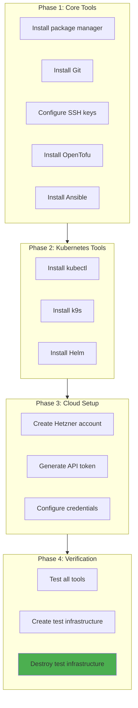
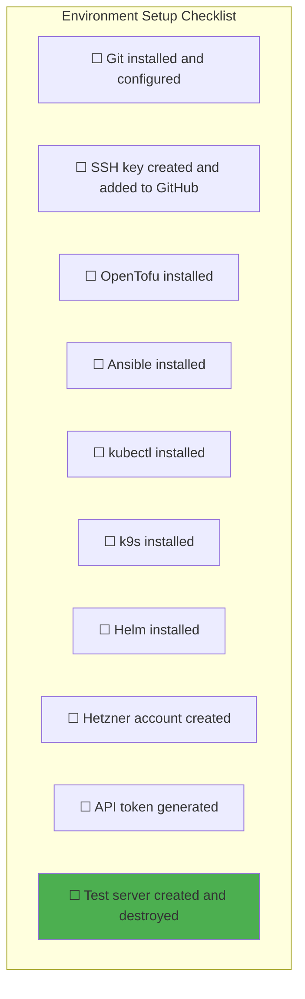

# Exercise 1: Environment Setup

## Objective

Set up your local development environment with all the tools needed for platform engineering work.

---

## Prerequisites

- macOS, Linux, or WSL2 on Windows
- Admin access to install software
- GitHub account
- Hetzner Cloud account (sign up at [hetzner.com](https://www.hetzner.com/cloud))

---

## Exercise Flow



---

## Phase 1: Core Tools

### 1.1 Package Manager

**macOS (Homebrew):**
```bash
/bin/bash -c "$(curl -fsSL https://raw.githubusercontent.com/Homebrew/install/HEAD/install.sh)"
```

**Linux (apt/dnf):**
```bash
# Debian/Ubuntu - apt is built-in
# Fedora/RHEL - dnf is built-in
```

### 1.2 Git

```bash
# macOS
brew install git

# Linux
sudo apt install git  # Debian/Ubuntu
sudo dnf install git  # Fedora

# Verify
git --version
```

**Configure Git:**
```bash
git config --global user.name "Your Name"
git config --global user.email "your.email@example.com"
git config --global init.defaultBranch main
```

### 1.3 SSH Keys

```bash
# Generate SSH key (if you don't have one)
ssh-keygen -t ed25519 -C "your.email@example.com"

# Start SSH agent
eval "$(ssh-agent -s)"

# Add key to agent
ssh-add ~/.ssh/id_ed25519

# Copy public key
cat ~/.ssh/id_ed25519.pub
# Add this to GitHub → Settings → SSH and GPG keys
```

**Verify GitHub access:**
```bash
ssh -T git@github.com
# Should see: "Hi username! You've successfully authenticated..."
```

### 1.4 OpenTofu

```bash
# macOS
brew install opentofu

# Linux (install script)
curl -fsSL https://get.opentofu.org/install-opentofu.sh | bash

# Verify
tofu --version
```

### 1.5 Ansible

```bash
# macOS
brew install ansible

# Linux (pip recommended)
pip3 install ansible

# Verify
ansible --version
```

---

## Phase 2: Kubernetes Tools

### 2.1 kubectl

```bash
# macOS
brew install kubectl

# Linux
curl -LO "https://dl.k8s.io/release/$(curl -L -s https://dl.k8s.io/release/stable.txt)/bin/linux/amd64/kubectl"
chmod +x kubectl
sudo mv kubectl /usr/local/bin/

# Verify
kubectl version --client
```

### 2.2 k9s (Terminal UI)

```bash
# macOS
brew install k9s

# Linux
curl -sS https://webinstall.dev/k9s | bash

# Verify
k9s version
```

### 2.3 Helm

```bash
# macOS
brew install helm

# Linux
curl https://raw.githubusercontent.com/helm/helm/main/scripts/get-helm-3 | bash

# Verify
helm version
```

---

## Phase 3: Cloud Setup

### 3.1 Hetzner Cloud Account

1. Go to [console.hetzner.cloud](https://console.hetzner.cloud)
2. Create account or sign in
3. Create a new project called "internship"

### 3.2 Generate API Token


1. In Hetzner Console, select your project
2. Go to **Security** → **API Tokens**
3. Click **Generate API Token**
4. Give it a name: `internship-token`
5. Select **Read & Write** permissions
6. **Copy the token immediately** (you can't see it again!)

### 3.3 Configure Credentials

**Create credentials file:**
```bash
mkdir -p ~/.config/hetzner
cat > ~/.config/hetzner/credentials << 'EOF'
# Hetzner Cloud API Token
export HCLOUD_TOKEN="your-token-here"
EOF
chmod 600 ~/.config/hetzner/credentials
```

**Add to shell:**
```bash
echo 'source ~/.config/hetzner/credentials' >> ~/.zshrc  # or ~/.bashrc
source ~/.zshrc
```

**Verify:**
```bash
echo $HCLOUD_TOKEN  # Should show your token
```

---

## Phase 4: Verification

### 4.1 Test All Tools

Create a verification script:

```bash
#!/usr/bin/env bash
# save as: verify-tools.sh

echo "=== Tool Verification ==="
echo

tools=(
  "git:git --version"
  "ssh:ssh -V"
  "tofu:tofu --version"
  "ansible:ansible --version | head -1"
  "kubectl:kubectl version --client --short 2>/dev/null || kubectl version --client"
  "k9s:k9s version --short 2>/dev/null || k9s version"
  "helm:helm version --short"
)

all_pass=true

for item in "${tools[@]}"; do
  name="${item%%:*}"
  cmd="${item#*:}"
  if eval "$cmd" &>/dev/null; then
    echo "✓ $name"
  else
    echo "✗ $name - NOT INSTALLED"
    all_pass=false
  fi
done

echo
if [ "$all_pass" = true ]; then
  echo "All tools installed successfully!"
else
  echo "Some tools are missing. Please install them."
  exit 1
fi
```

Run it:
```bash
chmod +x verify-tools.sh
./verify-tools.sh
```

### 4.2 Create Test Infrastructure

Create a test directory:
```bash
mkdir -p ~/internship/test-infra
cd ~/internship/test-infra
```

Create `main.tf`:
```hcl
# main.tf

terraform {
  required_providers {
    hcloud = {
      source  = "hetznercloud/hcloud"
      version = "~> 1.45"
    }
  }
}

provider "hcloud" {
  token = var.hcloud_token
}

variable "hcloud_token" {
  type        = string
  sensitive   = true
  description = "Hetzner Cloud API token"
}

# Create a small test server
resource "hcloud_server" "test" {
  name        = "test-server"
  image       = "ubuntu-22.04"
  server_type = "cx11"  # Smallest, cheapest type
  location    = "fsn1"

  labels = {
    purpose = "test"
    owner   = "intern"
  }
}

output "server_ip" {
  value       = hcloud_server.test.ipv4_address
  description = "Public IP of the test server"
}
```

Create `terraform.tfvars`:
```hcl
# terraform.tfvars
# This file contains sensitive values - DO NOT commit to Git!

hcloud_token = "your-actual-token-here"
```

**Initialize and apply:**
```bash
# Initialize OpenTofu
tofu init

# Preview changes
tofu plan

# Create the server (this costs money!)
tofu apply
```

### 4.3 Verify and Destroy

```bash
# Note the IP address from output
# Try to ping it (may take 30 seconds to boot)
ping -c 3 $(tofu output -raw server_ip)

# SSH into server (won't work yet - no SSH key added)
# This is expected behavior

# IMPORTANT: Destroy the test server to avoid charges
tofu destroy
```

---

## Verification Checklist



### Success Criteria

| Requirement | How to Verify |
|-------------|---------------|
| Git configured | `git config --list` shows name/email |
| SSH to GitHub | `ssh -T git@github.com` succeeds |
| OpenTofu works | `tofu --version` returns version |
| Ansible works | `ansible --version` returns version |
| kubectl works | `kubectl version --client` returns version |
| k9s works | `k9s version` returns version |
| Helm works | `helm version` returns version |
| Hetzner API | `tofu plan` with Hetzner provider works |

---

## Troubleshooting

### Common Issues

| Issue | Solution |
|-------|----------|
| `command not found: tofu` | Restart terminal or run `source ~/.zshrc` |
| Hetzner auth failed | Check `HCLOUD_TOKEN` is set and valid |
| SSH permission denied | Check key is added: `ssh-add -l` |
| `tofu init` fails | Check internet connection, try again |

### Getting Help

If you're stuck:
1. Check the error message carefully
2. Search the error on Google/Stack Overflow
3. Check official documentation
4. Ask in Teams channel with:
   - What you're trying to do
   - What you tried
   - The exact error message

---

## Next Exercise

Once your environment is set up, proceed to:
→ [Exercise 2: First OpenTofu Module](./02-First-OpenTofu-Module.md)

---

*Last Updated: 2026-02-02*
