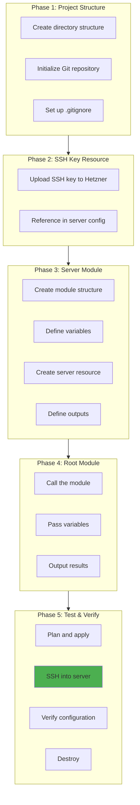
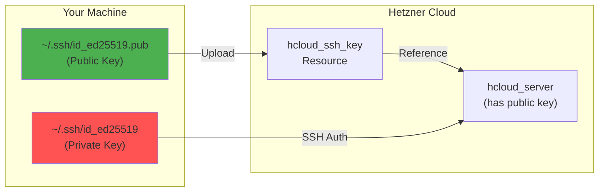
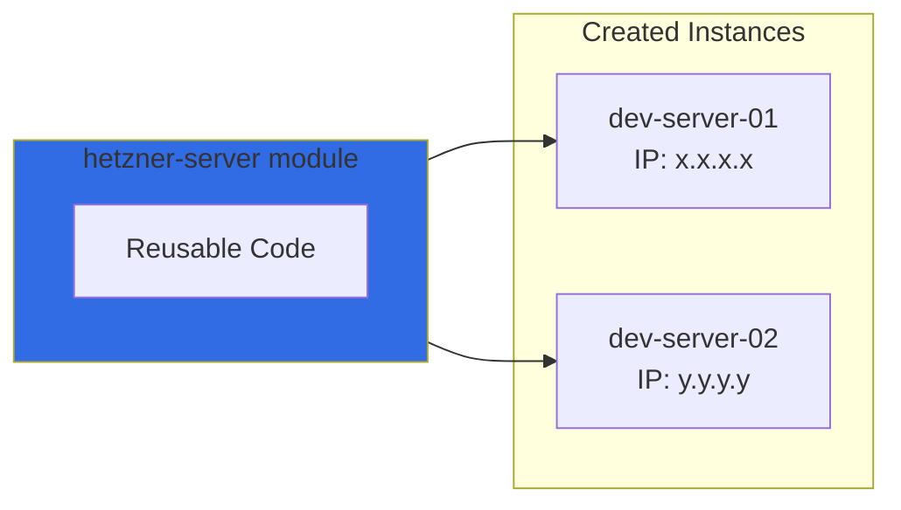
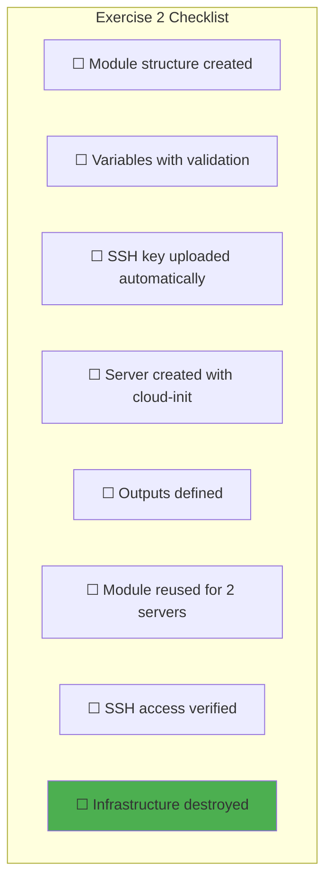
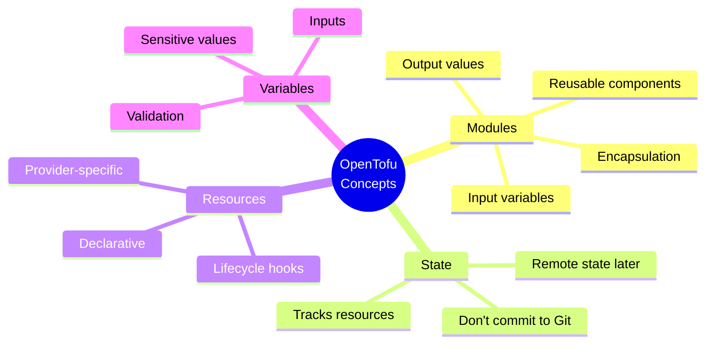

# Exercise 2: First OpenTofu Module

## Objective

Create a reusable OpenTofu module that provisions a Hetzner Cloud server with SSH access and proper configuration.

---

## Prerequisites

- Completed [Exercise 1: Environment Setup](./01-Environment-Setup.md)
- OpenTofu installed and working
- Hetzner API token configured
- SSH key pair generated

---

## Exercise Flow



---

## Phase 1: Project Structure

### 1.1 Create Directory Structure

```bash
mkdir -p ~/internship/infra
cd ~/internship/infra

# Create structure
mkdir -p modules/hetzner-server
mkdir -p environments/dev
```

Expected structure:
```
infra/
├── modules/
│   └── hetzner-server/
│       ├── main.tf
│       ├── variables.tf
│       └── outputs.tf
├── environments/
│   └── dev/
│       ├── main.tf
│       ├── variables.tf
│       ├── outputs.tf
│       └── terraform.tfvars
└── .gitignore
```

### 1.2 Initialize Git

```bash
git init
```

### 1.3 Create .gitignore

```bash
cat > .gitignore << 'EOF'
# OpenTofu/Terraform
*.tfstate
*.tfstate.*
.terraform/
.terraform.lock.hcl
*.tfvars
!*.tfvars.example

# Credentials
*.pem
*.key
credentials/

# OS files
.DS_Store
*.swp
EOF
```

---

## Phase 2: SSH Key Resource

### 2.1 Understanding SSH Keys in Hetzner



### 2.2 Add SSH Key to Module

We'll include SSH key management in our server module.

---

## Phase 3: Server Module

### 3.1 Module Variables

Create `modules/hetzner-server/variables.tf`:

```hcl
# modules/hetzner-server/variables.tf

variable "name" {
  type        = string
  description = "Name of the server"
}

variable "server_type" {
  type        = string
  default     = "cx11"
  description = "Hetzner server type (cx11, cx21, cx31, etc.)"

  validation {
    condition     = can(regex("^c[xp]x?[0-9]+$", var.server_type))
    error_message = "Server type must be a valid Hetzner type like cx11, cx21, cpx11."
  }
}

variable "image" {
  type        = string
  default     = "ubuntu-22.04"
  description = "OS image to use"
}

variable "location" {
  type        = string
  default     = "fsn1"
  description = "Datacenter location"

  validation {
    condition     = contains(["fsn1", "nbg1", "hel1", "ash", "hil"], var.location)
    error_message = "Location must be one of: fsn1, nbg1, hel1, ash, hil."
  }
}

variable "ssh_public_key_path" {
  type        = string
  default     = "~/.ssh/id_ed25519.pub"
  description = "Path to SSH public key"
}

variable "labels" {
  type        = map(string)
  default     = {}
  description = "Labels to apply to the server"
}

variable "user_data" {
  type        = string
  default     = ""
  description = "Cloud-init user data script"
}
```

### 3.2 Module Main

Create `modules/hetzner-server/main.tf`:

```hcl
# modules/hetzner-server/main.tf

terraform {
  required_providers {
    hcloud = {
      source  = "hetznercloud/hcloud"
      version = "~> 1.45"
    }
  }
}

# Upload SSH key to Hetzner
resource "hcloud_ssh_key" "this" {
  name       = "${var.name}-key"
  public_key = file(pathexpand(var.ssh_public_key_path))
}

# Create the server
resource "hcloud_server" "this" {
  name        = var.name
  image       = var.image
  server_type = var.server_type
  location    = var.location
  ssh_keys    = [hcloud_ssh_key.this.id]

  labels = merge(
    {
      managed_by = "opentofu"
    },
    var.labels
  )

  # Cloud-init for initial setup
  user_data = var.user_data != "" ? var.user_data : <<-EOF
    #cloud-config
    package_update: true
    package_upgrade: true
    packages:
      - curl
      - wget
      - vim
      - htop
      - git
    runcmd:
      - echo "Server provisioned by OpenTofu" > /etc/motd
  EOF

  # Ensure server is fully created before marking complete
  lifecycle {
    create_before_destroy = true
  }
}
```

### 3.3 Module Outputs

Create `modules/hetzner-server/outputs.tf`:

```hcl
# modules/hetzner-server/outputs.tf

output "id" {
  value       = hcloud_server.this.id
  description = "Server ID"
}

output "name" {
  value       = hcloud_server.this.name
  description = "Server name"
}

output "ipv4_address" {
  value       = hcloud_server.this.ipv4_address
  description = "Public IPv4 address"
}

output "ipv6_address" {
  value       = hcloud_server.this.ipv6_address
  description = "Public IPv6 address"
}

output "status" {
  value       = hcloud_server.this.status
  description = "Server status"
}

output "ssh_key_id" {
  value       = hcloud_ssh_key.this.id
  description = "SSH key ID in Hetzner"
}

output "ssh_command" {
  value       = "ssh root@${hcloud_server.this.ipv4_address}"
  description = "Command to SSH into the server"
}
```

---

## Phase 4: Root Module

### 4.1 Environment Variables

Create `environments/dev/variables.tf`:

```hcl
# environments/dev/variables.tf

variable "hcloud_token" {
  type        = string
  sensitive   = true
  description = "Hetzner Cloud API token"
}

variable "environment" {
  type        = string
  default     = "dev"
  description = "Environment name"
}
```

### 4.2 Environment Main

Create `environments/dev/main.tf`:

```hcl
# environments/dev/main.tf

terraform {
  required_version = ">= 1.6.0"

  required_providers {
    hcloud = {
      source  = "hetznercloud/hcloud"
      version = "~> 1.45"
    }
  }
}

# Configure the Hetzner provider
provider "hcloud" {
  token = var.hcloud_token
}

# Create a development server using our module
module "dev_server" {
  source = "../../modules/hetzner-server"

  name        = "dev-server-01"
  server_type = "cx11"
  location    = "fsn1"
  image       = "ubuntu-22.04"

  labels = {
    environment = var.environment
    purpose     = "development"
    owner       = "intern"
  }
}

# Create a second server to test module reusability
module "dev_server_2" {
  source = "../../modules/hetzner-server"

  name        = "dev-server-02"
  server_type = "cx11"
  location    = "fsn1"
  image       = "ubuntu-22.04"

  labels = {
    environment = var.environment
    purpose     = "development"
    owner       = "intern"
  }
}
```

### 4.3 Environment Outputs

Create `environments/dev/outputs.tf`:

```hcl
# environments/dev/outputs.tf

output "server_1_ip" {
  value       = module.dev_server.ipv4_address
  description = "IP address of first dev server"
}

output "server_1_ssh" {
  value       = module.dev_server.ssh_command
  description = "SSH command for first server"
}

output "server_2_ip" {
  value       = module.dev_server_2.ipv4_address
  description = "IP address of second dev server"
}

output "server_2_ssh" {
  value       = module.dev_server_2.ssh_command
  description = "SSH command for second server"
}

output "all_server_ips" {
  value = [
    module.dev_server.ipv4_address,
    module.dev_server_2.ipv4_address,
  ]
  description = "All server IP addresses"
}
```

### 4.4 Create tfvars Example

Create `environments/dev/terraform.tfvars.example`:

```hcl
# environments/dev/terraform.tfvars.example
# Copy this to terraform.tfvars and fill in real values

hcloud_token = "your-hetzner-api-token-here"
environment  = "dev"
```

Create your actual tfvars (not committed):
```bash
cp environments/dev/terraform.tfvars.example environments/dev/terraform.tfvars
# Edit terraform.tfvars with your actual token
```

---

## Phase 5: Test & Verify

### 5.1 Initialize and Plan

```bash
cd ~/internship/infra/environments/dev

# Initialize OpenTofu
tofu init

# Preview changes
tofu plan
```

You should see output showing:
- 2 SSH keys to be created
- 2 servers to be created

### 5.2 Apply

```bash
# Create the infrastructure
tofu apply

# Type 'yes' when prompted
```

### 5.3 Verify SSH Access

```bash
# Get SSH command from output
tofu output server_1_ssh

# SSH into server (wait 30-60 seconds for cloud-init)
ssh root@$(tofu output -raw server_1_ip)

# Once connected, verify:
cat /etc/motd  # Should show "Server provisioned by OpenTofu"
htop           # Should be installed
exit
```

### 5.4 Test Module Reusability



The same module created both servers with different names. This is the power of modules!

### 5.5 Destroy

```bash
# IMPORTANT: Destroy to avoid charges
tofu destroy

# Confirm with 'yes'
```

---

## Verification Checklist



### Success Criteria

| Requirement | How to Verify |
|-------------|---------------|
| Module structure | `ls modules/hetzner-server/` shows 3 files |
| Servers created | `tofu output` shows 2 IPs |
| SSH works | Can SSH to both servers |
| Cloud-init ran | `htop` is installed on servers |
| Destroyed | `tofu show` shows no resources |

---

## Key Concepts Learned



---

## Bonus Challenges

1. **Add a firewall rule** that only allows SSH from your IP
2. **Add a private network** and connect both servers
3. **Use `count`** to create 3 servers instead of duplicating module calls
4. **Add remote state** storage using Hetzner Object Storage

---

## Next Exercise

Proceed to:
→ [Exercise 3: Ansible Playbooks](./03-Ansible-Playbooks.md)

---

*Last Updated: 2026-02-02*
