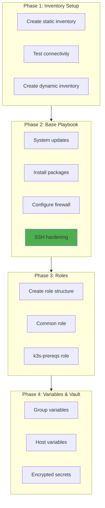
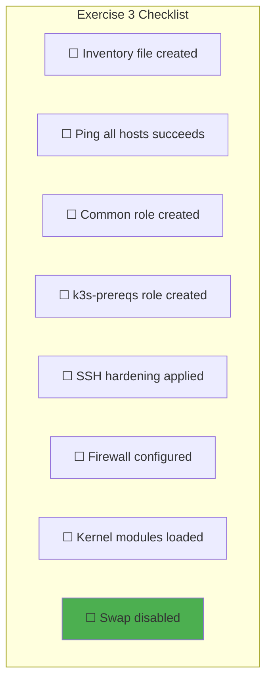
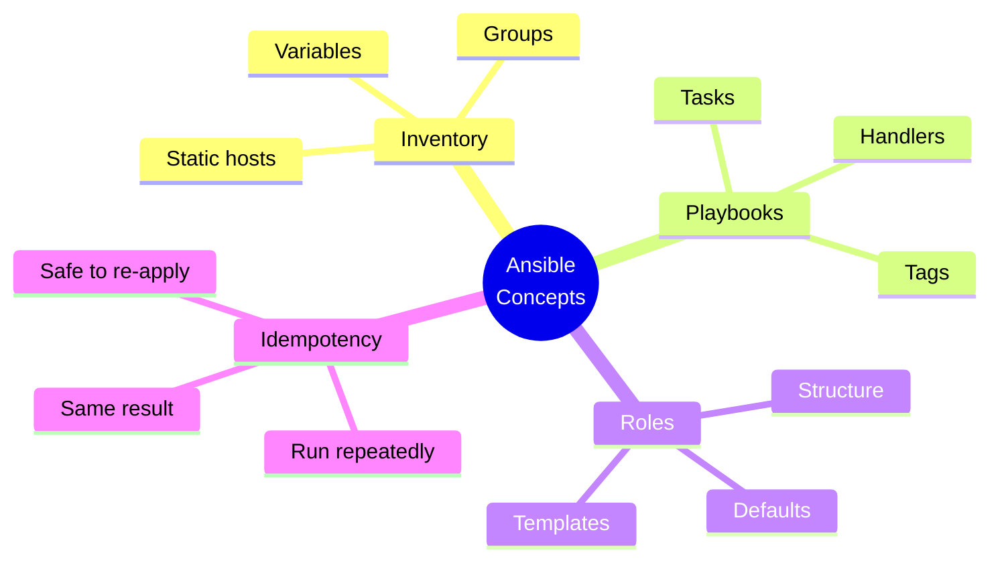

# Exercise 3: Ansible Playbooks

> *"Configuration as code should be idempotent, version-controlled, and testable."*
> — **Ansible: Up and Running** (Lorin Hochstein)

## Objective

Create Ansible playbooks to configure your Hetzner servers with security hardening and k3s prerequisites.

---

## Prerequisites

- Completed [Exercise 2: First OpenTofu Module](./02-First-OpenTofu-Module.md)
- Servers provisioned with SSH access
- Ansible installed locally

---

## Exercise Flow



---

## Phase 1: Inventory Setup

### 1.1 Project Structure

```bash
cd ~/internship/infra
mkdir -p ansible/{inventory,playbooks,roles}
mkdir -p ansible/inventory/{group_vars,host_vars}
```

Expected structure:
```
infra/
├── modules/              # From Exercise 2
├── environments/         # From Exercise 2
└── ansible/
    ├── ansible.cfg
    ├── inventory/
    │   ├── hosts.yml
    │   ├── group_vars/
    │   │   └── all.yml
    │   └── host_vars/
    ├── playbooks/
    │   ├── site.yml
    │   └── base-setup.yml
    └── roles/
        ├── common/
        └── k3s-prereqs/
```

### 1.2 Ansible Configuration

Create `ansible/ansible.cfg`:

```ini
[defaults]
inventory = inventory/hosts.yml
remote_user = root
host_key_checking = False
retry_files_enabled = False
gathering = smart
fact_caching = jsonfile
fact_caching_connection = /tmp/ansible_facts
fact_caching_timeout = 3600

[privilege_escalation]
become = True
become_method = sudo
become_user = root

[ssh_connection]
pipelining = True
ssh_args = -o ControlMaster=auto -o ControlPersist=60s
```

### 1.3 Static Inventory

Create `ansible/inventory/hosts.yml`:

```yaml
# ansible/inventory/hosts.yml

all:
  children:
    servers:
      hosts:
        server-01:
          ansible_host: "{{ lookup('env', 'SERVER_01_IP') }}"
        server-02:
          ansible_host: "{{ lookup('env', 'SERVER_02_IP') }}"

    agents:
      hosts:
        agent-01:
          ansible_host: "{{ lookup('env', 'AGENT_01_IP') }}"
        agent-02:
          ansible_host: "{{ lookup('env', 'AGENT_02_IP') }}"

    k3s_cluster:
      children:
        servers:
        agents:
```

### 1.4 Test Connectivity

```bash
cd ~/internship/infra/ansible

# Export IPs from Terraform output
export SERVER_01_IP=$(cd ../environments/dev && tofu output -raw server_1_ip)
export SERVER_02_IP=$(cd ../environments/dev && tofu output -raw server_2_ip)

# Test ping
ansible all -m ping

# Test command execution
ansible all -m command -a "uptime"
```

---

## Phase 2: Base Playbook

### 2.1 System Updates Playbook

Create `ansible/playbooks/base-setup.yml`:

```yaml
# ansible/playbooks/base-setup.yml
---
- name: Base system setup
  hosts: all
  become: yes

  vars:
    packages_to_install:
      - curl
      - wget
      - vim
      - htop
      - git
      - jq
      - unzip
      - net-tools
      - dnsutils
      - ca-certificates
      - gnupg
      - lsb-release

  tasks:
    # ─────────────────────────────────────────────
    # System Updates
    # ─────────────────────────────────────────────
    - name: Update apt cache
      apt:
        update_cache: yes
        cache_valid_time: 3600
      tags: [packages]

    - name: Upgrade all packages
      apt:
        upgrade: dist
        autoremove: yes
        autoclean: yes
      tags: [packages]

    - name: Install base packages
      apt:
        name: "{{ packages_to_install }}"
        state: present
      tags: [packages]

    # ─────────────────────────────────────────────
    # Timezone & Locale
    # ─────────────────────────────────────────────
    - name: Set timezone to UTC
      timezone:
        name: UTC
      tags: [system]

    - name: Set hostname from inventory
      hostname:
        name: "{{ inventory_hostname }}"
      tags: [system]

    # ─────────────────────────────────────────────
    # SSH Hardening
    # ─────────────────────────────────────────────
    - name: Disable password authentication
      lineinfile:
        path: /etc/ssh/sshd_config
        regexp: "^#?PasswordAuthentication"
        line: "PasswordAuthentication no"
        state: present
      notify: Restart SSH
      tags: [security, ssh]

    - name: Disable root password login
      lineinfile:
        path: /etc/ssh/sshd_config
        regexp: "^#?PermitRootLogin"
        line: "PermitRootLogin prohibit-password"
        state: present
      notify: Restart SSH
      tags: [security, ssh]

    - name: Disable empty passwords
      lineinfile:
        path: /etc/ssh/sshd_config
        regexp: "^#?PermitEmptyPasswords"
        line: "PermitEmptyPasswords no"
        state: present
      notify: Restart SSH
      tags: [security, ssh]

    # ─────────────────────────────────────────────
    # Firewall (UFW)
    # ─────────────────────────────────────────────
    - name: Install UFW
      apt:
        name: ufw
        state: present
      tags: [security, firewall]

    - name: Set UFW default deny incoming
      ufw:
        direction: incoming
        policy: deny
      tags: [security, firewall]

    - name: Set UFW default allow outgoing
      ufw:
        direction: outgoing
        policy: allow
      tags: [security, firewall]

    - name: Allow SSH through UFW
      ufw:
        rule: allow
        port: "22"
        proto: tcp
      tags: [security, firewall]

    - name: Enable UFW
      ufw:
        state: enabled
      tags: [security, firewall]

  handlers:
    - name: Restart SSH
      service:
        name: sshd
        state: restarted
```

### 2.2 Run the Playbook

```bash
# Dry run (check mode)
ansible-playbook playbooks/base-setup.yml --check --diff

# Apply changes
ansible-playbook playbooks/base-setup.yml

# Run only security tags
ansible-playbook playbooks/base-setup.yml --tags security
```

---

## Phase 3: Roles

### 3.1 Create Role Structure

```bash
cd ~/internship/infra/ansible

# Create common role
mkdir -p roles/common/{tasks,handlers,templates,files,vars,defaults}

# Create k3s-prereqs role
mkdir -p roles/k3s-prereqs/{tasks,handlers,templates,files,vars,defaults}
```

### 3.2 Common Role

Create `ansible/roles/common/tasks/main.yml`:

```yaml
# roles/common/tasks/main.yml
---
- name: Include package tasks
  include_tasks: packages.yml
  tags: [packages]

- name: Include security tasks
  include_tasks: security.yml
  tags: [security]

- name: Include system tasks
  include_tasks: system.yml
  tags: [system]
```

Create `ansible/roles/common/tasks/packages.yml`:

```yaml
# roles/common/tasks/packages.yml
---
- name: Update apt cache
  apt:
    update_cache: yes
    cache_valid_time: 3600

- name: Install common packages
  apt:
    name: "{{ common_packages }}"
    state: present
```

Create `ansible/roles/common/tasks/security.yml`:

```yaml
# roles/common/tasks/security.yml
---
- name: Configure SSH daemon
  template:
    src: sshd_config.j2
    dest: /etc/ssh/sshd_config
    owner: root
    group: root
    mode: '0644'
    validate: 'sshd -t -f %s'
  notify: Restart SSH

- name: Configure UFW firewall
  include_tasks: firewall.yml
```

Create `ansible/roles/common/tasks/firewall.yml`:

```yaml
# roles/common/tasks/firewall.yml
---
- name: Install UFW
  apt:
    name: ufw
    state: present

- name: Set UFW defaults
  ufw:
    direction: "{{ item.direction }}"
    policy: "{{ item.policy }}"
  loop:
    - { direction: incoming, policy: deny }
    - { direction: outgoing, policy: allow }

- name: Allow SSH
  ufw:
    rule: allow
    port: "22"
    proto: tcp

- name: Allow additional ports
  ufw:
    rule: allow
    port: "{{ item.port }}"
    proto: "{{ item.proto | default('tcp') }}"
  loop: "{{ firewall_allowed_ports | default([]) }}"

- name: Enable UFW
  ufw:
    state: enabled
```

Create `ansible/roles/common/defaults/main.yml`:

```yaml
# roles/common/defaults/main.yml
---
common_packages:
  - curl
  - wget
  - vim
  - htop
  - git
  - jq
  - unzip
  - net-tools
  - dnsutils
  - ca-certificates

ssh_permit_root_login: "prohibit-password"
ssh_password_authentication: "no"

firewall_allowed_ports: []
```

Create `ansible/roles/common/handlers/main.yml`:

```yaml
# roles/common/handlers/main.yml
---
- name: Restart SSH
  service:
    name: sshd
    state: restarted
```

Create `ansible/roles/common/templates/sshd_config.j2`:

```jinja2
# /etc/ssh/sshd_config - Managed by Ansible
# {{ ansible_managed }}

Port 22
Protocol 2

HostKey /etc/ssh/ssh_host_rsa_key
HostKey /etc/ssh/ssh_host_ecdsa_key
HostKey /etc/ssh/ssh_host_ed25519_key

# Authentication
PermitRootLogin {{ ssh_permit_root_login }}
PasswordAuthentication {{ ssh_password_authentication }}
PermitEmptyPasswords no
ChallengeResponseAuthentication no
PubkeyAuthentication yes
AuthorizedKeysFile .ssh/authorized_keys

# Security
X11Forwarding no
MaxAuthTries 3
MaxSessions 10
LoginGraceTime 60

# Logging
SyslogFacility AUTH
LogLevel INFO

# Connection
ClientAliveInterval 300
ClientAliveCountMax 2

# Subsystem
Subsystem sftp /usr/lib/openssh/sftp-server
```

### 3.3 k3s Prerequisites Role

Create `ansible/roles/k3s-prereqs/tasks/main.yml`:

```yaml
# roles/k3s-prereqs/tasks/main.yml
---
- name: Disable swap
  command: swapoff -a
  when: ansible_swaptotal_mb > 0
  changed_when: false

- name: Remove swap from fstab
  lineinfile:
    path: /etc/fstab
    regexp: '\sswap\s'
    state: absent

- name: Load required kernel modules
  modprobe:
    name: "{{ item }}"
    state: present
  loop:
    - br_netfilter
    - overlay
    - ip_vs
    - ip_vs_rr
    - ip_vs_wrr
    - ip_vs_sh
    - nf_conntrack

- name: Persist kernel modules
  copy:
    dest: /etc/modules-load.d/k3s.conf
    content: |
      br_netfilter
      overlay
      ip_vs
      ip_vs_rr
      ip_vs_wrr
      ip_vs_sh
      nf_conntrack
    mode: '0644'

- name: Configure sysctl for Kubernetes
  sysctl:
    name: "{{ item.name }}"
    value: "{{ item.value }}"
    state: present
    sysctl_file: /etc/sysctl.d/99-kubernetes.conf
    reload: yes
  loop:
    - { name: "net.bridge.bridge-nf-call-iptables", value: "1" }
    - { name: "net.bridge.bridge-nf-call-ip6tables", value: "1" }
    - { name: "net.ipv4.ip_forward", value: "1" }
    - { name: "net.ipv6.conf.all.forwarding", value: "1" }
    - { name: "vm.swappiness", value: "0" }

- name: Open k3s firewall ports (servers)
  ufw:
    rule: allow
    port: "{{ item.port }}"
    proto: "{{ item.proto }}"
  loop:
    - { port: "6443", proto: "tcp" }   # Kubernetes API
    - { port: "2379", proto: "tcp" }   # etcd client
    - { port: "2380", proto: "tcp" }   # etcd peer
    - { port: "10250", proto: "tcp" }  # kubelet
    - { port: "8472", proto: "udp" }   # Flannel VXLAN
  when: "'servers' in group_names"

- name: Open k3s firewall ports (agents)
  ufw:
    rule: allow
    port: "{{ item.port }}"
    proto: "{{ item.proto }}"
  loop:
    - { port: "10250", proto: "tcp" }  # kubelet
    - { port: "8472", proto: "udp" }   # Flannel VXLAN
  when: "'agents' in group_names"
```

---

## Phase 4: Main Site Playbook

Create `ansible/playbooks/site.yml`:

```yaml
# ansible/playbooks/site.yml
---
- name: Configure all nodes
  hosts: k3s_cluster
  become: yes
  roles:
    - common
    - k3s-prereqs
```

Create `ansible/inventory/group_vars/all.yml`:

```yaml
# inventory/group_vars/all.yml
---
# Common packages (override defaults)
common_packages:
  - curl
  - wget
  - vim
  - htop
  - git
  - jq
  - unzip
  - net-tools
  - dnsutils
  - ca-certificates
  - gnupg
  - lsb-release
  - open-iscsi  # Required for Longhorn

# SSH configuration
ssh_permit_root_login: "prohibit-password"
ssh_password_authentication: "no"

# Firewall - additional ports for monitoring
firewall_allowed_ports:
  - { port: "9100", proto: "tcp" }  # Node exporter
```

---

## Running the Complete Setup

### Full Deployment

```bash
cd ~/internship/infra/ansible

# Check syntax
ansible-playbook playbooks/site.yml --syntax-check

# Dry run with diff
ansible-playbook playbooks/site.yml --check --diff

# Apply all changes
ansible-playbook playbooks/site.yml

# Verify
ansible all -m command -a "ufw status"
ansible all -m command -a "swapon --show"
```

### Targeted Runs

```bash
# Only security tasks
ansible-playbook playbooks/site.yml --tags security

# Only servers
ansible-playbook playbooks/site.yml --limit servers

# Only packages
ansible-playbook playbooks/site.yml --tags packages
```

---

## Verification Checklist



### Success Criteria

| Requirement | Verification Command |
|-------------|---------------------|
| Inventory works | `ansible all -m ping` |
| SSH hardened | `grep PasswordAuth /etc/ssh/sshd_config` |
| Firewall active | `ufw status` on any node |
| Swap disabled | `swapon --show` returns empty |
| Modules loaded | `lsmod | grep br_netfilter` |
| IP forwarding | `sysctl net.ipv4.ip_forward` returns 1 |

---

## Key Concepts Learned



---

## Bonus Challenges

1. **Create a dynamic inventory** using the Hetzner plugin
2. **Add Ansible Vault** to encrypt sensitive variables
3. **Create a Molecule test** for your roles
4. **Add a facts gathering role** that exports system info

---

## Next Exercise

Proceed to:
→ [Exercise 4: k3s Installation](./04-k3s-Installation.md)

---

*Last Updated: 2026-02-02*
