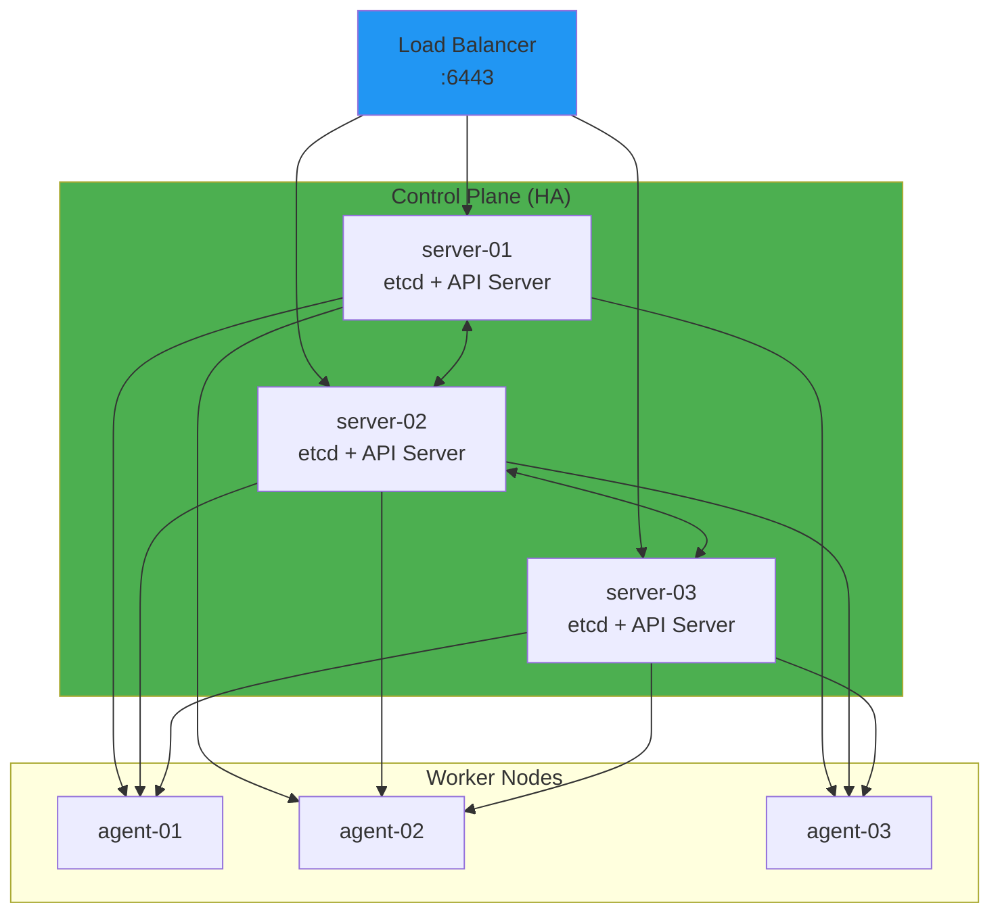
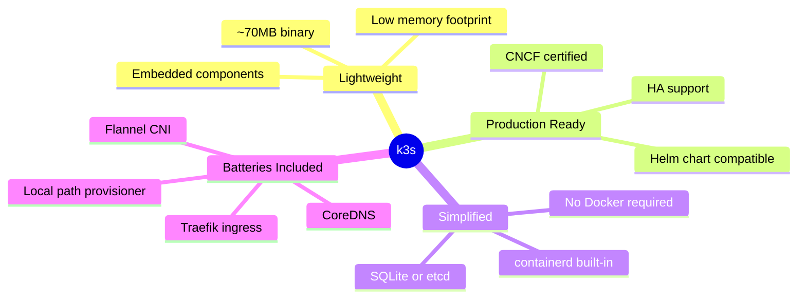
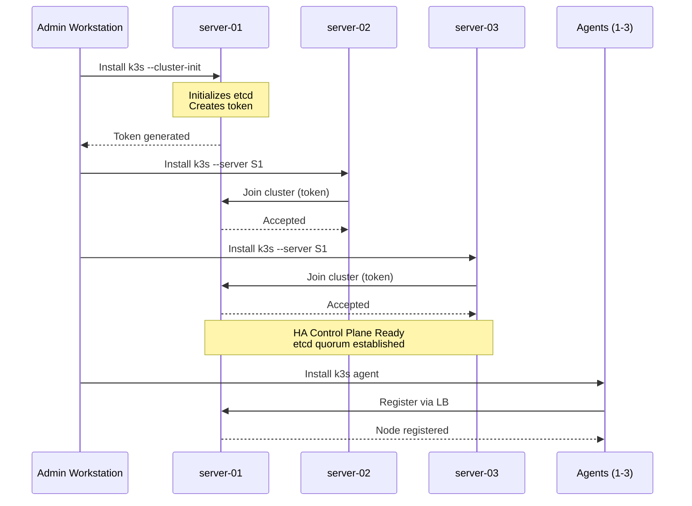
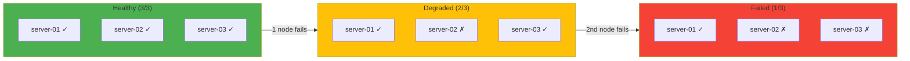
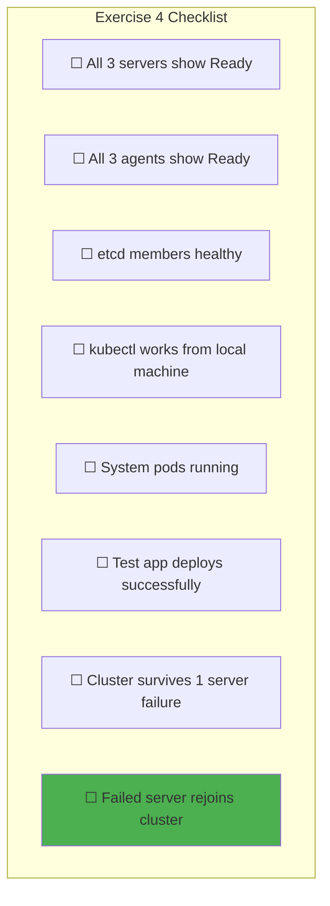
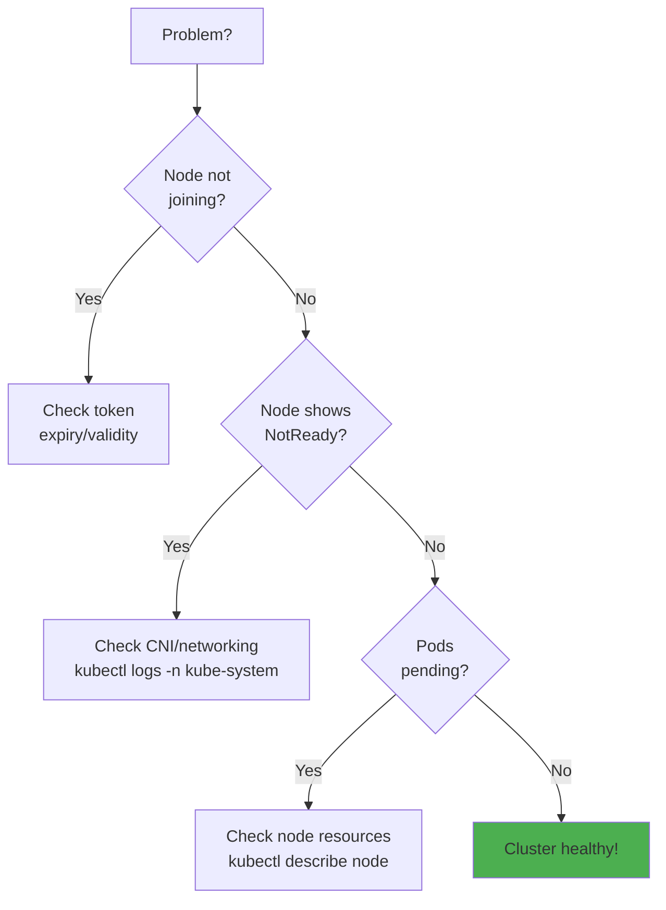
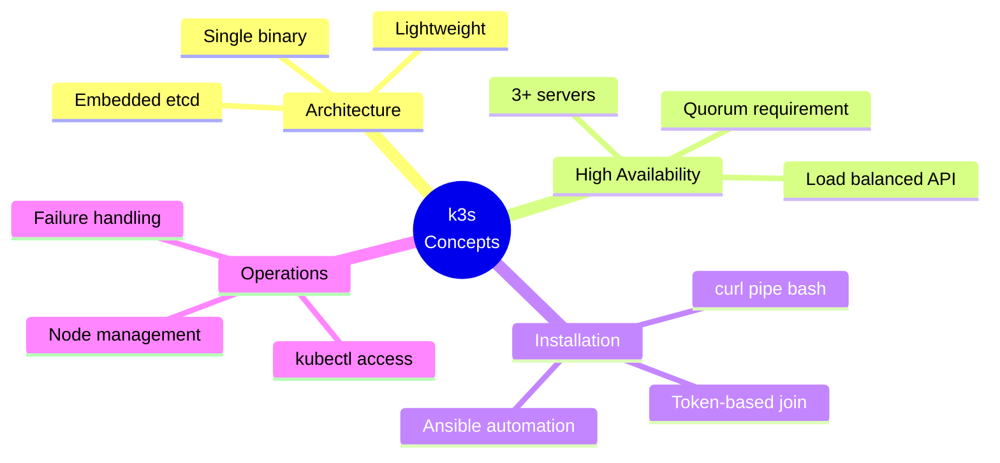

# Exercise 4: k3s Installation

> *"Kubernetes is not the destination. It's the vehicle. Make sure you know where you're going."*
> — **The Phoenix Project** (Gene Kim)

## Objective

Deploy a highly-available k3s cluster with 3 server nodes (control plane) and 3 agent nodes (workers).

---

## Prerequisites

- Completed [Exercise 3: Ansible Playbooks](./03-Ansible-Playbooks.md)
- All nodes configured with k3s prerequisites
- SSH access to all nodes
- Firewall ports opened

---

## Architecture Overview



---

## Phase 1: Understanding k3s

### What is k3s?

k3s is a lightweight, certified Kubernetes distribution designed for:
- Edge computing
- IoT devices
- CI/CD environments
- Resource-constrained environments



### k3s vs k8s

| Feature | k8s | k3s |
|---------|-----|-----|
| **Binary size** | ~1GB | ~70MB |
| **Memory footprint** | 2GB+ | 512MB |
| **Dependencies** | Many | Minimal |
| **Default storage** | etcd | SQLite (single) / etcd (HA) |
| **Container runtime** | Docker/containerd | containerd |
| **Certification** | CNCF | CNCF Certified |

---

## Phase 2: HA Server Installation

### 2.1 Create k3s Installation Role

Create `ansible/roles/k3s-server/tasks/main.yml`:

```yaml
# roles/k3s-server/tasks/main.yml
---
- name: Set k3s server facts
  set_fact:
    k3s_server_init: "{{ inventory_hostname == groups['servers'][0] }}"
    k3s_url: "https://{{ k3s_loadbalancer_ip }}:6443"

- name: Download k3s installation script
  get_url:
    url: https://get.k3s.io
    dest: /tmp/k3s-install.sh
    mode: '0755'

# ─────────────────────────────────────────────
# First Server (Initializes Cluster)
# ─────────────────────────────────────────────
- name: Install first k3s server
  shell: |
    /tmp/k3s-install.sh server \
      --cluster-init \
      --tls-san {{ k3s_loadbalancer_ip }} \
      --tls-san {{ ansible_host }} \
      --node-name {{ inventory_hostname }} \
      --disable traefik \
      --write-kubeconfig-mode 644
  environment:
    INSTALL_K3S_VERSION: "{{ k3s_version }}"
  args:
    creates: /etc/rancher/k3s/k3s.yaml
  when: k3s_server_init

- name: Wait for first server to be ready
  command: kubectl get nodes
  register: nodes_ready
  until: nodes_ready.rc == 0
  retries: 30
  delay: 10
  when: k3s_server_init

- name: Get k3s token from first server
  slurp:
    src: /var/lib/rancher/k3s/server/node-token
  register: k3s_token_raw
  when: k3s_server_init
  delegate_to: "{{ groups['servers'][0] }}"

- name: Set k3s token fact
  set_fact:
    k3s_token: "{{ k3s_token_raw.content | b64decode | trim }}"
  run_once: true
  delegate_to: "{{ groups['servers'][0] }}"

# ─────────────────────────────────────────────
# Additional Servers (Join Cluster)
# ─────────────────────────────────────────────
- name: Install additional k3s servers
  shell: |
    /tmp/k3s-install.sh server \
      --server https://{{ hostvars[groups['servers'][0]]['ansible_host'] }}:6443 \
      --token {{ hostvars[groups['servers'][0]]['k3s_token'] }} \
      --tls-san {{ k3s_loadbalancer_ip }} \
      --tls-san {{ ansible_host }} \
      --node-name {{ inventory_hostname }} \
      --disable traefik \
      --write-kubeconfig-mode 644
  environment:
    INSTALL_K3S_VERSION: "{{ k3s_version }}"
  args:
    creates: /etc/rancher/k3s/k3s.yaml
  when: not k3s_server_init
```

### 2.2 Server Role Defaults

Create `ansible/roles/k3s-server/defaults/main.yml`:

```yaml
# roles/k3s-server/defaults/main.yml
---
k3s_version: "v1.29.0+k3s1"
k3s_loadbalancer_ip: "{{ lookup('env', 'K3S_LB_IP') }}"
```

---

## Phase 3: Agent Installation

### 3.1 Create k3s Agent Role

Create `ansible/roles/k3s-agent/tasks/main.yml`:

```yaml
# roles/k3s-agent/tasks/main.yml
---
- name: Download k3s installation script
  get_url:
    url: https://get.k3s.io
    dest: /tmp/k3s-install.sh
    mode: '0755'

- name: Get k3s token from server
  slurp:
    src: /var/lib/rancher/k3s/server/node-token
  register: k3s_token_raw
  delegate_to: "{{ groups['servers'][0] }}"
  run_once: true

- name: Set k3s token fact
  set_fact:
    k3s_token: "{{ k3s_token_raw.content | b64decode | trim }}"

- name: Install k3s agent
  shell: |
    /tmp/k3s-install.sh agent \
      --server https://{{ k3s_loadbalancer_ip }}:6443 \
      --token {{ k3s_token }} \
      --node-name {{ inventory_hostname }}
  environment:
    INSTALL_K3S_VERSION: "{{ k3s_version }}"
  args:
    creates: /var/lib/rancher/k3s/agent/kubelet.kubeconfig
```

### 3.2 Agent Role Defaults

Create `ansible/roles/k3s-agent/defaults/main.yml`:

```yaml
# roles/k3s-agent/defaults/main.yml
---
k3s_version: "v1.29.0+k3s1"
k3s_loadbalancer_ip: "{{ lookup('env', 'K3S_LB_IP') }}"
```

---

## Phase 4: Orchestrated Deployment

### 4.1 k3s Cluster Playbook

Create `ansible/playbooks/k3s-cluster.yml`:

```yaml
# ansible/playbooks/k3s-cluster.yml
---
- name: Apply base configuration
  import_playbook: site.yml

- name: Install k3s servers
  hosts: servers
  become: yes
  serial: 1  # One at a time for HA stability
  roles:
    - k3s-server
  tags: [k3s, servers]

- name: Wait for control plane
  hosts: servers[0]
  tasks:
    - name: Wait for all servers to join
      command: kubectl get nodes -l node-role.kubernetes.io/control-plane=true --no-headers
      register: servers_ready
      until: servers_ready.stdout_lines | length == groups['servers'] | length
      retries: 30
      delay: 10
  tags: [k3s, verify]

- name: Install k3s agents
  hosts: agents
  become: yes
  roles:
    - k3s-agent
  tags: [k3s, agents]

- name: Final verification
  hosts: servers[0]
  tasks:
    - name: Get all nodes
      command: kubectl get nodes -o wide
      register: all_nodes

    - name: Display cluster status
      debug:
        msg: "{{ all_nodes.stdout_lines }}"
  tags: [k3s, verify]
```

---

## Phase 5: Deployment Sequence



### Run the Deployment

```bash
cd ~/internship/infra/ansible

# Export required variables
export K3S_LB_IP=$(cd ../environments/dev && tofu output -raw loadbalancer_ip)
export SERVER_01_IP=$(cd ../environments/dev && tofu output -raw server_1_ip)
export SERVER_02_IP=$(cd ../environments/dev && tofu output -raw server_2_ip)
export SERVER_03_IP=$(cd ../environments/dev && tofu output -raw server_3_ip)
export AGENT_01_IP=$(cd ../environments/dev && tofu output -raw agent_1_ip)
export AGENT_02_IP=$(cd ../environments/dev && tofu output -raw agent_2_ip)
export AGENT_03_IP=$(cd ../environments/dev && tofu output -raw agent_3_ip)

# Dry run
ansible-playbook playbooks/k3s-cluster.yml --check

# Deploy cluster
ansible-playbook playbooks/k3s-cluster.yml

# Only agents (if servers already running)
ansible-playbook playbooks/k3s-cluster.yml --tags agents
```

---

## Phase 6: kubectl Configuration

### 6.1 Get Kubeconfig

```bash
# Copy kubeconfig from first server
scp root@$SERVER_01_IP:/etc/rancher/k3s/k3s.yaml ~/.kube/k3s-config

# Update server URL to load balancer
sed -i '' "s/127.0.0.1/${K3S_LB_IP}/g" ~/.kube/k3s-config

# Set KUBECONFIG
export KUBECONFIG=~/.kube/k3s-config
```

### 6.2 Verify Cluster

```bash
# Check nodes
kubectl get nodes -o wide

# Expected output:
# NAME        STATUS   ROLES                       AGE   VERSION
# server-01   Ready    control-plane,etcd,master   5m    v1.29.0+k3s1
# server-02   Ready    control-plane,etcd,master   4m    v1.29.0+k3s1
# server-03   Ready    control-plane,etcd,master   3m    v1.29.0+k3s1
# agent-01    Ready    <none>                      2m    v1.29.0+k3s1
# agent-02    Ready    <none>                      2m    v1.29.0+k3s1
# agent-03    Ready    <none>                      2m    v1.29.0+k3s1

# Check system pods
kubectl get pods -n kube-system

# Check etcd health
kubectl get endpoints -n kube-system
```

---

## Phase 7: High Availability Testing

> *"Design for failure. Assume everything will break and design systems accordingly."*
> — **Release It!** (Michael Nygard)

### 7.1 Test Node Failure

```bash
# Current cluster state
kubectl get nodes

# Simulate server failure (on server-02)
ssh root@$SERVER_02_IP "systemctl stop k3s"

# Watch nodes (server-02 should become NotReady)
kubectl get nodes -w

# Verify workloads still running
kubectl get pods -A

# Recover the node
ssh root@$SERVER_02_IP "systemctl start k3s"

# Verify recovery
kubectl get nodes
```

### 7.2 Test etcd Quorum



**etcd requires majority quorum:**
- 3 nodes: tolerates 1 failure
- 5 nodes: tolerates 2 failures

---

## Phase 8: Deploy Test Application

### 8.1 Create Test Deployment

```yaml
# test-app.yaml
apiVersion: apps/v1
kind: Deployment
metadata:
  name: nginx-test
  labels:
    app: nginx-test
spec:
  replicas: 3
  selector:
    matchLabels:
      app: nginx-test
  template:
    metadata:
      labels:
        app: nginx-test
    spec:
      containers:
      - name: nginx
        image: nginx:alpine
        ports:
        - containerPort: 80
        resources:
          requests:
            memory: "64Mi"
            cpu: "100m"
          limits:
            memory: "128Mi"
            cpu: "200m"
---
apiVersion: v1
kind: Service
metadata:
  name: nginx-test
spec:
  selector:
    app: nginx-test
  ports:
  - port: 80
    targetPort: 80
  type: ClusterIP
```

### 8.2 Apply and Verify

```bash
# Apply deployment
kubectl apply -f test-app.yaml

# Watch pods come up
kubectl get pods -l app=nginx-test -w

# Check distribution across nodes
kubectl get pods -l app=nginx-test -o wide

# Test service
kubectl run curl --image=curlimages/curl --rm -it --restart=Never -- \
  curl -s nginx-test.default.svc.cluster.local

# Clean up
kubectl delete -f test-app.yaml
```

---

## Verification Checklist



### Success Criteria

| Requirement | Verification Command |
|-------------|---------------------|
| All nodes Ready | `kubectl get nodes` |
| etcd healthy | `kubectl get cs` (deprecated) or check endpoints |
| System pods running | `kubectl get pods -n kube-system` |
| API accessible via LB | `kubectl cluster-info` |
| Pods schedule correctly | `kubectl get pods -o wide` |
| HA works | Stop one server, cluster continues |

---

## Troubleshooting

### Common Issues



### Useful Commands

```bash
# Check k3s service logs
journalctl -u k3s -f

# Check kubelet logs
journalctl -u k3s-agent -f

# Describe problem node
kubectl describe node <node-name>

# Check etcd members (on server node)
kubectl exec -n kube-system etcd-server-01 -- etcdctl member list

# Reset and reinstall (CAUTION: destroys data)
# /usr/local/bin/k3s-uninstall.sh  # On servers
# /usr/local/bin/k3s-agent-uninstall.sh  # On agents
```

---

## Key Concepts Learned



---

## Next Exercise

Proceed to:
→ [Exercise 5: Core Platform Services](./05-Core-Platform-Services.md)

---

*Last Updated: 2026-02-02*
