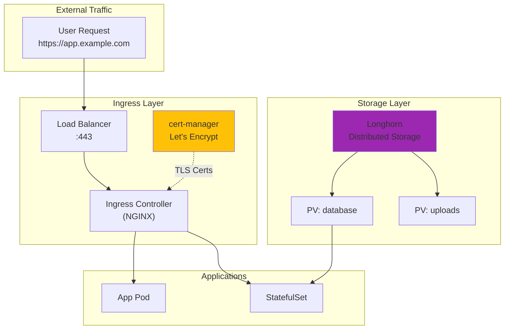
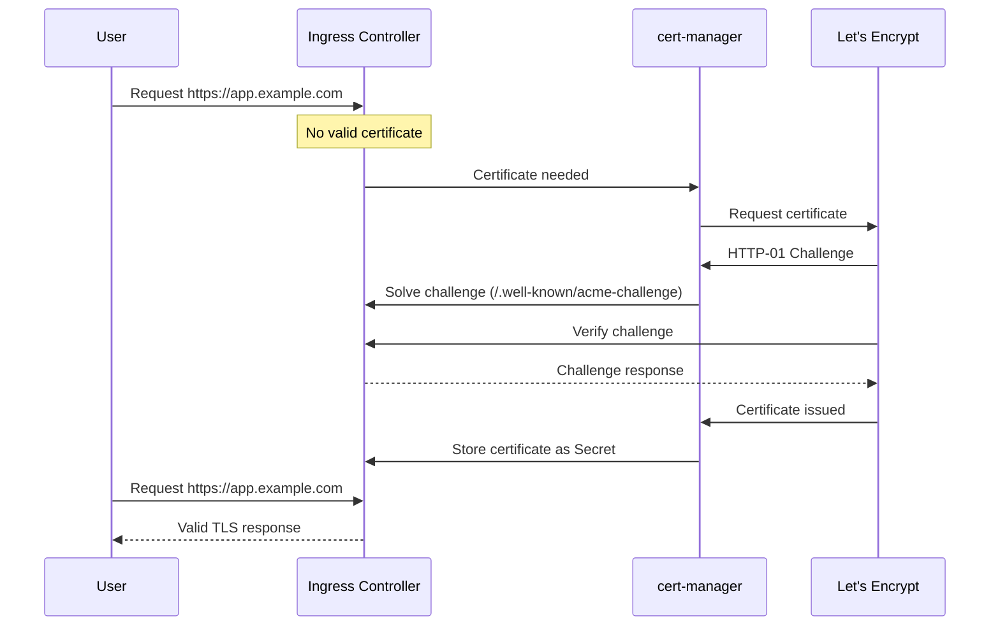
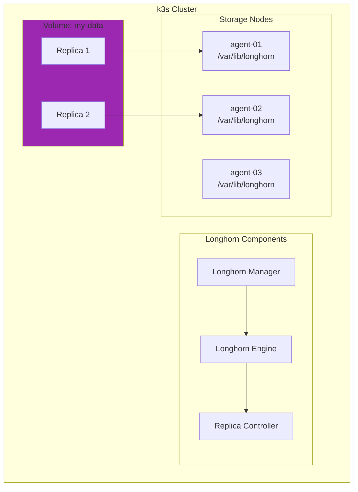
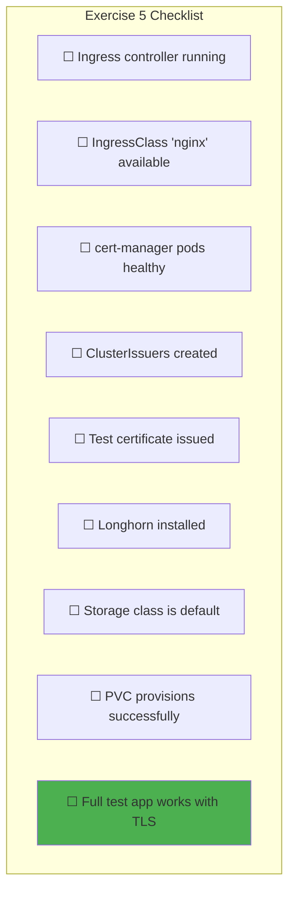
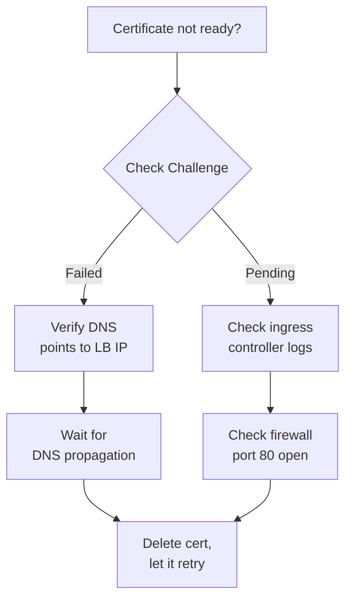
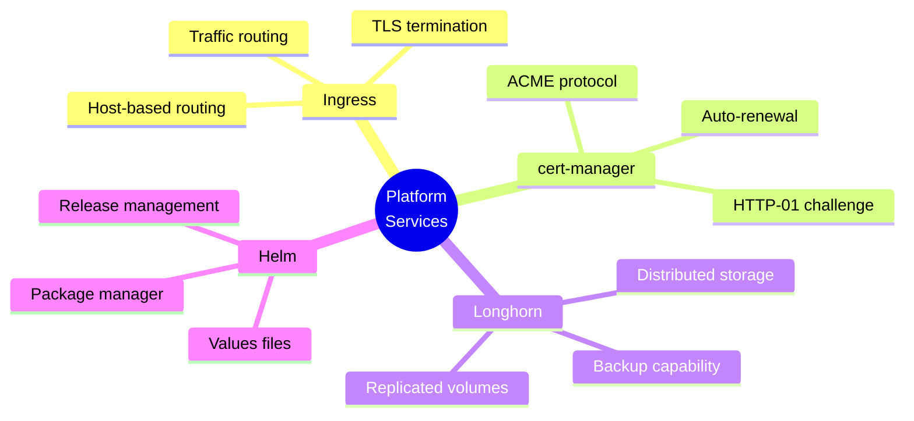

# Exercise 5: Core Platform Services

> *"A platform team's purpose is to enable stream-aligned teams to deliver work with substantial autonomy."*
> — **Team Topologies** (Matthew Skelton & Manuel Pais)

## Objective

Install and configure the foundational platform services: Ingress Controller, TLS certificates, and persistent storage.

---

## Prerequisites

- Completed [Exercise 4: k3s Installation](./04-k3s-Installation.md)
- Working k3s cluster with kubectl access
- Domain name pointing to load balancer IP
- Helm installed locally

---

## Platform Services Overview



---

## Phase 1: Helm Setup

### 1.1 Install Helm

```bash
# macOS
brew install helm

# Linux
curl https://raw.githubusercontent.com/helm/helm/main/scripts/get-helm-3 | bash

# Verify
helm version
```

### 1.2 Add Required Repos

```bash
# NGINX Ingress Controller
helm repo add ingress-nginx https://kubernetes.github.io/ingress-nginx

# cert-manager
helm repo add jetstack https://charts.jetstack.io

# Longhorn
helm repo add longhorn https://charts.longhorn.io

# Update repos
helm repo update
```

---

## Phase 2: NGINX Ingress Controller

> *"The ingress controller is the front door to your cluster. Design it carefully."*
> — **Kubernetes Patterns** (Bilgin Ibryam)

### 2.1 Create Ingress Namespace

```bash
kubectl create namespace ingress-nginx
```

### 2.2 Ingress Values File

Create `helm-values/ingress-nginx.yaml`:

```yaml
# helm-values/ingress-nginx.yaml
controller:
  # Run on all server nodes for HA
  kind: DaemonSet

  # Use host network for direct access
  hostNetwork: true
  hostPort:
    enabled: true
    ports:
      http: 80
      https: 443

  # Node selector - run on servers only
  nodeSelector:
    node-role.kubernetes.io/control-plane: "true"

  # Tolerations to run on control plane
  tolerations:
    - key: node-role.kubernetes.io/control-plane
      operator: Exists
      effect: NoSchedule

  # Resource limits
  resources:
    requests:
      cpu: 100m
      memory: 128Mi
    limits:
      cpu: 500m
      memory: 512Mi

  # Metrics for Prometheus
  metrics:
    enabled: true
    serviceMonitor:
      enabled: false  # Enable when Prometheus is installed

  # Default SSL certificate (optional)
  extraArgs:
    default-ssl-certificate: "cert-manager/wildcard-tls"

# Disable admission webhooks for simplicity
admissionWebhooks:
  enabled: false
```

### 2.3 Install Ingress Controller

```bash
helm install ingress-nginx ingress-nginx/ingress-nginx \
  --namespace ingress-nginx \
  --values helm-values/ingress-nginx.yaml

# Watch rollout
kubectl -n ingress-nginx get pods -w

# Verify DaemonSet
kubectl -n ingress-nginx get daemonset
```

### 2.4 Test Ingress

```bash
# Check ingress class
kubectl get ingressclass

# Should show:
# NAME    CONTROLLER                     PARAMETERS   AGE
# nginx   k8s.io/ingress-nginx           <none>       1m
```

---

## Phase 3: cert-manager

### 3.1 Install cert-manager CRDs

```bash
kubectl apply -f https://github.com/cert-manager/cert-manager/releases/download/v1.14.0/cert-manager.crds.yaml
```

### 3.2 cert-manager Values

Create `helm-values/cert-manager.yaml`:

```yaml
# helm-values/cert-manager.yaml
installCRDs: false  # Already installed above

# Resource limits
resources:
  requests:
    cpu: 10m
    memory: 32Mi
  limits:
    cpu: 100m
    memory: 128Mi

# Prometheus metrics
prometheus:
  enabled: true
  servicemonitor:
    enabled: false  # Enable when Prometheus installed

# Webhook configuration
webhook:
  resources:
    requests:
      cpu: 10m
      memory: 32Mi

cainjector:
  resources:
    requests:
      cpu: 10m
      memory: 32Mi
```

### 3.3 Install cert-manager

```bash
kubectl create namespace cert-manager

helm install cert-manager jetstack/cert-manager \
  --namespace cert-manager \
  --values helm-values/cert-manager.yaml

# Wait for pods
kubectl -n cert-manager get pods -w
```

### 3.4 Create ClusterIssuer

```yaml
# cert-manager/cluster-issuer.yaml
apiVersion: cert-manager.io/v1
kind: ClusterIssuer
metadata:
  name: letsencrypt-staging
spec:
  acme:
    server: https://acme-staging-v02.api.letsencrypt.org/directory
    email: admin@example.com  # Your email
    privateKeySecretRef:
      name: letsencrypt-staging-key
    solvers:
      - http01:
          ingress:
            class: nginx
---
apiVersion: cert-manager.io/v1
kind: ClusterIssuer
metadata:
  name: letsencrypt-prod
spec:
  acme:
    server: https://acme-v02.api.letsencrypt.org/directory
    email: admin@example.com  # Your email
    privateKeySecretRef:
      name: letsencrypt-prod-key
    solvers:
      - http01:
          ingress:
            class: nginx
```

```bash
# Apply cluster issuers
kubectl apply -f cert-manager/cluster-issuer.yaml

# Verify
kubectl get clusterissuer
```

---

## Phase 4: Certificate Flow



### 4.1 Test Certificate Issuance

```yaml
# test-cert/ingress.yaml
apiVersion: networking.k8s.io/v1
kind: Ingress
metadata:
  name: test-ingress
  annotations:
    cert-manager.io/cluster-issuer: letsencrypt-staging
spec:
  ingressClassName: nginx
  tls:
    - hosts:
        - test.example.com
      secretName: test-tls
  rules:
    - host: test.example.com
      http:
        paths:
          - path: /
            pathType: Prefix
            backend:
              service:
                name: nginx-test
                port:
                  number: 80
```

```bash
# Apply test ingress
kubectl apply -f test-cert/ingress.yaml

# Watch certificate
kubectl get certificate -w

# Check certificate status
kubectl describe certificate test-tls

# View the secret
kubectl get secret test-tls -o yaml
```

---

## Phase 5: Longhorn Storage

> *"Stateful workloads require careful consideration. Storage is the hardest part of Kubernetes."*
> — **Production Kubernetes** (Josh Rosso)

### 5.1 Longhorn Prerequisites

```bash
# Verify on each node (via Ansible)
ansible k3s_cluster -m shell -a "which iscsiadm && cat /etc/iscsi/initiatorname.iscsi"
```

### 5.2 Longhorn Values

Create `helm-values/longhorn.yaml`:

```yaml
# helm-values/longhorn.yaml
persistence:
  defaultClass: true
  defaultClassReplicaCount: 2  # 2 replicas for our 3-node cluster
  reclaimPolicy: Delete

defaultSettings:
  # Backup target (configure later)
  backupTarget: ""

  # Default replica count
  defaultReplicaCount: 2

  # Storage reserved for system
  storageMinimalAvailablePercentage: 15

  # Garbage collection
  orphanAutoDeletion: true

ingress:
  enabled: true
  ingressClassName: nginx
  host: longhorn.example.com
  tls: true
  tlsSecret: longhorn-tls
  annotations:
    cert-manager.io/cluster-issuer: letsencrypt-prod

# Resource limits for Longhorn manager
longhornManager:
  resources:
    requests:
      cpu: 100m
      memory: 128Mi

# UI resources
longhornUI:
  resources:
    requests:
      cpu: 50m
      memory: 64Mi
```

### 5.3 Install Longhorn

```bash
kubectl create namespace longhorn-system

helm install longhorn longhorn/longhorn \
  --namespace longhorn-system \
  --values helm-values/longhorn.yaml

# Watch installation (takes 2-3 minutes)
kubectl -n longhorn-system get pods -w
```

### 5.4 Verify Storage Class

```bash
# Check storage classes
kubectl get storageclass

# Should show:
# NAME                 PROVISIONER          RECLAIMPOLICY   AGE
# longhorn (default)   driver.longhorn.io   Delete          1m

# Check Longhorn nodes
kubectl -n longhorn-system get nodes.longhorn.io
```

---

## Phase 6: Storage Architecture



### 6.1 Test Persistent Volume

```yaml
# test-storage/pvc.yaml
apiVersion: v1
kind: PersistentVolumeClaim
metadata:
  name: test-pvc
spec:
  accessModes:
    - ReadWriteOnce
  storageClassName: longhorn
  resources:
    requests:
      storage: 1Gi
---
apiVersion: v1
kind: Pod
metadata:
  name: test-storage-pod
spec:
  containers:
    - name: test
      image: busybox
      command: ["sh", "-c", "echo 'Hello from Longhorn!' > /data/test.txt && sleep 3600"]
      volumeMounts:
        - name: data
          mountPath: /data
  volumes:
    - name: data
      persistentVolumeClaim:
        claimName: test-pvc
```

```bash
# Apply test
kubectl apply -f test-storage/pvc.yaml

# Check PVC status
kubectl get pvc test-pvc

# Check volume in Longhorn
kubectl -n longhorn-system get volumes.longhorn.io

# Verify data
kubectl exec test-storage-pod -- cat /data/test.txt

# Clean up
kubectl delete -f test-storage/pvc.yaml
```

---

## Phase 7: Complete Platform Test

### 7.1 Deploy Full Test Application

```yaml
# platform-test/app.yaml
apiVersion: v1
kind: Namespace
metadata:
  name: platform-test
---
apiVersion: v1
kind: PersistentVolumeClaim
metadata:
  name: app-data
  namespace: platform-test
spec:
  accessModes:
    - ReadWriteOnce
  storageClassName: longhorn
  resources:
    requests:
      storage: 1Gi
---
apiVersion: apps/v1
kind: Deployment
metadata:
  name: web-app
  namespace: platform-test
spec:
  replicas: 2
  selector:
    matchLabels:
      app: web-app
  template:
    metadata:
      labels:
        app: web-app
    spec:
      containers:
        - name: nginx
          image: nginx:alpine
          ports:
            - containerPort: 80
          resources:
            requests:
              memory: "64Mi"
              cpu: "100m"
---
apiVersion: v1
kind: Service
metadata:
  name: web-app
  namespace: platform-test
spec:
  selector:
    app: web-app
  ports:
    - port: 80
---
apiVersion: networking.k8s.io/v1
kind: Ingress
metadata:
  name: web-app
  namespace: platform-test
  annotations:
    cert-manager.io/cluster-issuer: letsencrypt-prod
spec:
  ingressClassName: nginx
  tls:
    - hosts:
        - app.example.com
      secretName: web-app-tls
  rules:
    - host: app.example.com
      http:
        paths:
          - path: /
            pathType: Prefix
            backend:
              service:
                name: web-app
                port:
                  number: 80
```

```bash
# Deploy
kubectl apply -f platform-test/app.yaml

# Watch certificate
kubectl -n platform-test get certificate -w

# Test HTTPS access
curl -v https://app.example.com

# Clean up
kubectl delete namespace platform-test
```

---

## Verification Checklist



### Success Criteria

| Component | Verification |
|-----------|-------------|
| Ingress | `kubectl -n ingress-nginx get daemonset` |
| cert-manager | `kubectl -n cert-manager get pods` |
| ClusterIssuer | `kubectl get clusterissuer -o wide` |
| Certificate | `kubectl get certificate -A` |
| Longhorn | `kubectl -n longhorn-system get pods` |
| StorageClass | `kubectl get sc` (longhorn = default) |
| PVC | Create PVC, verify `Bound` status |

---

## Troubleshooting

### Certificate Issues



```bash
# Check certificate request
kubectl describe certificaterequest

# Check challenges
kubectl get challenges -A

# cert-manager logs
kubectl -n cert-manager logs -l app=cert-manager -f

# Check HTTP-01 solver
kubectl describe challenge <challenge-name>
```

### Longhorn Issues

```bash
# Check node status
kubectl -n longhorn-system get nodes.longhorn.io -o wide

# Check manager logs
kubectl -n longhorn-system logs -l app=longhorn-manager -f

# Verify iscsi is running
ssh root@$AGENT_01_IP "systemctl status iscsid"
```

---

## Key Concepts Learned



---

## Next Exercise

Proceed to:
→ [Exercise 6: GitOps with ArgoCD](./06-GitOps-ArgoCD.md)

---

*Last Updated: 2026-02-02*
