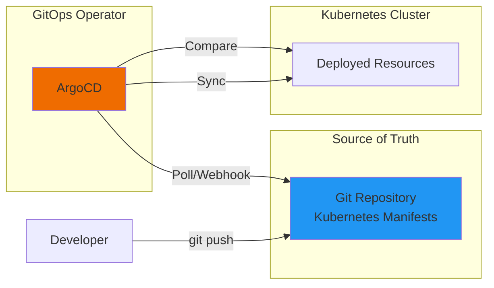
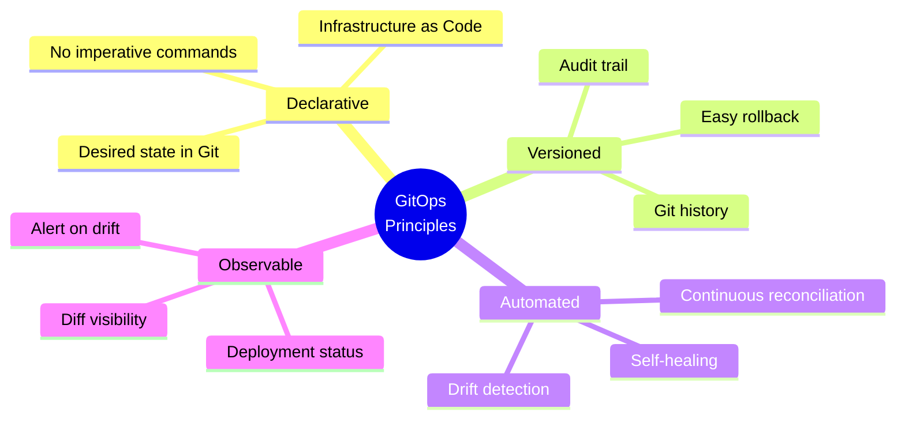
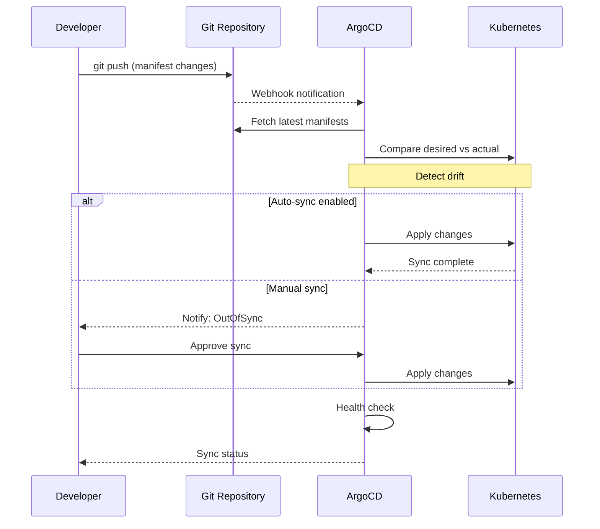
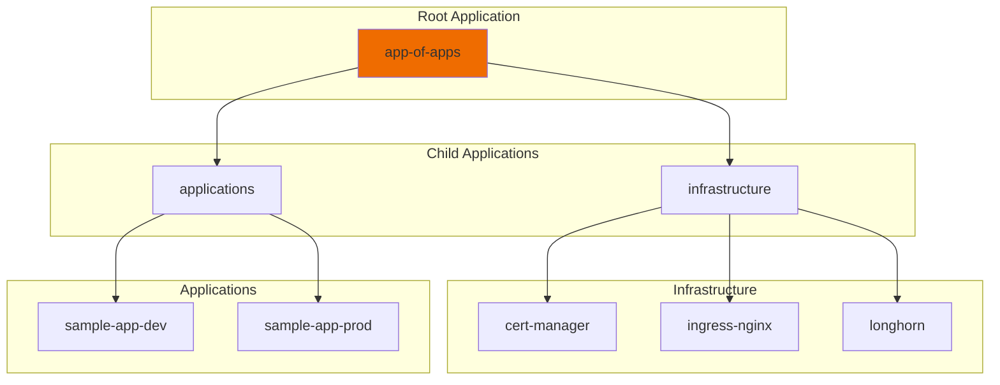
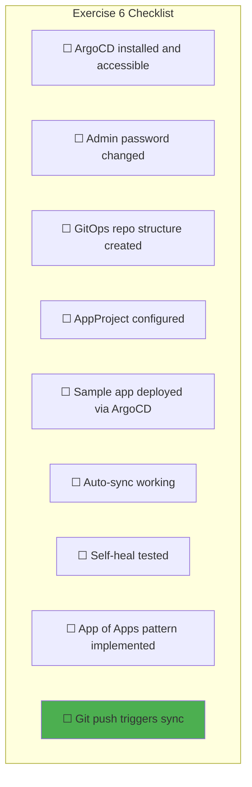
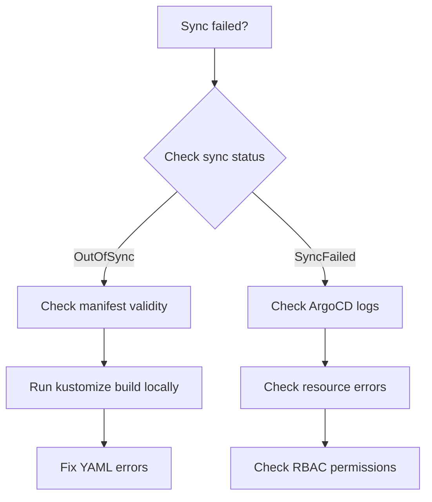
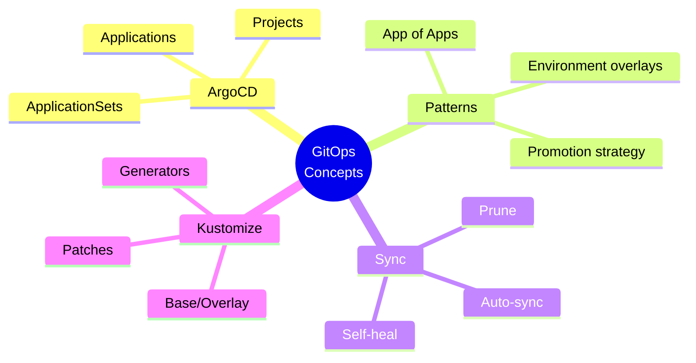

# Exercise 6: GitOps with ArgoCD

> *"GitOps is the operating model for building applications where the entire system is described declaratively."*
> — **GitOps and Kubernetes** (Billy Yuen)

## Objective

Implement GitOps practices using ArgoCD to manage application deployments declaratively through Git.

---

## Prerequisites

- Completed [Exercise 5: Core Platform Services](./05-Core-Platform-Services.md)
- Working ingress and cert-manager
- GitHub repository for application manifests
- kubectl and helm configured

---

## What is GitOps?



### GitOps Principles



---

## Phase 1: ArgoCD Installation

### 1.1 Create Namespace

```bash
kubectl create namespace argocd
```

### 1.2 ArgoCD Values

Create `helm-values/argocd.yaml`:

```yaml
# helm-values/argocd.yaml

# HA configuration
controller:
  replicas: 2

server:
  replicas: 2

  # Ingress configuration
  ingress:
    enabled: true
    ingressClassName: nginx
    hosts:
      - argocd.example.com
    tls:
      - secretName: argocd-tls
        hosts:
          - argocd.example.com
    annotations:
      cert-manager.io/cluster-issuer: letsencrypt-prod
      nginx.ingress.kubernetes.io/ssl-passthrough: "true"
      nginx.ingress.kubernetes.io/backend-protocol: "HTTPS"

  # Disable TLS on server (handled by ingress)
  extraArgs:
    - --insecure

repoServer:
  replicas: 2

applicationSet:
  replicas: 2

redis-ha:
  enabled: true

# Resource limits
resources:
  requests:
    cpu: 100m
    memory: 128Mi
```

### 1.3 Install ArgoCD

```bash
# Add Argo Helm repo
helm repo add argo https://argoproj.github.io/argo-helm
helm repo update

# Install ArgoCD
helm install argocd argo/argo-cd \
  --namespace argocd \
  --values helm-values/argocd.yaml

# Wait for deployment
kubectl -n argocd get pods -w
```

### 1.4 Get Initial Admin Password

```bash
# Get admin password
kubectl -n argocd get secret argocd-initial-admin-secret \
  -o jsonpath="{.data.password}" | base64 -d

# Access ArgoCD UI
# https://argocd.example.com
# Username: admin
# Password: <from above>

# Change password via CLI
argocd login argocd.example.com
argocd account update-password
```

---

## Phase 2: Repository Structure

### 2.1 GitOps Repository Layout

```
gitops-repo/
├── README.md
├── apps/                    # Application definitions
│   ├── base/
│   │   └── kustomization.yaml
│   └── overlays/
│       ├── dev/
│       │   └── kustomization.yaml
│       └── prod/
│           └── kustomization.yaml
├── infrastructure/          # Platform services
│   ├── cert-manager/
│   ├── ingress-nginx/
│   └── longhorn/
└── argocd/                  # ArgoCD configurations
    ├── projects/
    └── applicationsets/
```

### 2.2 Create Sample Application

Create `apps/base/deployment.yaml`:

```yaml
# apps/base/deployment.yaml
apiVersion: apps/v1
kind: Deployment
metadata:
  name: sample-app
spec:
  replicas: 2
  selector:
    matchLabels:
      app: sample-app
  template:
    metadata:
      labels:
        app: sample-app
    spec:
      containers:
        - name: app
          image: nginx:alpine
          ports:
            - containerPort: 80
          resources:
            requests:
              memory: "64Mi"
              cpu: "100m"
            limits:
              memory: "128Mi"
              cpu: "200m"
          livenessProbe:
            httpGet:
              path: /
              port: 80
            initialDelaySeconds: 5
            periodSeconds: 10
          readinessProbe:
            httpGet:
              path: /
              port: 80
            initialDelaySeconds: 5
            periodSeconds: 5
---
apiVersion: v1
kind: Service
metadata:
  name: sample-app
spec:
  selector:
    app: sample-app
  ports:
    - port: 80
      targetPort: 80
```

Create `apps/base/kustomization.yaml`:

```yaml
# apps/base/kustomization.yaml
apiVersion: kustomize.config.k8s.io/v1beta1
kind: Kustomization

resources:
  - deployment.yaml

commonLabels:
  app.kubernetes.io/managed-by: argocd
```

Create `apps/overlays/dev/kustomization.yaml`:

```yaml
# apps/overlays/dev/kustomization.yaml
apiVersion: kustomize.config.k8s.io/v1beta1
kind: Kustomization

namespace: dev
namePrefix: dev-

resources:
  - ../../base

replicas:
  - name: sample-app
    count: 1

images:
  - name: nginx
    newTag: "1.25-alpine"
```

Create `apps/overlays/prod/kustomization.yaml`:

```yaml
# apps/overlays/prod/kustomization.yaml
apiVersion: kustomize.config.k8s.io/v1beta1
kind: Kustomization

namespace: prod
namePrefix: prod-

resources:
  - ../../base
  - ingress.yaml

replicas:
  - name: sample-app
    count: 3

images:
  - name: nginx
    newTag: "1.25-alpine"
```

---

## Phase 3: ArgoCD Application

### 3.1 Sync Flow



### 3.2 Create ArgoCD Project

```yaml
# argocd/projects/platform.yaml
apiVersion: argoproj.io/v1alpha1
kind: AppProject
metadata:
  name: platform
  namespace: argocd
spec:
  description: Platform services project

  # Source repositories
  sourceRepos:
    - 'https://github.com/your-org/gitops-repo.git'
    - 'https://charts.jetstack.io'
    - 'https://kubernetes.github.io/ingress-nginx'

  # Allowed destinations
  destinations:
    - namespace: '*'
      server: https://kubernetes.default.svc

  # Cluster resources allowed
  clusterResourceWhitelist:
    - group: ''
      kind: Namespace
    - group: 'rbac.authorization.k8s.io'
      kind: ClusterRole
    - group: 'rbac.authorization.k8s.io'
      kind: ClusterRoleBinding

  # Namespace resources allowed
  namespaceResourceWhitelist:
    - group: '*'
      kind: '*'
```

### 3.3 Create Application

```yaml
# argocd/applications/sample-app-dev.yaml
apiVersion: argoproj.io/v1alpha1
kind: Application
metadata:
  name: sample-app-dev
  namespace: argocd
spec:
  project: platform

  source:
    repoURL: https://github.com/your-org/gitops-repo.git
    targetRevision: main
    path: apps/overlays/dev

  destination:
    server: https://kubernetes.default.svc
    namespace: dev

  syncPolicy:
    automated:
      prune: true        # Delete resources not in Git
      selfHeal: true     # Revert manual changes
      allowEmpty: false  # Don't sync if path is empty

    syncOptions:
      - CreateNamespace=true
      - PruneLast=true

    retry:
      limit: 5
      backoff:
        duration: 5s
        factor: 2
        maxDuration: 3m
```

---

## Phase 4: App of Apps Pattern

> *"The App of Apps pattern allows you to declaratively specify one ArgoCD app that consists of other apps."*
> — **ArgoCD Documentation**

### 4.1 Architecture



### 4.2 Root Application

```yaml
# argocd/applications/root.yaml
apiVersion: argoproj.io/v1alpha1
kind: Application
metadata:
  name: root
  namespace: argocd
  finalizers:
    - resources-finalizer.argocd.argoproj.io
spec:
  project: default

  source:
    repoURL: https://github.com/your-org/gitops-repo.git
    targetRevision: main
    path: argocd/applications

  destination:
    server: https://kubernetes.default.svc
    namespace: argocd

  syncPolicy:
    automated:
      prune: true
      selfHeal: true
```

### 4.3 ApplicationSet for Environments

```yaml
# argocd/applicationsets/sample-app.yaml
apiVersion: argoproj.io/v1alpha1
kind: ApplicationSet
metadata:
  name: sample-app
  namespace: argocd
spec:
  generators:
    - list:
        elements:
          - env: dev
            replicas: 1
            targetRevision: main
          - env: staging
            replicas: 2
            targetRevision: main
          - env: prod
            replicas: 3
            targetRevision: main

  template:
    metadata:
      name: 'sample-app-{{env}}'
    spec:
      project: platform
      source:
        repoURL: https://github.com/your-org/gitops-repo.git
        targetRevision: '{{targetRevision}}'
        path: 'apps/overlays/{{env}}'
      destination:
        server: https://kubernetes.default.svc
        namespace: '{{env}}'
      syncPolicy:
        automated:
          prune: true
          selfHeal: true
        syncOptions:
          - CreateNamespace=true
```

---

## Phase 5: Deployment Workflow

### 5.1 Development Flow

```mermaid
flowchart LR
    subgraph Dev["Development"]
        Code["Code Change"]
        PR["Pull Request"]
        Review["Review"]
    end

    subgraph CI["CI Pipeline"]
        Build["Build"]
        Test["Test"]
        Push["Push Image"]
    end

    subgraph CD["CD (GitOps)"]
        Update["Update Manifest"]
        Merge["Merge to Main"]
        Sync["ArgoCD Sync"]
    end

    subgraph Deploy["Deployment"]
        Dev_Env["Dev Cluster"]
        Verify["Verify"]
    end

    Code --> PR --> Review
    Review --> Build --> Test --> Push
    Push --> Update --> Merge --> Sync
    Sync --> Dev_Env --> Verify

    style Sync fill:#EF6C00
```



### 5.2 Promotion Strategy

```yaml
# Progressive deployment across environments

# 1. Dev: Auto-sync from main branch
# 2. Staging: Auto-sync from main, requires health check
# 3. Prod: Manual sync, requires approval

# Example: Production with manual sync
apiVersion: argoproj.io/v1alpha1
kind: Application
metadata:
  name: sample-app-prod
  namespace: argocd
spec:
  project: platform
  source:
    repoURL: https://github.com/your-org/gitops-repo.git
    targetRevision: main
    path: apps/overlays/prod
  destination:
    server: https://kubernetes.default.svc
    namespace: prod
  # No automated sync - requires manual approval
  syncPolicy:
    syncOptions:
      - CreateNamespace=true
```

---

## Phase 6: Notifications & Webhooks

### 6.1 GitHub Webhook

```bash
# Configure GitHub webhook for immediate sync
# Settings → Webhooks → Add webhook
# URL: https://argocd.example.com/api/webhook
# Content type: application/json
# Secret: <your-webhook-secret>
```

### 6.2 Slack Notifications

```yaml
# argocd-notifications-cm ConfigMap
apiVersion: v1
kind: ConfigMap
metadata:
  name: argocd-notifications-cm
  namespace: argocd
data:
  service.slack: |
    token: $slack-token

  template.app-deployed: |
    message: |
      Application {{.app.metadata.name}} is now running new version.
    slack:
      attachments: |
        [{
          "color": "#18be52",
          "title": "{{ .app.metadata.name }}",
          "fields": [
            {"title": "Sync Status", "value": "{{.app.status.sync.status}}", "short": true},
            {"title": "Repository", "value": "{{.app.spec.source.repoURL}}", "short": true}
          ]
        }]

  trigger.on-deployed: |
    - when: app.status.operationState.phase in ['Succeeded'] and app.status.health.status == 'Healthy'
      send: [app-deployed]
```

---

## Phase 7: Verification & Testing

### 7.1 Test GitOps Flow

```bash
# 1. Make a change in Git
# Edit apps/overlays/dev/kustomization.yaml
# Change image tag

# 2. Push to repository
git add .
git commit -m "Update dev image to 1.26-alpine"
git push

# 3. Watch ArgoCD sync
argocd app get sample-app-dev --refresh

# 4. Verify deployment
kubectl -n dev get pods -w

# 5. Check sync status
argocd app list
```

### 7.2 Test Self-Healing

```bash
# Manually change something in cluster
kubectl -n dev scale deployment dev-sample-app --replicas=5

# Watch ArgoCD detect drift and revert
kubectl -n dev get pods -w

# ArgoCD will restore to Git-defined state (1 replica for dev)
```

---

## Verification Checklist



### Success Criteria

| Requirement | Verification |
|-------------|-------------|
| ArgoCD UI accessible | `https://argocd.example.com` |
| Applications synced | `argocd app list` shows Healthy |
| Auto-sync works | Push to Git, watch sync |
| Self-heal works | Manual change reverts |
| Drift detection | OutOfSync shown when changed |

---

## Troubleshooting

### Sync Issues



```bash
# Check app status
argocd app get sample-app-dev

# View sync details
argocd app sync sample-app-dev --dry-run

# Check resource tree
argocd app resources sample-app-dev

# ArgoCD server logs
kubectl -n argocd logs -l app.kubernetes.io/name=argocd-server -f
```

---

## Key Concepts Learned



---

## Next Exercise

Proceed to:
→ [Exercise 7: Observability Stack](./07-Observability-Stack.md)

---

*Last Updated: 2026-02-02*
