# Exercise 7: Observability Stack

> *"Hope is not a strategy. Without observability, you're flying blind."*
> — **Site Reliability Engineering** (Google)

## Objective

Deploy a complete observability stack with Prometheus (metrics), Loki (logs), and Grafana (visualization) to monitor your platform.

---

## Prerequisites

- Completed [Exercise 6: GitOps with ArgoCD](./06-GitOps-ArgoCD.md)
- Working k3s cluster with ingress and storage
- Helm configured
- Domain names for Grafana/Prometheus endpoints

---

## Three Pillars of Observability

```mermaid
flowchart TB
    subgraph Pillars["Three Pillars"]
        Metrics["📊 Metrics<br/>(Prometheus)"]
        Logs["📝 Logs<br/>(Loki)"]
        Traces["🔗 Traces<br/>(Tempo)"]
    end

    subgraph Viz["Visualization"]
        Grafana["Grafana"]
    end

    subgraph Alert["Alerting"]
        AM["AlertManager"]
        Slack["Slack/PagerDuty"]
    end

    Metrics & Logs & Traces --> Grafana
    Metrics --> AM --> Slack

    style Metrics fill:#E65100
    style Logs fill:#1565C0
    style Traces fill:#2E7D32
```



---

## Phase 1: Prometheus Stack

### 1.1 kube-prometheus-stack Overview


### 1.2 Prometheus Values

Create `helm-values/kube-prometheus-stack.yaml`:

```yaml
# helm-values/kube-prometheus-stack.yaml

# Global settings
fullnameOverride: prometheus

# Prometheus configuration
prometheus:
  prometheusSpec:
    # Retention
    retention: 15d
    retentionSize: "10GB"

    # Storage
    storageSpec:
      volumeClaimTemplate:
        spec:
          storageClassName: longhorn
          accessModes: ["ReadWriteOnce"]
          resources:
            requests:
              storage: 20Gi

    # Resource limits
    resources:
      requests:
        cpu: 200m
        memory: 512Mi
      limits:
        cpu: 1000m
        memory: 2Gi

    # Service monitors auto-discovery
    serviceMonitorSelectorNilUsesHelmValues: false
    podMonitorSelectorNilUsesHelmValues: false

  ingress:
    enabled: true
    ingressClassName: nginx
    hosts:
      - prometheus.example.com
    tls:
      - secretName: prometheus-tls
        hosts:
          - prometheus.example.com
    annotations:
      cert-manager.io/cluster-issuer: letsencrypt-prod

# AlertManager configuration
alertmanager:
  alertmanagerSpec:
    storage:
      volumeClaimTemplate:
        spec:
          storageClassName: longhorn
          accessModes: ["ReadWriteOnce"]
          resources:
            requests:
              storage: 5Gi

  ingress:
    enabled: true
    ingressClassName: nginx
    hosts:
      - alertmanager.example.com
    tls:
      - secretName: alertmanager-tls
        hosts:
          - alertmanager.example.com
    annotations:
      cert-manager.io/cluster-issuer: letsencrypt-prod

# Grafana configuration
grafana:
  adminPassword: "changeme"  # Change this!

  persistence:
    enabled: true
    storageClassName: longhorn
    size: 5Gi

  ingress:
    enabled: true
    ingressClassName: nginx
    hosts:
      - grafana.example.com
    tls:
      - secretName: grafana-tls
        hosts:
          - grafana.example.com
    annotations:
      cert-manager.io/cluster-issuer: letsencrypt-prod

  # Additional data sources (Loki)
  additionalDataSources:
    - name: Loki
      type: loki
      url: http://loki-gateway.monitoring.svc.cluster.local
      access: proxy
      isDefault: false

  # Pre-installed dashboards
  dashboardProviders:
    dashboardproviders.yaml:
      apiVersion: 1
      providers:
        - name: 'default'
          orgId: 1
          folder: 'Platform'
          type: file
          disableDeletion: true
          editable: false
          options:
            path: /var/lib/grafana/dashboards/default

# Node exporter
nodeExporter:
  enabled: true

# kube-state-metrics
kubeStateMetrics:
  enabled: true

# Disable for k3s (uses different paths)
kubeControllerManager:
  enabled: false
kubeScheduler:
  enabled: false
kubeProxy:
  enabled: false
kubeEtcd:
  enabled: false
```

### 1.3 Install Prometheus Stack

```bash
# Add Prometheus community repo
helm repo add prometheus-community https://prometheus-community.github.io/helm-charts
helm repo update

# Create namespace
kubectl create namespace monitoring

# Install
helm install prometheus prometheus-community/kube-prometheus-stack \
  --namespace monitoring \
  --values helm-values/kube-prometheus-stack.yaml

# Watch deployment
kubectl -n monitoring get pods -w
```

---

## Phase 2: Loki for Logs

### 2.1 Loki Architecture


### 2.2 Loki Values

Create `helm-values/loki.yaml`:

```yaml
# helm-values/loki.yaml

# Simple scalable deployment
deploymentMode: SimpleScalable

loki:
  # Authentication
  auth_enabled: false

  # Common config
  commonConfig:
    replication_factor: 2

  # Storage configuration
  storage:
    type: filesystem

  # Schema config
  schemaConfig:
    configs:
      - from: "2024-01-01"
        store: tsdb
        object_store: filesystem
        schema: v13
        index:
          prefix: index_
          period: 24h

# Gateway
gateway:
  enabled: true
  replicas: 1

# Read path (querier)
read:
  replicas: 2
  persistence:
    size: 10Gi
    storageClass: longhorn

# Write path (ingester)
write:
  replicas: 2
  persistence:
    size: 10Gi
    storageClass: longhorn

# Backend (compactor, ruler)
backend:
  replicas: 1
  persistence:
    size: 10Gi
    storageClass: longhorn

# Disable single binary mode
singleBinary:
  replicas: 0

# Monitoring
monitoring:
  serviceMonitor:
    enabled: true
  selfMonitoring:
    enabled: false
    grafanaAgent:
      installOperator: false
```

### 2.3 Promtail Values

Create `helm-values/promtail.yaml`:

```yaml
# helm-values/promtail.yaml

# Loki endpoint
config:
  clients:
    - url: http://loki-gateway.monitoring.svc.cluster.local/loki/api/v1/push

  # Pipeline stages for parsing
  snippets:
    pipelineStages:
      - cri: {}
      - multiline:
          firstline: '^\d{4}-\d{2}-\d{2}'
          max_wait_time: 3s

# Service monitor for self-monitoring
serviceMonitor:
  enabled: true

# Resources
resources:
  requests:
    cpu: 50m
    memory: 64Mi
  limits:
    cpu: 200m
    memory: 256Mi

# Tolerations to run on all nodes
tolerations:
  - operator: Exists
    effect: NoSchedule
```

### 2.4 Install Loki Stack

```bash
# Add Grafana repo
helm repo add grafana https://grafana.github.io/helm-charts
helm repo update

# Install Loki
helm install loki grafana/loki \
  --namespace monitoring \
  --values helm-values/loki.yaml

# Install Promtail
helm install promtail grafana/promtail \
  --namespace monitoring \
  --values helm-values/promtail.yaml

# Verify
kubectl -n monitoring get pods -l app.kubernetes.io/name=loki
kubectl -n monitoring get pods -l app.kubernetes.io/name=promtail
```

---

## Phase 3: Grafana Dashboards

### 3.1 Dashboard Organization


### 3.2 Cluster Overview Dashboard

Create `dashboards/cluster-overview.json`:

```json
{
  "dashboard": {
    "title": "Cluster Overview",
    "tags": ["platform", "overview"],
    "panels": [
      {
        "title": "Cluster CPU Usage",
        "type": "gauge",
        "targets": [
          {
            "expr": "sum(rate(container_cpu_usage_seconds_total{container!=\"\"}[5m])) / sum(machine_cpu_cores) * 100",
            "legendFormat": "CPU %"
          }
        ]
      },
      {
        "title": "Cluster Memory Usage",
        "type": "gauge",
        "targets": [
          {
            "expr": "sum(container_memory_working_set_bytes{container!=\"\"}) / sum(machine_memory_bytes) * 100",
            "legendFormat": "Memory %"
          }
        ]
      },
      {
        "title": "Pod Count by Namespace",
        "type": "piechart",
        "targets": [
          {
            "expr": "sum by (namespace) (kube_pod_status_phase{phase=\"Running\"})",
            "legendFormat": "{{namespace}}"
          }
        ]
      },
      {
        "title": "Node Status",
        "type": "table",
        "targets": [
          {
            "expr": "kube_node_status_condition{condition=\"Ready\",status=\"true\"}",
            "legendFormat": "{{node}}"
          }
        ]
      }
    ]
  }
}
```

### 3.3 Key PromQL Queries

```yaml
# CPU Usage by Node
sum by (instance) (rate(node_cpu_seconds_total{mode!="idle"}[5m])) / count by (instance) (node_cpu_seconds_total{mode="idle"}) * 100

# Memory Usage by Node
(1 - node_memory_MemAvailable_bytes / node_memory_MemTotal_bytes) * 100

# Pod Restarts (last hour)
sum by (namespace, pod) (increase(kube_pod_container_status_restarts_total[1h]))

# HTTP Request Rate (if using ingress-nginx)
sum(rate(nginx_ingress_controller_requests[5m])) by (ingress)

# HTTP Error Rate (5xx)
sum(rate(nginx_ingress_controller_requests{status=~"5.."}[5m])) / sum(rate(nginx_ingress_controller_requests[5m])) * 100

# PVC Usage Percentage
kubelet_volume_stats_used_bytes / kubelet_volume_stats_capacity_bytes * 100
```

---

## Phase 4: Alerting

> *"Good alerting is not about catching every possible problem. It's about catching problems that matter."*
> — **Practical Monitoring** (Mike Julian)

### 4.1 Alert Flow


### 4.2 AlertManager Configuration

```yaml
# alertmanager-config.yaml
apiVersion: v1
kind: Secret
metadata:
  name: alertmanager-prometheus-alertmanager
  namespace: monitoring
stringData:
  alertmanager.yaml: |
    global:
      slack_api_url: 'https://hooks.slack.com/services/xxx/yyy/zzz'

    route:
      receiver: 'slack-default'
      group_by: ['alertname', 'namespace']
      group_wait: 30s
      group_interval: 5m
      repeat_interval: 4h

      routes:
        - match:
            severity: critical
          receiver: 'slack-critical'
          continue: true

        - match:
            severity: warning
          receiver: 'slack-warning'

    receivers:
      - name: 'slack-default'
        slack_configs:
          - channel: '#alerts'
            send_resolved: true
            title: '{{ .Status | toUpper }}: {{ .CommonLabels.alertname }}'
            text: '{{ range .Alerts }}{{ .Annotations.description }}{{ end }}'

      - name: 'slack-critical'
        slack_configs:
          - channel: '#alerts-critical'
            send_resolved: true
            color: '{{ if eq .Status "firing" }}danger{{ else }}good{{ end }}'
            title: '🚨 {{ .CommonLabels.alertname }}'
            text: '{{ range .Alerts }}{{ .Annotations.description }}{{ end }}'

      - name: 'slack-warning'
        slack_configs:
          - channel: '#alerts-warning'
            send_resolved: true
            title: '⚠️ {{ .CommonLabels.alertname }}'
```

### 4.3 Alert Rules

```yaml
# prometheus-rules.yaml
apiVersion: monitoring.coreos.com/v1
kind: PrometheusRule
metadata:
  name: platform-alerts
  namespace: monitoring
spec:
  groups:
    - name: node-alerts
      rules:
        - alert: NodeHighCPU
          expr: |
            (1 - avg by(instance) (rate(node_cpu_seconds_total{mode="idle"}[5m]))) > 0.8
          for: 5m
          labels:
            severity: warning
          annotations:
            summary: "High CPU on {{ $labels.instance }}"
            description: "CPU usage is above 80% for 5 minutes"

        - alert: NodeHighMemory
          expr: |
            (1 - node_memory_MemAvailable_bytes / node_memory_MemTotal_bytes) > 0.85
          for: 5m
          labels:
            severity: warning
          annotations:
            summary: "High memory on {{ $labels.instance }}"
            description: "Memory usage is above 85%"

        - alert: NodeDiskPressure
          expr: |
            (1 - node_filesystem_avail_bytes{mountpoint="/"} / node_filesystem_size_bytes{mountpoint="/"}) > 0.85
          for: 5m
          labels:
            severity: critical
          annotations:
            summary: "Disk pressure on {{ $labels.instance }}"
            description: "Root filesystem is above 85% full"

    - name: kubernetes-alerts
      rules:
        - alert: PodCrashLooping
          expr: |
            increase(kube_pod_container_status_restarts_total[1h]) > 5
          for: 5m
          labels:
            severity: critical
          annotations:
            summary: "Pod {{ $labels.namespace }}/{{ $labels.pod }} is crash looping"
            description: "Pod has restarted more than 5 times in the last hour"

        - alert: PodNotReady
          expr: |
            kube_pod_status_ready{condition="false"} == 1
          for: 15m
          labels:
            severity: warning
          annotations:
            summary: "Pod {{ $labels.namespace }}/{{ $labels.pod }} not ready"
            description: "Pod has been in not-ready state for 15 minutes"

        - alert: DeploymentReplicasMismatch
          expr: |
            kube_deployment_spec_replicas != kube_deployment_status_replicas_available
          for: 10m
          labels:
            severity: warning
          annotations:
            summary: "Deployment {{ $labels.namespace }}/{{ $labels.deployment }} replicas mismatch"
            description: "Expected {{ $value }} replicas but have fewer available"

    - name: storage-alerts
      rules:
        - alert: PVCAlmostFull
          expr: |
            kubelet_volume_stats_used_bytes / kubelet_volume_stats_capacity_bytes > 0.85
          for: 5m
          labels:
            severity: warning
          annotations:
            summary: "PVC {{ $labels.namespace }}/{{ $labels.persistentvolumeclaim }} almost full"
            description: "PVC is above 85% capacity"
```

---

## Phase 5: Log Exploration

### 5.1 LogQL Queries

```logql
# All logs from a namespace
{namespace="production"}

# Filter by pod name pattern
{namespace="production", pod=~"api-.*"}

# Search for errors
{namespace="production"} |= "error"

# JSON log parsing
{namespace="production"} | json | level="error"

# Rate of errors per minute
sum(rate({namespace="production"} |= "error" [1m])) by (pod)

# Top 10 error messages
{namespace="production"} |= "error" | pattern `<_> error: <message>` | line_format "{{.message}}" | topk(10, message)
```

### 5.2 Grafana Explore

```bash
# Access Grafana
# https://grafana.example.com

# Navigate to Explore
# Select Loki data source
# Use LogQL queries to search logs
```

---

## Phase 6: Service Monitors

### 6.1 Application ServiceMonitor

```yaml
# servicemonitor-example.yaml
apiVersion: monitoring.coreos.com/v1
kind: ServiceMonitor
metadata:
  name: sample-app
  namespace: production
  labels:
    release: prometheus  # Matches Prometheus selector
spec:
  selector:
    matchLabels:
      app: sample-app
  endpoints:
    - port: metrics
      interval: 15s
      path: /metrics
  namespaceSelector:
    matchNames:
      - production
```

### 6.2 PodMonitor for Sidecar Metrics

```yaml
# podmonitor-example.yaml
apiVersion: monitoring.coreos.com/v1
kind: PodMonitor
metadata:
  name: envoy-sidecar
  namespace: production
spec:
  selector:
    matchLabels:
      app: my-app
  podMetricsEndpoints:
    - port: envoy-admin
      interval: 15s
      path: /stats/prometheus
```

---

## Verification Checklist

```mermaid
flowchart TB
    subgraph Checklist["Exercise 7 Checklist"]
        C1["☐ Prometheus collecting metrics"]
        C2["☐ Grafana accessible with dashboards"]
        C3["☐ Loki receiving logs"]
        C4["☐ Promtail running on all nodes"]
        C5["☐ AlertManager configured"]
        C6["☐ Alert rules deployed"]
        C7["☐ Slack integration working"]
        C8["☐ Can query logs in Grafana"]
        C9["☐ Test alert fires correctly"]
    end

    style C9 fill:#4CAF50
```



### Success Criteria

| Component | Verification |
|-----------|-------------|
| Prometheus | `https://prometheus.example.com/targets` |
| Grafana | Login and view dashboards |
| Loki | Query logs in Grafana Explore |
| AlertManager | `https://alertmanager.example.com` |
| Alerts | Trigger test alert, verify Slack |

---

## Troubleshooting

### Prometheus Issues

```bash
# Check targets
kubectl -n monitoring port-forward svc/prometheus-prometheus 9090:9090
# Visit http://localhost:9090/targets

# Check Prometheus logs
kubectl -n monitoring logs -l app.kubernetes.io/name=prometheus -f

# Verify ServiceMonitors are detected
kubectl get servicemonitors -A
```

### Loki Issues

```bash
# Check Loki status
kubectl -n monitoring logs -l app.kubernetes.io/name=loki -f

# Check Promtail
kubectl -n monitoring logs -l app.kubernetes.io/name=promtail -f

# Test Loki query
curl -G -s "http://loki-gateway.monitoring.svc.cluster.local/loki/api/v1/query" \
  --data-urlencode 'query={namespace="monitoring"}' | jq
```

---

## Key Concepts Learned


---

## Next Exercise

Proceed to:
→ [Exercise 8: CI/CD Pipeline](./08-CICD-Pipeline.md)

---

*Last Updated: 2026-02-02*
