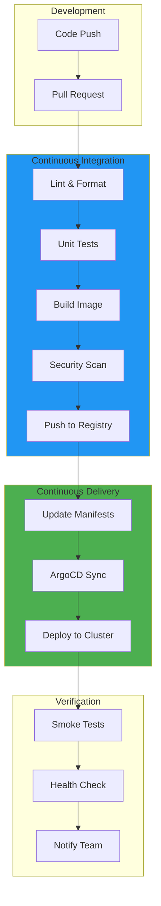
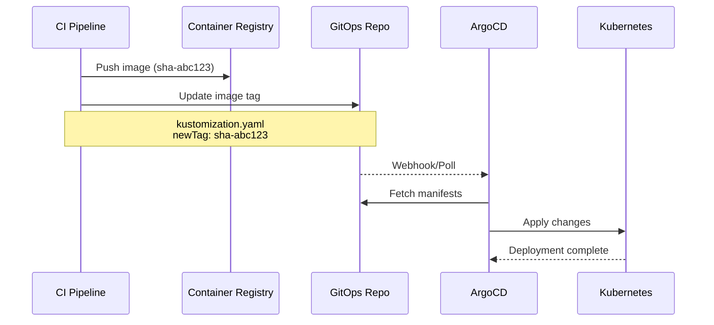
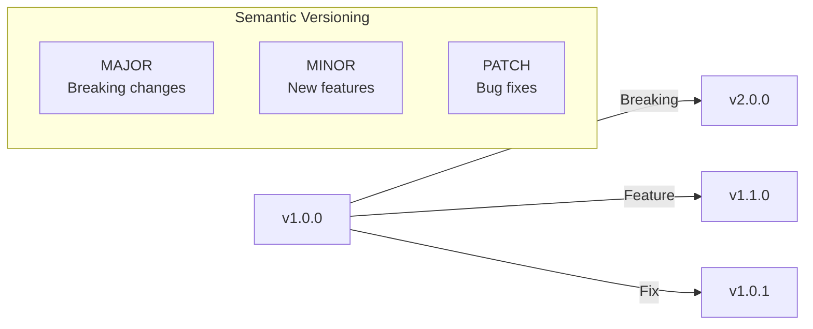
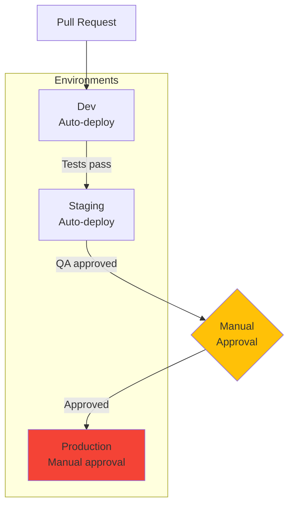
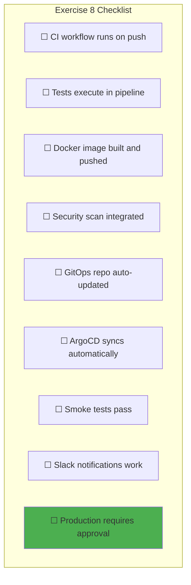
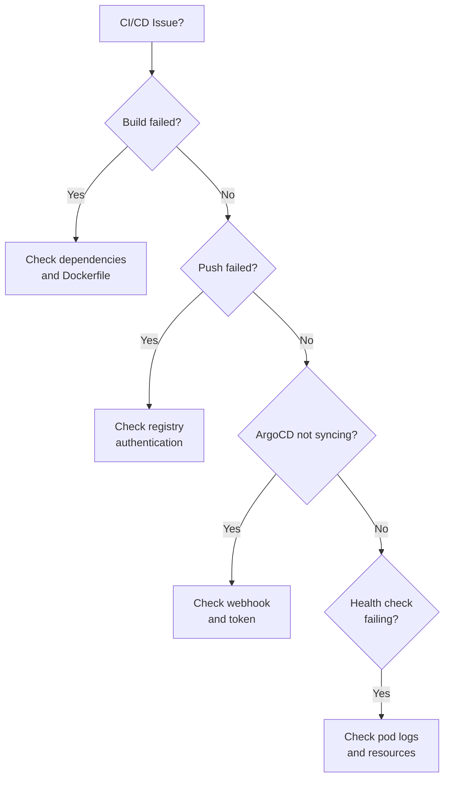
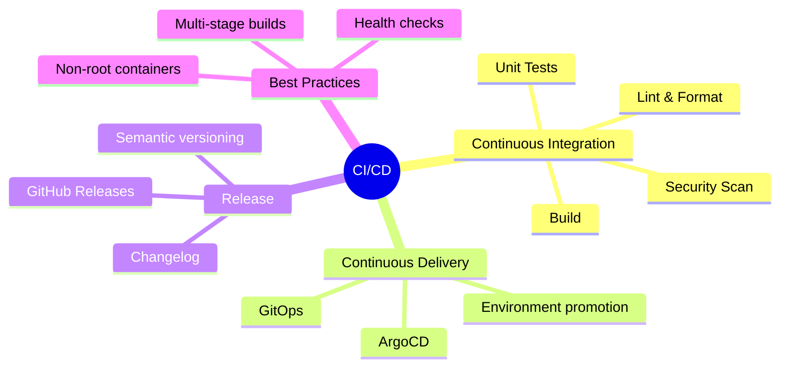

# Exercise 8: CI/CD Pipeline

> *"The goal of continuous delivery is to make releases boring, reliable, and frequent."*
> — **Continuous Delivery** (Jez Humble & David Farley)

## Objective

Build a complete CI/CD pipeline using GitHub Actions that builds, tests, and deploys applications to your Kubernetes cluster via GitOps.

---

## Prerequisites

- Completed [Exercise 7: Observability Stack](./07-Observability-Stack.md)
- GitHub repository for application code
- GitOps repository from Exercise 6
- Container registry (GitHub Container Registry or Docker Hub)
- ArgoCD configured

---

## CI/CD Architecture



---

## Phase 1: GitHub Actions Basics

### 1.1 Workflow Structure

```yaml
# .github/workflows/example.yaml
name: Example Workflow

# Trigger events
on:
  push:
    branches: [main]
  pull_request:
    branches: [main]

# Environment variables
env:
  REGISTRY: ghcr.io
  IMAGE_NAME: ${{ github.repository }}

# Jobs
jobs:
  build:
    runs-on: ubuntu-latest
    steps:
      - name: Checkout
        uses: actions/checkout@v4

      - name: Build
        run: echo "Building..."
```

### 1.2 Directory Structure

```
app-repo/
├── .github/
│   └── workflows/
│       ├── ci.yaml       # Build & test
│       ├── release.yaml  # Release to registry
│       └── deploy.yaml   # Update GitOps repo
├── src/
├── tests/
├── Dockerfile
└── package.json
```

---

## Phase 2: Continuous Integration

### 2.1 Complete CI Workflow

Create `.github/workflows/ci.yaml`:

```yaml
name: CI

on:
  push:
    branches: [main, develop]
  pull_request:
    branches: [main]

env:
  REGISTRY: ghcr.io
  IMAGE_NAME: ${{ github.repository }}

jobs:
  # ─────────────────────────────────────────────
  # Lint & Format Check
  # ─────────────────────────────────────────────
  lint:
    name: Lint
    runs-on: ubuntu-latest
    steps:
      - uses: actions/checkout@v4

      - name: Setup Node.js
        uses: actions/setup-node@v4
        with:
          node-version: '20'
          cache: 'npm'

      - name: Install dependencies
        run: npm ci

      - name: Run ESLint
        run: npm run lint

      - name: Check formatting
        run: npm run format:check

  # ─────────────────────────────────────────────
  # Unit Tests
  # ─────────────────────────────────────────────
  test:
    name: Test
    runs-on: ubuntu-latest
    steps:
      - uses: actions/checkout@v4

      - name: Setup Node.js
        uses: actions/setup-node@v4
        with:
          node-version: '20'
          cache: 'npm'

      - name: Install dependencies
        run: npm ci

      - name: Run tests
        run: npm test -- --coverage

      - name: Upload coverage
        uses: codecov/codecov-action@v4
        with:
          token: ${{ secrets.CODECOV_TOKEN }}

  # ─────────────────────────────────────────────
  # Build Docker Image
  # ─────────────────────────────────────────────
  build:
    name: Build
    runs-on: ubuntu-latest
    needs: [lint, test]
    permissions:
      contents: read
      packages: write

    outputs:
      image-tag: ${{ steps.meta.outputs.tags }}
      image-digest: ${{ steps.build-push.outputs.digest }}

    steps:
      - uses: actions/checkout@v4

      - name: Set up Docker Buildx
        uses: docker/setup-buildx-action@v3

      - name: Login to Container Registry
        uses: docker/login-action@v3
        with:
          registry: ${{ env.REGISTRY }}
          username: ${{ github.actor }}
          password: ${{ secrets.GITHUB_TOKEN }}

      - name: Extract metadata
        id: meta
        uses: docker/metadata-action@v5
        with:
          images: ${{ env.REGISTRY }}/${{ env.IMAGE_NAME }}
          tags: |
            type=sha,prefix=
            type=ref,event=branch
            type=ref,event=pr

      - name: Build and push
        id: build-push
        uses: docker/build-push-action@v5
        with:
          context: .
          push: ${{ github.event_name != 'pull_request' }}
          tags: ${{ steps.meta.outputs.tags }}
          labels: ${{ steps.meta.outputs.labels }}
          cache-from: type=gha
          cache-to: type=gha,mode=max

  # ─────────────────────────────────────────────
  # Security Scan
  # ─────────────────────────────────────────────
  security:
    name: Security Scan
    runs-on: ubuntu-latest
    needs: build
    if: github.event_name != 'pull_request'

    steps:
      - uses: actions/checkout@v4

      - name: Run Trivy vulnerability scanner
        uses: aquasecurity/trivy-action@master
        with:
          image-ref: ${{ env.REGISTRY }}/${{ env.IMAGE_NAME }}:${{ github.sha }}
          format: 'sarif'
          output: 'trivy-results.sarif'
          severity: 'CRITICAL,HIGH'

      - name: Upload Trivy scan results
        uses: github/codeql-action/upload-sarif@v3
        with:
          sarif_file: 'trivy-results.sarif'
```

---

## Phase 3: Continuous Delivery

### 3.1 GitOps Update Flow



### 3.2 Deployment Workflow

Create `.github/workflows/deploy.yaml`:

```yaml
name: Deploy

on:
  workflow_run:
    workflows: ["CI"]
    types: [completed]
    branches: [main]

env:
  GITOPS_REPO: your-org/gitops-repo
  APP_NAME: sample-app
  ENVIRONMENTS: dev,staging

jobs:
  update-manifests:
    name: Update GitOps Manifests
    runs-on: ubuntu-latest
    if: ${{ github.event.workflow_run.conclusion == 'success' }}

    steps:
      - name: Checkout GitOps repo
        uses: actions/checkout@v4
        with:
          repository: ${{ env.GITOPS_REPO }}
          token: ${{ secrets.GITOPS_TOKEN }}
          path: gitops

      - name: Setup Kustomize
        uses: imranismail/setup-kustomize@v2

      - name: Update image tag (dev)
        working-directory: gitops/apps/overlays/dev
        run: |
          kustomize edit set image \
            ${{ env.APP_NAME }}=ghcr.io/${{ github.repository }}:${{ github.sha }}

      - name: Update image tag (staging)
        working-directory: gitops/apps/overlays/staging
        run: |
          kustomize edit set image \
            ${{ env.APP_NAME }}=ghcr.io/${{ github.repository }}:${{ github.sha }}

      - name: Commit and push
        working-directory: gitops
        run: |
          git config user.name "GitHub Actions"
          git config user.email "actions@github.com"
          git add .
          git commit -m "Deploy ${{ env.APP_NAME }} to dev/staging: ${{ github.sha }}"
          git push

  wait-for-sync:
    name: Wait for ArgoCD Sync
    runs-on: ubuntu-latest
    needs: update-manifests

    steps:
      - name: Wait for ArgoCD
        run: |
          # Poll ArgoCD for sync status
          for i in {1..30}; do
            STATUS=$(curl -s -H "Authorization: Bearer ${{ secrets.ARGOCD_TOKEN }}" \
              "https://argocd.example.com/api/v1/applications/${{ env.APP_NAME }}-dev" \
              | jq -r '.status.sync.status')

            if [ "$STATUS" == "Synced" ]; then
              echo "Application synced successfully"
              exit 0
            fi

            echo "Waiting for sync... ($STATUS)"
            sleep 10
          done

          echo "Sync timeout"
          exit 1

  smoke-test:
    name: Smoke Test
    runs-on: ubuntu-latest
    needs: wait-for-sync

    steps:
      - name: Health check
        run: |
          for i in {1..10}; do
            STATUS=$(curl -s -o /dev/null -w "%{http_code}" \
              https://app-dev.example.com/health)

            if [ "$STATUS" == "200" ]; then
              echo "Health check passed"
              exit 0
            fi

            echo "Waiting for healthy... ($STATUS)"
            sleep 5
          done

          echo "Health check failed"
          exit 1

  notify:
    name: Notify Team
    runs-on: ubuntu-latest
    needs: [smoke-test]
    if: always()

    steps:
      - name: Slack notification
        uses: 8398a7/action-slack@v3
        with:
          status: ${{ job.status }}
          fields: repo,message,commit,author,action,eventName,workflow
        env:
          SLACK_WEBHOOK_URL: ${{ secrets.SLACK_WEBHOOK }}
```

---

## Phase 4: Release Management

### 4.1 Semantic Versioning



### 4.2 Release Workflow

Create `.github/workflows/release.yaml`:

```yaml
name: Release

on:
  push:
    tags:
      - 'v*'

env:
  REGISTRY: ghcr.io
  IMAGE_NAME: ${{ github.repository }}

jobs:
  release:
    name: Release
    runs-on: ubuntu-latest
    permissions:
      contents: write
      packages: write

    steps:
      - uses: actions/checkout@v4
        with:
          fetch-depth: 0

      - name: Get version from tag
        id: version
        run: echo "VERSION=${GITHUB_REF#refs/tags/v}" >> $GITHUB_OUTPUT

      - name: Setup Docker Buildx
        uses: docker/setup-buildx-action@v3

      - name: Login to Registry
        uses: docker/login-action@v3
        with:
          registry: ${{ env.REGISTRY }}
          username: ${{ github.actor }}
          password: ${{ secrets.GITHUB_TOKEN }}

      - name: Build and push release image
        uses: docker/build-push-action@v5
        with:
          context: .
          push: true
          tags: |
            ${{ env.REGISTRY }}/${{ env.IMAGE_NAME }}:${{ steps.version.outputs.VERSION }}
            ${{ env.REGISTRY }}/${{ env.IMAGE_NAME }}:latest
          labels: |
            org.opencontainers.image.version=${{ steps.version.outputs.VERSION }}

      - name: Generate changelog
        id: changelog
        uses: mikepenz/release-changelog-builder-action@v4
        with:
          configuration: ".github/changelog-config.json"
        env:
          GITHUB_TOKEN: ${{ secrets.GITHUB_TOKEN }}

      - name: Create GitHub Release
        uses: softprops/action-gh-release@v1
        with:
          body: ${{ steps.changelog.outputs.changelog }}
          draft: false
          prerelease: false
```

---

## Phase 5: Production Deployment

### 5.1 Production Promotion Flow



### 5.2 Production Deployment Workflow

Create `.github/workflows/deploy-prod.yaml`:

```yaml
name: Deploy to Production

on:
  workflow_dispatch:
    inputs:
      version:
        description: 'Version to deploy (e.g., v1.2.3)'
        required: true
      reason:
        description: 'Reason for deployment'
        required: true

env:
  GITOPS_REPO: your-org/gitops-repo
  APP_NAME: sample-app

jobs:
  validate:
    name: Validate
    runs-on: ubuntu-latest
    steps:
      - name: Validate version exists
        run: |
          # Check if image exists in registry
          docker manifest inspect \
            ghcr.io/${{ github.repository }}:${{ github.event.inputs.version }} \
            || (echo "Version not found" && exit 1)

  approval:
    name: Production Approval
    runs-on: ubuntu-latest
    needs: validate
    environment: production

    steps:
      - name: Approval received
        run: echo "Deployment approved by ${{ github.actor }}"

  deploy:
    name: Deploy to Production
    runs-on: ubuntu-latest
    needs: approval

    steps:
      - name: Checkout GitOps repo
        uses: actions/checkout@v4
        with:
          repository: ${{ env.GITOPS_REPO }}
          token: ${{ secrets.GITOPS_TOKEN }}
          path: gitops

      - name: Setup Kustomize
        uses: imranismail/setup-kustomize@v2

      - name: Update production image
        working-directory: gitops/apps/overlays/prod
        run: |
          VERSION="${{ github.event.inputs.version }}"
          # Remove 'v' prefix if present
          VERSION="${VERSION#v}"
          kustomize edit set image \
            ${{ env.APP_NAME }}=ghcr.io/${{ github.repository }}:${{ VERSION }}

      - name: Commit and push
        working-directory: gitops
        run: |
          git config user.name "GitHub Actions"
          git config user.email "actions@github.com"
          git add .
          git commit -m "Production deploy: ${{ env.APP_NAME }} ${{ github.event.inputs.version }}"
          git push

      - name: Create deployment record
        run: |
          echo "Deployed ${{ env.APP_NAME }} ${{ github.event.inputs.version }} to production"
          echo "Reason: ${{ github.event.inputs.reason }}"
          echo "Deployed by: ${{ github.actor }}"
          echo "Time: $(date -u +%Y-%m-%dT%H:%M:%SZ)"
```

---

## Phase 6: Dockerfile Best Practices

> *"A good Dockerfile is like good code: it should be readable, maintainable, and secure."*
> — **Docker Deep Dive** (Nigel Poulton)

### 6.1 Multi-Stage Build

```dockerfile
# Dockerfile
# ─────────────────────────────────────────────
# Stage 1: Build
# ─────────────────────────────────────────────
FROM node:20-alpine AS builder

WORKDIR /app

# Copy package files first (better layer caching)
COPY package*.json ./
RUN npm ci --only=production

# Copy source and build
COPY . .
RUN npm run build

# ─────────────────────────────────────────────
# Stage 2: Production
# ─────────────────────────────────────────────
FROM node:20-alpine AS production

# Security: run as non-root user
RUN addgroup -g 1001 -S nodejs && \
    adduser -S nodejs -u 1001

WORKDIR /app

# Copy only what's needed
COPY --from=builder --chown=nodejs:nodejs /app/dist ./dist
COPY --from=builder --chown=nodejs:nodejs /app/node_modules ./node_modules
COPY --from=builder --chown=nodejs:nodejs /app/package.json ./

# Switch to non-root user
USER nodejs

# Health check
HEALTHCHECK --interval=30s --timeout=3s --start-period=5s --retries=3 \
  CMD wget --no-verbose --tries=1 --spider http://localhost:3000/health || exit 1

EXPOSE 3000

CMD ["node", "dist/main.js"]
```

### 6.2 Security Scanning Results

```yaml
# Example Trivy output handling
- name: Fail on critical vulnerabilities
  run: |
    CRITICAL=$(cat trivy-results.json | jq '.Results[].Vulnerabilities | select(. != null) | .[] | select(.Severity == "CRITICAL")' | wc -l)
    if [ "$CRITICAL" -gt "0" ]; then
      echo "❌ Found $CRITICAL critical vulnerabilities"
      exit 1
    fi
    echo "✅ No critical vulnerabilities found"
```

---

## Verification Checklist



### Success Criteria

| Stage | Verification |
|-------|-------------|
| CI triggers | Push to main, check Actions tab |
| Image pushed | Check GitHub Packages |
| Security scan | View SARIF results in Security tab |
| GitOps updated | Check gitops repo commits |
| Deployment | Check ArgoCD applications |
| Notifications | Verify Slack messages |

---

## Troubleshooting

### Common Issues



```bash
# Check workflow runs
gh run list

# View specific run
gh run view <run-id>

# Check workflow logs
gh run view <run-id> --log

# Re-run failed workflow
gh run rerun <run-id>
```

---

## Key Concepts Learned



---

## Bonus: GitHub Actions Matrix

```yaml
# Run tests across multiple Node versions
jobs:
  test:
    runs-on: ubuntu-latest
    strategy:
      matrix:
        node-version: [18, 20, 22]
    steps:
      - uses: actions/setup-node@v4
        with:
          node-version: ${{ matrix.node-version }}
      - run: npm test
```

---

## Next Exercise

Proceed to:
→ [Exercise 9: Security Hardening](./09-Security-Hardening.md)

---

*Last Updated: 2026-02-02*
