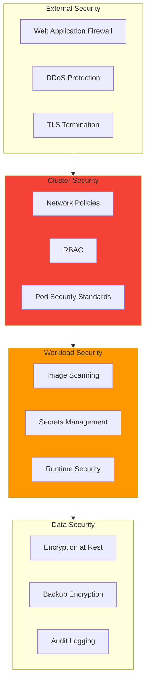
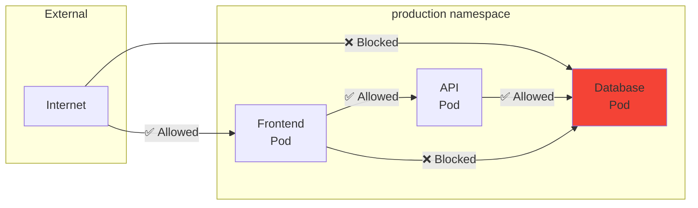
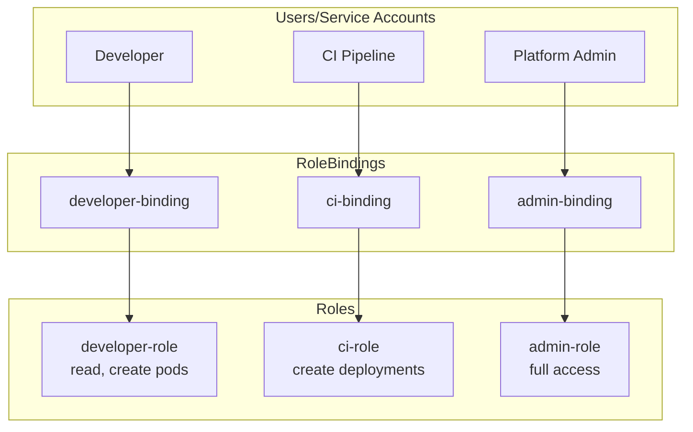
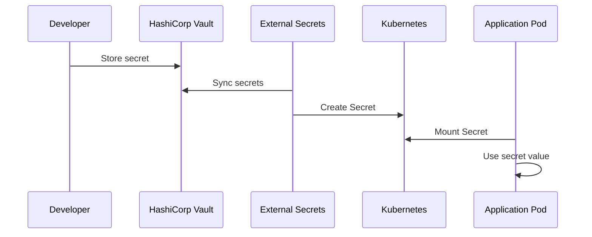
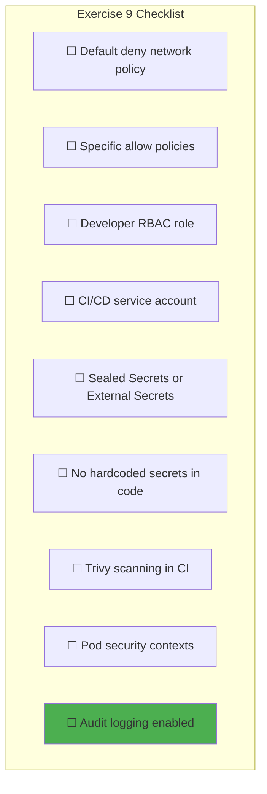
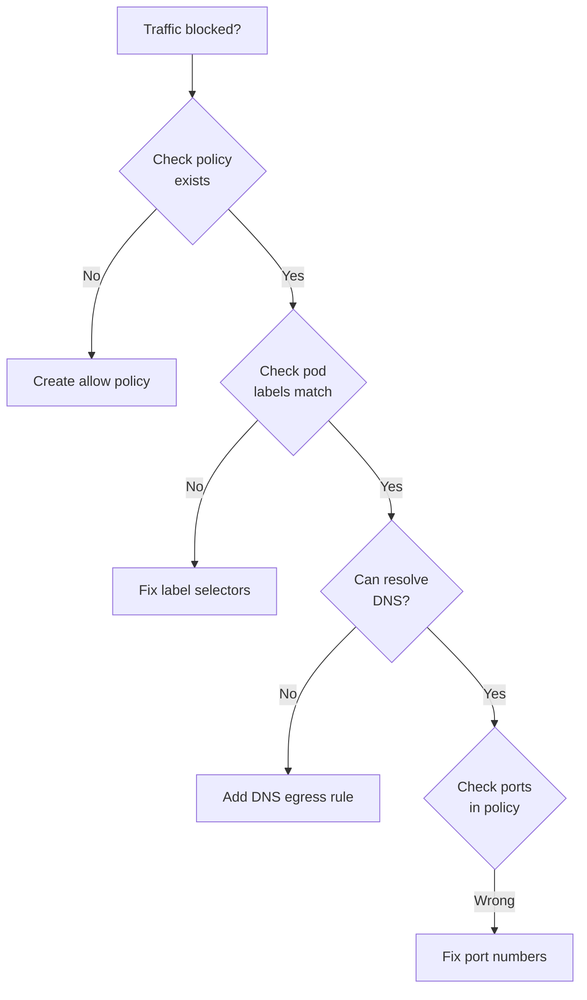
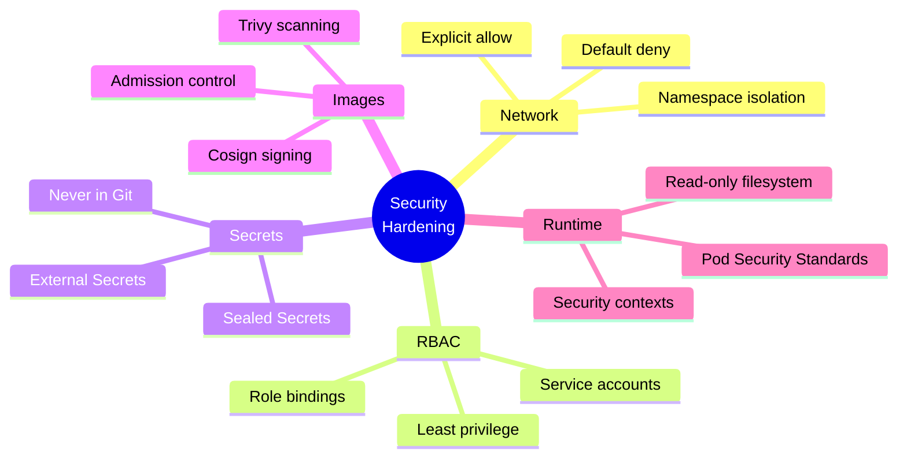

# Exercise 9: Security Hardening

> *"Security is not a feature. It's a property of the entire system that emerges from secure design, implementation, and operation."*
> — **Building Secure & Reliable Systems** (Google)

## Objective

Implement security hardening across your platform: network policies, RBAC, secrets management, and image scanning.

---

## Prerequisites

- Completed [Exercise 8: CI/CD Pipeline](./08-CICD-Pipeline.md)
- Working k3s cluster with all platform services
- ArgoCD managing deployments
- kubectl admin access

---

## Security Layers



---

## Phase 1: Network Policies

> *"Default deny, explicit allow. Every connection should be intentional."*
> — **Zero Trust Networks** (Evan Gilman)

### 1.1 Understanding Network Policies



### 1.2 Default Deny Policy

Create `security/network-policies/default-deny.yaml`:

```yaml
# Default deny all ingress and egress
apiVersion: networking.k8s.io/v1
kind: NetworkPolicy
metadata:
  name: default-deny-all
  namespace: production
spec:
  podSelector: {}  # Applies to all pods
  policyTypes:
    - Ingress
    - Egress
```

### 1.3 Allow Specific Traffic

Create `security/network-policies/allow-frontend.yaml`:

```yaml
apiVersion: networking.k8s.io/v1
kind: NetworkPolicy
metadata:
  name: allow-frontend-ingress
  namespace: production
spec:
  podSelector:
    matchLabels:
      app: frontend
  policyTypes:
    - Ingress
  ingress:
    - from:
        - namespaceSelector:
            matchLabels:
              name: ingress-nginx
      ports:
        - protocol: TCP
          port: 80
---
apiVersion: networking.k8s.io/v1
kind: NetworkPolicy
metadata:
  name: allow-frontend-to-api
  namespace: production
spec:
  podSelector:
    matchLabels:
      app: frontend
  policyTypes:
    - Egress
  egress:
    - to:
        - podSelector:
            matchLabels:
              app: api
      ports:
        - protocol: TCP
          port: 8080
    # Allow DNS resolution
    - to:
        - namespaceSelector: {}
          podSelector:
            matchLabels:
              k8s-app: kube-dns
      ports:
        - protocol: UDP
          port: 53
```

Create `security/network-policies/allow-api.yaml`:

```yaml
apiVersion: networking.k8s.io/v1
kind: NetworkPolicy
metadata:
  name: allow-api-ingress
  namespace: production
spec:
  podSelector:
    matchLabels:
      app: api
  policyTypes:
    - Ingress
  ingress:
    - from:
        - podSelector:
            matchLabels:
              app: frontend
      ports:
        - protocol: TCP
          port: 8080
---
apiVersion: networking.k8s.io/v1
kind: NetworkPolicy
metadata:
  name: allow-api-to-db
  namespace: production
spec:
  podSelector:
    matchLabels:
      app: api
  policyTypes:
    - Egress
  egress:
    - to:
        - podSelector:
            matchLabels:
              app: database
      ports:
        - protocol: TCP
          port: 5432
    # Allow DNS
    - to:
        - namespaceSelector: {}
          podSelector:
            matchLabels:
              k8s-app: kube-dns
      ports:
        - protocol: UDP
          port: 53
```

### 1.4 Apply and Test

```bash
# Apply policies
kubectl apply -f security/network-policies/

# Test connectivity (should fail)
kubectl run test-pod --rm -it --image=busybox --restart=Never -- wget -qO- http://database:5432

# Test from frontend pod (should succeed)
kubectl exec -it frontend-pod -- wget -qO- http://api:8080/health
```

---

## Phase 2: RBAC Configuration

### 2.1 RBAC Architecture



### 2.2 Developer Role (Read + Limited Write)

Create `security/rbac/developer-role.yaml`:

```yaml
apiVersion: rbac.authorization.k8s.io/v1
kind: Role
metadata:
  name: developer
  namespace: production
rules:
  # Read access to most resources
  - apiGroups: [""]
    resources: ["pods", "services", "configmaps", "secrets"]
    verbs: ["get", "list", "watch"]

  # Can view logs
  - apiGroups: [""]
    resources: ["pods/log"]
    verbs: ["get"]

  # Can exec into pods (for debugging)
  - apiGroups: [""]
    resources: ["pods/exec"]
    verbs: ["create"]

  # Read deployments
  - apiGroups: ["apps"]
    resources: ["deployments", "replicasets"]
    verbs: ["get", "list", "watch"]

  # Can port-forward
  - apiGroups: [""]
    resources: ["pods/portforward"]
    verbs: ["create"]
---
apiVersion: rbac.authorization.k8s.io/v1
kind: RoleBinding
metadata:
  name: developer-binding
  namespace: production
roleRef:
  apiGroup: rbac.authorization.k8s.io
  kind: Role
  name: developer
subjects:
  - kind: Group
    name: developers
    apiGroup: rbac.authorization.k8s.io
```

### 2.3 CI/CD Service Account

Create `security/rbac/cicd-role.yaml`:

```yaml
apiVersion: v1
kind: ServiceAccount
metadata:
  name: cicd-deployer
  namespace: production
---
apiVersion: rbac.authorization.k8s.io/v1
kind: Role
metadata:
  name: cicd-deployer
  namespace: production
rules:
  # Can manage deployments
  - apiGroups: ["apps"]
    resources: ["deployments"]
    verbs: ["get", "list", "watch", "create", "update", "patch"]

  # Can manage services
  - apiGroups: [""]
    resources: ["services"]
    verbs: ["get", "list", "watch", "create", "update", "patch"]

  # Can manage configmaps (for config changes)
  - apiGroups: [""]
    resources: ["configmaps"]
    verbs: ["get", "list", "watch", "create", "update", "patch"]

  # Can read secrets (not create - use External Secrets)
  - apiGroups: [""]
    resources: ["secrets"]
    verbs: ["get", "list", "watch"]

  # Can manage ingress
  - apiGroups: ["networking.k8s.io"]
    resources: ["ingresses"]
    verbs: ["get", "list", "watch", "create", "update", "patch"]
---
apiVersion: rbac.authorization.k8s.io/v1
kind: RoleBinding
metadata:
  name: cicd-deployer-binding
  namespace: production
roleRef:
  apiGroup: rbac.authorization.k8s.io
  kind: Role
  name: cicd-deployer
subjects:
  - kind: ServiceAccount
    name: cicd-deployer
    namespace: production
```

### 2.4 Verify RBAC

```bash
# Check what a user can do
kubectl auth can-i --list --as=developer@example.com -n production

# Check specific action
kubectl auth can-i delete pods -n production --as=developer@example.com
# Should return "no"

# Check CI service account
kubectl auth can-i create deployments -n production --as=system:serviceaccount:production:cicd-deployer
# Should return "yes"
```

---

## Phase 3: Secrets Management

### 3.1 Secrets Flow



### 3.2 External Secrets Operator

Create `helm-values/external-secrets.yaml`:

```yaml
# helm-values/external-secrets.yaml
installCRDs: true

serviceAccount:
  create: true
  name: external-secrets

resources:
  requests:
    cpu: 50m
    memory: 64Mi

webhook:
  resources:
    requests:
      cpu: 50m
      memory: 64Mi

certController:
  resources:
    requests:
      cpu: 50m
      memory: 64Mi
```

Install External Secrets:

```bash
helm repo add external-secrets https://charts.external-secrets.io
helm repo update

helm install external-secrets external-secrets/external-secrets \
  --namespace external-secrets \
  --create-namespace \
  --values helm-values/external-secrets.yaml
```

### 3.3 Sealed Secrets (Alternative)

```bash
# Install Sealed Secrets controller
helm repo add sealed-secrets https://bitnami-labs.github.io/sealed-secrets
helm install sealed-secrets sealed-secrets/sealed-secrets \
  --namespace kube-system

# Install kubeseal CLI
brew install kubeseal

# Create a sealed secret
kubectl create secret generic my-secret \
  --from-literal=password=supersecret \
  --dry-run=client -o yaml | \
  kubeseal --format yaml > sealed-secret.yaml

# Apply sealed secret (controller decrypts it)
kubectl apply -f sealed-secret.yaml
```

### 3.4 Secret Usage Best Practices

```yaml
# NEVER do this
apiVersion: v1
kind: Pod
metadata:
  name: bad-example
spec:
  containers:
    - name: app
      env:
        - name: DB_PASSWORD
          value: "hardcoded-password"  # ❌ NEVER

# DO this instead
apiVersion: v1
kind: Pod
metadata:
  name: good-example
spec:
  containers:
    - name: app
      env:
        - name: DB_PASSWORD
          valueFrom:
            secretKeyRef:
              name: database-credentials
              key: password
      # Or mount as file
      volumeMounts:
        - name: secrets
          mountPath: /etc/secrets
          readOnly: true
  volumes:
    - name: secrets
      secret:
        secretName: database-credentials
```

---

## Phase 4: Image Security

### 4.1 Security Scanning Pipeline

```mermaid
flowchart LR
    subgraph Build["CI Build"]
        Code["Source Code"]
        Build["Build Image"]
    end

    subgraph Scan["Security Scan"]
        Trivy["Trivy Scan"]
        Decision{Critical<br/>Vulns?}
    end

    subgraph Deploy["Deployment"]
        Push["Push to Registry"]
        Deploy["Deploy to Cluster"]
    end

    Code --> Build --> Trivy --> Decision
    Decision -->|No| Push --> Deploy
    Decision -->|Yes| Fail["Fail Build"]

    style Fail fill:#F44336
```

### 4.2 Trivy Integration

Create `.github/workflows/security-scan.yaml`:

```yaml
name: Security Scan

on:
  push:
    branches: [main]
  pull_request:
    branches: [main]
  schedule:
    - cron: '0 6 * * *'  # Daily at 6 AM

jobs:
  trivy-scan:
    runs-on: ubuntu-latest
    steps:
      - uses: actions/checkout@v4

      - name: Build image
        run: docker build -t app:${{ github.sha }} .

      - name: Run Trivy vulnerability scanner
        uses: aquasecurity/trivy-action@master
        with:
          image-ref: app:${{ github.sha }}
          format: 'table'
          exit-code: '1'
          ignore-unfixed: true
          vuln-type: 'os,library'
          severity: 'CRITICAL,HIGH'

      - name: Run Trivy for SARIF
        uses: aquasecurity/trivy-action@master
        if: always()
        with:
          image-ref: app:${{ github.sha }}
          format: 'sarif'
          output: 'trivy-results.sarif'

      - name: Upload SARIF
        uses: github/codeql-action/upload-sarif@v3
        if: always()
        with:
          sarif_file: 'trivy-results.sarif'

  filesystem-scan:
    runs-on: ubuntu-latest
    steps:
      - uses: actions/checkout@v4

      - name: Trivy filesystem scan
        uses: aquasecurity/trivy-action@master
        with:
          scan-type: 'fs'
          scan-ref: '.'
          format: 'table'
          exit-code: '1'
          severity: 'CRITICAL,HIGH'
```

### 4.3 Image Signing with Cosign

```bash
# Install cosign
brew install cosign

# Generate key pair
cosign generate-key-pair

# Sign an image
cosign sign --key cosign.key ghcr.io/your-org/your-app:v1.0.0

# Verify signature
cosign verify --key cosign.pub ghcr.io/your-org/your-app:v1.0.0
```

### 4.4 Admission Control for Signed Images

Create `security/policies/require-signed-images.yaml`:

```yaml
apiVersion: kyverno.io/v1
kind: ClusterPolicy
metadata:
  name: require-signed-images
spec:
  validationFailureAction: enforce
  rules:
    - name: check-image-signature
      match:
        resources:
          kinds:
            - Pod
      verifyImages:
        - image: "ghcr.io/your-org/*"
          key: |-
            -----BEGIN PUBLIC KEY-----
            MFkwEwYHKoZIzj0CAQYIKoZIzj0DAQcDQgAE...
            -----END PUBLIC KEY-----
```

---

## Phase 5: Pod Security Standards

### 5.1 Security Context

```yaml
apiVersion: v1
kind: Pod
metadata:
  name: secure-pod
spec:
  securityContext:
    runAsNonRoot: true
    runAsUser: 1000
    runAsGroup: 1000
    fsGroup: 1000
    seccompProfile:
      type: RuntimeDefault

  containers:
    - name: app
      image: your-app:v1
      securityContext:
        allowPrivilegeEscalation: false
        readOnlyRootFilesystem: true
        capabilities:
          drop:
            - ALL

      resources:
        limits:
          cpu: "500m"
          memory: "256Mi"
        requests:
          cpu: "100m"
          memory: "128Mi"

      # Health checks (required for production)
      livenessProbe:
        httpGet:
          path: /health
          port: 8080
        initialDelaySeconds: 10
        periodSeconds: 10

      readinessProbe:
        httpGet:
          path: /ready
          port: 8080
        initialDelaySeconds: 5
        periodSeconds: 5
```

### 5.2 Pod Security Admission

```yaml
# Enforce restricted security on namespace
apiVersion: v1
kind: Namespace
metadata:
  name: production
  labels:
    pod-security.kubernetes.io/enforce: restricted
    pod-security.kubernetes.io/enforce-version: latest
    pod-security.kubernetes.io/audit: restricted
    pod-security.kubernetes.io/warn: restricted
```

---

## Phase 6: Audit Logging

### 6.1 Enable Kubernetes Audit Logging

```yaml
# audit-policy.yaml
apiVersion: audit.k8s.io/v1
kind: Policy
rules:
  # Log all requests to secrets
  - level: Metadata
    resources:
      - group: ""
        resources: ["secrets"]

  # Log all changes to pods
  - level: RequestResponse
    verbs: ["create", "update", "patch", "delete"]
    resources:
      - group: ""
        resources: ["pods"]

  # Log RBAC changes
  - level: RequestResponse
    resources:
      - group: "rbac.authorization.k8s.io"
        resources: ["roles", "rolebindings", "clusterroles", "clusterrolebindings"]

  # Default: log metadata only
  - level: Metadata
    omitStages:
      - RequestReceived
```

### 6.2 Forward Audit Logs to Loki

```yaml
# promtail-audit.yaml
scrape_configs:
  - job_name: kubernetes-audit
    static_configs:
      - targets:
          - localhost
        labels:
          job: kubernetes-audit
          __path__: /var/log/kubernetes/audit/*.log
```

---

## Verification Checklist



### Security Testing Commands

```bash
# Test network policies
kubectl run test --rm -it --image=busybox -- wget -qO- http://api:8080
# Should timeout if policies work

# Check RBAC
kubectl auth can-i delete pods -n production --as=developer
# Should return "no"

# Verify no secrets in Git
git log -p | grep -i "password\|secret\|key" | head -20

# Scan running images
trivy image $(kubectl get pods -n production -o jsonpath='{.items[0].spec.containers[0].image}')
```

---

## Troubleshooting

### Network Policy Issues



```bash
# Debug network policies
kubectl describe networkpolicy -n production

# Check if pod matches policy selector
kubectl get pods -n production -l app=api --show-labels

# Test DNS
kubectl run test --rm -it --image=busybox -- nslookup api.production.svc.cluster.local
```

---

## Key Concepts Learned



---

## Next Steps

Congratulations! You've completed the core exercises. Continue to:
→ [Exercise 10: Disaster Recovery](./10-Disaster-Recovery.md)

Or review:
→ [Week-by-Week Progress](../02-Week-by-Week.md)

---

*Last Updated: 2026-02-02*
