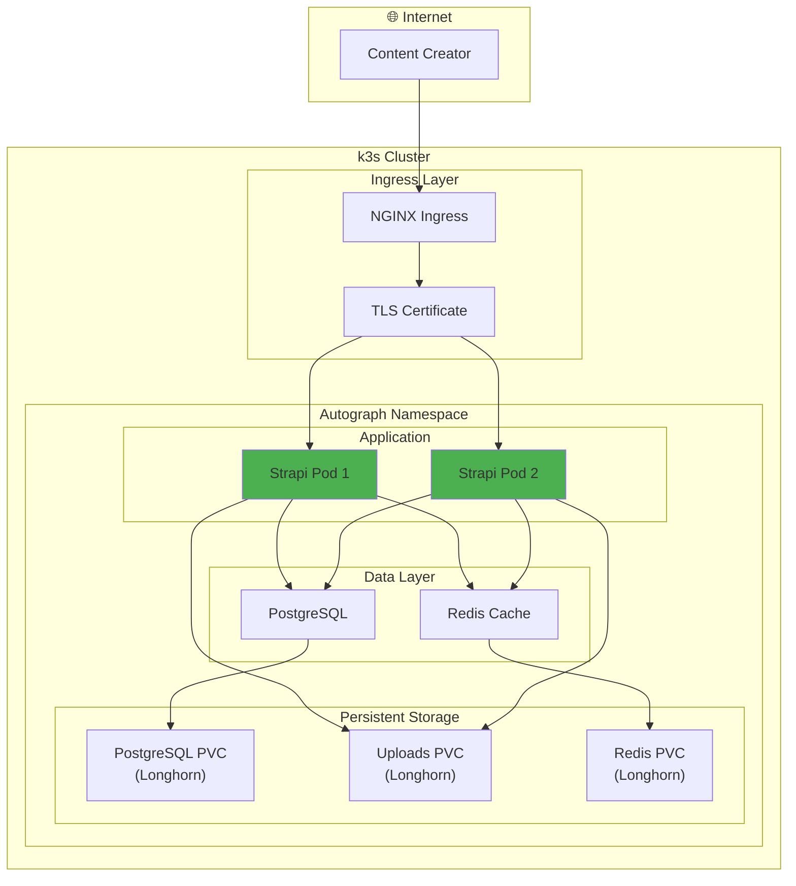

# Exercise 10: Autograph — Strapi CMS Deployment

> *"The best startups seem to start from scratch. The founders just decided what they wanted to build, then built it."*
> — **Paul Graham**, Y Combinator

## Objective

Deploy Strapi CMS—the core of Autograph—on your Kubernetes cluster with PostgreSQL and Redis.

**This is where your product comes to life.**

---

## Prerequisites

- [ ] Completed Exercise 04 (k3s cluster running)
- [ ] Completed Exercise 05 (Ingress, cert-manager, storage)
- [ ] kubectl configured and connected
- [ ] Domain pointing to your load balancer

---

## Learning Outcomes

By the end of this exercise, you will:
- Deploy a production-grade headless CMS
- Configure persistent storage for content
- Set up PostgreSQL with high availability
- Implement Redis caching for performance
- Understand how Autograph serves users

---

## Part 1: PostgreSQL Database

### Why PostgreSQL?

Strapi needs a database. PostgreSQL is:
- Open source and battle-tested
- Excellent for structured content
- Supports JSON fields for flexible content types
- Built-in full-text search

### Create the Namespace

```bash
kubectl create namespace autograph
```

### PostgreSQL Deployment with StatefulSet

```yaml
# postgresql/statefulset.yaml
apiVersion: apps/v1
kind: StatefulSet
metadata:
  name: postgresql
  namespace: autograph
spec:
  serviceName: postgresql
  replicas: 1
  selector:
    matchLabels:
      app: postgresql
  template:
    metadata:
      labels:
        app: postgresql
    spec:
      containers:
        - name: postgresql
          image: postgres:15-alpine
          ports:
            - containerPort: 5432
              name: postgres
          env:
            - name: POSTGRES_DB
              value: strapi
            - name: POSTGRES_USER
              valueFrom:
                secretKeyRef:
                  name: postgresql-secret
                  key: username
            - name: POSTGRES_PASSWORD
              valueFrom:
                secretKeyRef:
                  name: postgresql-secret
                  key: password
            - name: PGDATA
              value: /var/lib/postgresql/data/pgdata
          volumeMounts:
            - name: postgresql-data
              mountPath: /var/lib/postgresql/data
          resources:
            requests:
              memory: "256Mi"
              cpu: "250m"
            limits:
              memory: "512Mi"
              cpu: "500m"
          livenessProbe:
            exec:
              command:
                - pg_isready
                - -U
                - strapi
            initialDelaySeconds: 30
            periodSeconds: 10
          readinessProbe:
            exec:
              command:
                - pg_isready
                - -U
                - strapi
            initialDelaySeconds: 5
            periodSeconds: 5
  volumeClaimTemplates:
    - metadata:
        name: postgresql-data
      spec:
        accessModes: ["ReadWriteOnce"]
        storageClassName: longhorn
        resources:
          requests:
            storage: 10Gi
```

### PostgreSQL Service

```yaml
# postgresql/service.yaml
apiVersion: v1
kind: Service
metadata:
  name: postgresql
  namespace: autograph
spec:
  type: ClusterIP
  ports:
    - port: 5432
      targetPort: 5432
      name: postgres
  selector:
    app: postgresql
---
# Headless service for StatefulSet DNS
apiVersion: v1
kind: Service
metadata:
  name: postgresql-headless
  namespace: autograph
spec:
  type: ClusterIP
  clusterIP: None
  ports:
    - port: 5432
      name: postgres
  selector:
    app: postgresql
```

### Database Secret

```yaml
# postgresql/secret.yaml
apiVersion: v1
kind: Secret
metadata:
  name: postgresql-secret
  namespace: autograph
type: Opaque
stringData:
  username: strapi
  password: "YOUR_SECURE_PASSWORD"  # Change this!
  database: strapi
```

**Security Note**: In production, use Sealed Secrets or External Secrets. This is for development.

### Deploy PostgreSQL

```bash
kubectl apply -f postgresql/secret.yaml
kubectl apply -f postgresql/service.yaml
kubectl apply -f postgresql/statefulset.yaml

# Wait for PostgreSQL to be ready
kubectl wait --for=condition=ready pod/postgresql-0 -n autograph --timeout=120s
```

### Verify Database

```bash
# Connect to PostgreSQL pod
kubectl exec -it postgresql-0 -n autograph -- psql -U strapi -d strapi

# In psql, verify connection
\conninfo
\dt
\q
```

---

## Part 2: Redis Cache

### Why Redis?

Autograph needs fast responses:
- Cache API responses (< 10ms)
- Session storage for admin users
- Rate limiting for AI API calls

### Redis Deployment

```yaml
# redis/deployment.yaml
apiVersion: apps/v1
kind: Deployment
metadata:
  name: redis
  namespace: autograph
spec:
  replicas: 1
  selector:
    matchLabels:
      app: redis
  template:
    metadata:
      labels:
        app: redis
    spec:
      containers:
        - name: redis
          image: redis:7-alpine
          ports:
            - containerPort: 6379
              name: redis
          args:
            - redis-server
            - --appendonly
            - "yes"
            - --maxmemory
            - 256mb
            - --maxmemory-policy
            - allkeys-lru
          volumeMounts:
            - name: redis-data
              mountPath: /data
          resources:
            requests:
              memory: "128Mi"
              cpu: "100m"
            limits:
              memory: "256Mi"
              cpu: "200m"
          livenessProbe:
            exec:
              command:
                - redis-cli
                - ping
            initialDelaySeconds: 10
            periodSeconds: 5
          readinessProbe:
            exec:
              command:
                - redis-cli
                - ping
            initialDelaySeconds: 5
            periodSeconds: 3
      volumes:
        - name: redis-data
          persistentVolumeClaim:
            claimName: redis-data
---
apiVersion: v1
kind: PersistentVolumeClaim
metadata:
  name: redis-data
  namespace: autograph
spec:
  accessModes:
    - ReadWriteOnce
  storageClassName: longhorn
  resources:
    requests:
      storage: 1Gi
```

### Redis Service

```yaml
# redis/service.yaml
apiVersion: v1
kind: Service
metadata:
  name: redis
  namespace: autograph
spec:
  type: ClusterIP
  ports:
    - port: 6379
      targetPort: 6379
      name: redis
  selector:
    app: redis
```

### Deploy Redis

```bash
kubectl apply -f redis/
kubectl wait --for=condition=ready pod -l app=redis -n autograph --timeout=60s
```

---

## Part 3: Strapi CMS

### The Heart of Autograph

Strapi is your headless CMS:
- Admin panel for content creators
- REST and GraphQL APIs
- Custom content types
- Plugin system for AI integration

### Strapi ConfigMap

```yaml
# strapi/configmap.yaml
apiVersion: v1
kind: ConfigMap
metadata:
  name: strapi-config
  namespace: autograph
data:
  # Database configuration
  DATABASE_CLIENT: postgres
  DATABASE_HOST: postgresql
  DATABASE_PORT: "5432"
  DATABASE_NAME: strapi
  DATABASE_SSL: "false"

  # Redis configuration
  REDIS_HOST: redis
  REDIS_PORT: "6379"

  # Server configuration
  HOST: "0.0.0.0"
  PORT: "1337"
  NODE_ENV: production

  # App configuration
  APP_NAME: Autograph
  ADMIN_PATH: /admin
```

### Strapi Secret

```yaml
# strapi/secret.yaml
apiVersion: v1
kind: Secret
metadata:
  name: strapi-secret
  namespace: autograph
type: Opaque
stringData:
  # Database credentials
  DATABASE_USERNAME: strapi
  DATABASE_PASSWORD: "YOUR_SECURE_PASSWORD"  # Same as PostgreSQL

  # Strapi keys - generate with: openssl rand -base64 32
  APP_KEYS: "key1==,key2==,key3==,key4=="
  API_TOKEN_SALT: "your-api-token-salt=="
  ADMIN_JWT_SECRET: "your-admin-jwt-secret=="
  TRANSFER_TOKEN_SALT: "your-transfer-token-salt=="
  JWT_SECRET: "your-jwt-secret=="
```

### Strapi Deployment

```yaml
# strapi/deployment.yaml
apiVersion: apps/v1
kind: Deployment
metadata:
  name: strapi
  namespace: autograph
  labels:
    app: strapi
    product: autograph
spec:
  replicas: 2
  strategy:
    type: RollingUpdate
    rollingUpdate:
      maxUnavailable: 1
      maxSurge: 1
  selector:
    matchLabels:
      app: strapi
  template:
    metadata:
      labels:
        app: strapi
        product: autograph
    spec:
      initContainers:
        # Wait for PostgreSQL to be ready
        - name: wait-for-postgres
          image: busybox:1.36
          command:
            - sh
            - -c
            - |
              until nc -z postgresql 5432; do
                echo "Waiting for PostgreSQL..."
                sleep 2
              done
              echo "PostgreSQL is ready!"
      containers:
        - name: strapi
          image: strapi/strapi:4.15-alpine
          ports:
            - containerPort: 1337
              name: http
          envFrom:
            - configMapRef:
                name: strapi-config
            - secretRef:
                name: strapi-secret
          volumeMounts:
            - name: strapi-uploads
              mountPath: /opt/app/public/uploads
          resources:
            requests:
              memory: "512Mi"
              cpu: "250m"
            limits:
              memory: "1Gi"
              cpu: "500m"
          livenessProbe:
            httpGet:
              path: /_health
              port: 1337
            initialDelaySeconds: 60
            periodSeconds: 10
            timeoutSeconds: 5
          readinessProbe:
            httpGet:
              path: /_health
              port: 1337
            initialDelaySeconds: 30
            periodSeconds: 5
            timeoutSeconds: 3
      volumes:
        - name: strapi-uploads
          persistentVolumeClaim:
            claimName: strapi-uploads
---
apiVersion: v1
kind: PersistentVolumeClaim
metadata:
  name: strapi-uploads
  namespace: autograph
spec:
  accessModes:
    - ReadWriteMany  # Needed for multiple replicas
  storageClassName: longhorn
  resources:
    requests:
      storage: 5Gi
```

### Strapi Service

```yaml
# strapi/service.yaml
apiVersion: v1
kind: Service
metadata:
  name: strapi
  namespace: autograph
  labels:
    app: strapi
    product: autograph
spec:
  type: ClusterIP
  ports:
    - port: 1337
      targetPort: 1337
      name: http
  selector:
    app: strapi
```

### Strapi Ingress

```yaml
# strapi/ingress.yaml
apiVersion: networking.k8s.io/v1
kind: Ingress
metadata:
  name: strapi
  namespace: autograph
  annotations:
    cert-manager.io/cluster-issuer: letsencrypt-prod
    nginx.ingress.kubernetes.io/proxy-body-size: "50m"  # For file uploads
    nginx.ingress.kubernetes.io/proxy-read-timeout: "300"  # For AI generation
spec:
  ingressClassName: nginx
  tls:
    - hosts:
        - autograph.yourdomain.com
      secretName: strapi-tls
  rules:
    - host: autograph.yourdomain.com
      http:
        paths:
          - path: /
            pathType: Prefix
            backend:
              service:
                name: strapi
                port:
                  number: 1337
```

### Deploy Strapi

```bash
kubectl apply -f strapi/

# Watch deployment
kubectl get pods -n autograph -w

# Wait for readiness
kubectl wait --for=condition=ready pod -l app=strapi -n autograph --timeout=180s
```

---

## Part 4: Horizontal Pod Autoscaler

### Scale Based on Demand

```yaml
# strapi/hpa.yaml
apiVersion: autoscaling/v2
kind: HorizontalPodAutoscaler
metadata:
  name: strapi
  namespace: autograph
spec:
  scaleTargetRef:
    apiVersion: apps/v1
    kind: Deployment
    name: strapi
  minReplicas: 2
  maxReplicas: 5
  metrics:
    - type: Resource
      resource:
        name: cpu
        target:
          type: Utilization
          averageUtilization: 70
    - type: Resource
      resource:
        name: memory
        target:
          type: Utilization
          averageUtilization: 80
```

---

## Part 5: Verification

### Check All Components

```bash
# All pods running?
kubectl get pods -n autograph

# All services accessible?
kubectl get svc -n autograph

# Ingress configured?
kubectl get ingress -n autograph

# TLS certificate issued?
kubectl get certificate -n autograph
```

### Test Strapi

```bash
# Health check
curl -s https://autograph.yourdomain.com/_health | jq .

# Admin panel
echo "Open: https://autograph.yourdomain.com/admin"
```

### Create First Admin User

1. Navigate to `https://autograph.yourdomain.com/admin`
2. Create admin account
3. Explore the admin panel
4. Create a test content type

---

## Architecture Diagram



---

## Success Criteria

| Criteria | Check |
|----------|-------|
| PostgreSQL running with persistent storage | `kubectl get pvc -n autograph` |
| Redis caching operational | `kubectl exec -n autograph deploy/redis -- redis-cli ping` |
| Strapi pods healthy (2 replicas) | `kubectl get pods -n autograph -l app=strapi` |
| HTTPS endpoint working | `curl -I https://autograph.yourdomain.com` |
| Admin panel accessible | Browser test |
| Can create content types | Create a "BlogPost" type |

---

## What You've Built

Congratulations! You've deployed the core of Autograph:

| Component | Purpose | Status |
|-----------|---------|--------|
| **PostgreSQL** | Content storage | ✅ Running |
| **Redis** | Performance caching | ✅ Running |
| **Strapi CMS** | Content management | ✅ Running |
| **Ingress + TLS** | Secure access | ✅ Configured |
| **HPA** | Auto-scaling | ✅ Ready |

**Autograph is live!** 🚀

---

## Next Steps

- [[11-Autograph-AI-Service-Integration]] — Add AI content generation
- [[06-GitOps-ArgoCD]] — Manage with GitOps
- [[07-Observability-Stack]] — Add monitoring

---

## Troubleshooting

### Pod CrashLoopBackOff

```bash
# Check logs
kubectl logs -n autograph deploy/strapi

# Common causes:
# - Database connection failed (check PostgreSQL)
# - Missing secrets (check secret values)
# - Memory limits too low (check resources)
```

### Database Connection Refused

```bash
# Test PostgreSQL connectivity
kubectl exec -n autograph deploy/strapi -- nc -zv postgresql 5432

# Check PostgreSQL logs
kubectl logs -n autograph postgresql-0
```

### Ingress Not Working

```bash
# Check ingress controller
kubectl get pods -n ingress-nginx

# Check ingress events
kubectl describe ingress strapi -n autograph
```

---

## Related

- [Vision](../../01-Product/01-Vision.md) — Why we're building Autograph
- [Architecture](../../02-Engineering/01-Architecture.md) — System design
- [Week-by-Week](../02-Week-by-Week.md) — Where this fits

---

*Last Updated: 2026-02-02*
