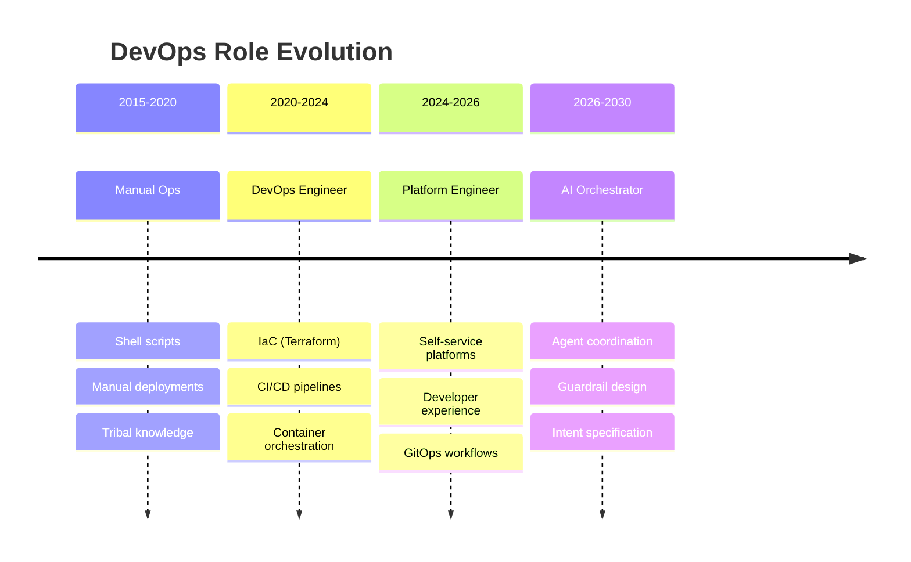
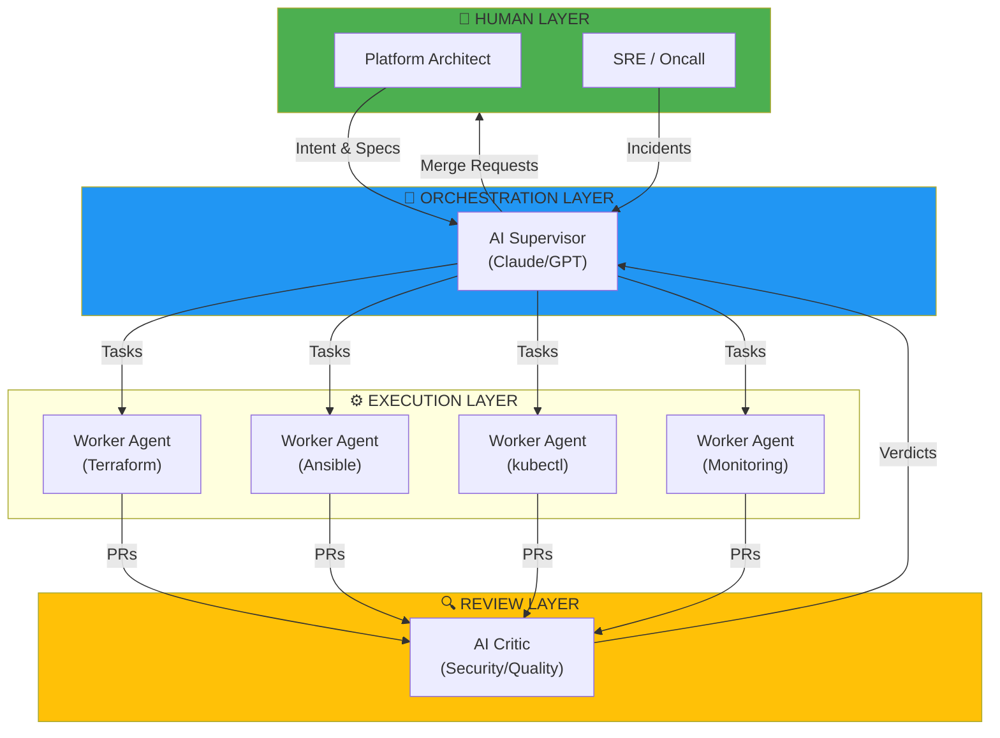
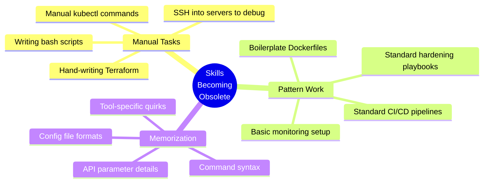
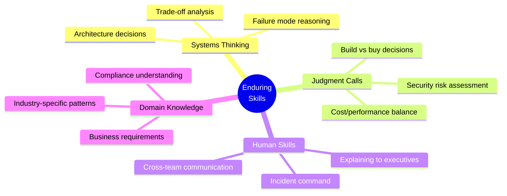
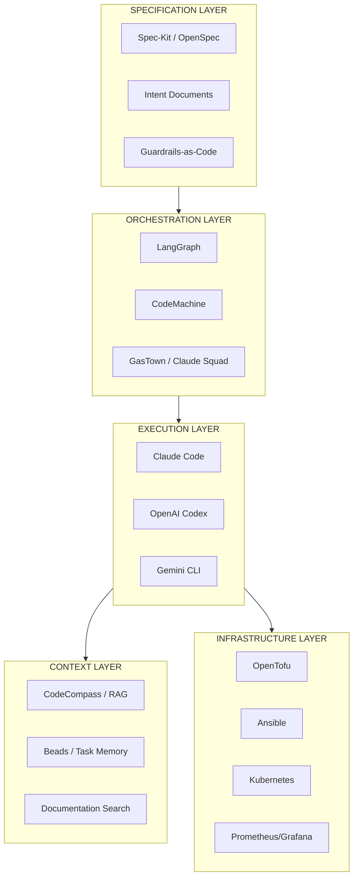
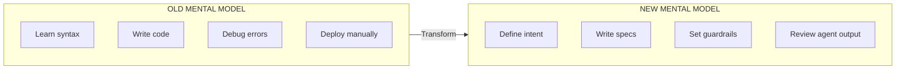
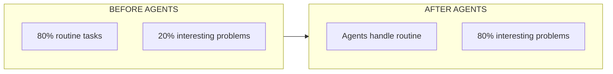

# DevOps in the AI Agent Era

> *"The role won't disappear. It will split: some become orchestrators of intelligent systems, others become the intelligence itself—encoded in config, skills, and guardrails."*
> — PearlThoughts Research, 2026

## A Brutally Honest Assessment

This document provides an unvarnished look at how DevOps will evolve as AI agents become capable of executing infrastructure tasks autonomously. No hype. No fear-mongering. Just reality.

---

## The Shift Has Already Begun



---

## What's Actually Happening (2026)

### Multi-Agent Orchestration is Real

AI agents are now capable of:

| Capability | Reality Check |
|-----------|---------------|
| **Writing Terraform modules** | ✅ Production-quality with proper specs |
| **Creating CI/CD pipelines** | ✅ Standard patterns, well-defined requirements |
| **Debugging infrastructure issues** | ⚠️ Simple issues yes; complex root cause needs human |
| **Security hardening** | ⚠️ Follows patterns; can miss novel threats |
| **Architecture decisions** | ❌ Needs human judgment for trade-offs |
| **Cost optimization** | ⚠️ Can suggest; humans must approve |

### The Supervisor-Worker Pattern



---

## What Will Expire (Brutal Truth)



### ❌ Jobs That Won't Exist in 3-5 Years

| Role | Why It's Dying |
|------|----------------|
| **Junior DevOps doing kubectl** | Agents handle routine cluster operations |
| **Pipeline copy-paste engineer** | Templates + agents generate better pipelines |
| **Infrastructure ticket resolver** | Self-healing systems + agents handle L1/L2 |
| **Documentation writer** | Agents generate docs from code |
| **Alert responder (simple)** | Automated remediation handles most incidents |

### The Uncomfortable Math

```
2020: 1 DevOps engineer : 10-20 developers
2024: 1 Platform engineer : 30-50 developers
2026: 1 AI orchestrator : 100+ developers (with agent fleet)
```

**Translation:** Fewer humans needed for the same output. This isn't speculation—it's happening at companies running multi-agent systems now.

---

## What Will Stick (Enduring Value)



### ✅ Skills That Become MORE Valuable

| Skill | Why It Matters More |
|-------|---------------------|
| **Systems architecture** | Someone must design what agents build |
| **Specification writing** | Clear specs = better agent output |
| **Guardrail design** | Agents need constraints to prevent disasters |
| **Observability strategy** | More automated systems = more need to understand them |
| **Incident command** | When agents fail, humans step in |
| **Cross-domain integration** | Connecting systems agents can't understand |

---

## New Roles Emerging

### 1. **AI Infrastructure Orchestrator**

```yaml
role: AI Infrastructure Orchestrator
responsibilities:
  - Design agent topologies (supervisor/worker patterns)
  - Create specifications for agent execution
  - Build guardrails and quality gates
  - Monitor agent fleet health and costs
  - Intervene when agents fail or conflict

skills_required:
  - Traditional DevOps/Platform Engineering
  - Prompt engineering and spec writing
  - Multi-agent coordination patterns
  - Cost optimization for API usage
  - Agent debugging and tracing

salary_range: $180K - $280K (2026 market)
```

### 2. **Platform Specification Engineer**

```yaml
role: Platform Specification Engineer
responsibilities:
  - Translate business requirements to agent-executable specs
  - Maintain spec libraries and templates
  - Version and test specifications
  - Bridge product and platform teams

skills_required:
  - Clear technical writing
  - Requirements gathering
  - Domain modeling
  - Version control for specs
  - Testing spec quality

salary_range: $150K - $220K (2026 market)
```

### 3. **Guardrail Architect**

```yaml
role: Guardrail Architect
responsibilities:
  - Design constraints that prevent agent disasters
  - Build policy-as-code for agent actions
  - Create review gates and approval workflows
  - Monitor for guardrail violations
  - Tune false positive/negative balance

skills_required:
  - Security mindset
  - Policy languages (OPA, Sentinel)
  - Agent behavior analysis
  - Risk assessment
  - Incident post-mortems

salary_range: $160K - $250K (2026 market)
```

### 4. **Agent Reliability Engineer (ARE)**

```yaml
role: Agent Reliability Engineer
responsibilities:
  - Ensure agent fleet uptime and performance
  - Debug agent failures and conflicts
  - Optimize agent costs (API calls, compute)
  - Build agent observability systems
  - On-call for agent-related incidents

skills_required:
  - SRE fundamentals
  - LLM behavior understanding
  - Cost optimization
  - Tracing and debugging
  - Incident response

salary_range: $170K - $260K (2026 market)
```

---

## New Tech Stack (2026-2030)

### The Agent-Native Platform Stack



### New Tools to Learn

| Category | Tools | Priority |
|----------|-------|----------|
| **Orchestration** | LangGraph, CrewAI, AutoGen | High |
| **Agent CLIs** | Claude Code, Codex, Gemini CLI, OpenCode | High |
| **Spec Frameworks** | Spec-Kit, OpenSpec, BMAD | Medium |
| **Context Systems** | RAG systems, Vector DBs, CodeCompass | Medium |
| **Task Memory** | Beads, Durable workflows | Medium |
| **Multi-agent** | Claude Squad, GasTown, Maestro | Low (wait for maturity) |

### What Stays in the Stack

```
✅ KEEP LEARNING / STILL RELEVANT:
- Kubernetes (agents need clusters to deploy to)
- Terraform/OpenTofu (agents generate it)
- Prometheus/Grafana (need to observe agent-managed systems)
- GitOps (ArgoCD, Flux)
- Container fundamentals
- Networking basics
- Security foundations
```

---

## New Way of Thinking

### From Execution to Specification



### Key Mindset Shifts

| Old Thinking | New Thinking |
|--------------|--------------|
| "I write the code" | "I specify what code should do" |
| "I know the commands" | "I know when to trust/distrust agent output" |
| "I debug by reading logs" | "I debug by understanding agent reasoning" |
| "Speed = typing faster" | "Speed = clearer specifications" |
| "Quality = more tests" | "Quality = better guardrails + verification" |
| "I automate tasks" | "I orchestrate automation fleets" |

### The Specification Hierarchy

```
Level 0: No spec (agent guesses) → ❌ Disaster
Level 1: Vague intent ("make it secure") → ⚠️ Hit or miss
Level 2: Clear requirements (acceptance criteria) → ✅ Decent
Level 3: Formal spec (structured, testable) → ✅ Reliable
Level 4: Spec + examples + constraints → ✅✅ Production-ready
```

**The better your specification skills, the more leverage you have over agents.**

---

## What You Must Learn (Action Items)

### Immediate (This Month)

```
□ Use Claude Code / Codex for infrastructure tasks
□ Practice writing clear, testable specifications
□ Understand prompt engineering basics
□ Learn to review agent-generated code critically
```

### Short-term (3-6 Months)

```
□ Study multi-agent orchestration patterns
□ Learn LangGraph or similar orchestration framework
□ Practice specification-driven development
□ Build guardrails for a real workflow
□ Understand RAG and context injection
```

### Medium-term (6-12 Months)

```
□ Design an agent topology for a real project
□ Build a supervisor-worker system
□ Create reusable spec templates
□ Implement agent observability
□ Run cost analysis on agent operations
```

---

## Harsh Realities to Accept

### 1. Junior Roles Are Shrinking

Entry-level "do kubectl and write pipelines" jobs are being automated. The entry bar is rising.

**What to do:** Focus on judgment, architecture, and orchestration skills that agents can't replicate.

### 2. Syntax Knowledge is Worthless

Memorizing Terraform syntax, kubectl flags, or Ansible modules is pointless when agents generate it better.

**What to do:** Understand concepts deeply. Know *why* things work, not just *how* to type them.

### 3. Speed ≠ Typing Speed Anymore

The bottleneck shifts from "how fast can I type commands" to "how clearly can I express intent."

**What to do:** Practice technical writing. Clear specifications produce better agent output.

### 4. More Responsibility, Fewer People

Teams will be smaller but cover more ground. Each person will orchestrate more systems.

**What to do:** Build breadth. Understand multiple domains: infra, security, observability, cost.

### 5. Continuous Learning is Non-negotiable

The agent landscape changes monthly. What works today may be obsolete in 6 months.

**What to do:** Allocate time for learning. Follow the ecosystem. Experiment constantly.

---

## The Opportunity

### Why This is Exciting (Not Scary)



- **Less toil:** Agents handle the boring parts
- **Higher impact:** Focus on architecture and strategy
- **More leverage:** One person can manage more systems
- **Faster learning:** Agents help explore new tools faster
- **Better outcomes:** Agents don't make typos or forget steps

### Career Paths That Thrive

| Path | Why It Thrives |
|------|----------------|
| **Platform Architect** | Designs systems agents build |
| **Security Specialist** | Agents can't understand threat models |
| **Incident Commander** | Crisis response needs human judgment |
| **Cost Optimizer** | Requires business context agents lack |
| **Developer Experience** | Understanding human needs |
| **AI/ML Infrastructure** | Building systems that power agents |

---

## Practical Exercise: Agent-Assisted Infrastructure

Try this workflow today:

1. **Write a specification** for a simple infrastructure component
2. **Give it to an AI agent** (Claude, Codex, Gemini)
3. **Review the output critically** — what did it get right/wrong?
4. **Refine your specification** based on what failed
5. **Iterate** until the output is production-quality

This is the new workflow. Master it.

---

## Summary: The New DevOps Identity

```
OLD IDENTITY:
"I am the person who knows how to configure infrastructure"

NEW IDENTITY:
"I am the person who defines what infrastructure should do,
sets the guardrails for how it's built,
and intervenes when intelligent systems fail"
```

---

## Related Reading

- [[02-Agent-Orchestration-Patterns]] — Technical patterns for multi-agent systems
- [[03-Specification-Driven-Infrastructure]] — How to write effective specs
- [[04-Guardrail-Design-Principles]] — Building safety into agent workflows

---

*Last Updated: 2026-02-02*
*Based on: PearlThoughts AI Agent Orchestration Research*
