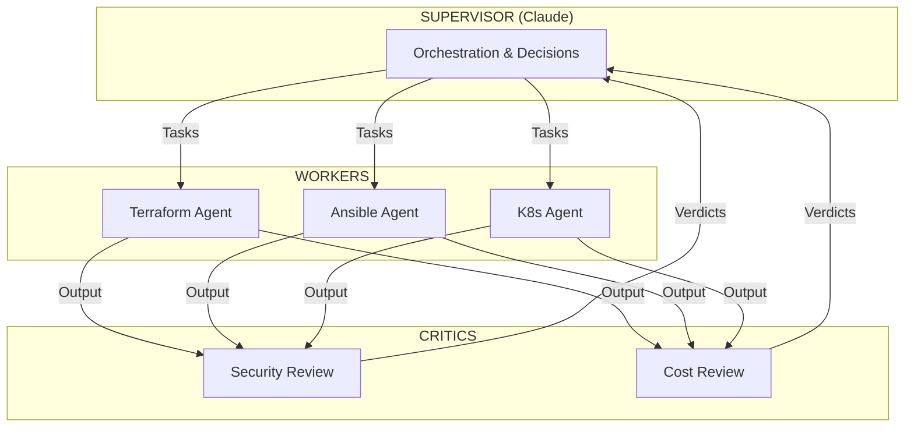
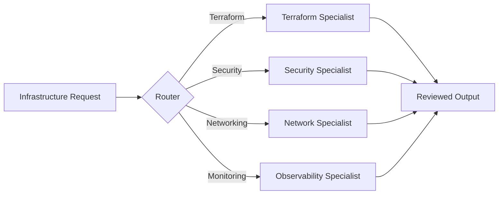
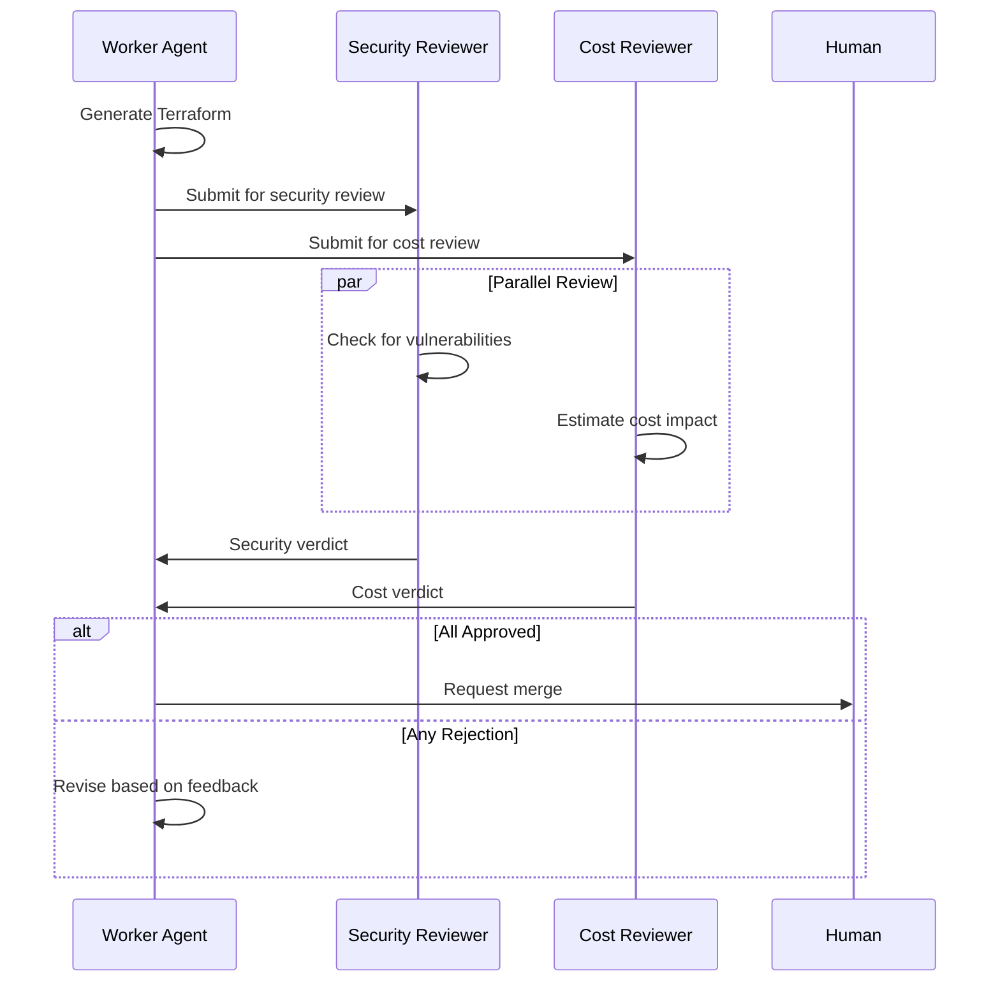
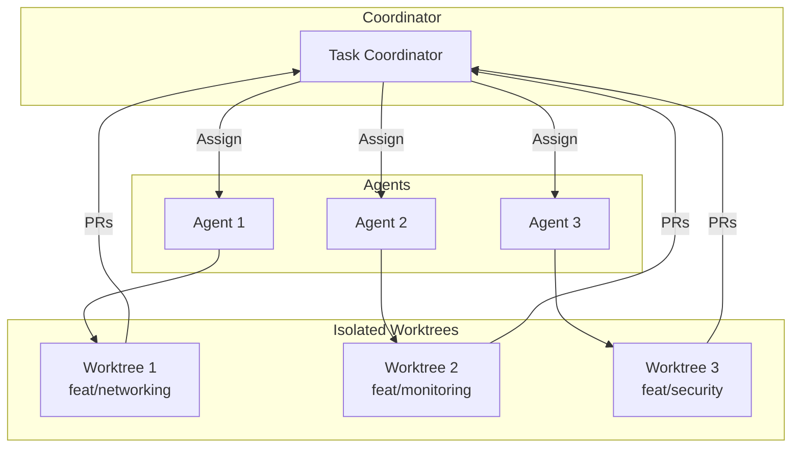
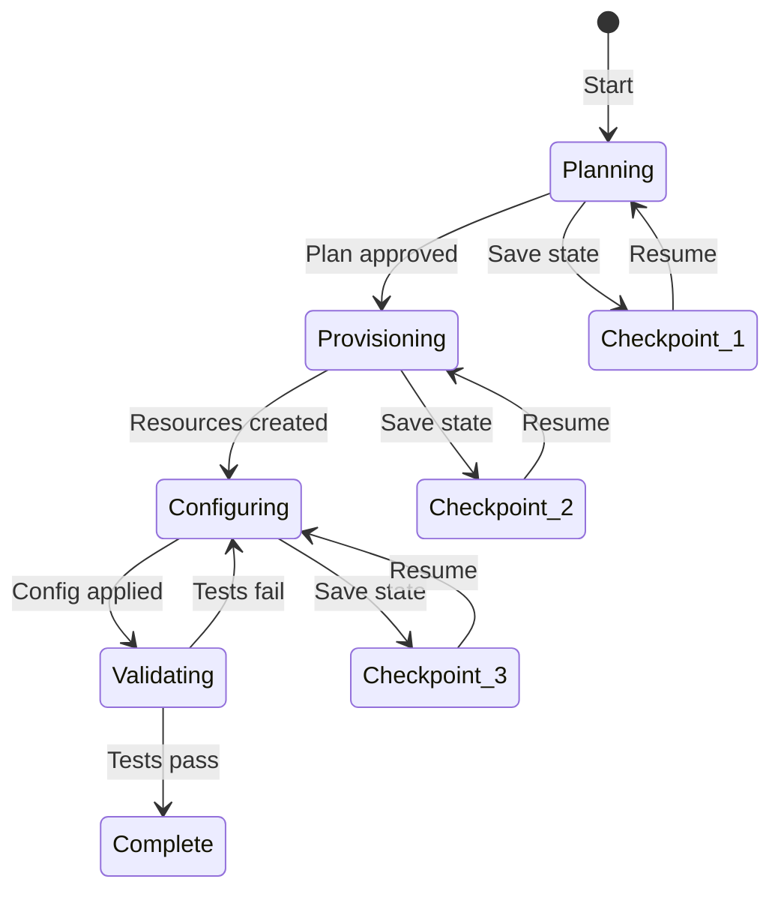

# Agent Orchestration Patterns for Infrastructure

> *"Multi-agent systems are not about having more agents. They're about having the right agents with the right constraints doing the right things."*
> — PearlThoughts Research, 2026

## Core Patterns for DevOps

This document covers practical patterns for orchestrating AI agents in infrastructure work.

---

## Pattern 1: Supervisor-Worker



### When to Use

- Complex infrastructure changes touching multiple systems
- Changes requiring security or cost review
- Production deployments

### Implementation

```yaml
# supervisor-config.yaml
supervisor:
  agent: claude
  role: orchestrator

  delegation_rules:
    terraform_changes:
      worker: codex
      reviewers: [gemini-security, claude-cost]
    kubernetes_changes:
      worker: claude-worker
      reviewers: [gemini-security]

  merge_policy:
    require_all_approvals: true
    human_final_approval: true
```

---

## Pattern 2: Specialist Routing



### When to Use

- Domain-specific tasks requiring deep expertise
- Parallel independent workstreams
- Large infrastructure refactoring

### Agent Specialization Matrix

| Specialist | Expertise | Triggers |
|-----------|-----------|----------|
| **Terraform Agent** | HCL, modules, state | "create module", "provision" |
| **Security Agent** | Policies, RBAC, encryption | "harden", "secure", "IAM" |
| **Network Agent** | Ingress, DNS, firewall | "traffic", "routing", "DNS" |
| **Observability Agent** | Prometheus, alerts, dashboards | "monitor", "alert", "metrics" |

---

## Pattern 3: Review Gate



### Guardrail Examples

```yaml
# security-guardrails.yaml
guardrails:
  - name: no-public-s3
    rule: "S3 buckets must not have public access"
    action: reject

  - name: encryption-required
    rule: "All storage must have encryption at rest"
    action: reject

  - name: no-root-credentials
    rule: "No hardcoded credentials in code"
    action: reject

  - name: require-tags
    rule: "All resources must have owner and cost-center tags"
    action: warn

# cost-guardrails.yaml
guardrails:
  - name: instance-size-limit
    rule: "Production instances max m5.2xlarge without approval"
    action: escalate

  - name: storage-budget
    rule: "Monthly storage cost delta < $500"
    action: warn
```

---

## Pattern 4: Parallel Execution with Isolation



### Git Worktree Setup

```bash
# Create isolated worktrees for parallel agent work
git worktree add ../project-networking feat/networking
git worktree add ../project-monitoring feat/monitoring
git worktree add ../project-security feat/security

# Each agent works in its own worktree
# No merge conflicts until integration
```

### Integration Rules

```yaml
integration:
  strategy: sequential_merge
  order:
    1. networking  # Base layer first
    2. security    # Security on top
    3. monitoring  # Observability last

  conflict_resolution:
    - automatic_for: formatting, imports
    - human_for: logic, architecture
```

---

## Pattern 5: Checkpoint-Resumable Workflows



### When to Use

- Long-running infrastructure deployments
- Multi-stage migrations
- Disaster recovery procedures

### Checkpoint Schema

```yaml
# checkpoint-state.yaml
checkpoint:
  id: "chk-2026-02-02-001"
  workflow: "k8s-cluster-deployment"
  stage: "configuring"

  completed_steps:
    - name: "vpc_creation"
      status: "success"
      outputs:
        vpc_id: "vpc-abc123"
    - name: "subnet_creation"
      status: "success"
      outputs:
        subnet_ids: ["subnet-1", "subnet-2", "subnet-3"]

  pending_steps:
    - name: "k8s_installation"
    - name: "addon_configuration"

  resume_command: |
    workflow resume --checkpoint chk-2026-02-02-001
```

---

## Agent Tool Matrix for Infrastructure

| Task | Best Agent | Why |
|------|------------|-----|
| **Terraform generation** | Codex | Strong at code generation |
| **Architecture review** | Gemini | Large context window |
| **Security analysis** | Claude | Strong reasoning |
| **Cost estimation** | Claude + GPT | Needs external data |
| **Documentation** | Any | All capable |
| **Debugging** | Claude | Strong chain-of-thought |
| **Exploration** | OpenCode | Built for codebase navigation |

---

## Anti-Patterns to Avoid

### ❌ Unsupervised Auto-Merge

```yaml
# NEVER DO THIS
automation:
  auto_merge: true
  skip_review: true
  # This WILL destroy your infrastructure eventually
```

### ❌ Parallel Agents Same Branch

```yaml
# NEVER DO THIS
parallel:
  agents: [agent1, agent2, agent3]
  target_branch: main  # Merge conflict disaster
```

### ❌ Infinite Retry Loops

```yaml
# NEVER DO THIS
on_failure:
  retry: infinite  # Agent will loop forever
  # Always have exit conditions
```

### ❌ No Guardrails

```yaml
# NEVER DO THIS
security:
  enabled: false
  # Because "it slows down the agents"
  # You WILL get pwned
```

---

## Recommended Stack for 2026

### Orchestration Layer

| Tool | Use Case | Maturity |
|------|----------|----------|
| **LangGraph** | Complex workflows | Production |
| **CodeMachine** | Spec-to-code | Production |
| **Claude Squad** | Quick parallel work | Beta |
| **Maestro** | Power user automation | Beta |

### Context Layer

| Tool | Use Case | Maturity |
|------|----------|----------|
| **CodeCompass** | Semantic code search | Production |
| **Beads** | Task memory | Beta |
| **RAG Systems** | Documentation search | Production |

### Execution Layer

| Tool | Use Case | Maturity |
|------|----------|----------|
| **Claude Code** | General infrastructure | Production |
| **OpenAI Codex** | Code generation | Production |
| **Gemini CLI** | Analysis & review | Production |
| **OpenCode** | Exploration | Production |

---

## Implementation Checklist

```
□ Choose orchestration pattern based on workflow complexity
□ Define clear agent roles and responsibilities
□ Create guardrails BEFORE enabling agents
□ Set up isolated worktrees for parallel work
□ Implement checkpoint/resume for long workflows
□ Configure review gates with human approval
□ Monitor agent costs and set budgets
□ Build rollback procedures for agent failures
```

---

## Related

- [[01-DevOps-AI-Agent-Era]] — Evolution of DevOps roles
- [[03-Specification-Driven-Infrastructure]] — Writing specs for agents

---

*Last Updated: 2026-02-02*
