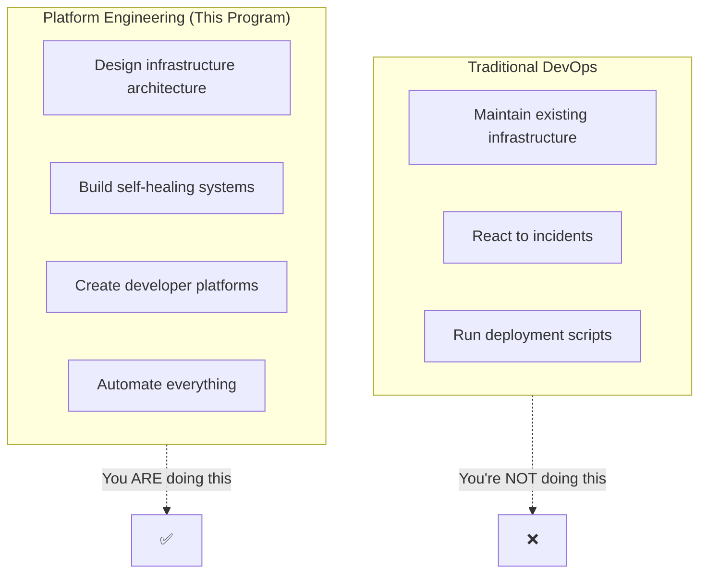

# Cloud Platform Engineering Internship

---

## Week 1 of 4: Foundation Phase

> **Current Focus**: Infrastructure design, platform architecture, environment setup
>
> **Key Deliverables**:
> - Working k3s development cluster
> - Infrastructure-as-Code foundation (OpenTofu)
> - GitOps pipeline skeleton
>
> **Extension Possible**: Based on active participation, quality work, communication, initiative.

---

## Vision

**Build the infrastructure that powers AI-native startups—from zero to production-ready.**

**The Opportunity**: Every startup needs infrastructure. Most DevOps is reactive firefighting. We're building a **platform engineering practice** that enables developers to ship faster while maintaining enterprise-grade reliability.

**Your Mission**: Build a complete, production-grade infrastructure platform for a multi-tenant SaaS application—the same platform that would power a YC-funded startup.

---

## Quick Start

```mermaid
flowchart LR
    subgraph Setup["0. Setup"]
        S1["Teams & Tools"]
        S2["Get webinar link"]
    end

    subgraph Read["1. Read"]
        R1["01-Before-You-Begin.md"]
        R2["Expectations & mindset"]
    end

    subgraph Review["2. Review"]
        V1["01-Vision.md"]
        V2["What we're building"]
    end

    subgraph Study["3. Study"]
        ST1["01-Architecture.md"]
        ST2["Platform overview"]
    end

    subgraph Build["4. Build"]
        B1["Environment Setup"]
        B2["Get hands dirty!"]
    end

    Setup --> Read --> Review --> Study --> Build
```

| Step | Document | Focus |
|------|----------|-------|
| **0. Setup** | Communication section below | Teams & Tools, webinar link |
| **1. Read** | [04-Internship/01-Before-You-Begin.md](./04-Internship/01-Before-You-Begin.md) | Expectations & startup mindset |
| **2. Review** | [01-Product/01-Vision.md](./01-Product/01-Vision.md) | What we're building and why |
| **3. Study** | [02-Engineering/01-Architecture.md](./02-Engineering/01-Architecture.md) | Platform architecture overview |
| **4. Build** | [04-Internship/Exercises/01-Environment-Setup](./04-Internship/Exercises/01-Environment-Setup.md) | Get your hands dirty! |

---

## What Makes This Different

This is **NOT** a traditional DevOps internship where you:
- Watch dashboards all day
- Run the same scripts repeatedly
- Maintain someone else's infrastructure

This **IS** a platform engineering program where you:
- **Design** infrastructure from first principles
- **Build** automation that eliminates toil
- **Ship** a real platform that could run a startup
- **Learn** enterprise patterns while building something new

> **You're not joining an Ops team. You're founding the infrastructure of a startup.**

---

## Platform Structure

### 01-Product — What We're Building

| Document | Description |
|----------|-------------|
| [Vision](./01-Product/01-Vision.md) | The startup platform we're building |
| [Market Context](./01-Product/02-Market-Context.md) | $150B cloud infrastructure market |
| [Capabilities](./01-Product/03-Capabilities.md) | Platform features and SLOs |
| [Target Architecture](./01-Product/04-Target-Architecture.md) | Multi-region, multi-tenant design |

### 02-Engineering — How to Build It

| Document | Description |
|----------|-------------|
| [Architecture Overview](./02-Engineering/01-Architecture.md) | Platform layers and components |
| [Infrastructure-as-Code](./02-Engineering/02-Infrastructure-as-Code.md) | OpenTofu/Terraform patterns |
| [Configuration Management](./02-Engineering/03-Configuration-Management.md) | Ansible best practices |
| [Container Orchestration](./02-Engineering/04-Container-Orchestration.md) | k3s/Kubernetes deep dive |
| [GitOps](./02-Engineering/05-GitOps.md) | ArgoCD, Flux, deployment patterns |

### 03-Platform — Cloud & Tooling

| Document | Description |
|----------|-------------|
| [Cloud Platforms](./03-Platform/01-Cloud-Platforms.md) | AWS, Hetzner comparison |
| [Observability Stack](./03-Platform/02-Observability.md) | Prometheus, Grafana, Loki |
| [Security](./03-Platform/03-Security.md) | Zero-trust, secrets management |
| [Networking](./03-Platform/04-Networking.md) | Service mesh, ingress, DNS |
| [Custom Tooling](./03-Platform/05-Custom-Tooling.md) | Python automation patterns |

### 04-Internship — Your Journey

| Document | Description |
|----------|-------------|
| [Before You Begin](./04-Internship/01-Before-You-Begin.md) | Expectations, mindset |
| [Week-by-Week](./04-Internship/02-Week-by-Week.md) | 4-week progression |
| [What You Build](./04-Internship/03-What-You-Build.md) | Deliverables, artifacts |
| [Your Role](./04-Internship/04-Your-Role.md) | Platform Engineer responsibilities |
| [Background](./04-Internship/Background/) | Cloud computing fundamentals |
| [Exercises](./04-Internship/Exercises/) | Hands-on tasks |

### 05-Contributions — Your Work

| Document | Description |
|----------|-------------|
| [How to Contribute](./05-Contributions/01-How-To-Contribute.md) | PR process, standards |
| [Reviews](./05-Contributions/Reviews/) | Cohort feedback |
| [Experiments](./05-Contributions/Experiments/) | Infrastructure experiments |

---

## Core Capabilities You'll Build

| Capability | Description | Documentation |
|------------|-------------|---------------|
| **Infrastructure-as-Code** | Declarative cloud provisioning | [IaC Patterns](./02-Engineering/02-Infrastructure-as-Code.md) |
| **Container Platform** | Production k3s cluster | [Orchestration](./02-Engineering/04-Container-Orchestration.md) |
| **GitOps Pipeline** | Automated deployments | [GitOps](./02-Engineering/05-GitOps.md) |
| **Observability** | Metrics, logs, traces | [Observability](./03-Platform/02-Observability.md) |
| **Security Hardening** | Zero-trust infrastructure | [Security](./03-Platform/03-Security.md) |

---

## Technology Stack

| Component | Primary | Alternative | Why |
|-----------|---------|-------------|-----|
| **IaC** | OpenTofu | Terraform | Open source, same HCL |
| **Config Mgmt** | Ansible | Salt | Agentless, Python-based |
| **Orchestration** | k3s | k0s | Lightweight, production-ready |
| **GitOps** | ArgoCD | Flux | UI, multi-cluster |
| **Cloud** | Hetzner | AWS | Cost-effective, EU sovereignty |
| **Monitoring** | Prometheus | Victoria Metrics | Industry standard |
| **Logging** | Loki | Elasticsearch | Lightweight, Grafana native |
| **Automation** | Python + Click | Bash | Maintainable, testable |

---

## Success Metrics

| Metric | Target | Measurement |
|--------|--------|-------------|
| Infrastructure Drift | 0% | Terraform state vs actual |
| Deployment Frequency | 10+/day capable | GitOps pipeline capacity |
| Recovery Time (MTTR) | < 15 minutes | Incident simulation |
| Change Failure Rate | < 5% | Failed deployments |
| Cluster Uptime | 99.9% | Prometheus alerting |

---

## Reference Implementations

**Infrastructure Repository** — Your primary workspace
- OpenTofu modules for cloud resources
- Ansible playbooks for configuration
- Kubernetes manifests for workloads
- Python automation scripts

**Don't copy existing solutions.** Understand them. Build your own version with YOUR insights.

---

## Using This Documentation

### Recommended: Obsidian

Download **[Obsidian](https://obsidian.md/)** for the best experience:
- Graph View for visualizing connections
- Quick Navigation with `Ctrl/Cmd + O`
- Backlinks to see related documents

**Setup**: Open the `DevOps` folder as a vault in Obsidian.

### Alternative

All links work on GitHub web UI.

---

## Getting Help

- **Teams/Slack**: #devops-internship channel
- **Documentation**: This vault
- **Mentors**: Available for architecture questions (after you've tried first)

**Remember**: Research first, ask second. We're evaluating your ability to figure things out independently.

---

## Communication & Remote Working

> **New here?** Start with our communication guides.

| Guide | What You'll Learn |
|-------|-------------------|
| [Teams Setup](../How-We-Communicate/01-Teams-Getting-Started.md) | Microsoft Teams setup, troubleshooting |
| [Communication Protocol](../How-We-Communicate/02-Communication-Protocol.md) | Which channel to use, threads vs posts |
| [Live Sessions](../How-We-Communicate/03-Live-Sessions.md) | Webinar format, demo showcase |
| [Tools & Workflows](../How-We-Communicate/04-Tools-and-Workflows.md) | Git repos, cloud access |

These guides apply to all internship programs at PearlThoughts.

---

*Last Updated: 2026-02-02*
